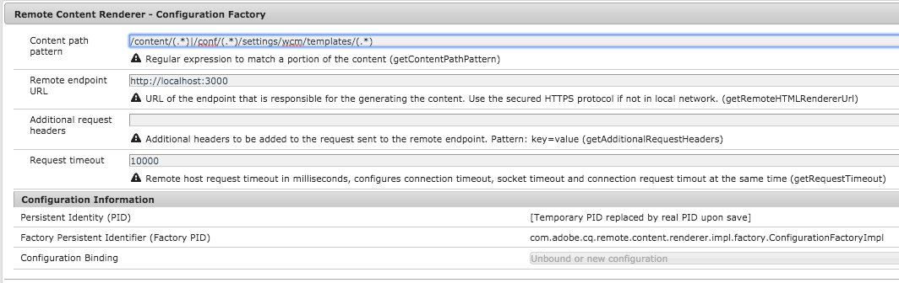
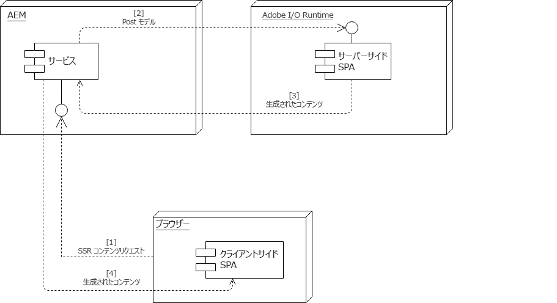

# SPAとサーバ側のレンダリング{#spa-and-server-side-rendering}

>[!NOTE]
>
>SPA Editorは、SPAフレームワークベースのクライアント側レンダリング（ReactやAngularなど）を必要とするプロジェクトに推奨されるソリューションです。

>[!NOTE]
>
>このドキュメントで説明するように、SPAサーバー側のレンダリング機能を使用するには、AEM 6.5.1.0以降が必要です。

## 概要 {#overview}

シングルページアプリ(SPA)では、ネイティブアプリケーションと同様、使い慣れた方法で反応し、動作するリッチで動的なエクスペリエンスをオファーできます。 [これは、クライアントを利用してコンテンツを先に読み込み、ユーザーの操作を大量に処理し、クライアントとサーバーの間で必要な通信量を最小限に抑えて](/help/sites-developing/spa-walkthrough.md#how-does-a-spa-work) 、アプリをより反応させることで達成されます。

ただし、特にSPAが大きく、コンテンツが豊富な場合は、初期読み込み時間が長くなる可能性があります。 読み込み時間を最適化するために、コンテンツの一部はサーバー側でレンダリングできます。 サーバ側レンダリング(SSR)を使用すると、ページの初期読み込みを高速化し、さらにクライアント上でレンダリングを渡すことができます。

## SSRを使用する場合 {#when-to-use-ssr}

SSRは、すべてのプロジェクトで必要とされるわけではありません。 AEMはSPAのJS SSRを完全にサポートしていますが、すべてのプロジェクトに対して体系的に実装することはお勧めしません。

SSRの導入を決定する際は、まず、長期のメンテナンスを含む、SSRの追加の複雑さ、作業量、コストの追加がプロジェクトに対してどのような現実的な意味を持つかを見積もる必要があります。 SSRアーキテクチャは、加算値が予測コストを明確に上回る場合にのみ選択する必要があります。

SSRは、次の質問のいずれかに対して明確な「はい」がある場合、通常、値を提供します。

* **SEO:** トラフィックをもたらす検索エンジンによって、サイトのインデックスが適切に作成されるように、SSRは実際には必要ですか。 メインの検索エンジンクローラーがJSを評価するようになりました。
* **ページ速度：** SSRは、実生活の環境を測定可能な速度で改善し、全体的なユーザ体験を増やしますか。

この2つの質問のうち少なくとも1つが明確な「はい」で回答された場合にのみ、アドビはSSRの実装を推奨します。 次の節では、Adobe I/O Runtimeを使用してこれを行う方法について説明します。

## Adobe I/Oランタイム {#adobe-i-o-runtime}

プロジェクト [にSSRの実装が必要であると確信している場合は](/help/sites-developing/spa-ssr.md#when-to-use-ssr)、アドビの推奨ソリューションはAdobe I/O Runtimeを使用することです。

Adobe I/O Runtimeについて詳しくは、

* [https://www.adobe.io/apis/experienceplatform/runtime.html](https://www.adobe.io/apis/experienceplatform/runtime.html) — サービスの概要
* [https://www.adobe.io/apis/experienceplatform/runtime/docs.html](https://www.adobe.io/apis/experienceplatform/runtime/docs.html) — プラットフォームに関する詳細なドキュメント

次の節では、Adobe I/O Runtimeを使用してSPAにSSRを実装する方法を2つの異なるモデルで説明します。

* [AEM主導型通信フロー](/help/sites-developing/spa-ssr.md#aem-driven-communication-flow)
* [Adobe I/Oランタイム主導型通信フロー](/help/sites-developing/spa-ssr.md#adobe-i-o-runtime-driven-communication-flow)

>[!NOTE]
>
>AEM環境（作成者、発行、ステージなど）ごとに別々のAdobe I/Oランタイムインスタンスを作成することをお勧めします。

## リモートレンダラーの設定 {#remote-renderer-configuration}

AEMは、リモートでレンダリングされたコンテンツを取得できる場所を知っている必要があります。 SSRにどのモ [デルを実装するかに関係なく](#adobe-i-o-runtime) 、AEMに対してこのリモートレンダリングサービスへのアクセス方法を指定する必要があります。

これは、RemoteContentRenderer - Configuration Factory OSGiサービ **スを介して行われます**。 Web Console Configuration Console()で、「RemoteContentRenderer」という文字列を検索します `http://<host>:<port>/system/console/configMgr`。



この設定では、次のフィールドを使用できます。

* **コンテンツパスパターン** — 必要に応じて、コンテンツの一部と一致させるための正規式。
* **リモートエンドポイントURL** — コンテンツの生成を行うエンドポイントのURL
   * ローカルネットワークにない場合は、保護されたHTTPSプロトコルを使用します。
* **追加のリクエストヘッダー** — リモートエンドポイントに送信されるリクエストに追加のヘッダー
   * パターン: `key=value`
* **要求タイムアウト** — リモートホスト要求のタイムアウト（ミリ秒）

>[!NOTE]
>
>[AEM駆動の通信フローや](#aem-driven-communication-flow) Adobe I/Oランタイム駆動フローを実装する場合は、リモートコンテンツレンダラーの設定を定義する必要があります [](#adobe-i-o-runtime-driven-communication-flow) 。
>
>また、カスタムNode.jsサーバーを使用する場合は、 [この設定を定義する必要があります。](#using-node-js)

>[!NOTE]
>
>この設定では、追加の拡張オプシ [ョンとカスタマイズオプションを](#remote-content-renderer) 備えたリモートコンテンツレンダラーを利用します。

## AEM主導型通信フロー {#aem-driven-communication-flow}

SSRを使用する場合、AEMのSPAの [コンポーネントの対話ワークフローに](/help/sites-developing/spa-overview.md#workflow) 、Adobe I/O Runtimeでアプリの初期コンテンツが生成される段階が含まれます。

1. ブラウザーがAEMからSSRコンテンツを要求します。

1. AEMは、モデルをAdobe I/O Runtimeに投稿します。

1. 生成されたコンテンツがAdobe I/O Runtimeによって返されます。

1. AEMは、Adobe I/O RuntimeからバックエンドページコンポーネントのHTLテンプレートを介して返されるHTMLを提供します。



## Adobe I/Oランタイム主導型通信フロー {#adobe-i-o-runtime-driven-communication-flow}

前の節では、AEMでSPAに関するサーバー側レンダリングの標準的で推奨される実装について説明します。AEMでは、コンテンツのブートストラップと提供を実行します。

また、Adobe I/O Runtimeがブートストラップを行い、通信フローを効果的に逆にするように、SSRを実装することもできます。

両方のモデルが有効で、AEMでサポートされています。 ただし、特定のモデルを実装する前に、それぞれの長所と短所を考慮する必要があります。

<table>
 <tbody>
  <tr>
   <th><strong>ブートストラップ</strong></th>
   <th><strong>メリット</strong></th>
   <th><strong>デメリット</strong></th>
  </tr>
  <tr>
   <th><strong>AEM経由</strong><br /> </th>
   <td>
    <ul>
     <li>AEMは必要な場所でライブラリの挿入を管理</li>
     <li>リソースはAEMでのみ維持する必要があります<br /> </li>
    </ul> </td>
   <td>
    <ul>
     <li>SPA開発者に馴染みのない可能性がある<br /> </li>
    </ul> </td>
  </tr>
  <tr>
   <th><strong>adobe I/Oランタイムを使用<br /> </strong></th>
   <td>
    <ul>
     <li>SPA開発者に詳しい<br /> </li>
    </ul> </td>
   <td>
    <ul>
     <li>CSSやJavaScriptなどのアプリケーションに必要なClientlibリソースは、AEM開発者がプロパティを介して使用できるようにする必要があり <code><a href="/help/sites-developing/clientlibs.md#locating-a-client-library-folder-and-using-the-proxy-client-libraries-servlet">allowProxy</a></code> ます<br /> </li>
     <li>リソースはAEMとAdobe I/O Runtimeの間で同期する必要があります<br /> </li>
     <li>SPAのオーサリングを有効にするには、Adobe I/O Runtimeのプロキシサーバーが必要な場合があります</li>
    </ul> </td>
  </tr>
 </tbody>
</table>

## SSRの計画 {#planning-for-ssr}

一般に、サーバー側でレンダリングする必要があるのはアプリケーションの一部のみです。 一般的な例は、ページの初回読み込み時に一画面に表示されるコンテンツがサーバー側にレンダリングされることです。 これにより、既にレンダリングされたコンテンツをクライアントに配信することで、時間を節約できます。 ユーザーがSPAを操作すると、追加のコンテンツがクライアントによってレンダリングされます。

SPAに対してサーバー側のレンダリングを実装する場合は、アプリケーションのどの部分が必要かを確認する必要があります。

## SSRを使用したSPAの開発 {#developing-an-spa-using-ssr}

SPAコンポーネントは、クライアント（ブラウザー内）またはサーバー側でレンダリングできます。 サーバー側でレンダリングする場合、ウィンドウのサイズや場所などのブラウザープロパティは存在しません。 したがって、SPAコンポーネントは同形的で、レンダリングされる場所を想定しないでください。

SSRを利用するには、AEMに加えて、サーバー側のレンダリングを担当するAdobe I/O Runtimeにコードをデプロイする必要があります。 ほとんどのコードは同じですが、サーバー固有のタスクは異なります。

## AEMのSPAのSSR {#ssr-for-spas-in-aem}

AEMのSPA用のSSRには、Adobe I/O Runtimeが必要です。これは、アプリケーションコンテンツサーバー側のレンダリングに対して呼び出されます。 アプリケーションのHTL内で、Adobe I/O Runtime上のリソースが呼び出され、コンテンツがレンダリングされます。

AEMがAngularおよびReact SPAフレームワークをサポートするように、AngularおよびReactアプリでも、サーバー側のレンダリングがサポートされます。 詳しくは、両方のフレームワークのNPMドキュメントを参照してください。

* 反応：https://github.com/adobe/aem-sample-we-retail-journal/blob/master/react-app/DEVELOPMENT.md#enabling-the-server-side-rendering-using-the-aem-page-component [](https://github.com/adobe/aem-sample-we-retail-journal/blob/master/react-app/DEVELOPMENT.md#enabling-the-server-side-rendering-using-the-aem-page-component)
* 角度：https://github.com/adobe/aem-sample-we-retail-journal/blob/master/react-app/DEVELOPMENT.md#enabling-the-server-side-rendering-using-the-aem-page-component [](https://github.com/adobe/aem-sample-we-retail-journal/blob/master/react-app/DEVELOPMENT.md#enabling-the-server-side-rendering-using-the-aem-page-component)

簡単な例については、 [We.Retailジャーナルアプリを参照](https://github.com/Adobe-Marketing-Cloud/aem-sample-we-retail-journal)。 アプリケーションサーバー側全体がレンダリングされます。 これは実際の例ではありませんが、SSRの実装に必要なものを示しています。

>[!CAUTION]
>
>We.Retail [ジャーナルアプリは](https://github.com/Adobe-Marketing-Cloud/aem-sample-we-retail-journal) 、デモの目的でのみ使用されるので、推奨されるAdobe I/Oランタイムの代わりにNode.jsを単純な例として使用します。 この例は、どのプロジェクトの作業にも使用しないでください。

>[!NOTE]
>
>AEM上のすべてのSPAプロジェクトは、SPAスターターキットの [Mavenアーキタイプを基にする必要があります](https://github.com/adobe/aem-spa-project-archetype)。

## Node.jsの使用 {#using-node-js}

AEMでSPA用のSSRを実装する場合は、Adobe I/O Runtimeが推奨されるソリューションです。

オンプレミスAEMインスタンスの場合は、上記と同じ方法で、カスタムNode.jsインスタンスを使用してSSRを実装することもできます。 これはアドビでサポートされていますが、お勧めしません。

>[!NOTE]
>
>Node.jsは、アドビがホストするAEMインスタンスではサポートされていません。

>[!NOTE]
>
>SSRをNode.js経由で実装する必要がある場合、アドビでは、すべてのAEM環境（作成者、発行、ステージなど）に対して個別のNode.jsインスタンスを使用することをお勧めします。

## リモートコンテンツレンダラー {#remote-content-renderer}

AEMタッ [プでSSRをSPAと共に使用する場合に必要なリモートコンテンツレンダラーの設定は](#remote-content-renderer-configuration) 、ニーズに合わせて拡張およびカスタマイズできる、より一般的なレンダリングサービスを提供します。

### RemoteContentRenderingService {#remotecontentrenderingservice}

`RemoteContentRenderingService` は、Adobe I/Oなどのリモートサーバー上でレンダリングされたコンテンツを取得するOSGiサービスです。リモートサーバーに送信されるコンテンツは、渡されたリクエストパラメーターに基づきます。

`RemoteContentRenderingService` は、追加のコンテンツ操作が必要な場合に、カスタムSlingモデルまたはサーブレットに依存関係が反転されて挿入できます。

このサービスは、RemoteContentRendererRequestHandlerServletによって内部的に使用さ [れます](#remotecontentrendererrequesthandlerservlet)。

### RemoteContentRendererRequestHandlerServlet {#remotecontentrendererrequesthandlerservlet}

を使用し `RemoteContentRendererRequestHandlerServlet` て、リクエストの設定をプログラムで設定できます。 `DefaultRemoteContentRendererRequestHandlerImpl`では、デフォルトのリクエストハンドラー実装が提供され、コンテンツ構造内の場所をリモートエンドポイントにマッピングするために、複数のOSGi設定を作成できます。

カスタムリクエストハンドラーを追加するには、インターフェイスを実装 `RemoteContentRendererRequestHandler` します。 コンポーネントのプロ `Constants.SERVICE_RANKING``DefaultRemoteContentRendererRequestHandlerImpl`パティは、100より大きい整数(

```
@Component(immediate = true,
        service = RemoteContentRendererRequestHandler.class,
        property={
            Constants.SERVICE_RANKING +":Integer=1000"
        })
public class CustomRemoteContentRendererRequestHandlerImpl implements RemoteContentRendererRequestHandler {}
```

### デフォルトハンドラのOSGi設定の設定 {#configure-default-handler}

デフォルトハンドラーの設定は、「リモートコンテンツレンダラーの設定」の節の説明に従っ [て設定する必要があります](#remote-content-renderer-configuration)。

### リモートコンテンツレンダラーの使用 {#usage}

サーブレットを取得して、ページに挿入できるコンテンツを返すには：

1. リモートサーバーにアクセスできることを確認します。
1. AEMコン追加ポーネントのHTLテンプレートに対する次のスニペットの1つ。
1. 必要に応じて、OSGi設定を作成または変更します。
1. サイトのコンテンツの参照

通常、ページコンポーネントのHTLテンプレートは、このような機能のメイン受信者です。

```
<sly data-sly-resource="${resource @ resourceType='cq/remote/content/renderer/request/handler'}" />
```

### 要件 {#requirements}

サーブレットは、Slingモデルエクスポーターを利用してコンポーネントデータをシリアライズします。 デフォルトでは、との両方がSlingモ `com.adobe.cq.export.json.ContainerExporter` デルのア `com.adobe.cq.export.json.ComponentExporter` ダプタとしてサポートされています。 必要に応じて、リクエストを使用して実装する必要のあるクラスを `RemoteContentRendererServlet` 追加できます `RemoteContentRendererRequestHandler#getSlingModelAdapterClasses`。 追加のクラスは、を拡張する必要がありま `ComponentExporter`す。
