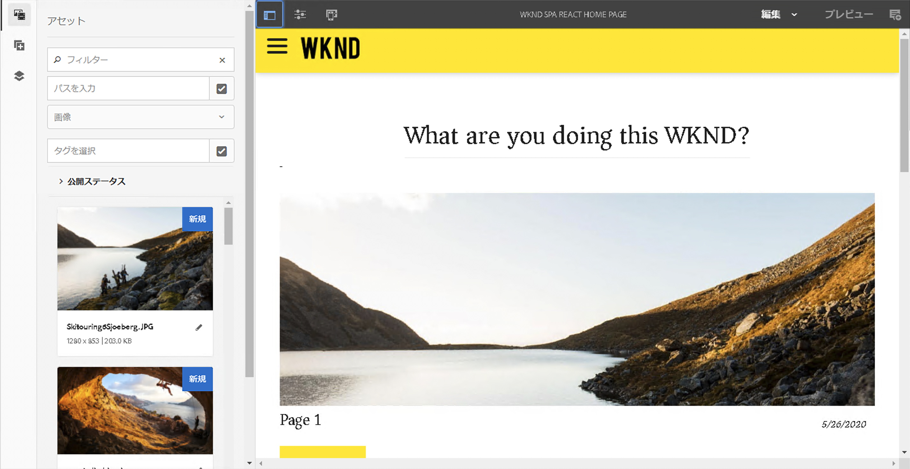
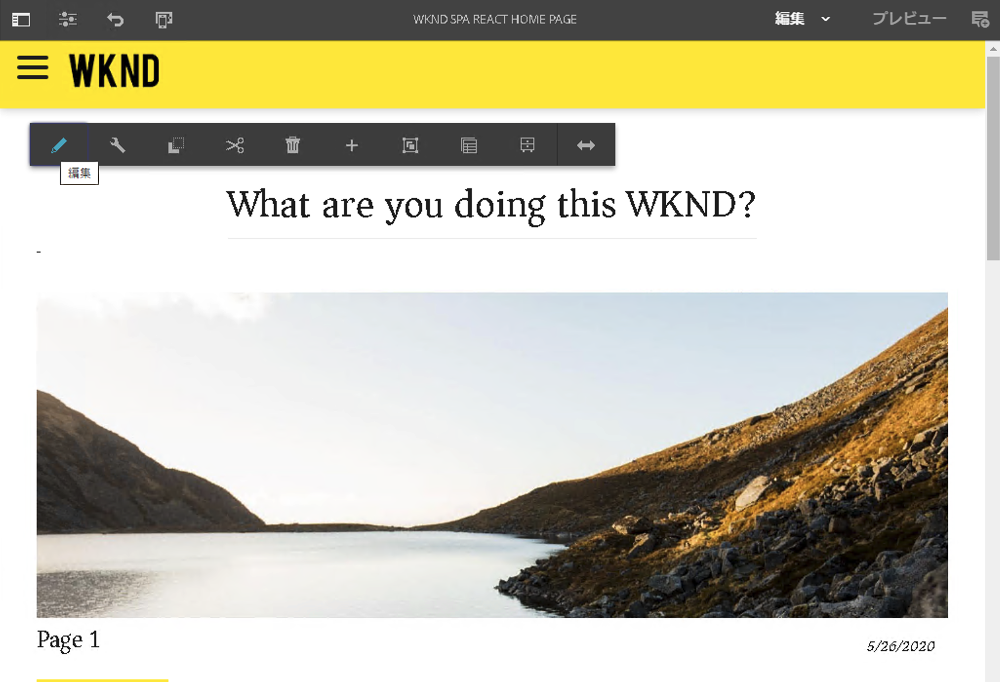
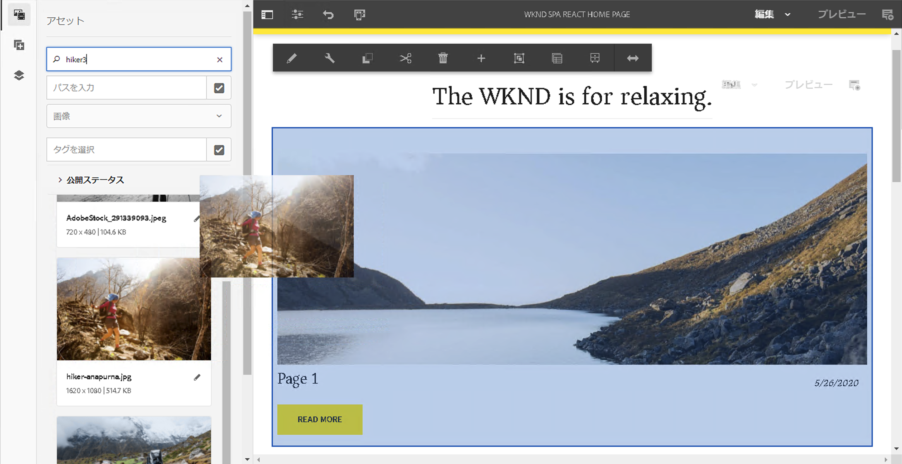
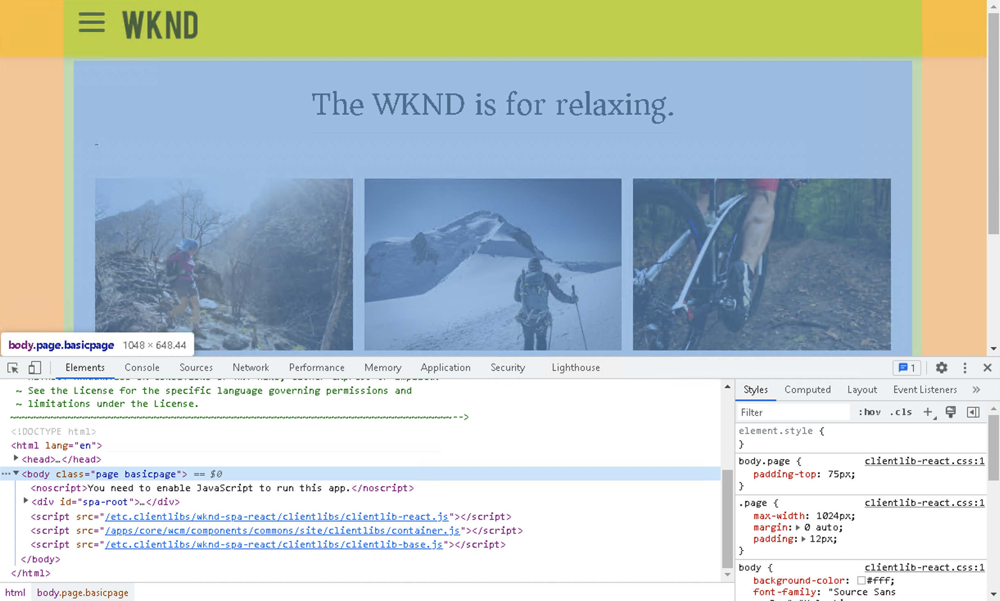

# SPA の概要およびガイド {#spa-introduction-and-walkthrough}

単一ページアプリケーション（SPA）により、Web サイトのユーザーに魅力的なエクスペリエンスを提供することができます。開発者は SPA フレームワークを使用してサイトを構築したいと考え、作成者はそうして構築されたサイトのコンテンツを AEM 内でシームレスに編集したいと考えています。

SPA エディターには、AEM 内で SPA をサポートするための包括的なソリューションが用意されています。この記事では、基本的な SPA アプリケーションを使用したオーサリングの手順を説明し、基礎となる AEM SPA エディターとの関連を示します。

>[!NOTE]
>
>SPA エディターは、SPA フレームワークを基にしたクライアントサイドレンダリング（React など）が必要なプロジェクトで有効なソリューションです。

## はじめに {#introduction}

### 記事の目的 {#article-objective}

この記事では、SPA エディターのガイドに進む前に、簡単な SPA アプリケーションを使用して基本的なコンテンツ編集のデモを行うことで、SPA の基本的な概念について説明します。次に、ページの構築、SPA アプリケーションと AEM SPA エディターとの関連とやり取りの仕組みについて説明します。

この概要とガイドの目標は、SPA が注目される理由、その一般的な動作、AEM エディターでの SPA の処理方法、標準の AEM アプリケーションとの違いを AEM 開発者に示すことです。

## 要件 {#requirements}

このガイドは、標準的な AEM 機能と、サンプルの WKND SPA Project アプリに基づいています。このチュートリアルに従うには、次の機能を使用できる必要があります。

* [AEMバージョン 6.5.4 以降](/help/release-notes/release-notes.md)
   * システムの管理者権限が必要です。
* [GitHub で入手可能なサンプルの WKND SPA Project アプリ](https://github.com/adobe/aem-guides-wknd-spa)
   * をダウンロードします。 [React アプリの最新リリース。](https://github.com/adobe/aem-guides-wknd-spa/releases) 次のように名前が付けられます。 `wknd-spa-react.all.classic-X.Y.Z-SNAPSHOT.zip`.
   * をダウンロードします。 [最新のサンプル画像](https://github.com/adobe/aem-guides-wknd-spa/releases) アプリの 次のように名前が付けられます。 `wknd-spa-sample-images-X.Y.Z.zip`.
   * [パッケージマネージャーの使用](/help/sites-administering/package-manager.md) を使用して、AEMの他のパッケージと同様にパッケージをインストールします。
   * このチュートリアルの目的では、Maven を使用してアプリをインストールする必要はありません。

>[!CAUTION]
>
>このドキュメントでは、 [WKND Spa Project アプリ](https://github.com/adobe/aem-guides-wknd-spa) デモ目的のみ。 どのプロジェクト作業にも使用しないでください。
>
>任意のAEMプロジェクトで [AEMプロジェクトアーキタイプ](https://experienceleague.adobe.com/docs/experience-manager-core-components/using/developing/archetype/overview.html?lang=ja) は、SPA SDK を利用した React またはAngularを使用したSPAプロジェクトをサポートします。

### SPA について  {#what-is-a-spa}

単一ページアプリケーション（SPA）は、クライアントサイドでレンダリングされ、主に JavaScript 主導であり、Ajax 呼び出しに依存してデータを読み込み、ページを動的に更新する点で、従来のページとは異なります。ほぼすべてのコンテンツは、1 回のページ読み込みで 1 回取得され、ユーザーによるページとのやり取りに基づいて、必要に応じて追加のリソースが非同期に読み込まれます。

これにより、ページを更新する必要が減り、シームレスで高速な、ネイティブアプリのエクスペリエンスに近いものをユーザーに提供できます。

AEM SPA エディターを使用すると、フロントエンド開発者は AEM のサイトに統合できる SPA を作成でき、コンテンツ作成者は SPA コンテンツを他の AEM コンテンツと同様に簡単に編集できます。

### SPA が注目される理由  {#why-a-spa}

より速く、流動的で、よりネイティブアプリケーションに近い SPA は、Web ページの訪問者だけでなく、SPA の仕組みの性質上、マーケターや開発者にとっても非常に魅力的なエクスペリエンスとなります。

**訪問者数**

* 訪問者は、コンテンツとのやり取りでネイティブなエクスペリエンスを求めています。
* ページが速くなればなるほど、コンバージョンが発生する可能性が高いという明確なデータがあります。

**マーケター**

* マーケターは、リッチでネイティブに近いエクスペリエンスをオファーして、訪問者のコンテンツに対する十分なエンゲージを獲得したいと考えています。
* パーソナライゼーションは、これらのエクスペリエンスをさらに魅力的にします。

**開発者**

* 開発者は、コンテンツとプレゼンテーションの間の懸念事項を明確に分けておきたいと考えています。
* 明確に分離することにより、システムの拡張性が向上し、フロントエンドの独立開発も可能になります。

### SPA の仕組み  {#how-does-a-spa-work}

SPA の背後にある主な考え方は、サーバー呼び出しに起因する遅延を最小限に抑えるために、サーバーへの呼び出しと依存性を低減し、SPA がネイティブアプリケーションの応答性に近づくようにすることです。

従来のシーケンシャルな Web ページでは、そのページに必要なデータのみが読み込まれます。つまり、訪問者が別のページに移動すると、サーバーが追加のリソースを呼び出します。訪問者がページ上の要素を操作する際に、追加の呼び出しが必要になる場合があります。これらの複数の呼び出しでは、ページが訪問者のリクエストに追いつく必要があるので、遅いという感覚を与える可能性があります。

訪問者がモバイルやネイティブアプリから期待する動作に近い、より流動的なエクスペリエンスを実現するために、SPA は、最初の読み込み時に訪問者に必要なすべてのデータを読み込みます。最初は少し時間がかかる場合がありますが、その後はサーバーコールを追加する必要はありません。

クライアントサイドでレンダリングすると、ページ要素の反応が速くなり、訪問者によるページとのやり取りが即時に行われます。ページの速度を最大化するために、必要になる可能性のある追加データはすべて非同期で呼び出されます。

>[!NOTE]
>
>AEM での SPA の動作の技術的な詳細については、[AEM での SPA の概要](/help/sites-developing/spa-getting-started-react.md)の記事を参照してください。
>
>SPA Editor のデザイン、アーキテクチャ、技術的なワークフローについて詳しくは、[SPA Editor の概要](/help/sites-developing/spa-overview.md)の記事を参照してください。

## SPA でのコンテンツ編集エクスペリエンス {#content-editing-experience-with-spa}

AEM SPA Editor を活用する SPA が構築されている場合、コンテンツの編集および作成時に、コンテンツ作成者は違いを認識しません。共通の AEM 機能を利用でき、作成者のワークフローに変更を加える必要はありません。

1. AEM で WKND SPA Project アプリを編集します。

   `http://<host>:<port>/editor.html/content/wknd-spa-react/us/en/home.html`

   

1. 見出しコンポーネントを選択すると、他のコンポーネントと同様にツールバーが表示されます。「**編集**」を選択します。

   

1. AEM 内でコンテンツを通常どおりに編集します。変更内容が保持されることに注意してください。

   

   >[!NOTE]
   >
   >インプレーステキストエディターと SPA について詳しくは、[SPA Editor の概要](spa-overview.md#requirements-limitations)を参照してください。

1. アセットブラウザーを使用して、新しい画像を画像コンポーネントにドラッグ＆ドロップします。

   

1. 変更が保持されます。

   

追加のコンポーネントをページにドラッグ＆ドロップしたり、コンポーネントを並べ替えたり、レイアウトを変更したりするなどのオーサリングツールは、SPA 以外のどの アプリケーションでもサポートされます。

>[!NOTE]
>
>SPA エディターは、アプリケーションの DOM を変更しません。SPA 自体が DOM を管理します。
>
>この機能を確認するには、この記事の次の節、[SPA アプリと AEM SPA エディター](#spa-apps-and-the-aem-spa-editor)に進みます。

## SPA アプリと AEM SPA エディター {#spa-apps-and-the-aem-spa-editor}

SPA がエンドユーザーにとってどのように動作するかを体験してから SPA ページを調べると、SPA アプリと AEM の SPA Editor が連携する仕組みをより深く理解できます。

### SPA アプリケーションの使用 {#using-an-spa-application}

1. WKND SPA Project アプリを公開サーバーで読み込むか、ページエディターの&#x200B;**ページ情報**&#x200B;メニューから「**公開済みとして表示**」オプションを使用して読み込みます。

   `http://<host>:<port>/content/wknd-spa-react/us/en/home.html`

   

   子ページへのナビゲーション、天気ウィジェット、記事などを含むページ構造があります。

1. メニューを使用して子ページに移動し、ページが読み込まれるのを確認します。更新は必要ありません。

   

1. ブラウザーに組み込まれている開発者ツールを開き、子ページを移動しながらネットワークアクティビティを監視します。

   

   アプリ内でページ間を移動する際のトラフィック量は非常に少なくなります。ページのリロードは行われず、新しい画像のみが要求されます。

   SPA はコンテンツとルーティングを完全にクライアントサイドで管理します。

子ページをナビゲートする際にページがリロードされないとすると、どのように読み込まれるのでしょうか。

次の節では、 [SPA Application の読み込み](#loading-an-spa-application) では、SPAの読み込みの仕組みと、コンテンツの同期および非同期での読み込み方法について詳しく説明します。

### SPA アプリケーションの読み込み {#loading-an-spa-application}

1. 読み込みがまだの場合は、WKND SPA アプリケーションを公開サーバーに読み込むか、ページエディターの&#x200B;**ページ情報**&#x200B;メニューから「**公開済みとして表示**」オプションを使用して読み込みます。

   `http://<host>:<port>/content/wknd-spa-react/us/en/home.html`

   

1. ブラウザーの組み込みツールを使用して、ページのソースを表示します。
1. ソースのコンテンツは極端に制限されます。

   * ページの本文にはコンテンツが含まれていません。ページは主に、スタイルシートと、`clientlib-react.min.js` などの様々なスクリプトの呼び出しで構成されます。
   * これらのスクリプトは、このアプリケーションのプライマリドライバーであり、すべてのコンテンツのレンダリングを担当します。

1. ブラウザーに組み込まれているツールを使用して、ページを調べます。完全に読み込まれた DOM のコンテンツを表示します。

   

1. 次に切り替え： **ネットワーク** 」タブに移動し、ページをリロードします。

   イメージリクエストを無視した場合、ページに対して読み込まれるプライマリリソースは、ページ、CSS、React Javascript、その依存関係、およびページの JSON データです。

   

1. `react.model.json` を新しいタブに読み込みます。

   `http://<host>:<port>/content/wknd-spa-react/us/en/home.model.json`

   

   AEM SPA エディターは、[AEM コンテンツサービス](/help/assets/content-fragments/content-fragments.md)を利用して、ページのコンテンツ全体を JSON モデルとして配信します。

   特定のインターフェイスを実装することで、Sling Model は SPA に必要な情報を提供します。JSON データの配信は、各コンポーネント（ページから段落、コンポーネントなど）に下方向に委任されます。

   各コンポーネントは、表示内容とレンダリング方法を選択します（HTL を使用するサーバーサイド、または React を使用するクライアントサイド）。この記事では、React を使用したクライアントサイドのレンダリングについて説明します。

1. このモデルでは、ページを同期して読み込むように複数のページをグループ化できるので、必要なページ再読み込み数を減らせます。

   WKND SPA Project アプリケーションの例では、訪問者は一般的にこれらのすべてのページを訪問するので、`home`、`page-1`、`page-2`、`page-3` ページは同期して読み込まれます。

   この動作は必須ではなく、完全に定義可能です。

   

1. この動作の違いを表示するには、ページを再読み込みし、開発者ツールのネットワークアクティビティをクリアします。 ページメニューの `page-1` に移動し、`page-1` のイメージのリクエストが唯一のネットワークアクティビティであることを確認します。`page-1` 自体は読み込む必要はありません。

   

### SPA エディターとのインタラクション {#interaction-with-the-spa-editor}

サンプルの WKND SPA Project アプリケーションを使用すると、JSON コンテンツ配信のコンテンツサービスやリソースの非同期読み込みを活用し、アプリケーションの動作と公開時の読み込み方法が明確になります。

また、コンテンツ作成者は、SPA エディターを使用したコンテンツを AEM 内でシームレスに作成できます。

次の節では、SPA エディターが SPA 内のコンポーネントを AEM コンポーネントに関連付け、このシームレスな編集操作を実現できるようにする契約を検討します。

1. エディターで WKND SPA Project アプリケーションを読み込み、**プレビュー**&#x200B;モードに切り替えます。

   `http://<host>:<port>/editor.html/content/wknd-spa-react/us/en/home.html`

1. ブラウザーに組み込まれている開発者ツールを使用して、ページのコンテンツを調べます。選択ツールを使用して、ページ上の編集可能なコンポーネントを選択し、表示の詳細を要素に選択します。

   コンポーネントには新しいデータ属性 `data-cq-data-path` があります。

   

   例：

   `data-cq-data-path="/content/wknd-spa-react/us/en/home/jcr:content/root/responsivegrid/text`

   このパスは、各コンポーネントの編集コンテキスト設定オブジェクトの取得と関連付けを可能にします。

   これは、SPA 内の編集可能なコンポーネントとして、エディターが認識するために必要なマークアップ属性です。この属性に基づいて、SPA エディターは、どの編集可能な設定がコンポーネントに関連付けられているかを判断し、正しいフレームやツールバーなどが読み込まれます。

   また、プレースホルダのマーキングやアセットのドラッグ＆ドロップ機能用に、いくつかの特定のクラス名が追加されています。

   >[!NOTE]
   >
   >これは、編集可能な各コンポーネントに `cq` 要素が挿入される AEM のサーバーサイドレンダリングページからの、動作の変更点です。
   >
   >
   >SPA のこのアプローチにより、カスタム要素を挿入する必要がなくなります。依存するのは追加のデータ属性のみのため、フロントエンド開発者にとってマークアップが簡単になります。

## 次の手順 {#next-steps}

AEM での SPA の編集エクスペリエンスと、SPA と SPA エディターとの関係を理解したら、SPA の構築方法を深く掘り下げます。

* [AEM での SPA の概要](/help/sites-developing/spa-getting-started-react.md)では、AEM での SPA エディターで動作する基本的な SPA の構築方法を示します。
* 「[SPA エディターの概要](/help/sites-developing/spa-overview.md)」では、AEM と SPA 間の通信モデルをより深く分析しています。
* [AEM 向け SPA の開発](/help/sites-developing/spa-architecture.md)では、フロントエンド開発者を AEM 向け SPA の開発に関与させる方法、および SPA と AEM アーキテクチャとのやり取りについて説明しています。
