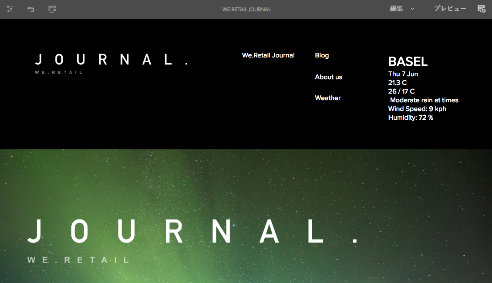

# SPAの概要とチュートリアル{#spa-introduction-and-walkthrough}

単一ページアプリケーション（SPA）により、Web サイトのユーザーに魅力的なエクスペリエンスを提供することができます。開発者は SPA フレームワークを使用してサイトを構築したいと考え、作成者はそうして構築されたサイトのコンテンツを AEM 内でシームレスに編集したいと考えています。

SPA エディターには、AEM 内で SPA をサポートするための包括的なソリューションが用意されています。この記事では、基本的なSPAアプリケーションを使用したオーサリングの手順を説明し、基盤となるAEM SPAエディターとの関連を示します。

>[!NOTE]
>
>SPAエディターは、SPAフレームワークベースのクライアント側レンダリング（ReactやAngularなど）を必要とするプロジェクトに推奨されるソリューションです。

## 概要 {#introduction}

### 記事の目的 {#article-objective}

この記事では、読者をSPAエディターのチュートリアルに進める前に、単純なSPAアプリケーションを使用して基本的なコンテンツ編集のデモを行う前に、SPAの基本的な概念について説明します。 次に、ページの構築、およびSPAアプリケーションとAEM SPAエディタとの関連ややややり取りに掘り下げます。

この概要とチュートリアルの目的は、AEM開発者に、SPAが関連する理由、一般的な動作、AEM SPAエディタでのSPAの処理方法、および標準のAEMアプリケーションとの相違点を説明することです。

チュートリアルは、標準的なAEM機能とサンプルのWeb.Retailジャーナルアプリに基づいています。 以下の要件を満たす必要があります。

* [AEMバージョン6.4（Service Pack 2以降）](/help/release-notes/sp-release-notes.md)
* [GitHubにあるサンプルのWe.Retailジャーナルアプリをここにインストールします。](https://github.com/Adobe-Marketing-Cloud/aem-sample-we-retail-journal)

>[!CAUTION]
>
>このドキュメントでは、 [We.Retailジャーナルアプリがデモ目的でのみ使用されます](https://github.com/Adobe-Marketing-Cloud/aem-sample-we-retail-journal) 。 どのプロジェクト作業にも使用しないでください。
>
>AEMプロジェクトでは、 [AEM Project Archetype](https://docs.adobe.com/content/help/ja-JP/experience-manager-core-components/using/developing/archetype/overview.html)（ReactまたはAngularを使用するSPAプロジェクトをサポートし、SPA SDKを利用する）を活用する必要があります。

### SPAとは {#what-is-a-spa}

シングルページアプリケーション(SPA)は、クライアント側でレンダリングされ、主にJavaScript主導であり、Ajax呼び出しに依存してデータを読み込み、ページを動的に更新する点で、従来のページとは異なります。 ほとんどまたはすべてのコンテンツは、1回のページ読み込みで1回取得され、ユーザーによるページとのやり取りに基づいて、必要に応じて非同期に読み込まれる追加のリソースが含まれます。

これにより、ページを更新する必要が減り、シームレスで高速な、ネイティブのアプリエクスペリエンスに近いエクスペリエンスをユーザーに提供できます。

AEM SPA Editorを使用すると、フロントエンド開発者はAEMサイトに統合できるSPAを作成でき、コンテンツ作成者は他のAEMコンテンツと同様に簡単にSPAコンテンツを編集できます。

### なぜSPAなの？ {#why-a-spa}

SPAは、より高速で流動的で、ネイティブアプリケーションと同様になることで、Webページの訪問者だけでなく、SPAの仕組みの性質上、マーケターや開発者にとっても非常に魅力的なエクスペリエンスとなります。


**訪問者数**

* 訪問者は、コンテンツとのやり取りでネイティブなエクスペリエンスを求めています。
* ページが速くなればなるほど、コンバージョンが発生する可能性が高いという明確なデータがあります。

**マーケター**

* マーケターは、豊富でネイティブなエクスペリエンスをオファーして、訪問者にコンテンツに対して十分な関与を促したいと考えています。
* パーソナライゼーションは、これらのエクスペリエンスをさらに魅力的にします。

**開発者向け**

* 開発者は、コンテンツとプレゼンテーションの間の懸念事項を明確に分けておきたいと考えています。
* クリーン分離により、システムの拡張性が向上し、フロントエンドの独立開発も可能になります。

### SPAの動作 {#how-does-a-spa-work}

SPAの主な概念は、サーバー呼び出しに伴う遅延を最小限に抑え、SPAがネイティブアプリケーションの応答性に近づくように、サーバーへの呼び出しと依存関係を低減することです。

従来の順次Webページでは、即時ページに必要なデータのみが読み込まれます。 つまり、訪問者が別のページに移動すると、サーバーが追加のリソースを呼び出します。 訪問者がページ上の要素とやり取りする際に、追加の呼び出しが必要になる場合があります。 これらの複数の呼び出しは、ページが訪問者のリクエストに追い付く必要があるので、遅延や遅延の感覚を与える可能性があります。


より流動的なエクスペリエンスを実現するために、訪問者がモバイルやネイティブアプリから予測する動作に近いSPAは、最初の読み込み時に訪問者に必要なすべてのデータを読み込みます。 最初は少し時間がかかる場合がありますが、サーバーコールを追加する必要はありません。

クライアント側でレンダリングすると、ページ要素の反応が速くなり、訪問者によるページとのやり取りが即時に行われます。 ページの速度を最大化するために、必要になる可能性のある追加データはすべて非同期に呼び出されます。

>[!NOTE]
>
>AEMでのSPAの動作方法に関する技術的な詳細については、AEMのSPA [使用の手引きを参照してください](/help/sites-developing/spa-getting-started-react.md)。
>
>SPAエディタの設計、アーキテクチャ、および技術的なワークフローについて詳しくは、「 [SPAエディタの概要](/help/sites-developing/spa-overview.md)」を参照してください。

## SPAを使用したコンテンツ編集エクスペリエンス {#content-editing-experience-with-spa}

AEM SPAエディターを利用するSPAが構築されている場合、コンテンツの編集と作成の際に、コンテンツ作成者は何の違いも認識しません。 共通のAEM機能を利用でき、作成者のワークフローに変更を加える必要はありません。

>[!NOTE]
>
>チュートリアルは、標準的なAEM機能とサンプルのWeb.Retailジャーナルアプリに基づいています。 以下の要件を満たす必要があります。
>
>* [AEMバージョン6.4(Service Pack 2)](/help/release-notes/sp-release-notes.md)
>* [GitHubにあるサンプルのWe.Retailジャーナルアプリをここにインストールします。](https://github.com/Adobe-Marketing-Cloud/aem-sample-we-retail-journal)

>


1. AEMでWe.Retailジャーナルアプリを編集します。

   `https://localhost:4502/editor.html/content/we-retail-journal/react.html`

   

1. 見出しコンポーネントを選択すると、ツールバーが他のコンポーネントと同様に表示されます。 「**編集**」を選択します。

   

1. AEM内でコンテンツを通常どおりに編集し、変更内容が保持されることに注意してください。

   

   >[!NOTE]
   >インプレーステキストエディタとSPAの詳細は、 [SPAエディタの概要](spa-overview.md#requirements-limitations) （英語）を参照してください。

1. アセットブラウザを使用して、新しい画像を画像コンポーネントにドラッグ&amp;ドロップします。

   

1. 変更は持続されます。

   

ページ上の追加のコンポーネントのドラッグ&amp;ドロップ、コンポーネントの並べ替え、レイアウトの変更など、追加のオーサリングツールは、SPA以外のアプリケーションと同様にサポートされます。

>[!NOTE]
>
>SPAエディタは、アプリケーションのDOMを変更しません。 SPA自体がDOMを処理します。
>
>この機能を確認するには、次の記事「 [SPA Apps」とAEM SPA Editorのセクションに進みます](/help/sites-developing/spa-walkthrough.md#spa-apps-and-the-aem-spa-editor)。

## SPA AppsとAEM SPAエディタ {#spa-apps-and-the-aem-spa-editor}

SPAがエンドユーザーに対してどのように動作するかを体験し、SPAページを検査すると、AEMのSPAエディターでのSAPアプリの動作をより深く理解できます。

### SPAアプリケーションの使用 {#using-an-spa-application}

1. Web.Retailジャーナルアプリケーションを公開サーバーで読み込むか、ページエディターの **ページ表示****(Page Information** )メニューから「公開済み」オプションを使用します。

   `/content/we-retail-journal/react.html`

   

   子ページへのナビゲーション、天気予報ウィジェット、記事など、ページ構造に注意してください。

1. メニューを使用して子ページに移動し、ページが読み込まれるのを確認します。更新は必要ありません。

   

1. ブラウザーに組み込まれている開発者ツールを開き、子ページを移動しながらネットワークアクティビティを監視します。

   

   アプリ内でページ間を移動する際のトラフィック量は非常に少なくなります。 ページがリロードされず、新しい画像のみが要求されます。

   SPAは、コンテンツとルーティングを完全にクライアント側で管理します。

子ページをナビゲートする際にページがリロードされない場合、どのようにロードされますか。

次のセクション「SPAアプリケーションの [読み込み](/help/sites-developing/spa-walkthrough.md#loading-an-spa-application)」では、SPAの読み込みの仕組みと、コンテンツの同期および非同期的な読み込み方法を詳しく調べます。

### SPAアプリケーションの読み込み {#loading-an-spa-application}

1. まだ読み込まれていない場合は、Web.Retailジャーナルアプリケーションを公開サーバーに読み込むか、ページエディターの **ページ表示****(Page Information** )メニューから「公開済み」オプションを使用します。

   `/content/we-retail-journal/react.html`

   

1. ブラウザーの組み込みツールを使用して、ページのソースを表示します。
1. ソースのコンテンツは非常に限られていることに注意してください。

   ```
   <!DOCTYPE HTML>
   <html lang="en-CH">
       <head>
       <meta charset="UTF-8">
       <title>We.Retail Journal</title>
   
       <meta name="template" content="we-retail-react-template"/>
   
   <link rel="stylesheet" href="/etc.clientlibs/we-retail-journal/react/clientlibs/we-retail-journal-react.css" type="text/css">
   
   <link rel="stylesheet" href="/libs/wcm/foundation/components/page/responsive.css" type="text/css">
   
   </head>
       <body class="page basicpage">
   
   <div id="page"></div>
   
   <script type="text/javascript" src="/etc.clientlibs/we-retail-journal/react/clientlibs/we-retail-journal-react.js"></script>
   
       </body>
   </html>
   ```

   ページの本文にはコンテンツが含まれていません。 主にスタイルシートとReactスクリプトの呼び出しで構成され `we-retail-journal-react.js`ます。

   このReactスクリプトは、このアプリケーションの主なドライバーであり、すべてのコンテンツのレンダリングを担当します。

1. ブラウザーに組み込まれているツールを使用して、ページを調べます。 完全に読み込まれたDOMのコンテンツを表示します。

   

1. [インスペクタ]の[ネットワーク]タブに切り替えて、ページを再読み込みします。

   イメージリクエストを無視した場合、ページに対して読み込まれる主なリソースは、ページ自体、CSS、React Javascript、その依存関係、およびページのJSONデータです。

   

1. を新しいタブ `react.model.json` に読み込みます。

   `/content/we-retail-journal/react.model.json`

   

   AEM SPA Editorは、 [AEM Content Services](/help/assets/content-fragments/content-fragments.md) を利用して、ページのコンテンツ全体をJSONモデルとして配信します。

   特定のインターフェイスを実装することで、SlingモデルはSPAに必要な情報を提供します。 JSONデータの配信は、各コンポーネント（ページ間、段落間、コンポーネント間など）に下方向に委任されます。

   各コンポーネントは、そのコンポーネントが何を公開し、どのようにレンダリングされるかを選択します（HTLを使用するサーバー側またはReactを使用するクライアント側）。 もちろん、この記事では、Reactを使用したクライアント側のレンダリングに重点を置いています。

1. また、モデルはページを同期的に読み込むように複数のページをグループ化できるので、必要なページ再読み込み数を減らすことができます。

   Web.Retailジャーナルの例では、訪問者は一般的にこれらのすべてのページを訪問するので、 `home`、 `blog`および `aboutus` ページは同期的に読み込まれます。 ただし、訪問者が `weather` ページを訪問する可能性が低いので、ページは非同期で読み込まれます。

   この動作は必須ではなく、完全に定義可能です。

   

1. この動作の違いを表示するには、ページを再読み込みし、インスペクタのネットワークアクティビティをクリアします。 ページメニューでブログや会社のページに移動し、ネットワークアクティビティが報告されていないことを確認します。

   天気予報ページに移動し、非同期で呼び出され `weather.model.json` ることを確認します。

   

### SPAエディタとの対話 {#interaction-with-the-spa-editor}

サンプルのWeb.Retailジャーナルアプリケーションを使用すると、JSONコンテンツ配信のコンテンツサービスやリソースの非同期的な読み込みを利用し、アプリケーションの動作と公開時の読み込み方法が明確になります。

また、コンテンツ作成者の場合、SPAエディターを使用したコンテンツ作成はAEM内でシームレスです。

次のセクションでは、SPAエディタでSPA内のコンポーネントをAEMコンポーネントに関連付け、このシームレスな編集操作を実現できる契約を検討します。

1. エディターでWe.Retailジャーナルアプリケーションを読み込み、 **プレビュー** モードに切り替えます。

   `https://localhost:4502/editor.html/content/we-retail-journal/react.html`

1. ブラウザーに組み込まれている開発者ツールを使用して、ページのコンテンツを調べます。 選択ツールを使用して、ページ上の編集可能なコンポーネントを選択し、表示の詳細を要素に選択します。

   コンポーネントには新しいデータ属性があり `data-cq-data-path`ます。

   

   例：

   `data-cq-data-path="root/responsivegrid/paragraph_1`

   このパスにより、各コンポーネントの編集コンテキスト設定オブジェクトの取得と関連付けが可能になります。

   これは、エディタがSPA内の編集可能なコンポーネントとして認識するために必要なマークアップ属性です。 この属性に基づいて、SPAエディタは、どの編集可能な設定がコンポーネントに関連付けられているかを判断し、正しいフレームやツールバーなどを設定します。 が読み込まれます。

   また、マークプレースホルダやアセットのドラッグ&amp;ドロップ機能用に、いくつかの特定のクラス名が追加されています。

   >[!NOTE]
   >
   >これは、AEMのサーバー側でレンダリングされたページでの動作の変更です。編集可能な各コンポーネントに `cq` 要素が挿入されます。
   >
   >
   >SPAでのこのアプローチは、追加のデータ属性に依存するカスタム要素を挿入する必要がなくなり、フロントエンド開発者にとってマークアップが簡単になります。

## 次の手順 {#next-steps}

AEMでのSPA編集の経験とSPAとSPAエディタとの関係を理解したので、SPAの構築方法を詳しく説明します。

* [AEMでのSPAの使用の手引き](/help/sites-developing/spa-getting-started-react.md) :AEMでSPAエディタを使用するために基本SPAを構築する方法を示します
* [「SPA Editor Overview](/help/sites-developing/spa-overview.md) 」では、AEMとSPAの間の通信モデルの詳細について説明しています。
* [AEM向けSPAの開発](/help/sites-developing/spa-architecture.md) ：フロントエンド開発者とAEM向けSPAの開発方法、SPAとAEMアーキテクチャとのやり取り方について説明します。
