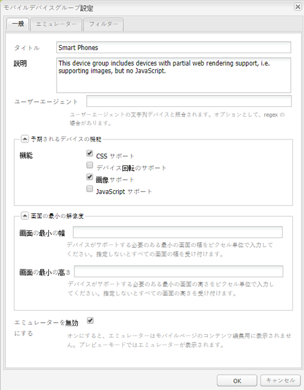
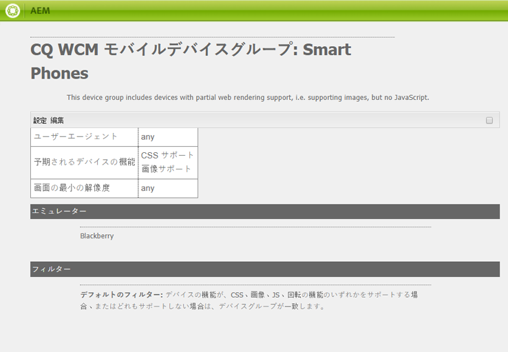
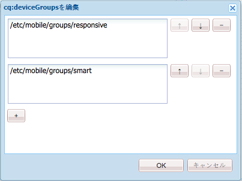
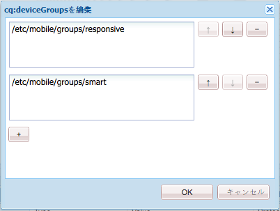
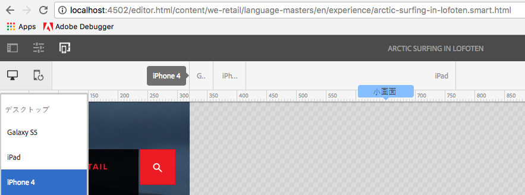

# アダプティブテンプレートレンダリング{#adaptive-template-rendering}

アダプティブテンプレートレンダリングを使用すると、バリエーションを持つページを管理できます。この機能は元々、モバイルデバイス（フィーチャーフォンとスマートフォンなど）用に様々な HTML 出力を提供する際に便利でしたが、異なるマークアップまたは HTML 出力を必要とする各種デバイスにエクスペリエンスを提供する際にも役立ちます。

## 概要 {#overview}

テンプレートは一般にレスポンシブグリッドを中心に構築されます。これらのテンプレートをベースに作成されたページは完全にレスポンシブとなり、クライアントデバイスのビューポートに合わせて自動的に調整されます。作成者は、ページエディターのエミュレーターツールバーを使用して、レイアウトを特定のデバイスに設定できます。

また、アダプティブレンダリングに対応するようテンプレートを設定することもできます。デバイスグループが正しく設定されている場合、エミュレーターモードでデバイスを選択すると、URL に別のセレクターを使用してページがレンダリングされます。セレクターを使用すると、特定のページレンダリングを、URL を使用して直接呼び出すことができます。

デバイスグループを設定する際は、以下の点に留意してください。

* 各デバイスは、少なくとも 1 つのデバイスグループに属している必要があります。
* デバイスは複数のデバイスグループに属することができます。
* デバイスは複数のデバイスグループに属することができるので、複数のセレクターを結合できます。
* セレクターの結合は、リポジトリ内で保持されるので、上から下に向かって評価されます。

>[!NOTE]
>
>デバイスグループ&#x200B;**レスポンシブデバイス**&#x200B;にはセレクターがありません。これは、レスポンシブデザインに対応していると認識されるデバイスは、アダプティブなレイアウトを必要としないと見なされるからです。

## 設定 {#configuration}

アダプティブレンダリングのセレクターは、既存のデバイスグループ、または[独自に作成したグループ](/help/sites-developing/mobile.md#device-groups)に対して設定できます。

この例では、We.Retail 内に&#x200B;**エクスペリエンスページ**&#x200B;テンプレートの一部としてアダプティブレンダリングセレクターが含まれるように、既存のデバイスグループである&#x200B;**スマートフォン**&#x200B;を設定します。

1. `http://localhost:4502/miscadmin#/etc/mobile/groups` で、アダプティブセレクターを必要とするデバイスグループを編集します。

   「**エミュレーターを無効にする**」オプションを設定して保存します。

   

1. 以降の手順でテンプレート構造およびページ構造にデバイスグループ&#x200B;**スマートフォン**&#x200B;を追加すると、**Blackberry** および **iPhone 4** でセレクターが使用できるようになります。

   

1. CRXDE Lite を使用し、テンプレートの構造で複数値文字列プロパティ `cq:deviceGroups` にデバイスグループを追加します。これにより、テンプレートでデバイスグループを使用できるようになります。

   `/conf/<your-site>/settings/wcm/templates/<your-template>/structure/jcr:content`

   例えば、スマートフォンデバイスグループを追加する場合は、以下のようになります。

   `/conf/we-retail/settings/wcm/templates/experience-page/structure/jcr:content`

   

1. CRXDE Lite を使用し、サイトの構造で複数値文字列プロパティ `cq:deviceGroups` にデバイスグループを追加します。これにより、サイトでデバイスグループを使用できるようになります。

   `/content/<your-site>/jcr:content`

   例えば、**スマートフォン**&#x200B;デバイスグループを使用できるようにする場合は、以下のようになります。

   `/content/we-retail/jcr:content`

   

これで、ページエディターで[エミュレーター](/help/sites-authoring/responsive-layout.md#layout-definitions-device-emulation-and-breakpoints)を使用する際（[レイアウトを変更する](/help/sites-authoring/responsive-layout.md)場合など）、設定済みのデバイスグループのデバイスを選択すると、URL の一部としてセレクターを持つページがレンダリングされるようになります。

この例では、**エクスペリエンスページ**&#x200B;テンプレートをベースとするページを編集するときに、エミュレーターで iPhone 4 を選択すると、ページにセレクターが含められ、`arctic-surfing-in-lofoten.html` の代わりに `arctic-surfing-in-lofoten.smart.html` としてレンダリングされます。

このセレクターを使用してページを直接呼び出すこともできます。

