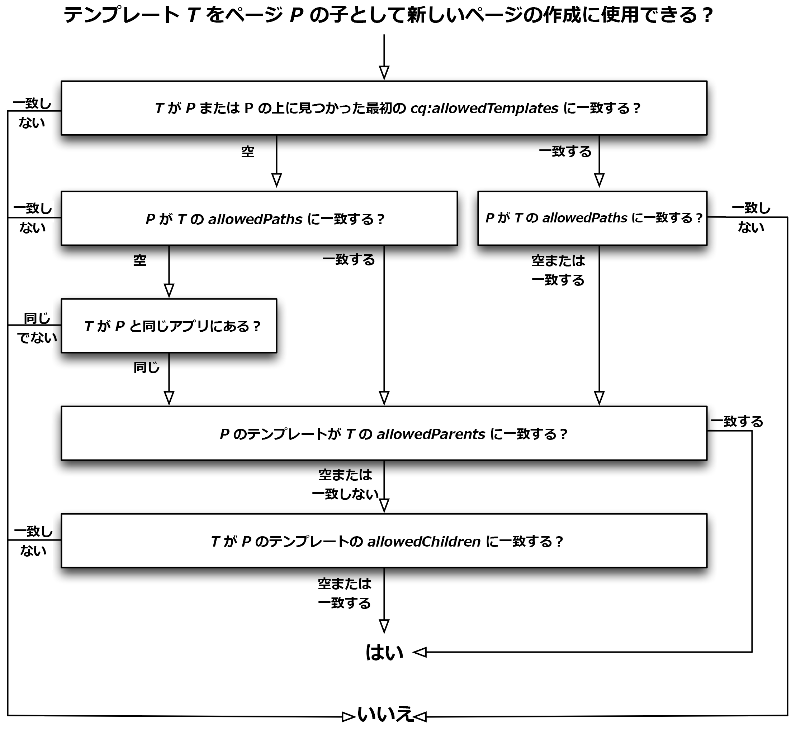

# テンプレート{#templates}

テンプレートは、AEM の様々な場面で使用されます。

* [ページの作成時にテンプレートを選択](#templates-pages)します。このテンプレートは、新しいページのベースとして使用されます。テンプレートは、作成されるページの構造、初期コンテンツおよび使用可能な[コンポーネント](/help/sites-authoring/default-components.md)（デザインプロパティ）を定義します。

* [コンテンツフラグメントの作成時にテンプレートを選択](#templates-content-fragments)します。このテンプレートは、構造、初期要素およびバリエーションを定義します。

ここでは、次のテンプレートについて詳しく説明します。

* [ページテンプレート - 編集可能](/help/sites-developing/page-templates-editable.md)
* [ページテンプレート - 静的](/help/sites-developing/page-templates-static.md)
* [コンテンツフラグメントテンプレート](/help/sites-developing/content-fragment-templates.md)
* [アダプティブテンプレートレンダリング](/help/sites-developing/templates-adaptive-rendering.md)

## テンプレート - ページ {#templates-pages}

現在、AEM には、ページ作成用として 2 つの基本的なタイプのテンプレートが用意されています。

>[!NOTE]
>
>[新しいページを作成](/help/sites-authoring/managing-pages.md#creating-a-new-page)するときにテンプレートを使用する際、ページ編集者にとって見た目的な違いはなく、またどちらのタイプのテンプレートを使用しているかについての表示もありません。

### 編集可能なテンプレート {#editable-templates}

編集可能なテンプレートは、AEMを使用した開発に関するベストプラクティスとして考えられるようになりました。

編集可能テンプレートのメリットは次のとおりです。

* 作成者が[作成](/help/sites-authoring/templates.md#creating-a-new-template-template-author)および[編集](/help/sites-authoring/templates.md#editing-a-template-structure-template-author)できます。

* テンプレートを使用して作成される任意のページで、以下の項目を定義できます。

   * 構造
   * 初期コンテンツ
   * コンテンツポリシー

* 新しいページの作成後も、そのページとテンプレートの間に動的接続が維持されます。つまり、テンプレートの構造に対する変更は、そのテンプレートを使用して作成されるすべてのページに反映されます（初期コンテンツに対する変更は反映されません）。
* デザインプロパティを保持するには、テンプレートエディターから編集できるコンテンツポリシーを使用します（ページエディター内のデザインモードは使用しません）。
* Are stored under `/conf`
* 詳しくは、[編集可能テンプレート](/help/sites-developing/page-templates-editable.md)を参照してください。

>[!NOTE]
>
>An AEM Community Article is available explaining how to develop an Experience Manager site with Editable Templates, see [Creating an Adobe Experience Manager 6.5 website using Editable Templates](https://helpx.adobe.com/jp/experience-manager/using/first_aem64_website.html).

### 静的テンプレート {#static-templates}

静的テンプレートには、次の特徴があります。

* 開発者が定義および設定する必要があります。
* これはAEMの元のテンプレート化システムで、多くのバージョンで利用できました。
* 作成されるページと同じ構造のノード階層を含んでいますが、実際のコンテンツはありません。
* 新しいページはテンプレートをコピーして作成されるので、動的接続は存在しません。
* デザインプロパティを保持するには、[デザインモード](/help/sites-authoring/default-components-designmode.md)を使用します。
* Are stored under `/apps`
* 詳しくは、[静的テンプレート](/help/sites-developing/page-templates-static.md)を参照してください。

>[!NOTE]
>
>AEM 6.5では、静的テンプレートの使用はベストプラクティスとは見なされません。 その代わりに編集可能テンプレートを使用してください。
>
>[AEM最新化ツールは](modernization-tools.md) 、静的なテンプレートから編集可能なテンプレートに移行する際に役立ちます。

### Template Availability {#template-availability}

>[!CAUTION]
>
>AEMは、複数のプロパティをオファーして、 **Sites**（サイト）で許可されるテンプレートを制御します。 ただし、組み合わせると、追跡や管理が困難な非常に複雑なルールになる可能性があります。
>
>したがって、Adobeでは、次の項目を定義して、単純な開始を行うことをお勧めします。
>
>* 唯一の `cq:allowedTemplates` 財産
   >
   >
* サイトのルートにのみ
>
>
For an example, see We.Retail: `/content/we-retail/jcr:content`
>
>プロパティ `allowedPaths`、 `allowedParents``allowedChildren` およびをテンプレートに配置して、より高度なルールを定義することもできます。 ただし、可能な場合は、許可されるテンプレートをさらに制限する必要がある場合は ** 、サイトのサブセクションでさらに `cq:allowedTemplates` プロパティを定義する方が簡単です。
>
>また、「 `cq:allowedTemplates` ページプロパティ」の「 **詳細** 」タブで、作成者がプロパティを更新できるという利点もあります ****。 その他のテンプレートプロパティは、（標準） UIを使用して更新することはできないので、変更を行うたびに、ルールとコードのデプロイメントを管理する開発者が必要になります。

サイト管理インターフェイスで新しいページを作成する場合、使用可能なテンプレートのリストは、新しいページの場所と、各テンプレートで指定されている配置制限によって異なります。

次のプロパティは、新しいページをページの子として配置する場合に、テンプレート `T` を使用できるかどうかを決定 `P`します。 これらの各プロパティは、0個以上の正規式を保持する複数値の文字列で、パスとの一致に使用されます。

* The `cq:allowedTemplates` property of the `jcr:content` subnode of `P` or an ancestor of `P`.

* の `allowedPaths` プロパティ `T`。

* の `allowedParents` プロパティ `T`。

* The `allowedChildren` property of the template of `P`.

評価は次のようにおこなわれます。

* で始まるページ階層を昇順にしているときに見つかった、最初の空でない `cq:allowedTemplates` プロパティ `P` は、のパスと一致し `T`ます。 一致する値がない場合、は拒否さ `T` れます。

* If `T` has a non-empty `allowedPaths` property, but none of the values match the path of `P`, `T` is rejected.

* 上記のプロパティの両方が空または存在しない場合、と同じアプリケーションに属し `T` ない限りは拒否され `P`ます。 `T` は、のパスの2番目のレベルの名前がのパスの2番目のレベルの名前と同じである場合 `P` に限り、ifと同じアプリケーション `T` に属し `P`ます。 例えば、テンプレート `/apps/geometrixx/templates/foo` はページと同じアプリに属してい `/content/geometrixx`ます。

* If `T` has an non-empty `allowedParents` property, but none of the values match the path of `P`, `T` is rejected.

* If the template of `P` has a non-empty `allowedChildren` property, but none of the values match the path of `T`, `T` is rejected.

* その他すべての場合は、`T` は許可されます。

以下の図は、テンプレートの評価プロセスを示しています。

#### 子ページで使用するテンプレートの制限 {#limiting-templates-used-in-child-pages}

特定のページの下に子ページを作成するために使用できるテンプレートを制限するには、ページの `cq:allowedTemplates``jcr:content` nodeのプロパティを使用して、子ページとして許可するテンプレートのリストを指定します。 例えば、リストの各値は、許可されている子ページのテンプレートへの絶対パスである必要があり `/apps/geometrixx/templates/contentpage`ます。

You can use the `cq:allowedTemplates` property on the template&#39;s  `jcr:content` node to have this configuration applied to all newly created pages that use this template.

テンプレート階層などに関する制約をさらに追加する場合は、テンプレートの `allowedParents/allowedChildren` プロパティを使用できます。 その後、テンプレートTから作成されたページが、テンプレートTから作成されたページの親/子である必要があることを明示的に指定できます。

## テンプレート - コンテンツフラグメント {#templates-content-fragments}

詳しくは、[コンテンツフラグメントテンプレート](/help/sites-developing/content-fragment-templates.md)を参照してください。
