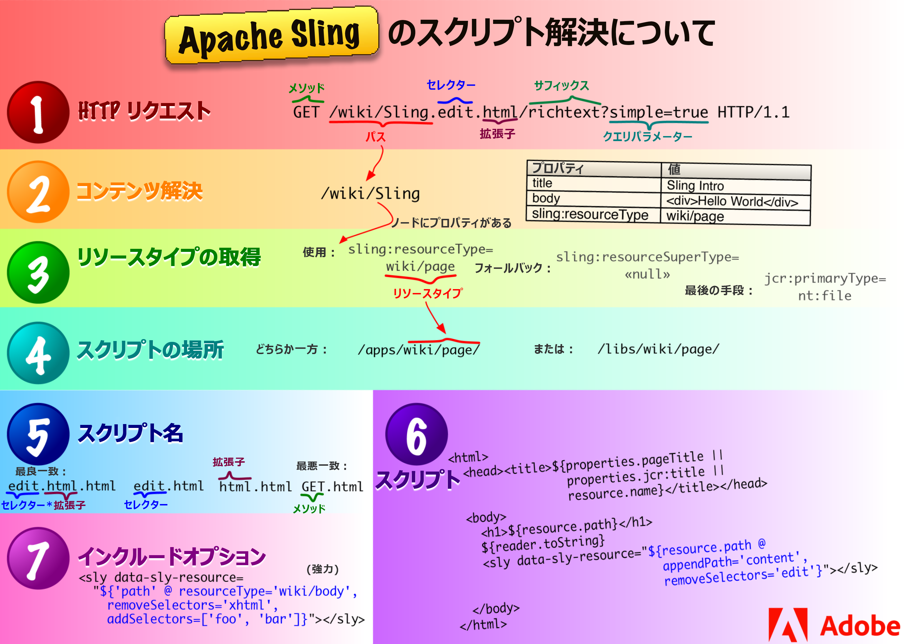

# AEM の中心概念 {#aem-core-concepts}

>[!NOTE]
>
>AEM の中心概念の詳細に入る前に、[AEM Sites の開発の手引き](/help/sites-developing/getting-started.md)のドキュメントで WKND チュートリアルを済ませ、AEM の開発プロセスと中心概念の概要を確認しておくことをお勧めします。

## AEM での開発の必要条件 {#prerequisites-for-developing-on-aem}

AEM での開発には、以下のスキルが必要です。

* 以下を含む Web アプリケーション技術の基本知識

   * リクエスト - 応答（XMLHttpRequest／XMLHttpResponse）のサイクル
   * HTML
   * CSS
   * JavaScript

* Content Explorer を含む Experience Server（CRX）の実務知識
* クラシック UI で開発する場合は、JSP の簡単な例を理解および変更できる能力を含む、JSP（JavaServer Pages）の基本知識が必要です。

[ガイドラインおよびベストプラクティス](/help/sites-developing/dev-guidelines-bestpractices.md)を参照し、手順に従うこともお勧めします。

## Java コンテンツリポジトリ {#java-content-repository}

Java コンテンツリポジトリ（JCR）の規格である [JSR 283](https://docs.adobe.com/content/docs/en/spec/jcr/2.0/index.html) では、コンテンツリポジトリ内で、任意の精度レベルでコンテンツに双方向アクセスするための、ベンダーにも実装にも依存しない方法が指定されています。

仕様を主導しているのは、Adobe Research（スイス）AG です。

JCR [API 2.0](https://docs.adobe.com/docs/en/spec/javax.jcr/javadocs/jcr-2.0/index.html) パッケージ、javax.jcr。&amp;ast;は、リポジトリのコンテンツへの直接アクセスと操作に使用されます。

## Experience Server（CRX）と Jackrabbit {#experience-server-crx-and-jackrabbit}

Experience Server は、AEM の基でありカスタムアプリケーションの構築に活用できる Experience Services を備えており、Jackrabbit に基づいてコンテンツリポジトリを埋め込みます。

[Apache Jackrabbit](https://jackrabbit.apache.org/) は、オープンソースの、JCR API 2.0 に完全準拠した実装です。

## Sling のリクエスト処理 {#sling-request-processing}

### Sling の概要 {#introduction-to-sling}

AEM の構築には [Sling](https://sling.apache.org/site/index.html) が使用されています。これは、REST の原則に基づき、コンテンツ指向のアプリケーションを簡単に開発できる、Web アプリケーションのフレームワークです。Sling では、Apache Jackrabbit のような JCR リポジトリを、また、AEM の場合は CRX コンテンツリポジトリを、データストアとして使用します。Sling は Apache Software Foundation に貢献してきました。詳しくは、「Apache」を参照してください。

Sling を使用する場合、レンダリングされるコンテンツのタイプは、処理に関する第一の考慮事項ではありません。主な考慮事項は、URL を解決して得られるコンテンツオブジェクト用に、レンダリングを実行するためのスクリプトが見つかるかどうかです。このことは、要件に合わせて簡単にカスタマイズ可能なページを Web コンテンツ作成者が構築する際に非常に役立ちます。

この柔軟性のメリットは、アプリケーションに幅広い様々なコンテンツ要素が含まれる場合や、簡単にカスタマイズできるページが必要な場合に明らかです。特に、WCM のような Web コンテンツ管理システムを AEM ソリューションに実装する場合です。

See [Discover Sling in 15 minutes](https://sling.apache.org/documentation/getting-started/discover-sling-in-15-minutes.html) for the first steps for developing with Sling.

次の図は、Sling のスクリプト解決の説明です。HTTP リクエストからコンテンツノード、コンテンツノードからリソースタイプ、リソースタイプからスクリプトを得る方法と、使用可能なスクリプト変数を示しています。



次の図は、SlingPostServlet を扱う際に使用できる、非表示ながらも強力なリクエストパラメーターの説明です。リポジトリでノードを作成、変更、削除、コピーおよび移動するためのオプションを際限なしに提供する、すべての POST リクエストのデフォルトハンドラーです。


### Sling はコンテンツ中心型 {#sling-is-content-centric}

Sling はコンテンツ中心型です。**&#x200B;つまり、（HTTP）リクエストがそれぞれ JCR リソース（リポジトリノード）の形式でコンテンツにマップされるので、コンテンツに焦点を当てた処理がおこなわれるということです。

* 最初のターゲットは、コンテンツを保持しているリソース（JCR ノード）です。
* 次に、表現、つまりスクリプトが、リソースプロパティから、リクエストの一部（セレクターや拡張子など）と組み合わせて配置されます。

### RESTful Sling {#restful-sling}

コンテンツ中心型の原理により、Sling は REST 指向のサーバーを実装するので、Web アプリケーションフレームワークの新しい概念を特徴としています。メリットは次のとおりです。

* 表面上だけでなく、非常に RESTful であり、リソースや表現をサーバー内で正しくモデリング
* 1 つ以上のデータモデルを削除

   * 以前に必要だったもの：URL 構造、ビジネスオブジェクト、DB スキーマ
   * 現在必要なもの：URL = リソース = JCR 構造

### URL の分解 {#url-decomposition}

Sling では、処理はユーザーリクエストの URL によって駆動されます。これにより、適切なスクリプトによって表示されるコンテンツが定義されます。これをおこなうために、URL から情報が抽出されます。

次の URL を分析する場合、

```xml
https://myhost/tools/spy.printable.a4.html/a/b?x=12
```

以下の複合部分に分割できます。

| プロトコル | ホスト | コンテンツのパス | セレクター | 拡張子 |  | サフィックス |  | パラメーター |
|---|---|---|---|---|---|---|---|---|
| https:// | myhost | tools/spy | .printable.a4. | html | ／ | a/b | ? | x=12 |

**protocol** HTTP

**host** :Webサイトの名前。

**コンテンツパス** ：レンダリングするコンテンツを指定するパス。 拡張子と組み合わせて使用される。この例では、tools/spy.htmlに変換します。

**selector(s)** ：コンテンツをレンダリングする別の方法で使用されます。次の例では、A4形式のプリンターに適したバージョンです。

**extension** Content形式；レンダリングに使用するスクリプトも指定します。

**[サフィックス** ]追加情報を指定する場合に使用できます。

**param(s)** 、動的コンテンツに必要なパラメーター。

#### URL からコンテンツおよびスクリプトへ {#from-url-to-content-and-scripts}

これらの原則を使用して、

* マッピングはリクエストから抽出されたコンテンツパスを使用してリソースを見つけます。
* 適切なリソースが見つかると、Sling リソースタイプが抽出され、コンテンツのレンダリングに使用するスクリプトを見つけるために使用されます。

下の図は、使用するメカニズムを示しています。これについては、以下の各項で詳細に説明します。


Slingを使用して、特定のエンティティをレンダリングするスクリプトを指定します(JCRノードで `sling:resourceType` プロパティを設定します)。 このメカニズムは、スクリプトが（PHPスクリプトのSQL文のように）データエンティティにアクセスする複数の自由度をオファーに持たせ、リソースに複数のレンディションを持たせることができます。

#### リソースへのマッピングリクエスト {#mapping-requests-to-resources}

リクエストは分解され、必要な情報が抽出されます。リポジトリで、リクエストされたリソース（コンテンツノード）の検索がおこなわれます。

* first Sling checks whether a node exists at the location specified in the request; e.g. `../content/corporate/jobs/developer.html`
* if no node is found, the extension is dropped and the search repeated; e.g. `../content/corporate/jobs/developer`
* それでもノードが見つからない場合、Sling は HTTP コード 404（Not Found）を返します。

Sling では JCR ノード以外のものをリソースとすることもできますが、これは高度な機能です。

### スクリプトの検索 {#locating-the-script}

適切なリソース（コンテンツノード）が見つかると、**sling リソースタイプ**&#x200B;が抽出されます。これは、コンテンツのレンダリングに使用するスクリプトを見つけるパスです。

The path specified by the `sling:resourceType` can be either:

* 絶対パス
* 相対、設定パラメーターへ

   移植性を高めるため、相対パスはAdobeが推奨します。

All Sling scripts are stored in subfolders of either `/apps` or `/libs`, which will be searched in this order (see [Customizing Components and Other Elements](/help/sites-developing/dev-guidelines-bestpractices.md#customizing-components-and-other-elements)).

その他の注意点は次のとおりです。

* メソッド（GET、POST）が必要なときは、HTTP の仕様に従って大文字で指定します（例：jobs.POST.esp。以下を参照）。
* 以下のような様々なスクリプトエンジンがサポートされています。

   * `.esp, .ecma`:ECMAScript (JavaScript)ページ（サーバー側の実行）
   * `.jsp`:Javaサーバーページ（サーバー側の実行）
   * `.java`:Javaサーブレットコンパイラ（サーバ側の実行）
   * `.jst`:JavaScriptテンプレート（クライアント側の実行）

The list of script engines supported by the given instance of AEM are listed on the Felix Management Console ( `http://<host>:<port>/system/console/slingscripting`).

また、Apache Sling では、他の一般的なスクリプトエンジン（Groovy、JRuby、Freemarker など）との統合がサポートされており、新しいスクリプトエンジンと統合する方法も提供されています。

Using the above example, if the `sling:resourceType` is `hr/jobs` then for:

* GET/HEADリクエスト、.htmlで終わるURL（デフォルトのリクエストタイプ、デフォルトの形式）

   スクリプトは/apps/hr/jobs/jobs.espになります。sling:resourceTypeの最後のセクションがファイル名を形成します。

* POST要求(GET/HEADを除くすべての要求タイプ。メソッド名は大文字にする必要があります)

   スクリプト名にPOSTが使用されます。

   スクリプトは次のようになり `/apps/hr/jobs/jobs.POST.esp`ます。

* 他の形式のURL（.htmlで終わらない）

   例：`../content/corporate/jobs/developer.pdf`

   スクリプトは次のとおりで `/apps/hr/jobs/jobs.pdf.esp`す。スクリプト名にサフィックスが追加されます。

* セレクターを含むURL

   セレクターを使用して、同じコンテンツを別の形式で表示できます。 例えば、プリンターに適したバージョン、rssフィード、サマリなどです。

   プリンターに適したバージョンを見てみると、セレクターが *印刷できます*。～と同様に `../content/corporate/jobs/developer.print.html`

   スクリプトは次のとおりで `/apps/hr/jobs/jobs.print.esp`す。セレクターがスクリプト名に追加されます。

* sling:resourceType が定義されていない場合は、次のようになります。

   * コンテンツパスは、適切なスクリプトの検索に使用されます（パスに基づくResourceTypeProviderがアクティブな場合）。

      例えば、のスクリプトはで検索 `../content/corporate/jobs/developer.html` を生成し `/apps/content/corporate/jobs/`ます。

   * プライマリノードタイプが使用されます。

* スクリプトがまったく見つからない場合は、デフォルトのスクリプトが使用されます。

   デフォルトのレンディションは現在、プレーンテキスト(.txt)、HTML(.html)、JSON(.json)としてサポートされています。これらのレンディションでは、ノードのプロパティ（適切な形式）がリストされます。 拡張子.resのデフォルトのレンディション、または要求拡張子のない要求は、（可能な場合は）リソースをスプールします。
* HTTP エラー処理（コード 403 または 404）の場合、Sling は以下のいずれかの場所でスクリプトを検索します。

   * [カスタマイズスクリプト](/help/sites-developing/customizing-errorhandler-pages.md)の /apps/sling/servlet/errorhandler
   * 標準スクリプト /libs/sling/servlet/errorhandler/403.esp または 404.esp

特定のリクエストに複数のスクリプトが該当する場合は、一致率が最も高いスクリプトが選択されます。一致は具体的であるほど良くなります。つまり、リクエスト拡張子であれ、メソッド名の一致であれ、セレクターの一致が多いほど良くなります。

For example, consider a request to access the resource
`/content/corporate/jobs/developer.print.a4.html`
of type
`sling:resourceType="hr/jobs"`

また、次のリストのスクリプトが正しい場所にあると仮定します。

1. `GET.esp`
1. `jobs.esp`
1. `html.esp`
1. `print.esp`
1. `print.html.esp`
1. `print/a4.esp`
1. `print/a4/html.esp`
1. `print/a4.html.esp`

この場合、優先順位は (8) - (7) - (6) - (5) - (4) - (3) - (2) - (1) となります。

リソースタイプ(主に `sling:resourceType` プロパティで定義)に加えて、リソースのスーパータイプもあります。 これは、通常、 `sling:resourceSuperType` プロパティで示されます。 これらのスーパータイプは、スクリプトを検索する際にも考慮されます。 リソース・スーパー・タイプのメリットは、デフォルトのリソース・タイプ `sling/servlet/default` （デフォルト・サーブレットで使用）が実際にルートである場合に、リソースの階層を形成できる点です。

リソースのリソーススーパータイプは次の 2 つの方法で定義できます。

* by the `sling:resourceSuperType` property of the resource.
* by the `sling:resourceSuperType` property of the node to which the `sling:resourceType` points.

次に例を示します。

* ／

   * a
   * b

      * sling:resourceSuperType = a
   * c

      * sling:resourceSuperType = b
   * x

      * sling:resourceType = c
   * y

      * sling:resourceType = c
      * sling:resourceSuperType = a


タイプの階層：

* `/x`
   * は、`[ c, b, a, <default>]`
* ～を求めて `/y`
   * 階層は `[ c, a, <default>]`

This is because `/y` has the `sling:resourceSuperType` property whereas `/x` does not and therefore its supertype is taken from its resource type.

#### Sling スクリプトを直接呼び出しできない {#sling-scripts-cannot-be-called-directly}

Sling 内では、スクリプトを直接呼び出しできません。REST サーバーの厳格な概念に違反して、リソースと表現を混在させることになるからです。

表現（スクリプト）を直接呼び出す場合、リソースがスクリプト内に隠され、フレームワーク（Sling）では認識できなくなります。これにより、次のような機能が失われます。

* GET 以外の HTTP メソッドの自動処理。これには以下が含まれます。

   * Sling のデフォルトの実装で処理される POST、PUT、DELETE
   * the `POST.jsp` script in your sling:resourceType location

* コードアーキテクチャに必要なクリーン性や明確な構造が失われます。これは大規模な開発では最も重要です。

### Sling API {#sling-api}

これはSling APIパッケージorg.apache.slingを使用します。&amp;ast;、およびタグライブラリ。

### sling:include を使用した既存の要素の参照 {#referencing-existing-elements-using-sling-include}

最後の考慮事項は、スクリプト内にある既存の要素の参照の必要性です。

More complex scripts (aggregating scripts) might need to access multiple resources (for example navigation, sidebar, footer, elements of a list) and do so by including the *resource*.

これを行うには、sling:include（&quot;/&lt;パス>/&lt;リソース>&quot;）コマンドを使用します。これは、イメージをレンダリングするための既存の定義を参照する次の文のように、参照先のリソースの定義を効果的に含めます。

```xml
%><sling:include resourceType="geometrixx/components/image/img"/><%
```

## OSGi {#osgi}

OSGi は、モジュール式アプリケーションおよびライブラリを開発およびデプロイするためのアーキテクチャを定義します（Dynamic Module System for Java とも言う）。OSGi コンテナを使用すると、アプリケーションを個々のモジュール（追加のメタ情報を含む jar ファイルで、OSGi 用語ではバンドル）に分解し、以下を使用してモジュール間の相互依存性を管理できます。

* コンテナ内に実装されているサービス
* コンテナとアプリケーションの間の契約

これらのサービスおよび契約によって提供されるアーキテクチャでは、コラボレーションのために個々の要素が相互に動的に検出し合うことができます。

その後、OSGi フレームワークによって、これらのバンドルの動的読み込み／読み込み解除、設定および制御が可能になります。再起動は不要です。

>[!NOTE]
>
>Full information on OSGi technology can be found at the [OSGi website](https://www.osgi.org).
>
>特に、基礎教育に関するページには、プレゼンテーションやチュートリアルのコレクションが収められています。

このアーキテクチャを使用すると、アプリケーション専用のモジュールで Sling を拡張できます。Sling、そして CQ5 は、[Apache Felix](https://felix.apache.org/) 実装の OSGI（Open Services Gateway initiative）を使用しており、OSGi Service Platform Release 4 バージョン 4.2 の仕様に基づいています。いずれも、OSGi フレームワーク内で動作している OSGi バンドルのコレクションです。

これにより、インストール内のどのパッケージでも、以下のアクションを実行できます。

* インストール
* 開始
* 停止
* 更新
* アンインストール
* 現在のステータスの確認
* 特定のバンドルに関する詳細情報（記号名、バージョン、場所など）へのアクセス

詳しくは、[Web コンソール](/help/sites-deploying/web-console.md)、[OSGI 設定](/help/sites-deploying/configuring-osgi.md)および [OSGi 設定](/help/sites-deploying/osgi-configuration-settings.md)を参照してください。

## AEM 環境の開発オブジェクト {#development-objects-in-the-aem-environment}

開発の際に関心の的となるものを以下に示します。

**[項目** ]項目はノードまたはプロパティです。

Item オブジェクトの操作方法について詳しくは、javax.jcr Interface Item の [Javadocs](https://docs.adobe.com/docs/en/spec/javax.jcr/javadocs/jcr-2.0/javax/jcr/Item.html) を参照してください。

**ノード（およびそのプロパティ）** ノードとそのプロパティは、JCR API 2.0仕様(JSR 283)で定義されています。 コンテンツ、オブジェクト定義、レンダリングスクリプト、およびその他のデータを格納します。

ノードがコンテンツ構造を定義し、ノードのプロパティに実際のコンテンツおよびメタデータが格納されます。

コンテンツノードがレンダリングを駆動します。Sling は受信リクエストからコンテンツノードを取得します。このノードのプロパティ sling:resourceType は、使用する Sling レンダリングコンポーネントを指します。

ノードというのは JCR 名であり、Sling 環境ではリソースとも呼びます。

例えば、現在のノードのプロパティを取得するには、スクリプト内で次のコードを使用します。

`PropertyIterator properties = currentNode.getProperties();`

currentNodeを現在のノードオブジェクトにします。

Node オブジェクトの操作方法について詳しくは、[Javadocs](https://docs.adobe.com/docs/en/spec/javax.jcr/javadocs/jcr-2.0/javax/jcr/Node.html) を参照してください。

**Widget** AEMでは、すべてのユーザー入力はウィジェットで管理されます。 多くの場合、これらはコンテンツの編集を制御するために使用されます。

ダイアログはウィジェットを組み合わせて構築されます。

AEM は、ウィジェットの ExtJS ライブラリを使用して開発されました。

**ダイアログ** Aダイアログはウィジェットの特殊なタイプです。

コンテンツを編集する際、AEM はアプリケーション開発者が定義したダイアログを使用します。一連のウィジェットを組み合わせて、関連するコンテンツの編集に必要なすべてのフィールドおよびアクションをユーザーに提示します。

ダイアログは、メタデータの編集や、様々な管理ツールでも使用します。

**コンポーネント** ：ソフトウェアコンポーネントは、事前に定義されたサービスまたはイベントを提供し、他のコンポーネントと通信できるシステム要素です。

AEM 内では、コンポーネントは多くの場合、リソースのコンテンツをレンダリングする目的で使用されます。リソースがページである場合、それをレンダリングするコンポーネントは、トップレベルコンポーネントまたはページコンポーネントと呼ばれます。ただし、コンポーネントがコンテンツをレンダリングすることや、特定のリソースにリンクすることは、必須ではありません。例えば、ナビゲーションコンポーネントでは複数のリソースに関する情報が表示されます。

コンポーネントの定義には以下が含まれます。

* コンテンツのレンダリングに使用するコード
* ユーザー入力および結果コンテンツの設定のためのダイアログ

**テンプレート** ：テンプレートは、特定のタイプのページのベースとなります。 「Webサイト」タブでページを作成する場合、ユーザーはテンプレートを選択する必要があります。 次に、このテンプレートをコピーして新しいページを作成します。

テンプレートは、作成するページと同じ構造を持つノードの階層ですが、実際のコンテンツは含まれていません。

ページのレンダリングに使用するページコンポーネントと、デフォルトのコンテンツ（プライマリトップレベルコンテンツ）を定義します。AEM はコンテンツ中心型なので、コンテンツによってレンダリング方法が定義されます。

**ページコンポーネント（トップレベルコンポーネント）** ：ページのレンダリングに使用するコンポーネント。

**ページ** Aページは、テンプレートの「インスタンス」です。

ページには、タイプが cq:Page の階層ノードと、タイプが cq:PageContent のコンテンツノードが含まれます。コンテンツノードのプロパティ sling:resourceType は、ページのレンダリングに使用するページコンポーネントを指します。

例えば、現在のページの名前を取得するには、スクリプト内で次のコードを使用します。

S`tring pageName = currentPage.getName();`

With currentPage being the current page object. For more information on manipulating Page objects, refer to the [Javadocs](https://helpx.adobe.com/experience-manager/6-5/sites/developing/using/reference-materials/javadoc/com/day/cq/wcm/api/Page.html).

**ページマネージャ** ：ページマネージャは、ページレベルの操作のためのメソッドを提供するインターフェイスです。

例えば、リソースを含むページを取得するには、スクリプト内で次のコードを使用します。

Page myPage = pageManager.getContainingPage(myResource);

With pageManager being the page manager object and myResource a resource object. For more information on the methods provided by the page manager, refer to the [Javadocs](https://helpx.adobe.com/experience-manager/6-5/sites/developing/using/reference-materials/javadoc/com/day/cq/wcm/api/PageManager.html).

## リポジトリ内の構造 {#structure-within-the-repository}

以下のリストは、リポジトリ内で見られる構造の概要を示しています。

>[!CAUTION]
>
>この構造、またはその中のファイルの変更は、注意しておこなう必要があります。
>
>変更は、開発の際に必要になりますが、変更がどのような意味を持つかを完全に理解しておく必要があります。

>[!CAUTION]
>
>`/libs` パス内の設定は一切変更しないでください。設定やその他の変更の場合は、からにアイテムをコピーし、内で変更 `/libs` を行い `/apps``/apps`ます。

* `/apps`

   出願に関する事項には、webサイトに固有のコンポーネント定義が含まれます。 開発するコンポーネントは、で使用可能な既製のコンポーネントに基づくことができ `/libs/foundation/components`ます。

* `/content`

   Webサイト用に作成されたコンテンツ。

* `/etc`

* `/home`

   ユーザーとグループの情報。

* `/libs`

   AEMのコアに属するライブラリと定義。 のサブフォルダーは、検索やレプリケーションなど、 `/libs` 初期設定済みのAEM機能を表します。 のコンテンツは、AEMの動作方法に影響を与えるので、変更しないで `/libs` ください。 Webサイトに固有の機能は、で開発する必要があります `/apps` (「コンポーネントとその他の要素の [カスタマイズ](/help/sites-developing/dev-guidelines-bestpractices.md#customizing-components-and-other-elements)」を参照)。

* `/tmp`

   仮作業領域。

* `/var`

   システムによって変更および更新されるファイル監査ログ、統計、イベント処理など。 サブフォルダーには、コンポーネントスクリプトから生成されたソースフォームおよびコンパイル済みのフォームのJavaサーブレットが含まれます。 `/var/classes`

## 環境 {#environments}

AEM では、本番環境は多くの場合、[オーサーインスタンスとパブリッシュインスタンス](/help/sites-deploying/deploy.md#author-and-publish-installs)の 2 種類のインスタンスで構成されます。

## Dispatcher {#the-dispatcher}

Dispatcher は、キャッシュとロードバランシングのいずれかまたは両方に対応するアドビのツールです。詳しくは、[Dispatcher ](https://helpx.adobe.com/experience-manager/dispatcher/user-guide.html)を参照してください。

## FileVault（ソースリビジョンシステム） {#filevault-source-revision-system}

FileVault は、ファイルシステムマッピングおよびバージョン管理の機能を JCR リポジトリに提供します。これを使用すると、標準のバージョン管理システム（Subversion など）で、プロジェクトコード、コンテンツ、設定などの格納やバージョン管理を完全にサポートして、AEM 開発プロジェクトを管理できます。

詳しくは、[FileVault ツール](/help/sites-developing/ht-vlttool.md)のドキュメントを参照してください。

## ワークフロー {#workflows}

コンテンツは、多くの場合、様々な参加者による承認や利用停止などの組織的なプロセスに依存します。このようなプロセスは、ワークフローとして表し、[AEM 内で定義および開発](/help/sites-developing/workflows-models.md)してから、[適切なコンテンツページ](/help/sites-administering/workflows.md)または[デジタルアセット](/help/assets/assets-workflow.md)に、必要に応じて適用できます。

ワークフローエンジンを使用して、ワークフローの実装、およびその後のコンテンツへの適用を管理します。

## マルチサイト管理 {#multi-site-management}

マルチサイトマネージャー（MSM）を使用すると、同じコンテンツを共有する複数の Web サイトを簡単に管理できます。MSM ではサイト間の関係を定義できるので、あるサイトでのコンテンツ変更を他のサイトに自動的にレプリケートできます。

例えば、Web サイトは多くの場合、世界中の閲覧者に対応するように、複数の言語で提供されます。同じ言語のサイト数が少ない（3 ～ 5 個）場合は、手動による処理でも、サイトをまたがってコンテンツを同期できます。ただし、サイト数が増えた場合や、複数の言語が関連する場合は、プロセスを自動化したほうが効率的になります。

* 様々な言語バージョンの Web サイトを効率的に管理します。
* ソースサイトに基づいて 1 つ以上のサイトを自動的に更新します。

   * 基本構造を共通にして、複数のサイトで共通のコンテンツを使用します。
   * 利用可能なリソースを最大限に使用します。
   * 共通のルックアンドフィールを維持します。
   * サイト間で異なるコンテンツの管理に労力を集中させます。

詳しくは、[マルチサイトマネージャー](/help/sites-administering/msm.md)を参照してください。