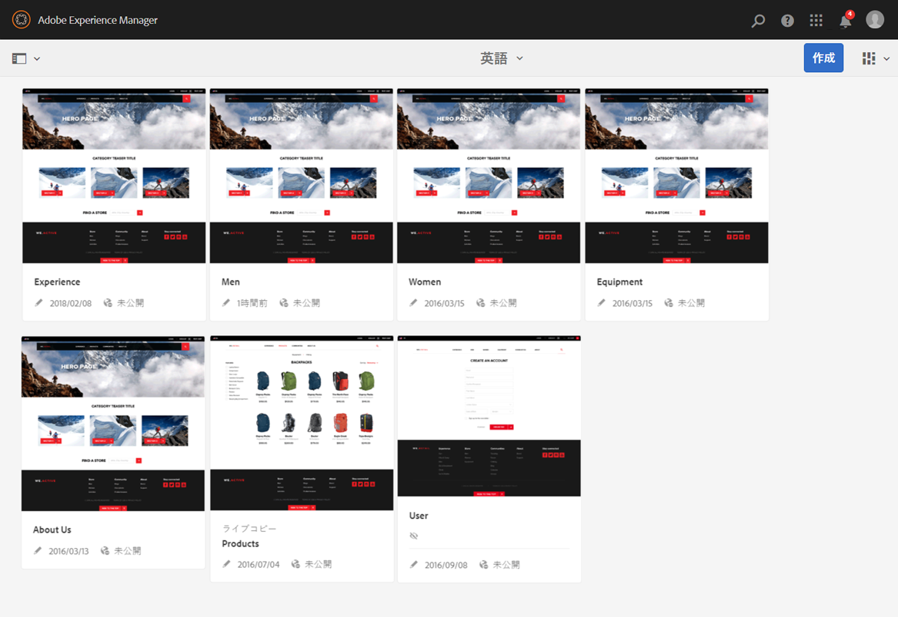
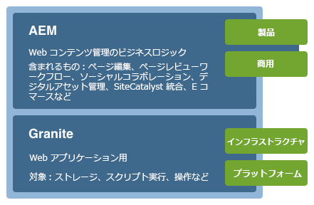
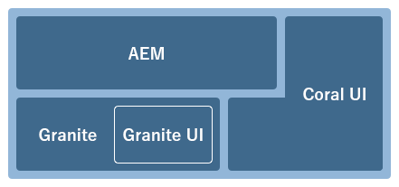
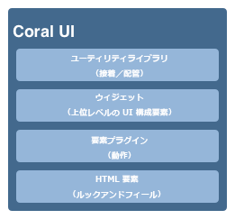

# AEM タッチ操作対応 UI の概念{#concepts-of-the-aem-touch-enabled-ui}

AEMには、タッチ対応UIと [レスポンシブデザイン](/help/sites-authoring/responsive-layout.md) (タッチとデスクトップの両方のデバイスで動作するように設計された作成者環境用)が用意されています。

>[!NOTE]
>
>タッチ対応UIは、AEMの標準UIです。 従来のUIはAEM 6.4で非推奨となりました。

タッチ操作対応 UI は以下で構成されます。

* スイートヘッダー：以下を表示します。
   * ロゴ
   * グローバルナビゲーションへのリンク
   * 検索、ヘルプ、Marketing Cloud ソリューション、通知、ユーザー設定など、その他の汎用アクションへのリンク
* 左側のレール（必要に応じて表示／非表示の切り替えが可能）：以下を表示できます。
   * タイムライン
   * 参照
   * フィルター
* ナビゲーションヘッダー：コンテキストに応じて、以下を表示できます。
   * 現在使用しているコンソールや、そのコンソール内の場所
   * 左側のレールの選択内容
   * パンくずリスト
   * 適切な&#x200B;**作成**&#x200B;アクションへのアクセス
   * 表示の選択状況
* コンテンツ領域
   * コンテンツの項目（ページ、アセット、フォーラム投稿など）のリストを表示します。
   * 必要に応じて形式（コラム、カードまたはリストなど）を指定できます。
   * レスポンシブデザインを使用します（デバイスやウィンドウサイズに応じて自動的に表示サイズが変更されます）。
   * 無限スクロールを使用します（ページネーションがなく、すべての項目が 1 つのウィンドウに表示されます）。



>[!NOTE]
>
>ほとんどすべての AEM 機能がタッチ操作対応 UI に移植されています。ただし、一部の限られたケースでは、機能がクラシック UI に戻ります。詳しくは、[タッチ操作対応 UI 機能のステータス](/help/release-notes/touch-ui-features-status.md)を参照してください。

タッチ操作対応 UI は、複数の製品間で一貫性のあるユーザーエクスペリエンスを提供するように設計されています。以下をベースとしています。

* **Coral UI**（CUI）は、アドビのタッチ操作対応 UI 用のビジュアルスタイル実装です。Coral UI は、製品／プロジェクト／Web アプリケーションで UI のビジュアルスタイルを採用するために必要となるすべてのものを備えています。
* **Granite UI** コンポーネントは、Coral UI を使用して構築されています。

タッチ操作対応 UI の基本原則は次のとおりです。

* モバイル優先（デスクトップを念頭に置きながら）
* レスポンシブデザイン
* コンテキスト関連のディスプレイ
* 再利用可能
* 組み込みのリファレンスドキュメント
* 組み込みのテスト
* ボトムアップ設計（これらの原則がすべての要素およびコンポーネントに確実に適用されます）

タッチ対応UI構造の詳細については、「AEMタッチ対応UIの [構造](/help/sites-developing/touch-ui-structure.md)」を参照してください。

## AEM テクノロジースタック {#aem-technology-stack}

AEM が基礎として使用する Granite プラットフォームには、特に Java コンテンツリポジトリが含まれています。



## Granite {#granite}

Granite は、次のような各種コンポーネントを提供するアドビの公開 Web スタックです。

* アプリケーションランチャー
* すべてのデプロイ先となる OSGi フレームワーク
* アプリケーションの構築をサポートする多数の OSGi 簡易サービス
* 様々なログ API を提供する包括的なログフレームワーク
* JCR API 仕様の CRX リポジトリ実装
* Apache Sling Web フレームワーク
* 現在の CRX 製品の追加要素

>[!NOTE]
>
>Granite は、アドビ内で公開開発プロジェクトとして進められています。コード、ディスカッションおよび問題に会社全体が関与しています。
>
>ただし、Granite はオープンソースプロジェクトでは&#x200B;**ありません**。いくつかのオープンソースプロジェクト（特に Apache Sling、Felix、Jackrabbit および Lucene）を重要なベースとしていますが、公開部分と非公開部分を明確に区別しています。

## Granite UI {#granite-ui}

Granite エンジニアリングプラットフォームには、基盤 UI フレームワークも備わっています。主な目的は次のとおりです。

* 詳細な UI ウィジェットを提供します。
* UI 概念を実装し、ベストプラクティス（長いリストのレンダリング、リストのフィルター処理、オブジェクト CRUD、CUD ウィザードなど）を実践します。
* 拡張可能なプラグインベースの管理 UI を提供します。

これらは次の要件に準拠しています。

* 「モバイル優先」を重視
* 拡張可能
* 上書きが容易

GraniteUI.pdf

[Get File](assets/graniteui.pdf)The Granite UI:

* Sling の RESTful アーキテクチャを使用します。
* コンテンツ中心型 Web アプリケーションを構築するためのコンポーネントライブラリを実装します。
* 詳細な UI ウィジェットを提供します。
* 標準化されたデフォルトの UI を提供します。
* 拡張可能です。
* モバイルデバイスとデスクトップデバイスの両方に対応しています（モバイル優先）。
* Granite ベースのすべてのプラットフォーム／製品／プロジェクト（AEM など）で使用できます。


* [Granite UI 基盤コンポーネント](#granite-ui-foundation-components) この基盤コンポーネントライブラリは他のライブラリで使用または拡張できます。
* [Granite UI 管理コンポーネント](#granite-ui-administration-components)

### クライアント側とサーバー側 {#client-side-vs-server-side}

Granite UI でのクライアントとサーバーの通信は、オブジェクトではなく、ハイパーテキストでおこなわれるので、クライアントでビジネスロジックを理解する必要はありません。

* サーバーは HTML をセマンティックデータで拡張します。
* クライアントはハイパーテキストをハイパーメディア（インタラクション）で拡張します。


#### クライアント側 {#client-side}

HTML ボキャブラリの拡張が使用され、作成者はインタラクティブな Web アプリケーションを構築するという意向を表明できるようになります。この方法は、[WAI-ARIA](https://www.w3.org/TR/wai-aria/) および [microformats](https://microformats.org/) に似ています。

主に、クライアント側で実行される JS および CSS コードによって解釈されるインタラクションパターン（フォームの非同期送信など）のコレクションで構成されます。クライアント側の役割は、（サーバーによってハイパーメディアアフォーダンスとして指定された）マークアップを拡張してインタラクティブ性を持たせることです。

クライアント側は、どのサーバーテクノロジーとも無関係です。サーバーから適切なマークアップが提供されている限り、クライアント側は独自の役割を果たすことができます。

現在、JS および CSS コードは、Granite [クライアント側ライブラリ](/help/sites-developing/clientlibs.md)として、次のカテゴリで提供されています。

`granite.ui.foundation and granite.ui.foundation.admin`

これらはコンテンツパッケージの一部として提供されています。

`granite.ui.content`

#### サーバー側 {#server-side}

sling コンポーネントのコレクションによって形成され、作成者は Web アプリケーションを迅速に構成できるようになります。**&#x200B;開発者がコンポーネントを開発し、作成者がそれらのコンポーネントを Web アプリケーションとしてアセンブルします。サーバー側の役割は、ハイパーメディアアフォーダンス（マークアップ）をクライアントに提供することです。

現在、コンポーネントは Granite リポジトリの次の場所にあります。

`/libs/granite/ui/components/foundation`

これはコンテンツパッケージの一部として提供されています。

`granite.ui.content`

### クラシック UI との違い {#differences-with-the-classic-ui}

次に Granite UI と ExtJS（クラシック UI に使用）の違いを示します。

<table>
 <tbody>
  <tr>
   <td><strong>ExtJS</strong></td>
   <td><strong>Granite UI</strong></td>
  </tr>
  <tr>
   <td>リモート手続き呼び出し<br /> </td>
   <td>状態遷移</td>
  </tr>
  <tr>
   <td>データ転送オブジェクト</td>
   <td>ハイパーメディア</td>
  </tr>
  <tr>
   <td>クライアントによるサーバーの内部認識あり</td>
   <td>クライアントによるサーバーの内部認識なし</td>
  </tr>
  <tr>
   <td>「ファットクライアント」</td>
   <td>「シンクライアント」</td>
  </tr>
  <tr>
   <td>専用クライアントライブラリ</td>
   <td>ユニバーサルクライアントライブラリ</td>
  </tr>
 </tbody>
</table>

### Granite UI 基盤コンポーネント {#granite-ui-foundation-components}

[Granite UI 基盤コンポーネント](https://helpx.adobe.com/experience-manager/6-5/sites/developing/using/reference-materials/granite-ui/api/jcr_root/libs/granite/ui/index.html)は、UI を構築するために必要な基本の構築ブロックを提供します。次に例を示します。

* ボタン
* ハイパーリンク
* ユーザーアバター

基盤コンポーネントは以下の場所にあります。

`/libs/granite/ui/components/foundation`

このライブラリには、各 Coral 要素に対応する Granite UI コンポーネントが含まれています。コンポーネントはコンテンツに基づき、その設定はリポジトリに保持されます。これにより、HTML マークアップを手動で記述しなくても、Granite UI アプリケーションを構成することができます。

目的:

* HTML 要素のコンポーネントモデル
* コンポーネントの構成
* 自動単体および機能テスト

実装:

* 構成および設定に基づくリポジトリ
* Granite プラットフォームによって提供されるテスト機能を利用
* JSP テンプレート

この基盤コンポーネントライブラリは他のライブラリで使用または拡張できます。

### ExtJS と対応する Granite UI コンポーネント {#extjs-and-corresponding-granite-ui-components}

Granite UI を使用するように ExtJS コードをアップグレードするときは、以下のリストを参照すると、ExtJS xtype およびノードタイプと、それぞれに対応する Granite UI のリソースタイプを確認できます。

| **ExtJS xtype** | **Granite UI のリソースタイプ** |
|---|---|
| `button` | `granite/ui/components/foundation/form/button` |
| `checkbox` | `granite/ui/components/foundation/form/checkbox` |
| `componentstyles` | `cq/gui/components/authoring/dialog/componentstyles` |
| `cqinclude` | `granite/ui/components/foundation/include` |
| `datetime` | `granite/ui/components/foundation/form/datepicker` |
| `dialogfieldset` | `granite/ui/components/foundation/form/fieldset` |
| `hidden` | `granite/ui/components/foundation/form/hidden` |
| `html5smartfile, html5smartimage` | `granite/ui/components/foundation/form/fileupload` |
| `multifield` | `granite/ui/components/foundation/form/multifield` |
| `numberfield` | `granite/ui/components/foundation/form/numberfield` |
| `pathfield, paragraphreference` | `granite/ui/components/foundation/form/pathbrowser` |
| `selection` | `granite/ui/components/foundation/form/select` |
| `sizefield` | `cq/gui/components/authoring/dialog/sizefield` |
| `tags` | `granite/ui/components/foundation/form/autocomplete``cq/gui/components/common/datasources/tags` |
| `textarea` | `granite/ui/components/foundation/form/textarea` |
| `textfield` | `granite/ui/components/foundation/form/textfield` |

| **ノードタイプ** | **Granite UI のリソースタイプ** |
|---|---|
| `cq:WidgetCollection` | `granite/ui/components/foundation/container` |
| `cq:TabPanel` | `granite/ui/components/foundation/container``granite/ui/components/foundation/layouts/tabs` |
| `cq:panel` | `granite/ui/components/foundation/container` |

### Granite UI 管理コンポーネント {#granite-ui-administration-components}

[Granite UI 管理コンポーネント](https://helpx.adobe.com/experience-manager/6-5/sites/developing/using/reference-materials/granite-ui/api/jcr_root/libs/granite/ui/index.html)は、基盤コンポーネントをベースに構築され、管理アプリケーションによって実装可能な一般的な構築ブロックを提供します。次に例を示します。

* グローバルナビゲーションバー
* パネル（スケルトン）
* 検索パネル

目的:

* 管理アプリケーションのルックアンドフィールを統一
* 管理アプリケーション用の RAD

実装:

* 基盤コンポーネントを使用した事前定義済みコンポーネント
* コンポーネントのカスタマイズが可能

## Coral UI {#coral-ui}

CoralUI.pdf

[Get File](assets/coralui.pdf)Coral UI(CUI)は、タッチ対応UIのAdobeの視覚的なスタイルの実装で、複数の製品でのユーザーエクスペリエンスの一貫性を保つように設計されています。 Coral UI は、オーサー環境で使用されるビジュアルスタイルを採用するために必要となるすべてのものを備えています。

>[!CAUTION]
>
>Coral UI は、AEM お客様が製品のライセンスで許容される範囲内でアプリケーションや Web インターフェイスを構築するために利用可能な UI ライブラリです。
>
>Coral UI の使用は以下の場合にのみ認められます。
>
>
>* AEM と一緒に出荷およびバンドルされている場合
>* オーサー環境の既存の UI を拡張する目的で使用する場合
>* アドビの販促品、広告、プレゼンテーション
>* Adobe ブランドのアプリケーションの UI（他の用途で簡単に使用できるフォントは不可）
>* わずかにカスタマイズされている場合

>
>
以下の場合は、Coral UI は使用しないでください。
>
>* アドビに関係のないドキュメントその他の項目
>* コンテンツ作成環境（前述の項目が他人によって生成されるおそれがある場合）
>* アドビと明確なつながりのないアプリケーション／コンポーネント／Web ページ

>


Coral UI は、Web アプリケーションを開発するための構成要素のコレクションです。



最初からモジュール式として設計されており、各モジュールはそれぞれの主要な役割に基づいて個別のレイヤーを形成します。レイヤーは相互にサポートするように設計されていますが、必要に応じて単独で使用することもできます。これにより、あらゆる HTML 対応環境に Coral のユーザーエクスペリエンスを実装することが可能です。

Coral UI では、特定の開発モデルやプラットフォームを使用することは必須ではありません。Coral の主な目的は、統一されたクリーンな HTML5 マークアップを提供することにあり、このマークアップを実際に発行する方法は問いません。Coral は、クライアント側またはサーバー側でのレンダリング、テンプレート、JSP、PHP、さらには Adobe Flash RIA アプリケーションをはじめ、様々なものに使用されています。

### HTML 要素 - マークアップレイヤー {#html-elements-the-markup-layer}

HTML 要素により、すべての基本 UI 要素（ナビゲーションバー、ボタン、メニュー、パネルなど）のルックアンドフィールを共通化できます。

最も基本的なレベルの HTML 要素は、専用のクラス名を持つ HTML タグです。複数のタグを（特定の方法で）相互にネストし、より複雑な要素を構成することができます。  

実際のルックアンドフィールは CSS で指定します。ルックアンドフィールを簡単にカスタマイズできるように（ブランド設定をおこなう場合など）、実際のスタイル値は、実行時に [LESS](https://lesscss.org/) プリプロセッサーによって展開される変数として宣言します。

目的:

* 基本 UI 要素のルックアンドフィールを共通化
* デフォルトのグリッドシステムを提供

実装:

* [ブートストラップ](https://twitter.github.com/bootstrap/)からアイデアを得たスタイルを HTML タグで使用
* クラスは LESS ファイルで定義
* アイコンはフォントスプライトとして定義

次にマークアップの例を示します。

```xml
<button class="btn btn-large btn-primary" type="button">Large button</button>
<button class="btn btn-large" type="button">Large button</button>
```

このマークアップは次のように表示されます。


ルックアンドフィールは LESS で定義し、専用のクラス名によって要素に関連付けます（次の抜粋は短縮され、簡潔に示されています）。

```xml
.btn {
    font-size: @baseFontSize;
    line-height: @baseLineHeight;
    .buttonBackground(@btnBackground,
                                @btnBackgroundHighlight,
                                @grayDark, 0 1px 1px rgba(255,255,255,.75));
```

実際の値は LESS 変数ファイルで定義します（次の抜粋は短縮され、簡潔に示されています）。

```xml
@btnBackgroundHighlight: darken(@white, 10%);
@btnPrimaryBackgroundHighlight: spin(@btnPrimaryBackground, 20%);
@baseFontSize: 17px;
@baseFontFamily: @sansFontFamily;
```

### 要素プラグイン {#element-plugins}

HTML 要素の多くは、ポップアップメニューの表示／非表示など、何らかの動的動作を示す必要があります。要素プラグインがこの役割を担い、JavaScript を使用して DOM を操作することによってこのようなタスクを実行します。

プラグインは次のいずれかです。

* 特定の DOM 要素に作用するように設計されています。例えば、ダイアログプラグインは、`DIV class=dialog` を検索することを想定しています。
* 自然の中で一般的です For example, a layout manager provides layout for any list of `DIV` or `LI` elements

プラグインの動作は、次のいずれかの方法でパラメーターを使用してカスタマイズできます。

* Javascript 呼び出しによってパラメーターを渡します。
* Using dedicated `data-*` attributes tied to the HTML markup

どのプラグインについても開発者がベストアプローチを選択できますが、経験則として以下を使用します。

* `data-*` 属性を使用します。 例えば、列数を指定するには
* API オプション／クラス - データに関連する機能の場合（表示する項目のリストを作成する場合など）

フォーム検証を実装する場合も同じ概念を使用します。For an element that you want validated, you must specify the required input form as a custom `data-*` attribute. この属性を検証プラグインのオプションとして使用します。

>[!NOTE]
>
>可能である場合または拡張する場合は、HTML5 固有のフォーム検証を使用する必要があります。

目的:

* HTML 要素の動的動作を提供
* CSS だけでは実現できないカスタムレイアウトを提供
* フォーム検証を実行
* 高度な DOM 操作を実行

実装:

* 特定の DOM 要素に関連付けた jQuery プラグイン
* Using `data-*` attributes to customize behavior

次にマークアップの例の抜粋を示します（data-* 属性として指定されたオプションに注目してください）。

```xml
<ul data-column-width="220" data-layout="card" class="cards">
  <li class="item">
    <div class="thumbnail">
      
      <div class="caption">
        <h4>Toolbar</h4>
          <p><small>toolbar</small><br></p>
      </div>
    </div>
  </li>
  <li class="item">
    <div class="thumbnail">
      
      <div class="caption">
        <h4>Toolbar</h4>
        <p><small>toolbar</small><br></p>
      </div>
    </div>
  </li>
```

次に jQuery プラグインの呼び出しを示します。

```
$(‘.cards’).cardlayout ();
```

この場合、次のように表示されます。


`cardLayout` プラグインでは、囲まれた `UL` 要素のレイアウトを決定する際、それぞれの高さを基準とし、さらに親の幅を考慮します。

### HTML 要素ウィジェット {#html-elements-widgets}

ウィジェットでは、javascript プラグインを使用して 1 つ以上の基本要素を結合し、上位の UI 要素を形成します。これにより、単一要素の場合と比較して、より複雑な動作、さらにはより複雑なルックアンドフィールを実装できます。タグピッカーやパネルウィジェットがよい例です。

ウィジェットは、カスタムイベントの呼び出しとリスンの両役割を果たし、ページ上の他のウィジェットと連携できます。一部のウィジェットは、実際には Coral HTML 要素を使用するネイティブ jQuery ウィジェットです。

目的:

* 複雑な動作を示す上位 UI 要素を実装
* イベントの呼び出しと処理

実装:

* jQuery プラグイン + HTML マークアップ
* クライアント側／サーバー側テンプレートを利用可能

次にマークアップの例を示します。

```
<input type="text" name="tags" placeholder="Tags" class="tagManager"/>
```

次に jQuery プラグインの呼び出し（オプション指定あり）を示します。

```
$(".tagManager").tagsManager({
        prefilled: ["Pisa", "Rome"] })
```

プラグインにより HTML マークアップが発行されます（このマークアップでは、他のプラグインを内部で使用する基本要素を使用しています）。

```
<span>Pisa</code>
<a title="Removing tag" tagidtoremove="0"
   id="myRemover_0" class="myTagRemover" href="#">x</a></code>

<span id="myTag_1" class="myTag"><span>Rome</code>
<a title="Removing tag" tagidtoremove="1"
   id="myRemover_1" class="myTagRemover" href="#">x</a></code>

<input type="text" data-original-title="" class="input-medium tagManager"
       placeholder="Tags" name="tags" data-provide="typeahead" data-items="6"
       autocomplete="off">
```

この場合、次のように表示されます。


### ユーティリティライブラリ {#utility-library}

このライブラリは、次の特徴を持つ javascript ヘルパープラグインや関数のコレクションです。

* UI 非依存
* フル機能の Web アプリケーションの構築に不可欠

これらには、XSS 処理およびイベントバスも含まれます。

HTML 要素プラグインおよびウィジェットはユーティリティライブラリが提供する機能に依存する場合がありますが、ユーティリティライブラリは要素自体またはウィジェット自体に対してハード依存を持つことはできません。

目的:

* 共通機能を提供
* イベントバスの実装
* クライアント側テンプレート
* XSS

実装:

* jQuery プラグインまたは AMD 対応の JavaScript モジュール
