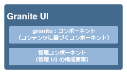

# Adobe Experience Manager タッチ操作対応 UI の概念{#concepts-of-the-aem-touch-enabled-ui}

Adobe Experience Manager（AEM）は、のタッチ操作対応 UI を備えています [レスポンシブデザイン](/help/sites-authoring/responsive-layout.md) タッチデバイスとデスクトップデバイスの両方で動作するように設計されたオーサー環境の場合。

>[!NOTE]
>
>タッチ対応 UI は AEM の標準 UI です。クラシック UI は AEM 6.4 で非推奨となりました。

タッチ対応 UI は以下で構成されます。

* スイートヘッダー：
   * ロゴを表示します
   * グローバルナビゲーションへのリンクを表示します
   * 検索、ヘルプ、Experience Cloudソリューション、通知、ユーザー設定など、その他の汎用アクションへのリンクを表示します。
* 左側のレール（必要に応じて表示／非表示の切り替えが可能）には次を表示できます。
   * タイムライン
   * 参照
   * フィルター
* ナビゲーションヘッダーは、再びコンテキストに依存し、次の内容を表示できます。
   * 現在使用しているコンソール、使用している場所、またはそのコンソール内の両方を示します
   * 左側のパネルの選択
   * パンくずリスト
   * 適切な&#x200B;**作成**&#x200B;アクションへのアクセス
   * 表示の選択状況
* コンテンツ領域には、次の機能があります。
   * コンテンツの項目（ページ、アセット、フォーラムへの投稿など）のリスト
   * 列、カード、リストなど、リクエストに応じた形式にすることができます
   * レスポンシブデザインを使用します（デバイスやウィンドウのサイズに応じて自動的に表示サイズが変更されます）。
   * 無限スクロールを使用します（ページネーションがなく、すべての項目が 1 つのウィンドウに表示されます）。


>[!NOTE]
>
>ほぼすべてのAEM機能がタッチ操作対応 UI に移植されました。 ただし、一部のケースでは、機能がクラシック UI に戻ります。 参照： [タッチ操作対応 UI 機能のステータス](/help/release-notes/touch-ui-features-status.md) を参照してください。

タッチ操作対応 UI は、複数のAdobe間で一貫性のあるユーザーエクスペリエンスを提供するために、製品ごとに設計されています。 基準は次のとおりです。

* **Coral UI** （CUI）タッチ操作対応 UI 用のAdobeのビジュアルスタイルの実装。 Coral UI は、製品、プロジェクト、web アプリケーションで UI ビジュアルスタイルを採用するために必要なすべてを提供します。
* **Granite UI** コンポーネントは Coral UI を使用して構築されています。

タッチ操作対応 UI の基本原則は次のとおりです。

* モバイル優先（デスクトップを念頭に）
* レスポンシブデザイン
* コンテキストに関連する表示
* 再使用可能
* 埋め込みリファレンスドキュメントを含める
* 埋め込みテストを含める
* これらの原則をすべての要素とコンポーネントに確実に適用するボトムアップ設計

タッチ操作対応 UI の構造の概要については、を参照してください。 [AEM タッチ操作対応 UI の構造](/help/sites-developing/touch-ui-structure.md).

## AEM テクノロジースタック {#aem-technology-stack}

AEMは Granite プラットフォームをベースとして使用し、Granite プラットフォームには Java™ コンテンツリポジトリなどが含まれます。


## Granite {#granite}

Granite は、Adobeのオープン web スタックで、次のような様々なコンポーネントを提供します。

* アプリケーションランチャー
* すべてがデプロイされる OSGi フレームワーク
* ビルディングアプリケーションをサポートするためのいくつかの OSGi 概要サービス
* 様々なログ API を提供する包括的なログフレームワーク
* JCR API 仕様の CRX リポジトリ実装
* Apache Sling Web フレームワーク
* 現在の CRX 製品の追加部品

>[!NOTE]
>
>Granite は、Adobe内でオープンな開発プロジェクトとして実行され、コード、ディスカッション、イシューへのコントリビューションが会社全体で行われます。
>
>ただし、Granite は **ではない** オープンソースプロジェクト。 いくつかのオープンソースプロジェクト（特に Apache Sling、Felix、Jackrabbit および Lucene）を重要なベースとしていますが、Adobeは公開部分と内部部分を明確に区別しています。

## Granite UI {#granite-ui}

Granite エンジニアリングプラットフォームは、基盤 UI フレームワークも提供します。 この主な目標は次のとおりです。

* 詳細な UI ウィジェットの提供
* UI の概念を実装し、ベストプラクティス（長いリストのレンダリング、リストフィルタリング、オブジェクト CRUD、CUD ウィザードなど）を示します。
* 拡張可能なプラグインベースの管理 UI を提供する

これらは、次の要件に従います。

* 「モバイルファースト」を尊重
* 拡張可能
* 上書きしやすい


GraniteUI.pdf

[ファイルを取得](assets/graniteui.pdf)
Granite UI は次のようになります。

* Sling の RESTful アーキテクチャを使用します
* コンテンツ中心の web アプリケーションを構築するためのコンポーネントライブラリを実装します。
* 詳細な UI ウィジェットを提供します
* デフォルトの標準化された UI を提供
* 拡張可能
* モバイルデバイスとデスクトップデバイスの両方に対応（モバイル優先）
* AEMなど、Granite ベースの任意のプラットフォーム/製品/プロジェクトで使用できます



* [Granite UI 基盤コンポーネント](#granite-ui-foundation-components)
この基盤コンポーネントライブラリは他のライブラリで使用または拡張できます。
* [Granite UI 管理コンポーネント](#granite-ui-administration-components)

### クライアントサイドとサーバーサイド {#client-side-vs-server-side}

Granite UI のクライアントサーバー通信は、オブジェクトではなくハイパーテキストで構成されているので、クライアントがビジネスロジックを理解する必要はありません

* サーバーは、セマンティックデータでHTMLを強化します
* クライアントは、ハイパーメディア（インタラクション）でハイパーテキストを強化します


#### クライアント側 {#client-side}

これは、HTMLの語彙を拡張したもので、作成者がインタラクティブな web アプリを構築する意図を表すことができます。 これは、次に対する同様のアプローチです [ワイアリア](https://www.w3.org/TR/wai-aria/) および [マイクロフォーマット](https://microformats.org/).

主に、クライアント側で実行される JS コードと CSS コードで解釈されるインタラクションパターンのコレクション（フォームの非同期送信など）で構成されます。 クライアントサイドの役割は、インタラクティブ機能のマークアップ（サーバーによるハイパーメディアアフォーダンスとして指定）を強化することです。

クライアントサイドは、サーバーテクノロジーとは無関係です。 サーバーが適切なマークアップを提供すれば、クライアントサイドはその役割を果たすことができます。

現在、JS コードと CSS コードは Granite として配信されています [clientlibs](/help/sites-developing/clientlibs.md) カテゴリで次の操作を行います。

`granite.ui.foundation and granite.ui.foundation.admin`

これらはコンテンツパッケージの一部として提供されています。

`granite.ui.content`

#### サーバー側 {#server-side}

sling コンポーネントのコレクションによって形成され、作成者は Web アプリケーションを迅速に構成できるようになります&#x200B;*。*&#x200B;開発者がコンポーネントを開発し、作成者がそのコンポーネントを Web アプリとして組み立てます。 サーバーサイドの役割は、ハイパーメディアアフォーダンス（マークアップ）をクライアントに提供することです。

現在、コンポーネントは次の場所にある Granite リポジトリーにあります。

`/libs/granite/ui/components/foundation`

これはコンテンツパッケージの一部として提供されています。

`granite.ui.content`

### クラシック UI との違い {#differences-with-the-classic-ui}

Granite UI と ExtJS （クラシック UI に使用）の違いも参考になります。

<table>
 <tbody>
  <tr>
   <td><strong>ExtJs</strong></td>
   <td><strong>Granite UI</strong></td>
  </tr>
  <tr>
   <td>リモート手続き呼び出し<br /> </td>
   <td>状態遷移</td>
  </tr>
  <tr>
   <td>データ転送オブジェクト</td>
   <td>ハイパーメディア</td>
  </tr>
  <tr>
   <td>クライアントがサーバの内部情報を認識</td>
   <td>クライアントが内部情報を認識しない</td>
  </tr>
  <tr>
   <td>"Fat クライアント"</td>
   <td>「シン・クライアント」</td>
  </tr>
  <tr>
   <td>専用のクライアントライブラリ</td>
   <td>ユニバーサルクライアントライブラリ</td>
  </tr>
 </tbody>
</table>

### Granite UI 基盤コンポーネント {#granite-ui-foundation-components}

この [Granite UI 基盤コンポーネント](https://developer.adobe.com/experience-manager/reference-materials/6-5/granite-ui/api/jcr_root/libs/granite/ui/index.html) の UI の構築に必要な基本的な構成要素を提供する。 例えば、次のようなものがあります。

* ボタン
* ハイパーリンク
* ユーザーアバター

基盤コンポーネントは、次の場所にあります。

`/libs/granite/ui/components/foundation`

このライブラリには、各 Coral 要素の Granite UI コンポーネントが含まれています。 コンポーネントはコンテンツ駆動型で、設定はリポジトリに格納されます。 これにより、手動でHTMLマークアップを記述することなく Granite UI アプリケーションを作成することが可能になります。

目的：

* HTML 要素のコンポーネントモデル
* コンポーネント構成
* 自動ユニットおよび機能テスト

実装：

* リポジトリーベースの構成と設定
* Granite プラットフォームが提供するテスト施設の使用
* JSP テンプレート

この基盤コンポーネントライブラリは他のライブラリで使用または拡張できます。

### ExtJS と対応する Granite UI コンポーネント {#extjs-and-corresponding-granite-ui-components}

Granite UI を使用するように ExtJS コードをアップグレードする際には、ExtJS の xtype とノードタイプを、同等の Granite UI リソースタイプにアップグレードする際に役立つ便利な概要を、次のリストで示します。

| **ExtJS xtype** | **Granite UI リソースタイプ** |
|---|---|
| `button` | `granite/ui/components/foundation/form/button` |
| `checkbox` | `granite/ui/components/foundation/form/checkbox` |
| `componentstyles` | `cq/gui/components/authoring/dialog/componentstyles` |
| `cqinclude` | `granite/ui/components/foundation/include` |
| `datetime` | `granite/ui/components/foundation/form/datepicker` |
| `dialogfieldset` | `granite/ui/components/foundation/form/fieldset` |
| `hidden` | `granite/ui/components/foundation/form/hidden` |
| `html5smartfile, html5smartimage` | `granite/ui/components/foundation/form/fileupload` |
| `multifield` | `granite/ui/components/foundation/form/multifield` |
| `numberfield` | `granite/ui/components/foundation/form/numberfield` |
| `pathfield, paragraphreference` | `granite/ui/components/foundation/form/pathbrowser` |
| `selection` | `granite/ui/components/foundation/form/select` |
| `sizefield` | `cq/gui/components/authoring/dialog/sizefield` |
| `tags` | `granite/ui/components/foundation/form/autocomplete``cq/gui/components/common/datasources/tags` |
| `textarea` | `granite/ui/components/foundation/form/textarea` |
| `textfield` | `granite/ui/components/foundation/form/textfield` |

| **ノードタイプ** | **Granite UI リソースタイプ** |
|---|---|
| `cq:WidgetCollection` | `granite/ui/components/foundation/container` |
| `cq:TabPanel` | `granite/ui/components/foundation/container``granite/ui/components/foundation/layouts/tabs` |
| `cq:panel` | `granite/ui/components/foundation/container` |

### Granite UI 管理コンポーネント {#granite-ui-administration-components}

この [Granite UI 管理コンポーネント](https://developer.adobe.com/experience-manager/reference-materials/6-5/granite-ui/api/jcr_root/libs/granite/ui/index.html) 基盤コンポーネントを基に構築し、管理アプリケーションが実装できる一般的な構築ブロックを提供します。 その他の点では、

* グローバルナビゲーションバー
* レール（スケルトン）
* 検索パネル

目的：

* 管理アプリケーション向けの統一されたルックアンドフィール
* 投与用途のRAD

実装：

* 基盤コンポーネントを使用した事前定義済みコンポーネント
* コンポーネントはカスタマイズできます

## Coral UI {#coral-ui}

CoralUI.pdf

[ファイルを入手](assets/coralui.pdf)
Coral UI （CUI）は、タッチ操作対応 UI 用にAdobeのビジュアルスタイルを実装したもので、複数の製品間で一貫性のあるユーザーエクスペリエンスを提供するように設計されています。 Coral UI には、オーサリング環境で使用されるビジュアルスタイルを採用するために必要なすべてが用意されています。

>[!CAUTION]
>
>Coral UI は、AEM のお客様が製品ライセンスの許容範囲内でアプリケーションや web インターフェイスの構築に利用できる UI ライブラリです。
>
>Coral UI は次の場合にのみ使用できます。
>
>
>* AEMにバンドルされて出荷された時点。
>* オーサリング環境の既存の UI を拡張する際に使用します。
>* アドビの販促品、広告、プレゼンテーション
>* Adobeブランドのアプリケーションの UI （フォントは、他の用途ですぐに使用できない必要があります）。
>* マイナーカスタマイズを使用する。
>
>Coral UI は次の場所では使用しないでください。
>
>* Adobeに関係のない書類その他の物件。
>* コンテンツ作成環境（これらの項目が他のユーザーによって生成される場合があります）。
>* アドビと明確なつながりのないアプリケーション／コンポーネント／web ページ
>

Coral UI は、web アプリケーションを開発するための構成要素のコレクションです。


各モジュールは最初からモジュール式に設計されており、主要な役割に基づいて個別のレイヤーを形成します。 レイヤーは互いにサポートするように設計されていますが、必要に応じて個別に使用することもできます。 これにより、Coral のユーザーエクスペリエンスをあらゆるHTML対応の環境に実装することが可能になります。

Coral UI では、特定の開発モデルやプラットフォームを使用する必要はありません。 Coral の主な目標は、このマークアップの実際の出力方法に依存せずに、統一されたクリーンなHTML5 マークアップを提供することです。 これはクライアント側やサーバ側のレンダリング、テンプレート、JSP、PHP、あるいはAdobeFlashの RIA アプリケーションなどに使われます。

### HTML要素 – マークアップレイヤー {#html-elements-the-markup-layer}

HTML要素は、すべてのベース UI 要素（ナビゲーションバー、ボタン、メニュー、パネルなど）に共通のルックアンドフィールを提供します。

最も基本的なレベルでは、HTML要素は、専用のクラス名を持つHTMLタグです。 複数のタグを（特定の方法で）相互にネストし、より複雑な要素を構成することができます。 

実際のルックアンドフィールは CSS で指定します。 ルックアンドフィールを簡単にカスタマイズできるように（ブランド設定を行う場合など）、実際のスタイル値は、で展開される変数として宣言します。 [より小さい](https://lesscss.org/) 実行時のプリプロセッサー。

目的：

* 共通のルックアンドフィールを持つ基本的な UI 要素の提供
* デフォルトのグリッドシステムを提供

実装：

* スタイルを取り入れたHTMLタグ [Bootstrap](https://twitter.github.com/bootstrap/)
* クラスは LESS ファイルで定義されます
* アイコンは、フォントスプライトとして定義されます

例えば、次のようなマークアップが表示されます。

```xml
<button class="btn btn-large btn-primary" type="button">Large button</button>
<button class="btn btn-large" type="button">Large button</button>
```

このマークアップは次のように表示されます。


ルックアンドフィールは LESS で定義し、専用のクラス名によって要素に関連付けます（次の抜粋は短縮され、簡潔に示されています）。

```xml
.btn {
    font-size: @baseFontSize;
    line-height: @baseLineHeight;
    .buttonBackground(@btnBackground,
                                @btnBackgroundHighlight,
                                @grayDark, 0 1px 1px rgba(255,255,255,.75));
```

実際の値は LESS 変数ファイルで定義します（次の抜粋は短縮され、簡潔に示されています）。

```xml
@btnBackgroundHighlight: darken(@white, 10%);
@btnPrimaryBackgroundHighlight: spin(@btnPrimaryBackground, 20%);
@baseFontSize: 17px;
@baseFontFamily: @sansFontFamily;
```

### 要素プラグイン {#element-plugins}

多くのHTML要素は、ポップアップメニューの開閉などの何らかの動的動作を示す必要があります。 これは、JavaScript を使用して DOM を操作することでこのようなタスクを実行する要素プラグインの役割です。

プラグインは次のいずれかです。

* 特定の DOM 要素で動作するように設計されています。 例えば、ダイアログプラグインは、を検索することを想定しています。 `DIV class=dialog`
* 汎用的なものです。例えば、レイアウトマネージャーは、`DIV` 要素または `LI` 要素のリスト用のレイアウトを提供します。

プラグインの動作は、次のいずれかの方法で、パラメーターを使用してカスタマイズできます。

* JavaScript 呼び出しによるパラメーターの受け渡し
* HTML マークアップに関連付けられた専用の `data-*` 属性を使用します。

開発者はどのプラグインにも最適なアプローチを選択できますが、経験則では以下のように使用します。

* HTML レイアウトに関連するオプションの `data-*` 属性。例えば、列数を指定します
* データに関連する機能の API オプション/クラス。 例えば、表示する項目のリストの作成などです

フォームの検証を実装する場合も同じ概念を使用します。要素を検証する場合、必要な入力フォームをカスタムの `data-*` 属性として指定する必要があります。その後、この属性は検証プラグインのオプションとして使用されます。

>[!NOTE]
>
>可能な限りHTML5 ネイティブのフォーム検証を使用するか、またはその両方を拡張する必要があります。

目的：

* HTML要素の動的動作の指定
* 純粋な CSS では実現できないカスタムレイアウトを提供する
* フォームの検証の実行
* 高度な DOM 操作の実行

実装：

* 特定の DOM 要素に関連付けられた jQuery プラグイン
* `data-*` 属性を使用した動作のカスタマイズ

次にマークアップの例の抜粋を示します（data-&#42; 属性として指定されたオプションに注意）。

```xml
<ul data-column-width="220" data-layout="card" class="cards">
  <li class="item">
    <div class="thumbnail">
      
      <div class="caption">
        <h4>Toolbar</h4>
          <p><small>toolbar</small><br></p>
      </div>
    </div>
  </li>
  <li class="item">
    <div class="thumbnail">
      
      <div class="caption">
        <h4>Toolbar</h4>
        <p><small>toolbar</small><br></p>
      </div>
    </div>
  </li>
```

次に jQuery プラグインの呼び出しを示します。

```
$('.cards').cardlayout ();
```

これは次のように表示されます。


この `cardLayout` プラグインは、囲まれた `UL` 要素はそれぞれの高さに基づいており、また親の幅を考慮に入れています。

### HTML 要素ウィジェット {#html-elements-widgets}

ウィジェットは、1 つ以上の基本要素を JavaScript プラグインと組み合わせて、「上位レベル」の UI 要素を形成します。 これらは、1 つの要素で実現できるよりも複雑な動作、さらにはより複雑なルックアンドフィールを実装できます。 タグピッカーやパネルウィジェットがよい例です。

ウィジェットは、カスタムイベントをトリガーしたりリッスンしたりして、ページ上の他のウィジェットと連携できます。 一部のウィジェットは、Coral HTML要素を使用するネイティブの jQuery ウィジェットです。

目的：

* 複雑な動作を示す上位レベルの UI 要素を実装する
* イベントのトリガーと処理

実装：

* jQuery プラグイン + HTMLのマークアップ
* クライアント/サーバー側テンプレートを使用できます。

マークアップの例は次のとおりです。

```
<input type="text" name="tags" placeholder="Tags" class="tagManager"/>
```

jQuery プラグインの呼び出し（オプション付き）:

```
$(".tagManager").tagsManager({
        prefilled: ["Pisa", "Rome"] })
```

プラグインがHTMLのマークアップを生成する（このマークアップは基本的な要素を使用し、内部で他のプラグインを使用する場合があります）:

```
<span>Pisa</code>
<a title="Removing tag" tagidtoremove="0"
   id="myRemover_0" class="myTagRemover" href="#">x</a></code>

<span id="myTag_1" class="myTag"><span>Rome</code>
<a title="Removing tag" tagidtoremove="1"
   id="myRemover_1" class="myTagRemover" href="#">x</a></code>

<input type="text" data-original-title="" class="input-medium tagManager"
       placeholder="Tags" name="tags" data-provide="typeahead" data-items="6"
       autocomplete="off">
```

これは次のように表示されます。


### ユーティリティライブラリ {#utility-library}

このライブラリは、次のような JavaScript ヘルパープラグインや関数のコレクションです。

* UI に依存しない
* 完全な機能を備えた Web アプリケーションを構築する上で欠かせない

これには、XSS 処理とイベントバスが含まれます。

HTML要素のプラグインとウィジェットは、ユーティリティライブラリが提供する機能に依存している場合がありますが、ユーティリティライブラリは、要素やウィジェット自体に強い依存を持つことはできません。

目的：

* 共通の機能の提供
* Event Bus の実装
* クライアントサイドテンプレート
* XSS

実装：

* jQuery プラグインまたは AMD 準拠 JavaScript モジュール
