# AEM タッチ操作対応 UI の構造{#structure-of-the-aem-touch-enabled-ui}

AEM タッチ操作対応 UI には、基盤となる原則があり、いくつかの主要な要素で構成されています。

## コンソール {#consoles}

### 基本レイアウトとサイズ変更 {#basic-layout-and-resizing}

UI はモバイルデバイスとデスクトップデバイスの両方に対応します。アドビでは、2 つのスタイルを作成するのではなく、すべての画面とデバイスで機能する 1 つのスタイルを使用することにしました。

すべてのモジュールで同じ基本レイアウトを使用すると、AEM では次のような表示になります。

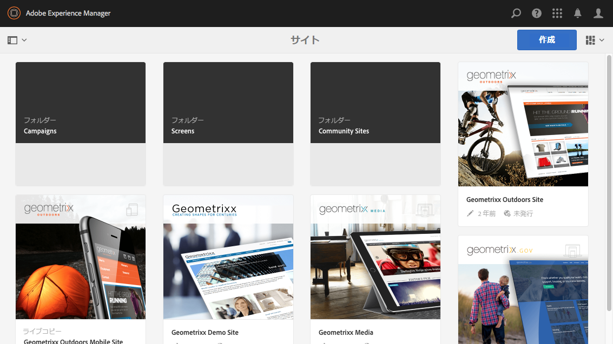

レイアウトはレスポンシブデザインスタイルに従い、使用するデバイスやウィンドウのサイズに合わせて調整されます。

例えば、解像度が 1024 px 未満（モバイルデバイスなど）になると、それに応じて表示が調整されます。

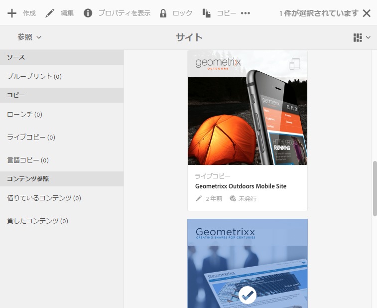

### Header Bar {#header-bar}

ヘッダーバーにはグローバル要素が表示されます。

* 現在使用しているロゴと特定の製品/ソリューションaemの場合は、これもグローバルナビゲーションへのリンクを形成します。
* 検索
* ヘルプリソースにアクセスするためのアイコン
* その他のソリューションにアクセスするためのアイコン
* ユーザー対応が必要なアラートまたはインボックス項目のインジケーター（またはそれらへのアクセス）
* ユーザーのプロファイル管理へのリンクになっているユーザーアイコン

### ツールバー {#toolbar}

現在の場所に応じて変わり、下のページのビューやアセットの制御に関連したツールが表示されます。ツールバーは製品専用ですが、要素は若干共通しています。

どの場所でも、ツールバーには現在実行可能なアクションが表示されます。

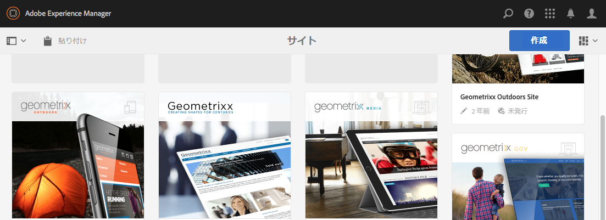

表示される内容は、現在リソースが選択されているかどうかによっても異なります。

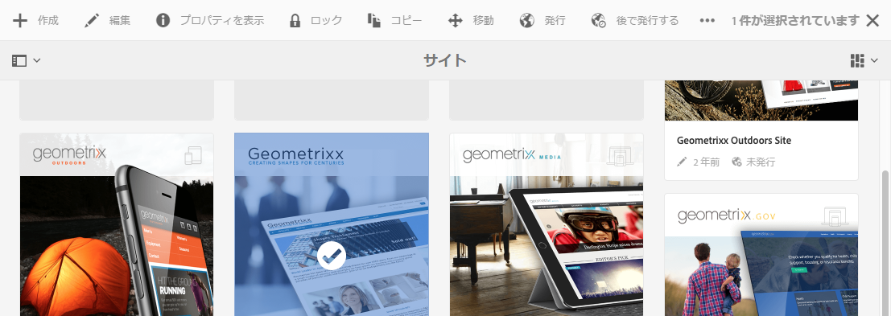

### 左レール {#left-rail}

左レールは、必要に応じて表示／非表示を切り替えることができます。

* **タイムライン**
* **参照**
* **フィルター**

デフォルトでは&#x200B;**コンテンツのみ**&#x200B;が表示されます（レールは非表示です）。

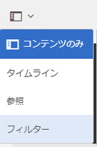

## ページオーサリング {#page-authoring}

ページのオーサリング時、構造化された領域は次のようになります。

### コンテンツフレーム {#content-frame}

ページコンテンツはコンテンツフレームにレンダリングされます。コンテンツフレームはエディターにはまったく依存していません。これは、CSS や JavaScript による競合を回避するためです。

コンテンツフレームは、ウィンドウの右側セクションの、ツールバーの下に表示されます。

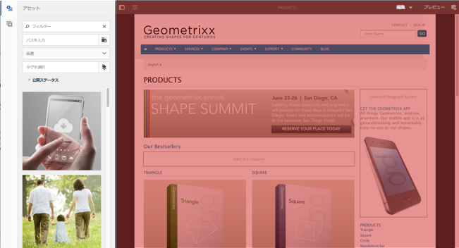

### エディターフレーム {#editor-frame}

エディターフレームによって編集機能が実現されます。

エディターフレームは、すべてのページオーサリング要素のためのコンテナ（抽象）です。**&#x200B;コンテンツフレームの上にあり、以下が含まれます。

* 上部のツールバー
* サイドパネル
* すべてのオーバーレイ
* その他のページオーサリング要素（コンポーネントツールバーなど）

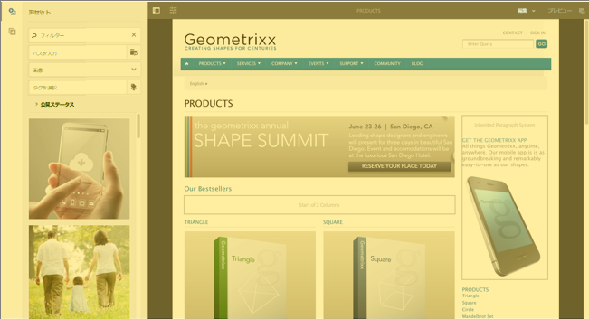

### サイドパネル {#side-panel}

デフォルトのタブが 2 つ含まれており、アセットとコンポーネントを選択し、ここからドラッグしてページにドロップできます。

サイドパネルはデフォルトでは非表示です。選択すると、左側に表示されるか、横にスライドしてウィンドウ全体を覆います（モバイルデバイスのように、ウィンドウサイズが幅 1,024 px 未満の場合）。

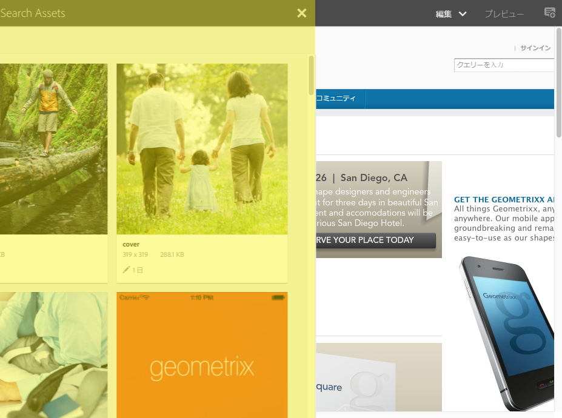

### サイドパネル - アセット {#side-panel-assets}

「アセット」タブでは、一連のアセットから選択できます。特定の用語でフィルタリングしたり、グループを選択することもできます。

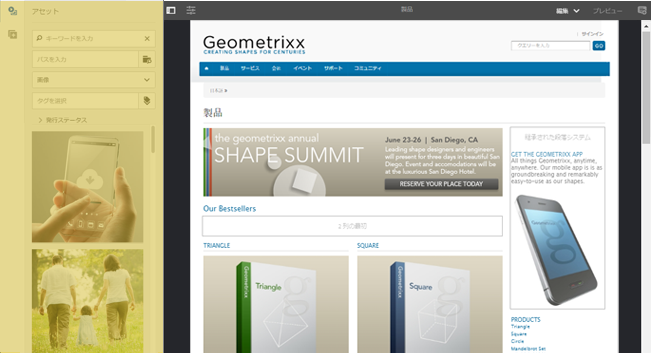

### サイドパネル - アセットグループ {#side-panel-asset-groups}

「アセット」タブにはドロップダウンがあり、特定のアセットグループを選択できます。

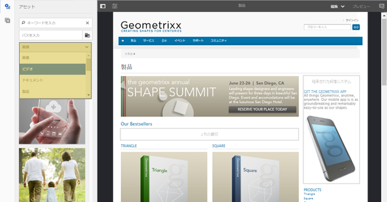

### サイドパネル - コンポーネント {#side-panel-components}

「コンポーネント」タブでは、一連のコンポーネントから選択できます。特定の用語でフィルタリングしたり、グループを選択することもできます。

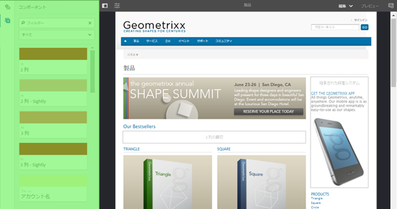

### オーバーレイ {#overlays}

コンテンツフレームをオーバーレイし、コンポーネントおよびそのコンテンツとの（完全に透過的な）インタラクション方法を実現するために、[レイヤー](#layer)によって使用されます。

オーバーレイは、エディターフレーム内に（他のすべてのページオーサリング要素と共に）ありますが、実際はコンテンツフレームの適切なコンポーネントにオーバーレイします。

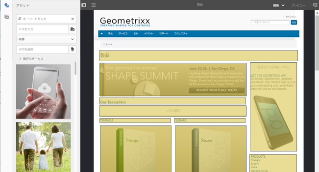

### レイヤー {#layer}

レイヤーは、独立した機能バンドルであり、アクティベートすると次のことが可能です。

* ページを別のビューで表示
* ページの操作やインタラクションが可能

レイヤーを使用すると、個々のコンポーネントに特定のアクションが提供されるのではなく、ページ全体に高度な機能が提供されます。

AEM には、編集、プレビュー、注釈など、ページオーサリング用のレイヤーがいくつか実装済みです。

>[!NOTE]
>
>レイヤーは強力な概念であり、ページコンテンツのユーザーのビューや、ページコンテンツとのインタラクションに影響します。独自のレイヤーを開発するときは、終了時にレイヤーがクリーンアップされることを確認する必要があります。

### レイヤースイッチャー {#layer-switcher}

レイヤースイッチャーを使用すると、使用するレイヤーを選択できます。閉じると、現在使用中のレイヤーが示されます。

レイヤースイッチャーは、ツールバー（ウィンドウ上部、エディターフレーム内）からドロップダウンとして使用できます。

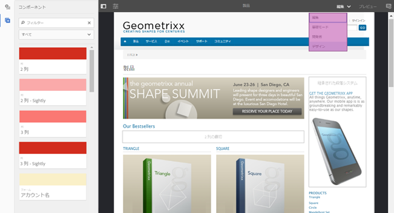

### コンポーネントツールバー {#component-toolbar}

コンポーネントの各インスタンスをクリック（1 回のクリックまたはゆっくりダブルクリック）すると、そのツールバーが表示されます。ツールバーには、ページ上のコンポーネントインスタンスで使用可能（編集可能）な特定のアクション（コピー、貼り付け、エディターを開くなど）が含まれます。

表示可能なスペースによって、コンポーネントツールバーは、適切なコンポーネントの右上または右下の隅に配置されます。

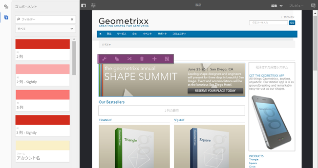

## その他の情報 {#further-information}

タッチ対応UIに関する概念について詳しくは、AEMタッチ対応UIの [概念に関する記事](/help/sites-developing/touch-ui-concepts.md)を参照してください。

技術情報について詳しくは、タッチ対応ページエディターの [JSドキュメントセット](https://helpx.adobe.com/experience-manager/6-5/sites/developing/using/reference-materials/jsdoc/ui-touch/editor-core/index.html) （英語のみ）を参照してください。

