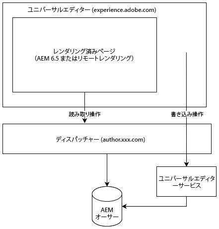

# ユニバーサルエディター {#universal-editor}

ユニバーサルエディターの柔軟性と、AEM 6.5 を使用してヘッドレスエクスペリエンスを強化する方法について説明します。

## 概要 {#overview}

ユニバーサルエディターは、Adobe Experience Manager Sites の一部である多用途のビジュアルエディターです。作成者は、ヘッドレスエクスペリエンスに対して見たままが得られる（WYSIWYG）編集を行うことができます。

* 作成者は、ユニバーサルエディターがAEM ヘッドレスコンテンツのすべてのフォームに対して同じ一貫性のあるビジュアル編集をサポートするので、ユニバーサルエディターの柔軟性の利点を活用できます。
* ユニバーサルエディターは実装の真の分離をサポートするので、開発者はユニバーサルエディターの汎用性のメリットを受けます。 SDKやテクノロジに制約を課すことなく、任意のフレームワークやアーキテクチャを使用できます。

詳しくは、ユニバーサルエディターの [AEM as a Cloud Service ドキュメント ](https://experienceleague.adobe.com/ja/docs/experience-manager-cloud-service/content/implementing/developing/universal-editor/introduction) を参照してください。

## アーキテクチャ {#architecture}

ユニバーサルエディターは、AEMと連携してコンテンツをヘッドレスにオーサリングするサービスです。

* ユニバーサルエディターは `https://experience.adobe.com/#/aem/editor/canvas` でホストされ、AEM 6.5 でレンダリングされたページを編集できます。
* AEMページは、ユニバーサルエディターによって、AEM オーサーインスタンスから Dispatcher を介して読み取られます。
* Dispatcherと同じホスト上で動作するユニバーサルエディターサービスが、変更内容をAEM オーサーインスタンスに書き戻します。



## 要件 {#requirements}

ユニバーサルエディターは、以下でサポートされています。

* AEM 6.5（サービスパック 21 または 22 と機能パック）
   * オンプレミスおよび AMS の両方のホスティングがサポートされています。
* [AEM as a Cloud Service](https://experienceleague.adobe.com/ja/docs/experience-manager-cloud-service/content/implementing/developing/universal-editor/introduction) （リリース `2023.8.13099` 以降）

このドキュメントでは、ユニバーサルエディターのAEM 6.5 のサポートに焦点を当てています。

## 設定 {#setup}

ユニバーサルエディターをテストするには、次の操作が必要です。

1. [AEM オーサリングインスタンスを更新および設定します。](#update-configure-aem)
1. [ローカルのユニバーサルエディターサービスを設定します。](#set-up-ue)
1. [ユニバーサルエディターサービスを許可するように Dispatcher を調整します。](#update-dispatcher)

設定が完了したら、[ ユニバーサルエディターを使用するようにアプリケーションをインストルメント ](#instrumentation) できます。

### AEMの更新 {#update-aem}

AEM 6.5 でユニバーサルエディターを使用するには、サービスパック 21 または 22、AEMの機能パックが必要です。

#### 最新のサービスパックを適用 {#latest}

AEM 6.5 の Service Pack 21 または 22 以降を実行していることを確認してください。最新のサービスパックは、[ ソフトウェア配布 ](https://experienceleague.adobe.com/docs/experience-cloud/software-distribution/home.html?lang=ja) からダウンロードできます。

#### ユニバーサルエディター機能パックのインストール {#feature-pack}

**AEM 6.5 用ユニバーサルエディター機能パック** ソフトウェア配布で入手可能 [ をインストールします ](https://experience.adobe.com/#/downloads/content/software-distribution/en/aem.html?package=/content/software-distribution/en/details.html/content/dam/aem/public/cq-6.5.21-universal-editor-1.0.0.zip)。

既にサービスパック 23 以降を実行している場合、機能パックは必要ありません。

### サービスの設定 {#configure-services}

機能パックにより、追加の設定が必要な多数の新しいパッケージがインストールされます。

#### `login-token` cookie に SameSite 属性を設定します。 {#samesite-attribute}

1. Configuration Manager を開きます。
   * `http://<host>:<port>/system/console/configMgr`
1. リストで **Adobe Granite トークン認証ハンドラー** を見つけて、「**設定値を変更**」をクリックします。
1. ダイアログで、login-token cookie の **SameSite 属性** （`token.samesite.cookie.attr`）の値を `Partitioned` に変更します。
1. 「**保存**」をクリックします。

#### `SAMEORIGIN` ヘッダーの X-Frame オプションを削除します。 {#sameorigin}

1. Configuration Manager を開きます。
   * `http://<host>:<port>/system/console/configMgr`
1. リストで **Apache Sling Main Servlet** を見つけ、**設定値を編集** をクリックします。
1. **追加の応答ヘッダー** 属性（`sling.additional.response.headers`）が存在する場合は、その属性から `X-Frame-Options=SAMEORIGIN` 値を削除します。
1. 「**保存**」をクリックします。

#### Adobe Granite クエリパラメーター認証ハンドラーを設定します。 {#query-parameter}

1. Configuration Manager を開きます。
   * `http://<host>:<port>/system/console/configMgr`
1. リストの **Adobe Granite クエリパラメーター認証ハンドラー** を見つけて、「**設定値を編集**」をクリックします。
1. **パス** フィールド（`path`）に、有効にする `/` を追加します。
   * 値が空の場合は、認証ハンドラーが無効になります。
1. 「**保存**」をクリックします。

#### ユニバーサルエディターを開くコンテンツ `sling:resourceTypes` パスまたはパスを定義します。 {#paths}

1. Configuration Manager を開きます。
   * `http://<host>:<port>/system/console/configMgr`
1. リストで&#x200B;**ユニバーサルエディター URL サービス**&#x200B;を見つけて、「**設定値を編集**」をクリックします。
1. ユニバーサルエディターを開くコンテンツ `sling:resourceTypes` パスまたはパスを定義します。
   * 「**ユニバーサルエディターを開くマッピング**」フィールドに、ユニバーサルエディターを開くパスを指定します。
   * 「**ユニバーサルエディターで開く Sling:resourceTypes**」フィールドに、ユニバーサルエディターによって直接開かれるリソースのリストを指定します。
1. 「**保存**」をクリックします。
1. [externalizer 設定 ](/help/sites-developing/externalizer.md) を確認し、少なくともローカル、オーサー、パブリッシュ環境が次の例のように設定されていることを確認します。

   ```text
   "local $[env:AEM_EXTERNALIZER_LOCAL;default=http://localhost:4502]",
   "author $[env:AEM_EXTERNALIZER_AUTHOR;default=http://localhost:4502]",
   "publish $[env:AEM_EXTERNALIZER_PUBLISH;default=http://localhost:4503]"
   ```

これらの設定手順が完了すると、AEMは次の順序でページのユニバーサルエディターを開きます。

1. AEM は `Universal Editor Opening Mapping` の下にあるマッピングを確認し、コンテンツがそこに定義されているパスの下にある場合は、ユニバーサルエディターが開かれます。
1. `Universal Editor Opening Mapping` で定義されたパスの下にないコンテンツの場合、AEM はコンテンツの `resourceType` が、**ユニバーサルエディターで開かれる Sling:resourceTypes**&#x200B;で定義されたものと一致するかどうかを確認し、コンテンツがこれらのタイプのいずれかに一致する場合は、`${author}${path}.html` でユニバーサルエディターが開かれます。
1. それ以外の場合は、AEM によってページエディターが開かれます。

`Universal Editor Opening Mapping` の下でマッピングを定義するには、次の変数を使用できます。

* `path`：開くリソースのコンテンツパス
* `localhost`：スキーマなしの `localhost` の Externalizer エントリ（例：`localhost:4502`）
* `author`：スキーマなしのオーサーの Externalizer エントリ（例：`localhost:4502`）
* `publish`：スキーマなしのパブリッシュの Externalizer エントリ（例：`localhost:4503`）
* `preview`：スキーマなしのプレビューの Externalizer エントリ（例：`localhost:4504`）
* `env`：定義された Sling 実行モードに基づく `prod`、`stage`、`dev`
* `token`：`QueryTokenAuthenticationHandler` に必要なクエリトークン

マッピングの例：

* AEM オーサーの `/content/foo` の下にあるすべてのページを開きます。
   * `/content/foo:${author}${path}.html?login-token=${token}`
   * これにより、`https://localhost:4502/content/foo/x.html?login-token=<token>` が開きます。
* すべての変数を情報として指定して、リモート NextJS サーバー上の `/content/bar` 下にあるすべてのページを開きます。
   * `/content/bar:nextjs.server${path}?env=${env}&author=https://${author}&publish=https://${publish}&login-token=${token}`
   * これにより、`https://nextjs.server/content/bar/x?env=prod&author=https://localhost:4502&publish=https://localhost:4503&login-token=<token>` が開きます。

### ユニバーサルエディターサービスの設定 {#set-up-ue}

AEMが更新および設定されたので、独自のローカル開発およびテスト用にローカルのユニバーサルエディターサービスをセットアップできます。

1. Node.js のバージョン >=20 をインストールします。
1. [ ソフトウェア配布 ](https://experienceleague.adobe.com/ja/docs/experience-cloud/software-distribution/home) から最新のユニバーサルエディターサービスをダウンロードして展開します
1. 環境変数または `.env` ファイルを使用してユニバーサルエディターサービスを設定します。
   * [ 詳しくは、AEM as a Cloud Service ユニバーサルエディターのドキュメントを参照してください。](https://experienceleague.adobe.com/ja/docs/experience-manager-cloud-service/content/implementing/developing/universal-editor/local-dev#setting-up-service)
   * 内部 IP の書き換えが必要な場合は、`UES_MAPPING` オプションを使用する必要がある場合があります。
1. 実行 `universal-editor-service.cjs`

### Dispatcherの更新 {#update-dispatcher}

AEMが設定され、ローカルのユニバーサルエディターサービスが実行されている場合は、（Dispatcher で [ 新しいサービスのリバースプロキシを許可する必要があ ](https://experienceleague.adobe.com/ja/docs/experience-manager-dispatcher/using/dispatcher) ます。

1. オーサーインスタンスの vhost ファイルを調整して、リバースプロキシが組み込まれるようにします。

   ```html
   <IfModule mod_proxy.c>
    ProxyPass "/universal-editor" "http://localhost:8080"
    ProxyPassReverse "/universal-editor" "http://localhost:8080"
   </IfModule>
   ```

   >[!NOTE]
   >
   >デフォルトのポートは 8080 です。 [`.env` ファイル ](https://experienceleague.adobe.com/ja/docs/experience-manager-cloud-service/content/implementing/developing/universal-editor/local-dev#setting-up-service) の `UES_PORT` パラメーターを使用してこの値を変更した場合は、ポートの値を適宜調整する必要があります。

1. Apache を再起動します。

## アプリの実装 {#instrumentation}

AEMが更新され、ローカルのユニバーサルエディターサービスが実行されている状態で、ユニバーサルエディターを使用してヘッドレスコンテンツの編集を開始できます。

ただし、ユニバーサルエディターを利用するには、アプリのインストルメントを行う必要があります。 これには、コンテンツを保持する方法と場所をエディターに指示するメタタグを含める必要があります。 この実装について詳しくは、[AEM as a Cloud Serviceのユニバーサルエディターのドキュメント ](https://experienceleague.adobe.com/ja/docs/experience-manager-cloud-service/content/implementing/developing/universal-editor/getting-started#instrument-page) を参照してください。

AEMを使用したユニバーサルエディターのドキュメントに従う場合、AEM as a Cloud Service 6.5 で使用する際には次の変更が適用されます。

* メタタグのプロトコルは、`aem` ではなく `aem65` にする必要があります。

  ```html
  <meta name="urn:adobe:aue:system:aemconnection" content={`aem65:${getAuthorHost()}`}/>
  ```

* ユニバーサルエディターサービスエンドポイントは、メタタグを使用してアナウンスする必要があります。

  ```html
  <meta name="urn:adobe:aue:config:service" content={`${getAuthorHost()}/universal-editor`}/>
  ```

* コンポーネント定義の `plugins` セクションでは、`aem` の代わりに `aem65` を使用する必要があります。

>[!TIP]
>
>ユニバーサルエディターの使用を開始する開発者向けの包括的なガイドについては、AEM as a Cloud Service ドキュメントの [AEM開発者向けユニバーサルエディターの概要 ](https://experienceleague.adobe.com/ja/docs/experience-manager-cloud-service/content/implementing/developing/universal-editor/developer-overview) を参照してください。この節で説明したAEM 6.5 のサポートに必要な変更に留意してください。

## AEM 6.5 とAEM as a Cloud Serviceの違い {#differences}

AEM 6.5 のユニバーサルエディターは、UI や多くの設定を含め、AEM as a Cloud Serviceと広く同じように機能します。 ただし、注意すべき違いがあります。

* 6.5 のユニバーサルエディターでは、ヘッドレスのユースケースのみをサポートしています。
* ユニバーサルエディターの設定は、6.5 で（現在のドキュメントで説明されているように [&#128279;](#setup) わずかに異なります。
* 6.5 のユニバーサルエディターは、AEM as a Cloud Serviceとは異なるアセットピッカーと異なるコンテンツフラグメントピッカーを使用します。
