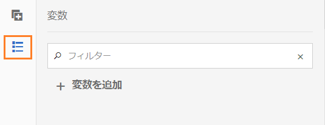
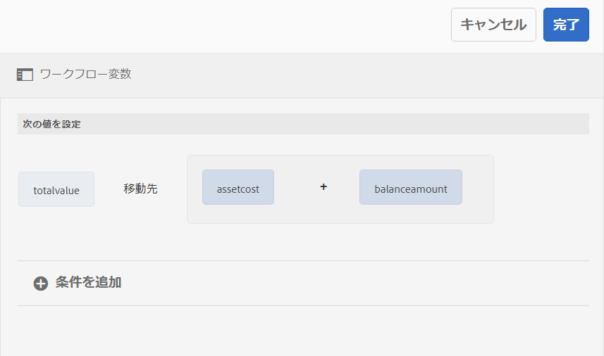
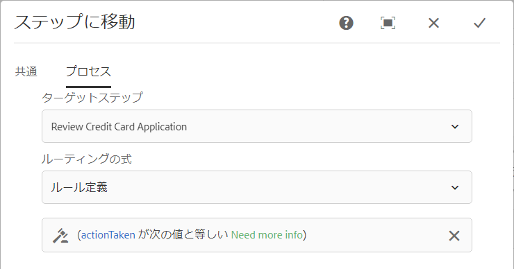

# AEMワークフロー{#variables-in-aem-workflows}

ワークフローモデルの変数は、そのデータタイプに基づいて値を格納する方法です。 その後、任意のワークフロー手順で変数の名前を使用して、変数に格納された値を取得できます。 変数名を使用して、変数を決定する式を定義することもできます。

AEMワークフローモデルでは、次のことができます。

* [データ型の変数](/help/sites-developing/using-variables-in-aem-workflows.md#create-a-variable) は、格納する情報型に基づいて作成します。
* [「変数を設定」ワークフローの手順を使用して](/help/sites-developing/using-variables-in-aem-workflows.md#set-a-variable) 、変数の値を設定します。
* [OR SplitとGoto](/help/sites-developing/using-variables-in-aem-workflows.md#use-a-variable) AEM workflow手順で変数を使用して、ルーティングの意思決定を行う式を定義します。 また、すべてのAEM Formsワークフロー手順で変数を使用することもできます。

次のビデオでは、AEMワークフローモデルで変数を作成、設定および使用する方法を示します。

>[!VIDEO](https://helpx.adobe.com/content/dam/help/en/experience-manager/6-5/forms/using/usevariables_example.mp4)

変数は、MetaDataMapインターフェイスの拡 [張です](https://helpx.adobe.com/experience-manager/6-5/sites/developing/using/reference-materials/javadoc/com/adobe/granite/workflow/metadata/MetaDataMap.html) 。 ECMAScriptのMetaDataMapを使用し [て](https://helpx.adobe.com/experience-manager/6-5/sites/developing/using/reference-materials/javadoc/com/adobe/granite/workflow/metadata/MetaDataMap.html) 、変数を使用して保存されたメタデータにアクセスできます。

## 変数の作成 {#create-a-variable}

変数は、ワークフローモデルのサイドキックにある「変数」セクションを使用して作成します。 AEMワークフロー変数は、次のデータ型をサポートしています。

* **プリミティブデータ型**:長整数型、重複型、ブール型、日付型、文字列型
* **複雑なデータ型**: [XML](https://docs.oracle.com/javase/8/docs/api/org/w3c/dom/Document.html) および [JSON](https://static.javadoc.io/com.google.code.gson/gson/2.3/com/google/gson/JsonObject.html)

>[!NOTE]
>
>ワークフローは、日付型変数のISO8601形式のみをサポートしています。

AEM Formsワークフローで使用できるその他の複雑なデータ型については、「AEM Formsワークフローの変数」を参照し [てくださ](/help/forms/using/variable-in-aem-workflows.md)い。  ArrayListデータ型を使用して、変数コレクションを作成します。 すべてのプリミティブデータ型と複雑なデータ型に対して、ArrayList変数を作成できます。 例えば、ArrayList変数を作成し、その変数を使用して複数の文字列値を格納する場合は、「String」をサブタイプとして選択します。

次の手順を実行して、変数を作成します。

1. AEMインスタンスで、ツール/ワークフロー/モデルに移動します。
1. 「作成 **[!UICONTROL 」をタップし]** 、ワークフローモデルのタイトルと名前（オプション）を指定します。 モデルを選択し、「編集」をタッ **[!UICONTROL プします]**。
1. ワークフローモデルのサイドキックで使用可能な変数アイコンをタップし、「変数」をタ **[!UICONTROL 追加ップしま]**&#x200B;す。

   

1. Variable追加ダイアログで、名前を指定し、変数のタイプを選択します。
1. 「タイプ」ドロップダウン **[!UICONTROL リストか]** らデータタイプを選択し、次の値を指定します。

   * プリミティブデータ型 — 変数のオプションのデフォルト値を指定します。
   * JSONまたはXML — オプションのJSONまたはXMLのスキーマパスを指定します。 システムは、このスキーマで使用可能なプロパティを別の変数にマッピングして保存する際に、スキーマパスを検証します。
   * Form Data Model - Form Data Modelのパスを指定します。
   * ArrayList — コレクションのサブタイプを指定します。

1. 変数の説明（オプション）を指定し、をタップして  変更を保存します。 変数は、左側のペインのリストに表示されます。

変数を作成する場合、次のプラクティスをお勧めします。

* ワークフローで必要な数の変数を作成します。 ただし、データベースのリソースを確保するため、必要最低限の変数を使用し、必要に応じて変数を再利用してください。
* 変数では大文字と小文字が区別されます。ワークフローでは、大文字と小文字を区別して変数を参照してください。
* 変数の名前に特殊文字を使用しないでください。

## 変数の設定 {#set-a-variable}

変数の値を設定し、値が設定される順序を定義するには、「変数を設定」ステップを使用します。 変数は、変数のマッピングが変数の設定手順で示される順序で設定されます。

変数値を変更すると、変更が発生したプロセスのインスタンスのみに影響します。例えば、ワークフローが開始され、変数データが変更されると、その変更はワークフローのそのインスタンスにのみ影響します。 この変更は、以前に開始された、またはその後開始されたワークフローの他のインスタンスには影響しません。

変数のデータタイプに応じて、次のオプションを使用して変数の値を設定できます。

* **リテラル：**&#x200B;指定する値が正確に分かっている場合は、このオプションを使用します。
* **式:** このオプションは、使用する値がオプションに基づいて計算される場合に式します。 式は、提供された式エディタで作成されます。
* **JSONドット表記：** JSONまたはFDM型の変数から値を取得するには、このオプションを使用します。
* **XPATH:** XML型の変数から値を取得するには、このオプションを使用します。
* **ペイロードに対する相対：** 変数に保存する値が、ペイロードに対する相対パスで使用可能な場合に、このオプションを使用します。
* **絶対パス：** 変数に保存する値が絶対パスで使用可能な場合は、このオプションを使用します。

また、JSON DOT NotationまたはXPATH表記を使用して、JSONまたはXML型の変数の特定の要素を更新することもできます。

### 変追加数間のマッピング {#add-mapping-between-variables}

次の手順を実行して、変数間のマッピングを追加します。

1. ワークフローの編集ページで、ワークフローモデルのサイドキックにある手順アイコンをタップします。
1. 「変数を設定」ステップをワークフ **ローエディターに** ドラッグ&amp;ドロップし、ステップをタップして「  （設定）」を選択します。
1. 変数を設定ダイアログで、マッピング/マッピ **[!UICONTROL ング]** を選択 **[!UICONTROL 追加します]**。
1. 「 **Map Variable** 」セクションで、データを保存する変数を選択し、マッピングモードを選択して、変数に保存する値を指定します。 マッピングモードは、変数のタイプによって異なります。
1. より多くの変数をマッピングして意味のある式を作成。 Tap  to save the changes.

### 例1:クエリ文字列変数の値を設定するXML変数 {#example-query-an-xml-variable-to-set-value-for-a-string-variable}

XMLファイルを保存するXML型の変数を選択します。 XML変数をクエリして、XMLファイルで使用可能なプロパティの文字列変数の値を設定します。 XML変数 **フィールドのXPATHを指定して** 、文字列変数に格納するプロパティを定義します。

この例では、 **cc-app.xmlファイルを保存するformdata** XML変数を選択します **** 。 **formdata** 変数をクエリし、emailaddress **string変数の値を設定して、** cc-app.xmlファイルで使用できる **emailAddress****** プロパティの値を格納します。

>[!VIDEO](https://helpx.adobe.com/content/dam/help/en/experience-manager/6-5/forms/using/set_variable_example1.mp4 "変数の値の設定")

### 例2:他の変数に基づいて式を使用して値を保存する {#example2}

式を使用して変数の合計を計算し、結果を変数に格納します。

この例では、式エディターを使用して式を定義し、 **assetscost** 変数とbalanceamount変数の合計 **を計算し** 、結果をtotalvalue変数に **格納します** 。

>[!VIDEO](https://helpx.adobe.com/content/dam/help/en/experience-manager/6-5/forms/using/variables_expression.mp4)

## 式エディター {#use-expression-editor}

また、式を使用して、実行時に変数の値を計算します。 変数は、変数を定義する式エディターを提供します。式

式エディターを使用して、次の操作を行います。

* 他のワークフロー変数、数値または数値式を使用して、変数の値を設定
* ワークフロー変数、文字列、数値または式を数学式内で使用
* 追加条件を使用して、変数の値を設定します。
* 演算子追加を使用します。



これは、次の変更を加えたアダプティブフォームのルールエディターに基づいています。 変数のルールエディター：

* 関数をサポートしません。
* ルールの概要に対するUIを表示に提供しない
* コードエディターがありません。
* オブジェクトの値の有効化と無効化をサポートしません。
* オブジェクトのプロパティの設定はサポートされません。
* Webサービスの呼び出しをサポートしません。

For more information, see [adaptive forms rule editor](/help/forms/using/rule-editor.md).

## Use a variable {#use-a-variable}

変数を使用して、入力および出力を取得したり、手順の結果を保存したりできます。 ワークフローエディターには、次の2種類のワークフロー手順が用意されています。

* 変数のサポートを含むワークフロー手順
* 変数をサポートしないワークフロー手順

### 変数のサポートを含むワークフロー手順 {#workflow-steps-with-support-for-variables}

「移動先」または「分割」の手順と、すべてのAEM Formsワークフローの手順で変数がサポートされています。

#### OR分割ステップ {#or-split-step}

OR 分割は、ワークフロー内に分割を作成し、以降は 1 つのブランチだけがアクティブになります。これを使用すると、ワークフローに条件付き処理パスを導入できます。必要に応じて、各ブランチにワークフローステップを追加できます。

ブランチのルーティング式は、ルール定義、ECMAスクリプトまたは外部スクリプトを使用して定義できます。

変数を使用して、変数エディターを使用してルーティング式を式できます。 OR分割ステップでのルーティング式の使用について詳しくは、 [OR分割ステップを参照してください](/help/sites-developing/workflows-step-ref.md#or-split)。

この例では、ルーティング式を定義する前に、例2 [を使用し](/help/sites-developing/using-variables-in-aem-workflows.md#example2) 、totalvalue変数の値を設定 **します** 。 ブランチ1は、totalvalue変数の値が50000を超え **る場合** 、アクティブです。 同様に、totalvalue変数の値が50000未満の場合にブランチ2をアクティブにす **るルール** を定義できます。

>[!VIDEO](https://helpx.adobe.com/content/dam/help/en/experience-manager/6-5/forms/using/variables_orsplit_example.mp4)

同様に、アクティブなブランチを評価するルーティング式の外部スクリプトパスを選択するか、ECMAスクリプトを指定します。 「ブラン **[!UICONTROL チの名前を変更]** 」をタップして、ブランチの別の名前を指定します。

その他の例については、「ワークフロー [モデルの作成」を参照してくださ](/help/forms/using/aem-forms-workflow.md#create-a-workflow-model)い。

#### ステップへ移動 {#go-to-step}

The **Goto Step** allows you to specify the next step in the workflow model to execute, dependent on the result of a routing expression.

OR分割手順と同様に、ルール定義、ECMAスクリプトまたは外部スクリプトを使用して、Goto手順のルーティング式を定義できます。

変数を使用して、変数エディターを使用してルーティング式を式できます。 Gotoステップでのルーティング式の使用について詳しくは、Gotoステップを参照し [てください](/help/sites-developing/workflows-step-ref.md#goto-step)。



この例では、Gotoステップで、actiontaked変数の値が「Need more info **」と等しい場合、「Review Credit Card Application」を次のステップと** して指定します ****。

Gotoステップでのルール定義の使用例については、Forループのシミュレ [ートを参照してください](/help/sites-developing/workflows-step-ref.md#simulateforloop)。

#### フォームワークフロー中心のワークフローの手順 {#forms-workflow-centric-workflow-steps}

すべてのAEM Formsワークフロー手順で、変数がサポートされます。 For more information, see [Forms-centric workflow on OSGi](/help/forms/using/aem-forms-workflow-step-reference.md).

### 変数をサポートしないワークフロー手順 {#workflow-steps-without-support-for-variables}

MetaDataMapインターフェ [イスを使用して](https://helpx.adobe.com/experience-manager/6-5/sites/developing/using/reference-materials/javadoc/com/adobe/granite/workflow/metadata/MetaDataMap.html) 、変数をサポートしないワークフロー手順の変数にアクセスできます。

#### 変数値の取得 {#retrieve-the-variable-value}

ECMAスクリプトで次のAPIを使用して、データ型に基づいて既存の変数の値を取得します。

| 変数データ型 | API |
|---|---|
| プリミティブ(長整数型、重複型、ブール型、日付型、文字列型) | workItem.getWorkflowData().getMetaDataMap().get(variableName, type) |
| XML | Packages.org.w3c.dom.workflowxmlObject = workItem.getWorkflowData().getMetaDataMap().get(variableName, Packages.org.w3c.dom.ドキュメント.class); |
| JSON | Packages.com.google.gson.JsonObject jsonObject = workItem.getWorkflowData().getMetaDataMap().get(variableName, Packages.com.google.gson.JsonObject.class); |

AEM Formsワークフローで使用できる追加の複雑な変数データ型のAPIについて詳しくは、「AEM Formsワークフローの変数」 [を参照してください](/help/forms/using/variable-in-aem-workflows.md)。

**例**

次のAPIを使用して、文字列データ型の値を取得します。

```
workItem.getWorkflowData().getMetaDataMap().get(accname, Packages.java.lang.String)
```

#### 変数値の更新 {#update-the-variable-value}

ECMAスクリプトで次のAPIを使用して、変数の値を更新します。

```
workItem.getWorkflowData().getMetaDataMap().put(variableName, value)
```

**例**

```
workItem.getWorkflowData().getMetaDataMap().put(salary, 50000)
```

salary変数の値を50000に **更新します** 。

### 変数を設定して呼び出すワークフロー {#apiinvokeworkflow}

APIを使用して変数を設定し、それらを渡してワークフローインスタンスを呼び出すことができます。

[workflowSession.startWorkflowは](https://helpx.adobe.com/experience-manager/6-5/sites/developing/using/reference-materials/javadoc/com/adobe/granite/workflow/WorkflowSession.html#startWorkflow-com.adobe.granite.workflow.model.WorkflowModel-com.adobe.granite.workflow.exec.WorkflowData-java.util.Map-) 、モデル、wfDataおよびmetaDataを引数として使用します。 MetaDataMapを使用して変数の値を設定します。

このAPIでは、 **variableName** 変数は、metaData **** .put(variableName, value)；を使用して値に設定されます。

```java
import com.adobe.granite.workflow.model.WorkflowModel;
import com.adobe.granite.workflow.metadata.MetaDataMap;
import com.adobe.aemfd.docmanager.Document;

/*Assume that you already have a workflowSession and modelId along with the payloadType and payload*/
WorkflowData wfData = workflowSession.newWorkflowData(payloadType, payload);
MetaDataMap metaData = wfData.getMetaDataMap();
metaData.put(variableName, value); //Create a variable "variableName" in your workflow model
WorkflowModel model = workflowSession.getModel(modelId);
workflowSession.startWorkflow(model, wfData, metaData);
```

## 変数の編集 {#edit-a-variable}

1. ワークフローを編集ページで、ワークフローモデルのサイドキックにある変数アイコンをタップします。 左側のウィンドウの「変数」セクションには、既存の変数がすべて表示されます。
1. 編集する  変数名の横にある（編集）アイコンをタップします。
1. 変数情報を編集し、をタップし  て変更を保存します。 変数の「名前」フィール **[!UICONTROL ドと]** 「タ **[!UICONTROL イプ]** 」フィールドは編集できません。

## 変数の削除 {#delete-a-variable}

変数を削除する前に、変数の参照をすべてワークフローから削除します。 この変数がワークフローで使用されていないことを確認します。

次の手順を実行して、変数を削除します。

1. ワークフローを編集ページで、ワークフローモデルのサイドキックにある変数アイコンをタップします。 左側のウィンドウの「変数」セクションには、既存の変数がすべて表示されます。
1. 削除する変数名の横にある削除アイコンをタップします。
1. をタップ  して、変数を確認および削除します。

