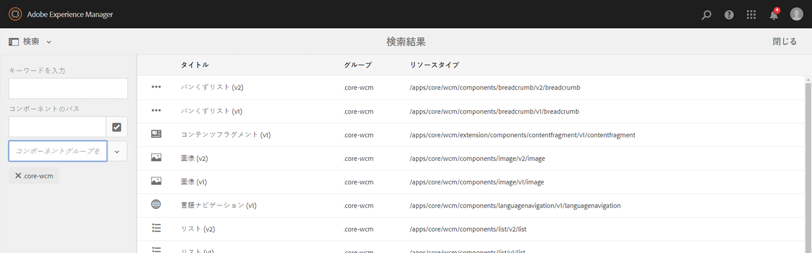
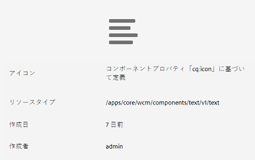
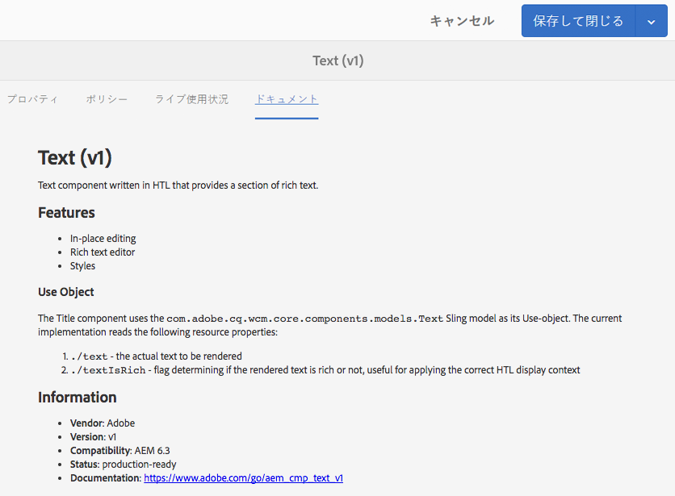
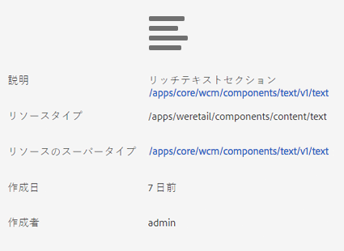
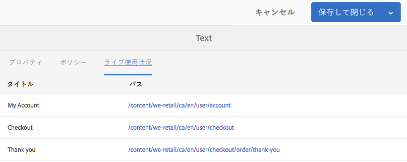
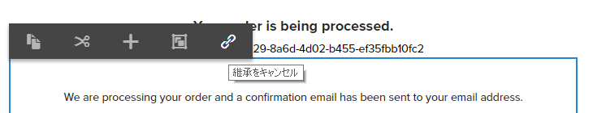
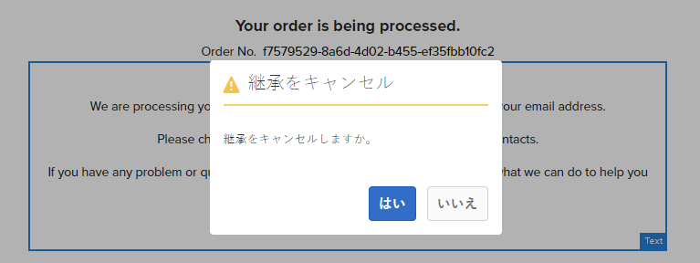
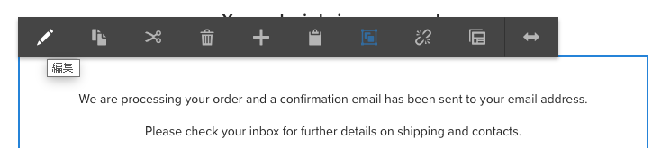
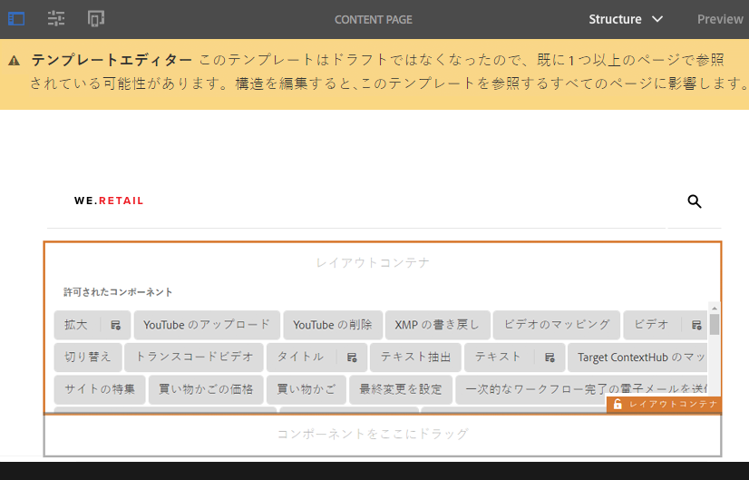
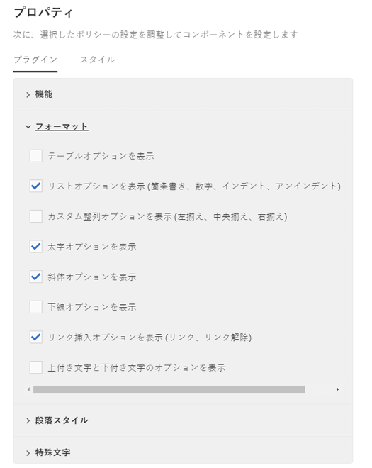

# We.Retail のコアコンポーネントの使用{#trying-out-core-components-in-we-retail}

コアコンポーネントは柔軟性の高い最新のコンポーネントです。拡張が容易で、プロジェクトに簡単に統合できます。コアコンポーネントは、HTL、設定不要の使いやすさ、設定可能、バージョン管理、拡張性など、いくつかの重要な設計の原理に基づいて構築されています。We.Retail はコアコンポーネントを基盤に構築されています。

## 試してみる {#trying-it-out}

1. We.Retail サンプルコンテンツを使用して AEM を起動し、[コンポーネントコンソール](/help/sites-authoring/default-components-console.md)を開きます。

   **グローバルナビゲーション／ツール／コンポーネント**

1. コンポーネントコンソールでレールを開くと、特定のコンポーネントグループをフィルタリングできます。コアコンポーネントは以下の場所にあります。

   * `.core-wcm`:標準コアコンポーネント
   * `.core-wcm-form`:フォーム送信コアコンポーネント

   Choose `.core-wcm`.

   

1. すべてのコアコンポーネントの名前が **v1** になっています。これは、このコアコンポーネントの最初のバージョンであることを示しています。将来的には、定期的にバージョンがリリースされます。これは、AEM とバージョンの互換性があり、簡単にアップグレードできるので、最新機能を利用することができます。
1. **Text (v1)** をクリックします。

   See that the **Resource Type** of the component is `/apps/core/wcm/components/text/v1/text`. Core components are found under `/apps/core/wcm/components` and are versioned per component.

   

1. 「**ドキュメント**」タブをクリックして、コンポーネントの開発者用ドキュメントを表示します。

   

1. コンポーネントコンソールに戻ります。**We.Retail** グループをフィルタリングし、**テキスト**&#x200B;コンポーネントを選択します。
1. See that the **Resource Type** points to a component as expected under `/apps/weretail` but the **Resource Super Type** points back to the core component `/apps/core/wcm/components/text/v1/text`.

   

1. Click the **Live Usage** tab to see on which pages this component is currently being used. 最初の&#x200B;**ありがとう**&#x200B;ページをクリックしてページを編集します。

   

1. ありがとうページで、テキストコンポーネントを選択し、コンポーネントの編集メニューで、継承をキャンセルアイコンをクリックします。

   [We.Retail にはグローバル化されたサイト構造が用意されており](/help/sites-developing/we-retail-globalized-site-structure.md)、この構造では、コンテンツが言語マスターから[継承と呼ばれるメカニズムを通じてライブコピーにプッシュされます](/help/sites-administering/msm.md)。このため、ユーザーが手動でテキストを編集できるよう、継承はキャンセルする必要があります。

   

1. 「**はい**」をクリックしてキャンセルを確定します。

   

1. 継承をキャンセルしてテキストコンポーネントを選択すると、さらに多くのオプションを使用できるようになります。「**編集**」をクリックします。

   

1. テキストコンポーネントに使用できる編集オプションが表示されます。

   

1. **ページ情報**&#x200B;メニューから「**テンプレートを編集**」を選択します。
1. ページのテンプレートエディターで、そのページの&#x200B;**レイアウトコンテナ**&#x200B;にあるテキストコンポーネントの&#x200B;**ポリシー**&#x200B;アイコンをクリックします。

   

1. コアコンポーネントを使用すると、テンプレート作成者は、ページ作成者がどのプロパティを使用できるかを設定できます。これには、許可される貼り付け元、書式設定オプション、使用可能な段落スタイルなどの機能が含まれます。

   このようなデザインダイアログは、多くのコアコンポーネントで使用可能で、テンプレートエディターと連携して機能します。有効にした機能は、コンポーネントエディターを通じて作成者に提供されます。

   

## その他の情報 {#further-information}

コアコンポーネントについて詳しくは、オーサリングドキュメントの[コアコンポーネント](https://docs.adobe.com/content/help/ja-JP/experience-manager-core-components/using/introduction.html)でコアコンポーネントの概要を参照し、開発者用ドキュメントの[コアコンポーネントの開発](https://helpx.adobe.com/experience-manager/core-components/using/developing.html)で技術的な概要を参照してください。

また、[編集可能テンプレート](/help/sites-developing/we-retail-editable-templates.md)も詳しく調査することをお勧めします。Refer to the authoring document [Creating Page Templates](/help/sites-authoring/templates.md) or the developer document Page [Templates - Editable](/help/sites-developing/page-templates-editable.md) for complete details on editable templates.
