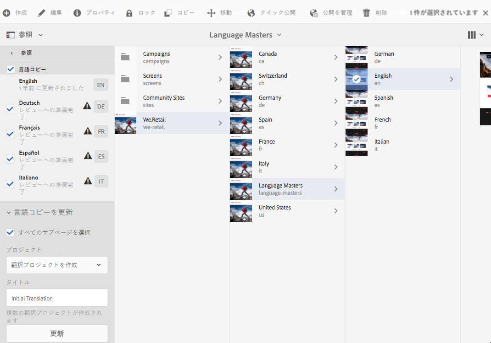

# We.Retail のグローバル化されたサイト構造の使用{#trying-out-the-globalized-site-structure-in-we-retail}

We.Retail は、国固有の Web サイトにライブコピーできる言語マスターを提供するグローバル化されたサイト構造を使用して構築されています。この構造と組み込みの翻訳機能を試すことができるように、すべてが最初から設定されています。

## 試してみる  {#trying-it-out}

1. **グローバルナビゲーション／サイト**&#x200B;からサイトコンソールを開きます。
1. 列表示（まだアクティブでない場合）に切り替え、We.Retail を選択します。スイス、米国、フランスなどの国構造の例を、言語マスターと共に示します。

   

1. スイスを選択して、その国の言語の言語ルートを表示します。これらのルートの下にはまだコンテンツがないことに注意してください。

   

1. リスト表示に切り替えて、各国の言語コピーがすべてライブコピーであることを確認します。

   

1. 列表示に戻り、言語マスターをクリックして、コンテンツを含む言語マスタールートを表示します。コンテンツがあるのは英語だけです。

   We.Retail には翻訳されたコンテンツがありません。ただし、構造と設定は用意されているので、翻訳サービスを試すことができます。

   

1. 英語の言語マスターを選択した状態で、サイトコンソールで&#x200B;**参照**&#x200B;レールを開き、**言語コピー**&#x200B;を選択します。

   

1. **言語コピー**&#x200B;ラベルの横のチェックボックスを選択し、すべての言語コピーを選択します。レールの&#x200B;**言語コピーを更新**&#x200B;セクションで、「**新しい翻訳プロジェクトを作成**」オプションを選択します。プロジェクトの名前を入力し、「**更新**」をクリックします。

   

1. 各言語の翻訳用にプロジェクトが作成されます。作成されたプロジェクトは、**ナビゲーション／プロジェクト**&#x200B;に表示されます。

   

1. ドイツ語をクリックして、その翻訳プロジェクトの詳細を表示します。ステータスが&#x200B;**ドラフト**&#x200B;になっています。Microsoft の翻訳サービスを使用して翻訳を開始するには、**翻訳ジョブ**&#x200B;という見出しの横にある山形括弧をクリックし、「**開始**」を選択します。

   

1. 翻訳プロジェクトが開始されます。「翻訳ジョブ」というラベルの付いたカードの下部にある省略記号をクリックして、詳細を表示します。状態に&#x200B;**レビューへの準備完了**&#x200B;と表示されているページは、既に翻訳サービスによって翻訳済みです。

   

1. リスト内のページの 1 つを選択し、ツールバーの「**サイトでプレビュー**」を選択すると、翻訳されたページがページエディターで開かれます。

   

>[!NOTE]
>
>この手順では、組み込みの Microsoft の機械翻訳との統合を示しました。[AEM 翻訳統合フレームワーク](/help/sites-administering/translation.md)を使用すると、多くの標準的な翻訳サービスと統合して AEM の翻訳を調整できます。

## その他の情報 {#further-information}

詳細については、オーサリングドキュメント[Translating Content for Multilingual Sites](/help/sites-administering/translation.md)を参照して、技術的な詳細を確認してください。
