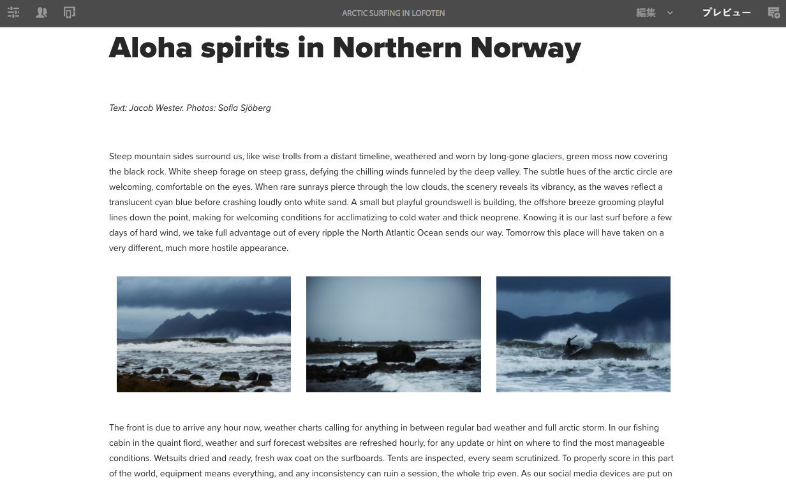
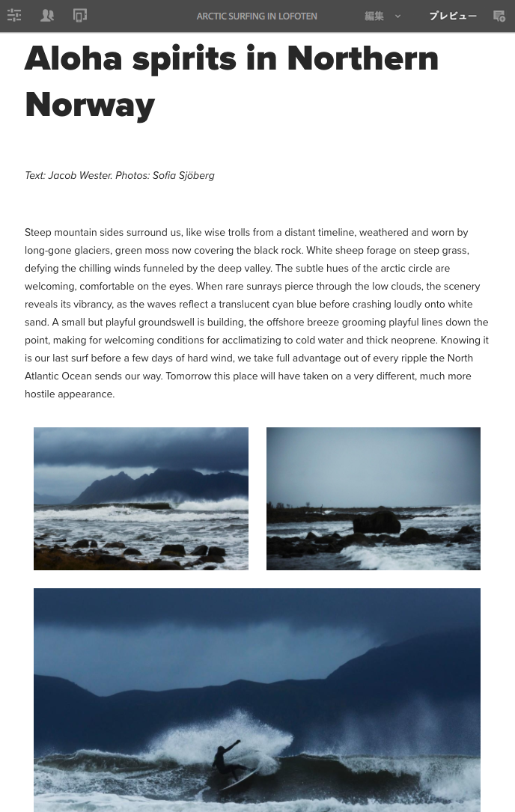
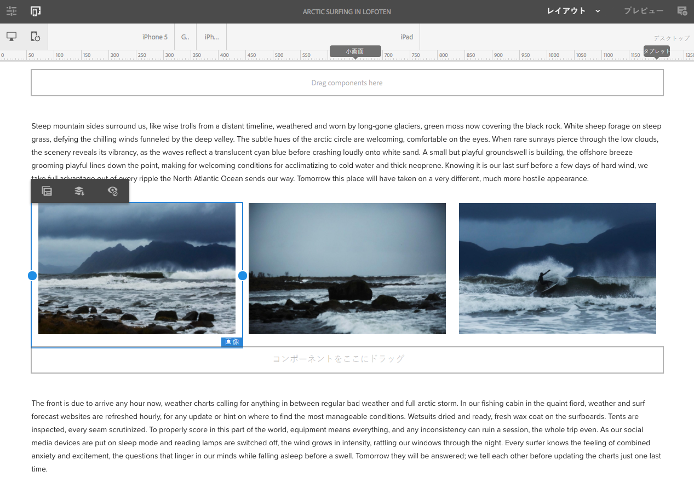
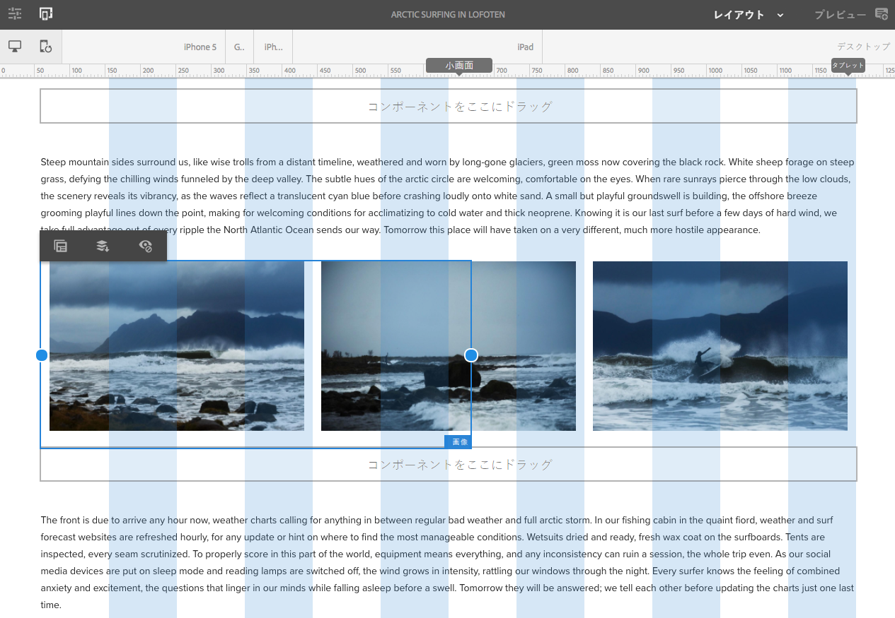

# We.Retail のレスポンシブレイアウトの使用{#trying-out-responsive-layout-in-we-retail}

すべてのWeb.Retailページで、レスポンシブデザインの実装にレイアウトコンテナコンポーネントが使用されます。 レイアウトコンテナは、レスポンシブグリッド内にコンポーネントを配置できる段落システムを提供します。このグリッドでは、デバイスやウィンドウのサイズおよび形式に従ってレイアウトを再編成できます。The component is used in conjunction with the **Layout** mode in the page editor, which allows you to create and edit your responsive layout dependent on device.

## 試してみる {#trying-it-out}

1. 言語マスターブランチの「エクスペリエンス」セクションで Arctic Surfing ページを編集します。

   http://localhost:4502/editor.html/content/we-retail/language-masters/en/experience/arctic-surfing-in-lofoten.html

1. **プレビュー**&#x200B;に切り替えて、Web サイトの訪問者に表示されるページを確認します。記事「Aloha spirits in Norther Norway」**&#x200B;のコンテンツまでスクロールダウンします。

   

1. ブラウザーウィンドウのサイズを変更し、そのサイズ変更に対してレイアウトが動的に調整されることを確認します。

   

1. レイアウトモードに切り替えます。エミュレーターツールバーが自動的に表示されます。このツールバーを使用して、ターゲットデバイスごとにレイアウトを計画できます。

   コンポーネントを選択すると、編集メニューにフローティングおよび非表示オプションと共に、コンポーネントのサイズ変更ハンドルが表示されます。

   

1. コンポーネントのサイズ変更ハンドルを選択してドラッグすると、サイズ変更に役立つレイアウトグリッドが自動的に表示されます。

   

## その他の情報 {#further-information}

For further information, refer to the authoring document [Responsive Layout](/help/sites-authoring/responsive-layout.md) or the administrator document [Configuring Layout Container and Layout Mode](/help/sites-administering/configuring-responsive-layout.md) for complete technical details.
