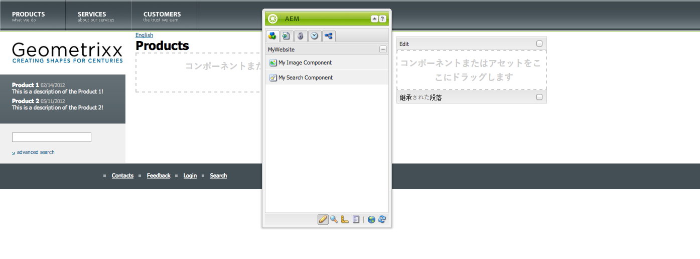
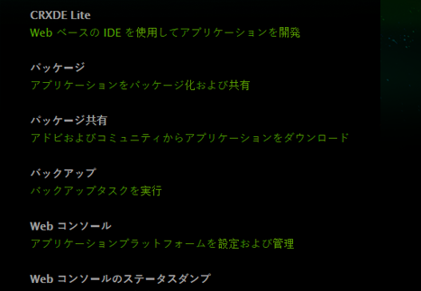
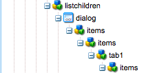
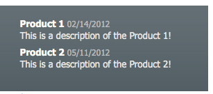
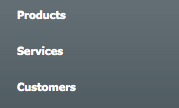

# 完全な機能を備えた Web サイトの作成（JSP）{#create-a-fully-featured-website-jsp}

>[!NOTE]
>
>この記事では、JSP とクラシック UI を使用して Web サイトを作成する方法について説明します。アドビでは、[AEM Sites の開発の手引き](/help/sites-developing/getting-started.md)で詳しく説明しているように、Web サイトに最新の AEM テクノロジーを利用することをお勧めします。

このチュートリアルでは、Adobe Experience Manager（AEM）を使用して完全な機能を備えた Web サイトを作成できます。この Web サイトは汎用の Web サイトをベースとし、主に Web 開発者をターゲットとしています。開発はすべて、オーサー環境内でおこなわれます。

このチュートリアルでは、次の方法を説明します。

1. AEM をインストールします。
1. CRXDE Lite（開発環境）にアクセスします。
1. CRXDE Lite でプロジェクトの構造を設定します。
1. コンテンツページ作成の基礎として使用するテンプレート、コンポーネントおよびスクリプトを作成します。
1. Web サイトのルートページを作成し、次にコンテンツページを作成します。
1. ページで使用する以下のコンポーネントを作成します。

   * 上部ナビゲーション
   * リストの子
   * Logo（ロゴ）
   * 画像
   * テキスト画像
   * 検索

1. 様々な基盤コンポーネントを含めます。

すべての手順を実行後、ページは次のようになります。



**最終結果のダウンロード**

演習をおこなわずにチュートリアルに従う場合は、website-1.0.zip をダウンロードします。このファイルは、このチュートリアルの結果を含む AEM コンテンツパッケージです。[パッケージマネージャー](/help/sites-administering/package-manager.md)を使用して、オーサーインスタンスにパッケージをインストールします。

**注意：**&#x200B;このパッケージをインストールすると、このチュートリアルを使用して作成したオーサーインスタンス上のリソースがすべて上書きされます。

Web サイトコンテンツパッケージ

[ファイルを入手](assets/website-1_0.zip)

## Adobe Experience Manager のインストール {#installing-adobe-experience-manager}

To install an AEM instance for developing your website, follow the instructions for setting up a [deployment environment with author and publish instances](/help/sites-deploying/deploy.md#author-and-publish-installs), or perform a [generic installation](/help/sites-deploying/deploy.md#default-local-install). The generic installation involves downloading the AEM Quickstart JAR file, placing the license.properties file in the same directory as the JAR file, and double-clicking the JAR file.

AEM をインストールしたら、ようこそページで CRXDE Lite のリンクをクリックして CRXDE Lite 開発環境にアクセスします。



>[!NOTE]
>
>The URL of CRXDE Lite for an AEM authoring instance that is installed locally using the default port is [https://localhost:4502/crx/de/](https://localhost:4502/crx/de/).

### CRXDE Lite でのプロジェクト構造の設定 {#setting-up-the-project-structure-in-crxde-lite}

CRXDE Lite を使用して、リポジトリ内に mywebsite アプリケーション構造を作成します。

1. CRXDE Liteの左側のツリーで、フォルダーを右クリックし、 **`/apps`** 作成 **/フォルダーを** 作成 **をクリックします******。 フォルダの **作成** ダイアログで、フォルダ名 `mywebsite` としてと入力し、「 **OK**」をクリックします。
1. Right-click the **`/apps/mywebsite`** folder and click **Create** > **Create Folder**. フォルダの **作成** ダイアログで、フォルダ名 `components` としてと入力し、「 **OK**」をクリックします。
1. Right-click the **`/apps/mywebsite`** folder and click **Create** > **Create Folder**. フォルダの **作成** ダイアログで、フォルダ名 `templates` としてと入力し、「 **OK**」をクリックします。

   ツリー内の構造は次のようになります。

   

1. 「**すべて保存**」をクリックします。

### デザインの設定 {#setting-up-the-design}

ここでは、デザイナーツールを使用してアプリケーションのデザインを作成します。デザインによって、Web サイトに CSS リソースおよび画像リソースが提供されます。

>[!NOTE]
>
>以下のリンクをクリックして mywebsite.zip をダウンロードします。アーカイブには、デザイン用の static.css および画像ファイルが含まれています。

サンプルの static.css ファイルおよび画像

[ファイルを入手](assets/mywebsite.zip)

1. On the AEM Welcome page, click **Tools**. ([https://localhost:4502/libs/cq/core/content/welcome.html](https://localhost:4502/libs/cq/core/content/welcome.html))

   

1. In the folder tree, select the **Designs** folder and then click **New** > **New Page**. タイトル `mywebsite` を入力し、「 **作成**」をクリックします。

1. mywebsite という項目がテーブルに表示されない場合は、ツリーまたはテーブルを更新します。

1. [https://localhost:4502にあるURLへのWebDAV](/help/sites-administering/webdav-access.md) アクセスを使用して、ダウンロードしたmywebsite.zipファイルからサンプル `static.css` ファイルと `images` フォルダーを `/etc/designs/mywebsite` フォルダーにコピーします。

   

### contentpage テンプレート、コンポーネントおよびスクリプトの作成 {#creating-the-contentpage-template-component-and-script}

ここでは、以下を作成します。

* サンプル Web サイトのコンテンツページを作成する際に使用する contentpage テンプレート
* コンテンツのページをレンダリングする際に使用する contentpage コンポーネント
* contentpage スクリプト

#### contentpage テンプレートの作成 {#creating-the-contentpage-template}

サイトの Web ページの基礎として使用するテンプレートを作成します。

テンプレートは、新しいページのデフォルトのコンテンツを定義するものです。複雑な Web サイトでは、複数のテンプレートを使用して、サイト内の様々なタイプのページを作成する場合があります。この演習では、すべてのページを 1 つの単純なテンプレートに基づいて作成します。

1. In the folder tree of CRXDE Lite, right-click `/apps/mywebsite/templates` and click **Create** > **Create Template**.

1. テンプレートを作成ダイアログで、次の値を入力し、「**次へ**」をクリックします。

   * **ラベル**：contentpage
   * **タイトル**：My Website Content Page Template
   * **説明**：This is my Website Content Page Template
   * **リソースの種類：** mywebサイト/components/contentpage

   「ランキング」プロパティにはデフォルト値を使用します。

   

   リソースタイプは、ページをレンダリングするコンポーネントを識別します。 In this case, all pages created using the contentpage template are rendered by the `mywebsite/components/contentpage` component.

1. To specify the paths of the pages that can use this template, click the plus button and type `/content(/.*)?` in the text box that appears. 次に、「**次へ**」をクリックします。

   

   The value of the allowed path property is a *regular expression.* Pages that have a path that matches the expression can use the template. In this is case the regular expression matches the path of the **/content** folder and all subpages.

   When an author creates a page below /content, the **contentpage** template appears in a list of available templates to use.

1. **許可された親**&#x200B;パネルおよび&#x200B;**許可されている子**&#x200B;パネルで「**次へ**」をクリックして、「**OK**」をクリックします。CRXDE Lite で、「**すべて保存**」をクリックします。

   

#### contentpage コンポーネントの作成 {#creating-the-contentpage-component}

コンテンツを定義し、contentpage テンプレートを使用するコンポーネントを作成します。**&#x200B;コンポーネントの場所は、contentpage テンプレートの「リソースタイプ」プロパティの値と一致する必要があります。

1. In CRXDE Lite, right-click `/apps/mywebsite/components` and click **Create** > **Component**.
1. **コンポーネントを作成**&#x200B;ダイアログで、以下のプロパティ値を入力します。

   * **ラベル**：contentpage
   * **タイトル**：My Website Content Page Component
   * **説明**：This is My Website Content Page Component

   

   新しいコンポーネントの場所はです `/apps/mywebsite/components/contentpage`。 このパスは、contentpageテンプレート(パスの最初の **`/apps/`** 部分を除く)のリソースタイプに対応します。

   この一致は、テンプレートをコンポーネントと結び付けるものなので、Web サイトを正常に機能させるために重要です。

1. Click **Next** until the Allowed Children panel of the dialog appears, and then click **OK**. In CRXDE Lite, click **Save All**.

   この時点で構造は次のようになります。

   

#### contentpage コンポーネントスクリプトの開発 {#developing-the-contentpage-component-script}

contentpage.jsp スクリプトにコードを追加してページコンテンツを定義します。

1. CRXDE Liteで、ファイルを開 `contentpage.jsp` き `/apps/mywebsite/components/contentpage`ます。 ファイルにはデフォルトで次のコードが含まれています。

   ```java
   <%--
   
     My Website Content Page Component component.
   
     This is My Website Content Page Component.
   
   --%><%
   %><%@include file="/libs/foundation/global.jsp"%><%
   %><%@page session="false" %><%
   %><%
       /* TODO add you code here */
   %>
   ```

1. 以下のコードをコピーして、contentpage.jsp のデフォルトコードの後に貼り付けます。

   ```java
   <%@ page language="java" contentType="text/html; charset=ISO-8859-1"
       pageEncoding="ISO-8859-1"%>
   <!DOCTYPE html PUBLIC "-//W3C//DTD HTML 4.01 Transitional//EN"
   "https://www.w3.org/TR/html4/loose.dtd">
   <html>
   <head>
   <meta http-equiv="Content-Type" content="text/html; charset=ISO-8859-1">
   <title>My title</title>
   </head>
   <body>
   <div>My body</div>
   </body>
   </html>
   ```

1. 「**すべて保存**」をクリックして変更を保存します。

### Web サイトページおよびコンテンツページの作成 {#creating-your-website-page-and-content-pages}

このセクションでは、次のページを作成し、すべてのページでcontentpageテンプレートを使用します。Webサイト、英語、製品、サービス、およびお客様

1. On the AEM Welcome page ([https://localhost:4502/libs/cq/core/content/welcome.html](https://localhost:4502/libs/cq/core/content/welcome.html)), click Websites.

   

1. In the folder tree, select the **Websites** folder and then click **New** > **New Page**.
1. **ページを作成**&#x200B;ウィンドウで、以下を入力します。

   * タイトル: `My Website`
   * 名前：`mywebsite`
   *  `My Website Content Page Template`

   

1. Click **Create**. In the folder tree, select the **/Websites/My Website** page and click **New** > **New Page**.
1. ページを作成ダイアログで、以下のプロパティ値を入力して「作成」をクリックします。

   * タイトル：English
   * 名前：en
   * 「My Website Content Page Template」を選択します。

1. In the folder tree, select the **/Websites/My Website/English** page and click **New**> **New Page**.
1. **ページを作成**&#x200B;ダイアログで、以下のプロパティ値を入力して「**作成**」をクリックします。

   * タイトル：製品
   * 「My Website Content Page Template」を選択します。

1. In the folder tree, select the **/Websites/My Website/English** page and click **New** > **New Page**.
1. **ページを作成**&#x200B;ダイアログで、以下のプロパティ値を入力して「**作成**」をクリックします。

   * タイトル：サービス
   * 「My Website Content Page Template」を選択します。

1. In the folder tree, select the **/Websites/My Website/English** page and click **New** > **New Page**.
1. **ページを作成**&#x200B;ダイアログで、以下のプロパティ値を入力して「**作成**」をクリックします。

   * タイトル：お客様
   * 「My Website Content Page Template」を選択します。

   構造は次のようになります。

   

1. ページをmywebサイトデザインにリンクするには、CRXDE Liteで `/content/mywebsite/en/jcr:content` ノードを選択します。 「プロパティ」タブで、新しいプロパティに次の値を入力し、追加をクリックします。

   * 名前：cq:designPath
   * タイプ：String
   * 値：/etc/designs/mywebsite

   

1. In a new wb browser tab or window, open [https://localhost:4502/content/mywebsite/en/products.html](https://localhost:4502/content/mywebsite/en/products.html) to see the Products page:

   

### contentpage スクリプトの機能強化 {#enhancing-the-contentpage-script}

ここでは、AEM 基盤コンポーネントのスクリプトを使用し、独自のスクリプトを作成することによって contentpage スクリプトの機能を強化する方法について説明します。

**Products** ページは次のようになります。


#### 基盤ページスクリプトの使用 {#using-the-foundation-page-scripts}

この練習では、pagecontentコンポーネントを設定して、スーパータイプがAEM Pageコンポーネントになるようにします。コンポーネントはスーパータイプの機能を継承するので、ページコンテンツはページコンポーネントのスクリプトとプロパティを継承します。

例えば、自分のコンポーネントの JSP コード内で、スーパータイプコンポーネントによって提供されているスクリプトを、自分のコンポーネントに含まれているかのように参照できます。

1. In CRXDE Lite, add a property to the `/apps/mywebsite/components/contentpage` node.

   1. Select the `/apps/mywebsite/components/contentpage` node.
   1. 「プロパティ」タブの下部で、次のプロパティ値を入力し、クリックし追加ます。

      * **名前：** sling:resourceSuperType
      * **タイプ：** String
      * **値：** foundation/components/page
   1. 「すべて保存」をクリックします。


1. Open the `contentpage.jsp` file under `/apps/mywebsite/components/contentpage` and replace the existing code with the following code:

   ```xml
   <%@include file="/libs/foundation/global.jsp"%><%
   %><%@page session="false" contentType="text/html; charset=utf-8" %><%
   %><!DOCTYPE HTML PUBLIC "-//W3C//DTD HTML 4.01//EN" "https://www.w3.org/TR/html4/strict.dtd">
   <html>
   <cq:include script="head.jsp"/>
   <cq:include script="body.jsp"/>
   </html>
   ```

1. 変更を保存します。
1. ブラウザーで、Products ページを再読み込みします。次のように表示されます。

   

   ページソースを開いて、head.jsp スクリプトと body.jsp スクリプトによって生成された JavaScript および HTML の要素を確認します。以下のスクリプトスニペットを指定すると、ページを開いたときにサイドキックが開きます。

   ```java
   CQ.WCM.launchSidekick("/content/mywebsite/en/products",
               {propsDialog: "/libs/foundation/components/page/dialog",
                  locked: false locked: false
                });
   ```

#### 独自のスクリプトの使用 {#using-your-own-scripts}

ここでは、それぞれページ本体の一部を生成する複数のスクリプトを作成します。次に、pagecontent コンポーネントで body.jsp ファイルを作成して、AEM のページコンポーネントの body.jsp を上書きします。作成する body.jsp ファイルには、ページ本体の様々な部分を生成するスクリプトを含めます。

**ヒント：**&#x200B;コンポーネントのスーパータイプ内のファイルと同じ名前で相対的な場所も同じファイルがコンポーネントに含まれている場合、これをオーバーレイと呼びます。**

1. In CRXDE Lite, create the file `left.jsp` under `/apps/mywebsite/components/contentpage`:

   1. Right-click the node `/apps/mywebsite/components/contentpage`, then select **Create **then **Create File**.

   1. In the window, type `left.jsp` as the **Name** and click **OK**.

1. `left.jsp` ファイルを編集して、既存のコンテンツを削除し、以下のコードに置き換えます。

   ```java
   <%@include file="/libs/foundation/global.jsp"%><%
   %><div class="left">
   <div>logo</div>
   <div>newslist</div>
   <div>search</div>
   </div>
   ```

1. 変更内容を保存します。
1. In CRXDE Lite, create the file `center.jsp` under `/apps/mywebsite/components/contentpage`:

   1. Right-click the node `/apps/mywebsite/components/contentpage`, select **Create**, then **Create File**.

   1. ダイアログボックスで、「`center.jsp`名前&#x200B;**」に** と入力して、「**OK**」をクリックします。

1. Edit the file `center.jsp` to remove the existing content and replace it with the following code:

   ```java
   <%@include file="/libs/foundation/global.jsp"%><%
   %><div class="center">
   <div>trail</div>
   <div>title</div>
   <div>parsys</div>
   </div>
   ```

1. 変更内容を保存します。
1. In CRXDE Lite, create the file `right.jsp` under `/apps/mywebsite/components/contentpage`:

   1. Right-click the node `/apps/mywebsite/components/contentpage`, select **Create**, then **Create File**.

   1. ダイアログボックスで、「`right.jsp`名前&#x200B;**」に** と入力して、「**OK**」をクリックします。

1. `right.jsp` ファイルを編集して、既存のコンテンツを削除し、以下のコードに置き換えます。

   ```java
   <%@include file="/libs/foundation/global.jsp"%><%
   %><div class="right">
   <div>iparsys</div>
   </div>
   ```

1. 変更内容を保存します。
1. In CRXDE Lite, create the file `body.jsp` under `/apps/mywebsite/components/contentpage`:
1. `body.jsp` ファイルを編集して、既存のコンテンツを削除し、以下のコードに置き換えます。

   ```java
   <%@include file="/libs/foundation/global.jsp"%><%
   %><body>
   <div id="CQ">
   <div class="topnav">topnav</div>
   <div class="content">
   <cq:include script="left.jsp" />
   <cq:include script="center.jsp" />
   <cq:include script="right.jsp" />
   </div>
   <div class="footer">
   <div class="toolbar">toolbar</div>
   </div>
   </div>
   </body>
   ```

1. 変更内容を保存します。
1. ブラウザーで、Products ページを再読み込みします。次のように表示されます。

   

### 上部ナビゲーションコンポーネントの作成 {#creating-the-top-navigation-component}

ここでは、ナビゲーションを簡単にするために、Web サイトのすべての最上位ページへのリンクを表示するコンポーネントを作成します。このコンポーネントのコンテンツは、contentpage テンプレートを使用して作成されたすべてのページの上部に表示されます。

上部ナビゲーションコンポーネント（topnav）の最初のバージョンでは、ナビゲーション項目はテキストリンクのみです。2 番目のバージョンでは、画像ナビゲーションリンクと共に topnav を実装します。

上部ナビゲーションは次のようになります。


#### 上部ナビゲーションコンポーネントの作成 {#creating-the-top-navigation-component-1}

1. In CRXDE Lite, right-click `/apps/mywebsite/components`, select **Create**, then **Create Component**.
1. **コンポーネントを作成**&#x200B;ウィンドウで、以下を入力します。

   * **ラベル**: `topnav`

   * **タイトル**: `My Top Navigation Component`

   * **説明**: `This is My Top Navigation Component`

1. 「**次へ**」を数回クリックして最後のウィンドウに移動し、「**OK**」をクリックします。変更内容を保存します。

#### テキストリンクを含む上部ナビゲーションスクリプトの作成 {#creating-the-top-navigation-script-with-textual-links}

topnav にレンダリングスクリプトを追加して、子ページへのテキストリンクを生成します。

1. In CRXDE Lite, open the file `topnav.jsp` under `/apps/mywebsite/components/topnav`.
1. 以下のコードをコピー＆ペーストして、ファイル内のコードを置き換えます。

   ```xml
   <%@include file="/libs/foundation/global.jsp"%><%
   %><%@ page import="java.util.Iterator,
           com.day.text.Text,
           com.day.cq.wcm.api.PageFilter, com.day.cq.wcm.api.Page" %><%
       /* get starting point of navigation */
       Page navRootPage = currentPage.getAbsoluteParent(2);
       if (navRootPage == null && currentPage != null) {
       navRootPage = currentPage;
       }
       if (navRootPage != null) {
           Iterator<Page> children = navRootPage.listChildren(new PageFilter(request));
           while (children.hasNext()) {
               Page child = children.next();
               %><a href="<%= child.getPath() %>.html"><%=child.getTitle() %></a><%
           }
       }
   %>
   ```

#### contentpage コンポーネントに上部ナビゲーションを含める {#including-top-navigation-in-the-contentpage-component}

contentpage コンポーネントに topnav を含めるには：

1. In CRXDE Lite, open the `body.jsp` under `/apps/mywebsite/components/contentpage`and replace:

   ```xml
   <div class="topnav">topnav</div>
   ```

   を次のように置き換えます。

   ```xml
   <cq:include path="topnav" resourceType="mywebsite/components/topnav" />
   ```

1. 変更内容を保存します。
1. ブラウザーで、Products ページを再読み込みします。上部ナビゲーションは次のように表示されます。

   

#### サブタイトルを含めたページの強化 {#enhancing-pages-with-subtitles}

ページコンポーネントで定義されるプロパティを使用すると、ページにサブタイトルを指定できます。ページコンテンツに関する情報を提供するサブタイトルを追加します。

1. In your browser, open the **Products** page.
1. On the Sidekick **Page** tab, click **Page Properties**.
1. On the Basic tab of the dialog, expand **More Titles and Description,** and for the **Subtitle** property, type **what we do**. Click **OK**.
1. Repeat the previous steps to add the subtitle **about our services** to the **Services** page.
1. Repeat the previous steps to add the subtitle **the trust we earn** to the **Customers** page.

   **ヒント：** CRXDE Lite で、/content/mywebsite/en/products/jcr:content ノードを選択して、サブタイトルプロパティが追加されていることを確認します。

#### 画像リンクを使用した上部ナビゲーションの強化 {#enhance-top-navigation-by-using-image-links}

ハイパーテキストの代わりに画像リンクを使用してナビゲーションを制御するように、topnav コンポーネントのレンダリングスクリプトを強化します。画像には、リンクターゲットのタイトルとサブタイトルが含まれます。

この演習では、[Sling の要求処理](/help/sites-developing/the-basics.md#sling-request-processing)を実証します。ページナビゲーションリンクに使用する画像を動的に生成するスクリプトを呼び出すように topnav.jsp スクリプトを変更します。この演習では、Sling で画像ソースファイルの URL を解析し、画像のレンダリングに使用するスクリプトを特定します。

例えば、製品ページへの画像リンクのソースは、https://localhost:4502/content/mywebsite/en/products.navimage.pngになります。 Slingは、このURLを解析して、リソースの種類と、リソースのレンダリングに使用するスクリプトを決定します。

1. Sling determines the path of the resource to be `/content/mwebysite/en/products.png.`
1. Sling matches this path with the `/content/mywebsite/en/products` node.
1. Sling determines the `sling:resourceType` of this node to be `mywebsite/components/contentpage`.

1. Sling が、このコンポーネント内で、URL セレクター（`navimage`）およびファイル名拡張子（`png`）に最も一致するスクリプトを見つけます。

この演習では、Sling はこれらの URL を、ユーザーが作成する /apps/mywebsite/components/contentpage/navimage.png.java スクリプトと照合します。

1. In CRXDE Lite, open the `topnav.jsp` under `/apps/mywebsite/components/topnav.`Locate the content of the anchor element (line 14):

   ```xml
   <%=child.getTitle() %>
   ```

1. アンカーのコンテンツを以下のコードに置き換えます。

   ```xml
   " src="<%= child.getPath() %>.navimage.png">
   ```

1. 変更内容を保存します。
1. Right-click the `/apps/mywebsite/components/contentpage` node and click **Create** > **Create File**.
1. In the **Create File** window, as **Name**, type `navimage.png.java`.

   .javaファイル名の拡張子は、Slingに対して、Apache SlingスクリプティングJavaサポートを使用してスクリプトをコンパイルし、サーブレットを作成する必要があることを示します。

1. Copy the following code into `navimage.png.java.`The code extends the AbstractImageServlet class:

   * [AbstractImageServlet](https://helpx.adobe.com/experience-manager/6-5/sites/developing/using/reference-materials/javadoc/com/day/cq/wcm/commons/AbstractImageServlet.html) は、現在のリソースのプロパティを格納する ImageContext オブジェクトを作成します。
   * リソースの親ページは、ImageContext オブジェクトから抽出されます。その後、ページのタイトルとサブタイトルが取得されます。
   * [ImageHelper](https://helpx.adobe.com/experience-manager/6-5/sites/developing/using/reference-materials/javadoc/com/day/cq/commons/ImageHelper.html) は、サイトデザイン、ページタイトルおよびページサブタイトルの navimage_bg.jpg ファイルから画像を生成するために使用します。

   ```java
   package apps.mywebsite.components.contentpage;
   
   import java.awt.Color;
   import java.awt.Paint;
   import java.awt.geom.Rectangle2D;
   
   import java.io.IOException;
   import javax.jcr.RepositoryException;
   
   import com.day.cq.wcm.api.Page;
   import com.day.cq.wcm.api.PageManager;
   import com.day.cq.wcm.api.components.Component;
   import com.day.cq.wcm.api.designer.Designer;
   
   import com.day.cq.commons.SlingRepositoryException;
   import com.day.cq.wcm.commons.WCMUtils;
   import com.day.cq.wcm.commons.AbstractImageServlet;
   import com.day.cq.commons.ImageHelper;
   
   import com.day.image.Font;
   import com.day.image.Layer;
   
   import org.apache.sling.api.SlingHttpServletRequest;
   import org.apache.sling.api.SlingHttpServletResponse;
   import org.apache.sling.api.resource.Resource;
   import org.apache.sling.api.servlets.SlingSafeMethodsServlet;
   
   /**
     * Renders the navigation image
     */
   public class navimage_png extends AbstractImageServlet {
   
         protected Layer createLayer(ImageContext ctx)
                throws RepositoryException, IOException {
            PageManager pageManager = ctx.resolver.adaptTo(PageManager.class);
            Page currentPage = pageManager.getContainingPage(ctx.resource);
   
            /* constants for image appearance */
            int scale = 6;
            int paddingX = 24;
            int paddingY = 24;
            Color bgColor = new Color(0x004a565c, true);
   
            /* obtain the page title */
            String title = currentPage.getTitle();
            if (title == null) {
                title = currentPage.getName();
            }
   
            /* format the title text */
            title = title.toUpperCase();
            Paint titleColor = Color.WHITE;
            Font titleFont = new Font("Myriad Pro", 10 * scale, Font.BOLD);
            int titleBase = 10 * scale;
   
            /* obtain and format the page subtitle */
            String subtitle = currentPage.getProperties().get("subtitle", "");
            Paint subtitleColor = new Color(0xffa9afb1, true);
            Font subTitleFont = new Font("Tahoma", 7);
            int subTitleBase = 20;
   
            /* create a layer that contains the background image from the mywebsite design */
            Designer dg = ctx.resolver.adaptTo(Designer.class);
            String imgPath = new String(dg.getDesignPath(currentPage)+"/images/navimage_bg.jpg");
            Layer bg = ImageHelper.createLayer(ctx.resolver.resolve(imgPath));
   
            /* draw the title text (4 times bigger) */
            Rectangle2D titleExtent = titleFont.getTextExtent(0, 0, 0, 0, title, Font.ALIGN_LEFT, 0, 0);
            Rectangle2D subtitleExtent = subTitleFont.getTextExtent(0, 0, 0, 0, subtitle, Font.ALIGN_LEFT, 0, 0);
   
            /* ensure subtitleExtent is wide enough */
            if ( subtitle.length() > 0 ) {
                int titleWidth = (int)titleExtent.getWidth() / scale;
                if ( subtitleExtent.getWidth() > titleWidth && subtitleExtent.getWidth() + 2 * paddingX >
    bg.getWidth() ) {
                    int charWidth = (int)subtitleExtent.getWidth() / subtitle.length();
                    int maxWidth = (bg.getWidth() > titleWidth + 2  * paddingX ? bg.getWidth() - 2 * paddingX : titleWidth);
                    int len = (maxWidth - ( 2 * charWidth) ) / charWidth;
                    subtitle = subtitle.substring(0, len) + "...";
                    subtitleExtent = subTitleFont.getTextExtent(0, 0, 0, 0, subtitle, Font.ALIGN_LEFT, 0, 0);
                }
            }
            int width = Math.max((int) titleExtent.getWidth(), (int) subtitleExtent.getWidth());
           /* create the text layer */
            Layer text = new Layer(width, (int) titleExtent.getHeight() + 40, new Color(0x01ffffff, true));
            text.setPaint(titleColor);
            text.drawText(0, titleBase, 0, 0, title, titleFont, Font.ALIGN_LEFT | Font.ALIGN_BASE, 0, 0);
            text.resize(text.getWidth() / scale, text.getHeight() / scale);
            text.setX(0);
            text.setY(0);
   
            if (subtitle.length() > 0) {
                /* draw the subtitle normal sized */
                text.setPaint(subtitleColor);
                text.drawText(0, subTitleBase, 0, 0, subtitle, subTitleFont, Font.ALIGN_LEFT | Font.ALIGN_BASE, 0, 0);
            }
   
            /* merge the image and text layers */
            text.setY(paddingY);
            text.setX(paddingX);
            text.setBackgroundColor(bgColor);
   
            int bgWidth = bg.getWidth();
            if ( text.getWidth() + 2 * paddingX > bgWidth ) {
                bgWidth = text.getWidth() + 2 * paddingX;
                bg.resize(bgWidth, bg.getHeight());
            }
            bg.merge(text);
   
            return bg;
        }
    }
   ```

1. 変更内容を保存します。
1. ブラウザーで、Products ページを再読み込みします。この時点で上部ナビゲーションは次のように表示されます。

   

### リストの子コンポーネントの作成 {#creating-the-list-children-component}

ページ（製品ページなど）のタイトル、説明および日付を含むページリンクのリストを生成するリストの子（listchildren）コンポーネントを作成します。このリンクのターゲットは、現在のページの、またはコンポーネントのダイアログで指定されているルートページの子ページです。


#### 製品ページの作成 {#creating-product-pages}

Products ページの下に 2 つのページを作成します。特定の 2 つの製品を説明するページごとに、タイトル、説明および日付を設定します。

1. Web サイトページのフォルダーツリーで、Websites/My Website/English/Products 項目を選択して、新規／新しいページをクリックします。
1. ダイアログで、以下のプロパティ値を入力して「作成」をクリックします。

   * タイトル：Product 1
   * 名前：product1
   * 「My Website Content Page Template」を選択します。

1. 以下のプロパティ値を使用して、Products の下にもう 1 つのページを作成します。

   * タイトル：Product 2
   * 名前：product2
   * 「My Website Content Page Template」を選択します。

1. CRXDE Lite で、Product 1 ページの説明と日付を設定します。

   1. Select the `/content/mywebsite/en/products/product1/jcr:content` node.
   1. 「**プロパティ**」タブで、以下の値を入力します。

      * 名前：`jcr:description`
      * 型：`String`
      * 値：`This is a description of the Product 1!.`
   1. 「**追加**」をクリックします。
   1. 「**プロパティ**」タブで、以下の値を使用してもう 1 つのプロパティを作成します。

      * 名前：date
      * タイプ：String
      * 値：02/14/2008
      * 「追加」をクリックします。
   1. 「すべて保存」をクリックします。


1. CRXDE Lite で、Product 2 ページの説明と日付を設定します。

   1. /content/mywebsite/jp/products/product2/jcr:contentノードを選択します。
   1. 「**プロパティ**」タブで、以下の値を入力します。

      * 名前：jcr:description
      * タイプ：String
      * 値：製品2の説明です。
   1. 「**追加**」をクリックします。
   1. 同じテキストボックスで、前の値を以下の値に置き換えます。

      * 名前：date
      * タイプ：String
      * 値：05/11/2012
      * 「追加」をクリックします。
   1. 「すべて保存」をクリックします。


#### リストの子コンポーネントの作成 {#creating-the-list-children-component-1}

listchildren コンポーネントを作成するには：

1. In CRXDE Lite, right-click `/apps/mywebsite/components`, select **Create**, then **Create Component**.
1. ダイアログで、以下のプロパティ値を入力して「次へ」をクリックします。

   * ラベル：listchildren.
   * タイトル：My Listchildrenコンポーネント。
   * 説明：これはMy Listchildrenコンポーネントです。

1. 「次へ」を数回クリックして許可されている子パネルを表示し、「OK」をクリックします。

#### リストの子スクリプトの作成 {#creating-the-list-children-script}

listchildren コンポーネントのスクリプトを開発します。

1. In CRXDE Lite, open the file `listchildren.jsp` under `/apps/mywebsite/components/listchildren`.
1. デフォルトのコードを以下のコードに置き換えます。

   ```xml
   <%@include file="/libs/foundation/global.jsp"%><%
   %><%@ page import="java.util.Iterator,
            com.day.cq.wcm.api.PageFilter"%><%
        /* Create a new Page object using the path of the current page */
         String listroot = properties.get("listroot", currentPage.getPath());
        Page rootPage = pageManager.getPage(listroot);
        /* iterate through the child pages and gather properties */
        if (rootPage != null) {
            Iterator<Page> children = rootPage.listChildren(new PageFilter(request));
            while (children.hasNext()) {
                Page child = children.next();
                String title = child.getTitle() == null ? child.getName() : child.getTitle();
                String date = child.getProperties().get("date","");
                %><div class="item">
                <a href="<%= child.getPath() %>.html"><b><%= title %></b></a>
                <span><%= date %></code><br>
                <%= child.getProperties().get("jcr:description","") %><br>
                </div><%
            }
        }
    %>
   ```

1. 変更内容を保存します。

#### リストの子ダイアログの作成 {#creating-the-list-children-dialog}

listchildren コンポーネントのプロパティを設定する際に使用するダイアログを作成します。

1. listchildren コンポーネントの下に dialog ノードを作成します。

   1. In CRXDE Lite, right-click the `/apps/mywebsite/components/listchildren`node and click **Create** > **Create Dialog**.

   1. ダイアログで、以下のプロパティ値を入力して「OK」をクリックします。

      * **ラベル**: `dialog`

      * **タイトル**: `Edit Component` 「 **OK**」をクリックします。

   

   次のようにプロパティを定義します。

   

1. Select the `/apps/mywebsite/components/listchildren/dialog/items/items/tab1` node.
1. In the Properties tab, change the value of the **title** property to `List Children`

   

1. tab1 ノードを選択し、作成／ノードを作成をクリックし、以下のプロパティ値を入力して、「OK」をクリックします。

   * 名前：items
   * タイプ：cq:WidgetCollection

   

1. 以下のプロパティ値を使用して、items ノードの下にノードを作成します。

   * 名前：listroot
   * タイプ：cq:Widget

   

1. リストア追加ウトノードをテキストフィールドとして設定するためのプロパティ。次の表に示す各行は、プロパティを表しています。終了したら、「すべて保存」をクリックします。

   | 名前 | タイプ | 値 |
   |---|---|---|
   | fieldLabel | String | リストルートのパス |
   | name | String | 。/listroot |
   | xtype | String | textfield |

   

#### contentpage コンポーネントにリストの子を含める {#including-list-children-in-the-contentpage-component}

contentpage コンポーネントに listchildren コンポーネントを含めるには、次の手順を実行します。

1. In CRXDE Lite, open the file `left.jsp` under `/apps/mywebsite/components/contentpage` and locate the following code (line 4):

   ```xml
   <div>newslist</div>
   ```

1. このコードを以下のコードに置き換えます。

   ```xml
   <cq:include path="newslist" resourceType="mywebsite/components/listchildren" />
   ```

1. 変更内容を保存します。

#### ページでのリストの子の表示 {#viewing-list-children-in-a-page}

このコンポーネントの完全な動作は、Products ページを表示して確認できます。

* 親ページ（「リストルートのパス」）が定義されていないとき。
* 親ページ（「リストルートのパス」）が定義されているとき。

1. ブラウザーで、Products ページを再読み込みします。listchildren コンポーネントは次のように表示されます。

   

1. 

1. リストルートのパスとして、次のように入力します。 `/content/mywebsite/en`.「OK」をクリックします。 ページ上のlistchildrenコンポーネントは次のようになります。

   

### ロゴコンポーネントの作成 {#creating-the-logo-component}

会社のロゴを表示し、サイトのホームページへのリンクを提供するコンポーネントを作成します。このコンポーネントにはデザインモードのダイアログが含まれており、プロパティ値はサイトデザイン（/etc/designs/mywebsite）に格納されます。

* このデザインを使用するページに追加されるコンポーネントのすべてのインスタンスにプロパティ値が適用されます。
* プロパティの設定には、このデザインを使用するページ上にあるコンポーネントのどのインスタンスでも使用できます。

デザインモードのダイアログには、画像とリンクパスを設定するためのプロパティが含まれています。ロゴコンポーネントは、Web サイトのすべてのページの左上に配置されます。

次のようになります。


>[!NOTE]
>
>Adobe Experience Manager provides a more full-featured logo component ( `/libs/foundation/components/logo`).

#### ロゴコンポーネントノードの作成 {#creating-the-logo-component-node}

ロゴコンポーネントを作成するには、次の手順を実行します。

1. CRXDE Lite で、/apps/mywebsite/components を右クリックして、**作成**／**コンポーネントを作成**&#x200B;をクリックします。
1. コンポーネントを作成ダイアログで、以下のプロパティ値を入力して「次へ」をクリックします。

   * ラベル: `logo`.
   * タイトル: `My Logo Component`.
   * 説明: `This is My Logo Component`.

1. 「次へ」を数回クリックしてダイアログの最後のパネルを表示し、「**OK**」をクリックします。

#### ロゴスクリプトの作成 {#creating-the-logo-script}

ここでは、ホームページへのリンクを含むロゴイメージを表示するスクリプトの作成方法について説明します。

1. In CRXDE Lite, open the file `logo.jsp` under `/apps/mywebsite/components/logo`.
1. 以下のコードでは、サイトのホームページへのリンクが作成され、ロゴイメージへの参照が追加されます。このコードを `logo.jsp` にコピーします。

   ```xml
   <%@include file="/libs/foundation/global.jsp"%><%
   %><%@ page import="com.day.text.Text,
                      com.day.cq.wcm.foundation.Image,
                      com.day.cq.commons.Doctype" %><%
       /* obtain the path for home */
       long absParent = currentStyle.get("absParent", 2L);
       String home = Text.getAbsoluteParent(currentPage.getPath(), (int) absParent);
       /* obtain the image */
       Resource res = currentStyle.getDefiningResource("imageReference");
       if (res == null) {
           res = currentStyle.getDefiningResource("image");
       }
       /* if no image use text link, otherwise draw the image */
       %>
   <a href="<%= home %>.html"><%
       if (res == null) {
           %>Home<%
       } else {
           Image img = new Image(res);
           img.setItemName(Image.NN_FILE, "image");
           img.setItemName(Image.PN_REFERENCE, "imageReference");
           img.setSelector("img");
           img.setDoctype(Doctype.fromRequest(request));
           img.setAlt("Home");
           img.draw(out);
       }
       %></a>
   ```

1. 変更内容を保存します。

#### ロゴデザインダイアログの作成 {#creating-the-logo-design-dialog}

デザインモードでロゴコンポーネントを設定するためのダイアログを作成します。デザインモードのダイアログには、`design_dialog` という名前を付ける必要があります。

1. logo コンポーネントの下に dialog ノードを作成します。

   1. Right-click the `/apps/mywebsite/components/logo` node and click **Create** > **Create Dialog**.

   1. 以下のプロパティ値を入力して「OK」をクリックします。

      * **ラベル：** `design_dialog`

      * **タイトル:** `Logo (Design)`

1. design_dialog ブランチの tab1 ノードを右クリックして「削除」をクリックします。「すべて保存」をクリックします。
1. Under the `design_dialog/items/items`node, create a new node named `img` of type `cq:Widget`. 追加次のプロパティを指定し、「すべて保存」をクリックします。

   | 名前 | タイプ | 値 |
   |---|---|---|
   | fileNameParameter | String | 。/imageName |
   | fileReferenceParameter | String | 。/imageReference |
   | name | String | 。/画像 |
   | title | String | 画像 |
   | xtype | String | html5smartimage |

   

#### ロゴレンダリングスクリプトの作成 {#creating-the-logo-render-script}

ロゴイメージを取得してページに書き込むスクリプトを作成します。

1. logo コンポーネントノードを右クリックし、作成／ファイルを作成をクリックして、img.GET.java という名前のスクリプトファイルを作成します。
1. ファイルを開き、以下のコードをファイルにコピーして、「すべて保存」をクリックします。

```java
package apps.mywebsite.components.logo;

import java.io.IOException;
import java.io.InputStream;

import javax.jcr.RepositoryException;
import javax.jcr.Property;
import javax.servlet.http.HttpServletResponse;

import com.day.cq.wcm.foundation.Image;
import com.day.cq.wcm.commons.RequestHelper;
import com.day.cq.wcm.commons.WCMUtils;
import com.day.cq.wcm.commons.AbstractImageServlet;
import com.day.cq.commons.SlingRepositoryException;
import com.day.image.Layer;
import org.apache.commons.io.IOUtils;
import org.apache.sling.api.SlingHttpServletRequest;
import org.apache.sling.api.SlingHttpServletResponse;
import org.apache.sling.api.resource.Resource;
import org.apache.sling.api.resource.ValueMap;
import org.apache.sling.api.servlets.SlingSafeMethodsServlet;

/**
 * Renders an image
 */
public class img_GET extends AbstractImageServlet {

    protected Layer createLayer(ImageContext c)
            throws RepositoryException, IOException {
        /* don't create the layer yet. handle everything later */
        return null;
    }

    protected void writeLayer(SlingHttpServletRequest req,
                              SlingHttpServletResponse resp,
                              ImageContext c, Layer layer)
            throws IOException, RepositoryException {

        Image image = new Image(c.resource);
        image.setItemName(Image.NN_FILE, "image");
        image.setItemName(Image.PN_REFERENCE, "imageReference");
        if (!image.hasContent()) {
            resp.sendError(HttpServletResponse.SC_NOT_FOUND);
            return;
        }
        /* get pure layer */
        layer = image.getLayer(false, false, false);

        /* do not re-encode layer, just spool */
        Property data = image.getData();
        InputStream in = data.getStream();
        resp.setContentLength((int) data.getLength());
        String contentType = image.getMimeType();
        if (contentType.equals("application/octet-stream")) {
            contentType=c.requestImageType;
        }
        resp.setContentType(contentType);
        IOUtils.copy(in, resp.getOutputStream());
        in.close();

        resp.flushBuffer();
    }
}
```

#### contentpage コンポーネントへのロゴコンポーネントの追加 {#adding-the-logo-component-to-the-contentpage-component}

1. CRXDE Liteで、の下のを開き、次のコ `left.jsp` ード行 `/apps/mywebsite/components/contentpage file` を探します。

   ```xml
   <div>logo</div>
   ```

1. このコードを以下のコード行に置き換えます。

   ```xml
   <cq:include path="logo" resourceType="mywebsite/components/logo" />
   ```

1. 変更内容を保存します。
1. ブラウザーで、製品ページを再読み込みします。ロゴは次のようになりますが、現在のところ、基になるリンクのみを表示します。

   

#### ページでのロゴイメージの設定 {#setting-the-logo-image-in-a-page}

ここでは、デザインモードのダイアログを使用して画像をロゴとして設定する方法について説明します。

1. ブラウザーで Products ページを開いた状態で、サイドキックの下部にある「デザイン」ボタンをクリックしてデザインモードに切り替えます。

   

1. ロゴのデザインバーで、「編集」をクリックして、ロゴコンポーネントの設定を編集するダイアログを使用します。
1. ダイアログで、「画像」タブのパネル内をクリックし、mywebsite.zip ファイルから抽出した logo.png 画像を参照して、「OK」をクリックします。

   

1. サイドキックタイトルバーの三角形をクリックして編集モードに戻ります。

   

1. CRXDE Lite で、以下のノードに移動して、格納されているプロパティ値を確認します。

   `/etc/designs/mywebsite/jcr:content/contentpage/logo`

### パンくずコンポーネントを含める {#including-the-breadcrumb-component}

ここでは、基盤コンポーネントの 1 つであるパンくず（trail）コンポーネントを含めます。

1. In CRXDE Lite, browse to `/apps/mywebsite/components/contentpage`, open the file `center.jsp` and replace:

   ```java
   <div>trail</div>
   ```

   を次のように置き換えます。

   ```xml
   <cq:include path="trail" resourceType="foundation/components/breadcrumb" />
   ```

1. 変更内容を保存します。
1. ブラウザーで、**Products 1** ページを再読み込みします。trail コンポーネントは次のようになります。

   

### タイトルコンポーネントを含める {#including-the-title-component}

ここでは、基盤コンポーネントの 1 つであるタイトルコンポーネントを含めます。

1. In CRXDE Lite, browse to `/apps/mywebsite/components/contentpage`, open the file `center.jsp` and replace:

   ```xml
   <div>title</div>
   ```

   を次のように置き換えます。

   ```xml
   <cq:include path="title" resourceType="foundation/components/title" />
   ```

1. 変更内容を保存します。
1. ブラウザーで、製品ページを再読み込みします。titleコンポーネントは次のようになります。

   

   **注意**：編集モードで別のタイトルおよびタイプ／サイズを設定できます。

### 段落システムコンポーネントを含める {#including-the-paragraph-system-component}

段落システム（parsys）は、段落のリストを管理するので、Web サイトの重要部分です。これを使用すると、作成者は段落コンポーネントをページに追加し、構造を指定できます。

parsys コンポーネント（基盤コンポーネントの 1 つ）を、contentpage コンポーネントに追加します。

1. In CRXDE Lite, browse to `/apps/mywebsite/components/contentpage`, open the file `center.jsp` and locate the following line of code:

   ```xml
   <div>parsys</div>
   ```

1. このコード行を以下のコードに置き換えて、変更内容を保存します。

   ```xml
   <cq:include path="par" resourceType="foundation/components/parsys" />
   ```

1. ブラウザーで、Products ページを更新します。parsys コンポーネントが以下のように表示されます。

   

### 画像コンポーネントの作成 {#creating-the-image-component}

段落システムに画像を表示するコンポーネントを作成します。時間を節約するために、この画像コンポーネントは、ロゴコンポーネントをコピーし、一部のプロパティを変更して作成します。

>[!NOTE]
>
>Adobe Experience Manager provides a more full-featured image component ( `/libs/foundation/components/image`).

#### 画像コンポーネントの作成 {#creating-the-image-component-1}

1. Right click the `/apps/mywebsite/components/logo` node and click Copy.
1. Right-click the `/apps/mywebsite/components` node and click Paste.
1. Right-click the `Copy of logo` node, click Rename, delete the existing text and type `image`.

1. `image` コンポーネントノードを選択して、以下のプロパティ値を変更します。

   * `jcr:title:` マイ画像コンポーネント
   * `jcr:description`:これはMy Imageコンポーネントです。

1. 以下のプロパティ値を使用して、`image` ノードにプロパティを追加します。

   * 名前：componentGroup
   * タイプ：String
   * 値：MyWebsite

1. Below the `image` node, rename the `design_dialog` node to `dialog`.

1. Rename `logo.jsp` to `image.jsp.`

1. img.GET.java を開いて、パッケージを `apps.mywebsite.components.image` に変更します。


#### 画像スクリプトの作成 {#creating-the-image-script}

ここでは、画像スクリプトを作成する方法について説明します。

1. `/apps/mywebsite/components/image/` を開きます。`image.jsp`
1. 既存のコードを以下のコードに置き換えて、変更内容を保存します。

   ```xml
   <%@include file="/libs/foundation/global.jsp"%><%
   %><%@ page import="com.day.cq.commons.Doctype,
                       com.day.cq.wcm.foundation.Image,
                       com.day.cq.wcm.api.components.DropTarget,
                       com.day.cq.wcm.api.components.EditConfig,
                       com.day.cq.wcm.commons.WCMUtils" %><%
    /* global.jsp provides access to the current resource through the resource object */
           Image img = new Image(resource);
           img.setItemName(Image.NN_FILE, "image");
           img.setItemName(Image.PN_REFERENCE, "imageReference");
           img.setSelector("img");
           img.setDoctype(Doctype.fromRequest(request));
           img.setAlt("Home");
           img.draw(out); %>
   ```

1. 変更内容を保存します。

#### 画像の cq:editConfig ノードの作成 {#creating-the-image-cq-editconfig-node}

`cq:editConfig` ノードタイプを使用すると、プロパティを編集するときに、コンポーネントの一定の動作を設定できます。

ここでは、cq:editConfig ノードを使用して、コンテンツファインダーから画像コンポーネントへ、アセットをドラッグできるようにします。

1. CRXDE Lite で、/apps/mywebsite/components/image ノードの下に、以下のように新しいノードを作成します。

   * 名前：cq:editConfig
   * タイプ：cq:EditConfig

1. cq:editConfig ノードの下に、以下のように新しいノードを作成します。

   * 名前：cq:dropTargets
   * タイプ：cq:DropTargetConfig

1. cq:dropTargets ノードの下に、以下のように新しいノードを作成します。

   * 名前：image
   * タイプ：nt:unstructured

1. CRXDE で、プロパティを以下のように設定します。

| 名前 | タイプ | 値 |
|---|---|---|
| 同意 | String | image/(gif | jpeg | png) |
| グループ | String | media |
| propertyName | String | 。/imageReference |


#### アイコンの追加 {#adding-the-icon}

ここでは、画像コンポーネントをサイドキックに表示したときに横に表示されるアイコンを追加します。

1. In CRXDE Lite, right-click the file `/libs/foundation/components/image/icon.png` and select **Copy.**
1. Right-click the node `/apps/mywebsite/components/image` and click **Paste**, then click **Save All**.

#### 画像コンポーネントの使用 {#using-the-image-component}

ここでは、**Products** ページを表示して、段落システムに画像コンポーネントを追加します。

1. In your browser, reload the **Products** page.
1. サイドキックで、**デザインモード**&#x200B;アイコンをクリックします。
1. 「編集」ボタンをクリックして、段落のデザインダイアログを編集します。
1. ダイアログには、**許可されたコンポーネント**&#x200B;のリストが表示されます。**MyWebsite** に移動し、「**My Image Component**」を選択して、「**OK**」をクリックします。
1. **編集モード**&#x200B;に戻ります。
1. parsys フレーム（**コンポーネントまたはアセットをここにドラッグします**）をダブルクリックします。**新規コンポーネントを挿入**&#x200B;および&#x200B;**サイドキック**&#x200B;のセレクターは以下のように表示されます。

   

### ツールバーコンポーネントを含める {#including-the-toolbar-component}

ここでは、基盤コンポーネントの 1 つであるツールバーコンポーネントを含めます。

編集モードとデザインモードで、複数のオプションがあります。

1. In CRXDE Lite, navigate to `/apps/mywebsite/components/contentpage`, open the `body.jsp` file and locate the following code:

   ```java
   <div class="toolbar">toolbar</div>
   ```

1. このコードを以下のコードに置き換えて、変更内容を保存します。

   ```java
   <cq:include path="toolbar" resourceType="foundation/components/toolbar"/>
   ```

1. AEM Web サイトページのフォルダーツリーで、Websites/My Website/English を選択して、新規／新しいページをクリックします。以下のプロパティ値を指定して「作成」をクリックします。

   * タイトル：Toolbar
   * 「My Website Content Page Template」を選択します。

1. ページのリストで、Toolbar ページを右クリックして「プロパティ」をクリックします。「ナビゲーション内で非表示にする」を選択して「OK」をクリックします。

   「ナビゲーション内で非表示にする」オプションを選択すると、topnav や listchildren などのナビゲーションコンポーネントにページが表示されなくなります。

1. Toolbar の下に、以下のページを作成します。

   * Contacts
   * Feedback
   * Login
   * 検索

1. ブラウザーで、Products ページを再読み込みします。次のように表示されます。

   

### 検索コンポーネントの作成 {#creating-the-search-component}

ここでは、Web サイトでコンテンツを検索するコンポーネントを作成します。この検索コンポーネントは、任意のページ（特殊な検索結果ページなど）の段落システムに配置できます。

検索入力ボックスは、**English** ページに以下のように表示されます。


#### 検索コンポーネントの作成 {#creating-the-search-component-1}

1. In CRXDE Lite, right-click `/apps/mywebsite/components`, select **Create**, then **Create Component**.
1. ダイアログを使用してコンポーネントを設定します。

   1. 最初のパネルで、以下のプロパティ値を指定します。

      * ラベル：search
      * タイトル：検索コンポーネント
      * 説明：これは検索コンポーネントです
      * グループ：MyWebサイト
   1. 「次へ」をクリックしてから、再度「次へ」をクリックします。
   1. On the Allowed Parents panel, click the + button and type `*/parsys`.
   1. 「次へ」をクリックし、「OK」をクリックします。


1. 「すべて保存」をクリックします。
1. 以下のノードをコピーして、apps/mywebsite/components/search ノードに貼り付けます。

   * `/libs/foundation/components/search/dialog`
   * `` `/libs/foundation/components/search/i18n`

   * `/libs/foundation/components/search/icon.png`

1. 「すべて保存」をクリックします。

#### 検索スクリプトの作成 {#creating-the-search-script}

ここでは、検索スクリプトを作成する方法について説明します。

1. Open the `/apps/mywebsite/components/search/search.jsp` file.
1. 以下のコードを `search.jsp` にコピーします。

   ```java
   <%@ page import="com.day.cq.wcm.foundation.Search,com.day.cq.tagging.TagManager" %>
   <%@include file="/libs/foundation/global.jsp" %><%
   %><cq:setContentBundle/><%
       Search search = new Search(slingRequest);
   
       String searchIn = (String) properties.get("searchIn");
       String requestSearchPath = request.getParameter("path");
       if (searchIn != null) {
           /* only allow the "path" request parameter to be used if it
            is within the searchIn path configured */
           if (requestSearchPath != null && requestSearchPath.startsWith(searchIn)) {
               search.setSearchIn(requestSearchPath);
           } else {
               search.setSearchIn(searchIn);
           }
       } else if (requestSearchPath != null) {
           search.setSearchIn(requestSearchPath);
       }
   
       pageContext.setAttribute("search", search);
       TagManager tm = resourceResolver.adaptTo(TagManager.class);
   %><c:set var="trends" value="${search.trends}"/><%
   %><center>
     <form action="${currentPage.path}.html">
       <input size="41" maxlength="2048" name="q" value="${fn:escapeXml(search.query)}"/>
       <input value="<fmt:message key="searchButtonText"/>" type="submit" />
     </form>
   </center>
   <br/>
   <c:set var="result" value="${search.result}"/>
   <c:choose>
     <c:when test="${empty result && empty search.query}">
     </c:when>
     <c:when test="${empty result.hits}">
       <c:if test="${result.spellcheck != null}">
         <p><fmt:message key="spellcheckText"/> <a href="<c:url value="${currentPage.path}.html"><c:param name="q" value="${result.spellcheck}"/></c:url>"><b><c:out value="${result.spellcheck}"/></b></a></p>
       </c:if>
       <fmt:message key="noResultsText">
         <fmt:param value="${fn:escapeXml(search.query)}"/>
       </fmt:message>
     </c:when>
     <c:otherwise>
       <p class="searchmeta">Results ${result.startIndex + 1} - ${result.startIndex + fn:length(result.hits)} of ${result.totalMatches} for <b>${fn:escapeXml(search.query)}</b>. (${result.executionTime} seconds)</p>
      <br/>
   
     <div class="searchresults">
       <div class="results">
         <c:forEach var="hit" items="${result.hits}" varStatus="status">
           <div class="hit">
           <a href="${hit.URL}">${hit.title}</a>
           <div class="excerpt">${hit.excerpt}</div>
          <div class="hiturl"> ${hit.URL}<c:if test="${!empty hit.properties['cq:lastModified']}"> - <c:catch><fmt:formatDate value="${hit.properties['cq:lastModified'].time}" dateStyle="medium"/></c:catch></c:if> - <a href="${hit.similarURL}"><fmt:message key="similarPagesText"/></a>
           </div></div>
         </c:forEach>
       </div>
         <br/>
   
        <div class="searchRight">
             <c:if test="${fn:length(trends.queries) > 0}">
                 <p><fmt:message key="searchTrendsText"/></p>
                 <div class="searchTrends">
                     <c:forEach var="query" items="${trends.queries}">
                         <a href="<c:url value="${currentPage.path}.html"><c:param name="q" value="${query.query}"/></c:url>"><span style="font-size:${query.size}px"><c:out value="${query.query}"/></code></a>
                     </c:forEach>
                 </div>
             </c:if>
             <c:if test="${result.facets.languages.containsHit}">
                 <p>Languages</p>
                 <c:forEach var="bucket" items="${result.facets.languages.buckets}">
                     <c:set var="bucketValue" value="${bucket.value}"/>
                     <c:set var="label" value='<%= new java.util.Locale((String) pageContext.getAttribute("bucketValue")).getDisplayLanguage(request.getLocale()) %>'/>
                     <c:choose>
                         <c:when test="${param.language != null}">${label} (${bucket.count}) - <a href="<cq:requestURL><cq:removeParam name="language"/></cq:requestURL>">remove filter</a></c:when>
                         <c:otherwise><a title="filter results" href="<cq:requestURL><cq:addParam name="language" value="${bucket.value}"/></cq:requestURL>">${label} (${bucket.count})</a></c:otherwise>
                     </c:choose><br/>
                 </c:forEach>
             </c:if>
             <c:if test="${result.facets.tags.containsHit}">
                 <p>Tags</p>
                 <c:forEach var="bucket" items="${result.facets.tags.buckets}">
                     <c:set var="bucketValue" value="${bucket.value}"/>
                     <c:set var="tag" value="<%= tm.resolve((String) pageContext.getAttribute("bucketValue")) %>"/>
                     <c:if test="${tag != null}">
                         <c:set var="label" value="${tag.title}"/>
                         <c:choose>
                             <c:when test="<%= request.getParameter("tag") != null && java.util.Arrays.asList(request.getParameterValues("tag")).contains(pageContext.getAttribute("bucketValue")) %>">${label} (${bucket.count}) - <a href="<cq:requestURL><cq:removeParam name="tag" value="${bucket.value}"/></cq:requestURL>">remove filter</a></c:when>
                             <c:otherwise><a title="filter results" href="<cq:requestURL><cq:addParam name="tag" value="${bucket.value}"/></cq:requestURL>">${label} (${bucket.count})</a></c:otherwise>
                         </c:choose><br/>
                     </c:if>
                 </c:forEach>
             </c:if>
             <c:if test="${result.facets.mimeTypes.containsHit}">
                 <jsp:useBean id="fileTypes" class="com.day.cq.wcm.foundation.FileTypes"/>
                 <p>File types</p>
                 <c:forEach var="bucket" items="${result.facets.mimeTypes.buckets}">
                     <c:set var="bucketValue" value="${bucket.value}"/>
                     <c:set var="label" value="${fileTypes[bucket.value]}"/>
                     <c:choose>
                         <c:when test="<%= request.getParameter("mimeType") != null && java.util.Arrays.asList(request.getParameterValues("mimeType")).contains(pageContext.getAttribute("bucketValue")) %>">${label} (${bucket.count}) - <a href="<cq:requestURL><cq:removeParam name="mimeType" value="${bucket.value}"/></cq:requestURL>">remove filter</a></c:when>
                         <c:otherwise><a title="filter results" href="<cq:requestURL><cq:addParam name="mimeType" value="${bucket.value}"/></cq:requestURL>">${label} (${bucket.count})</a></c:otherwise>
                     </c:choose><br/>
                 </c:forEach>
             </c:if>
             <c:if test="${result.facets.lastModified.containsHit}">
                 <p>Last Modified</p>
                 <c:forEach var="bucket" items="${result.facets.lastModified.buckets}">
                     <c:choose>
                         <c:when test="${param.from == bucket.from && param.to == bucket.to}">${bucket.value} (${bucket.count}) - <a href="<cq:requestURL><cq:removeParam name="from"/><cq:removeParam name="to"/></cq:requestURL>">remove filter</a></c:when>
                         <c:otherwise><a title="filter results" href="<cq:requestURL><cq:removeParam name="from"/><cq:removeParam name="to"/><c:if test="${bucket.from != null}"><cq:addParam name="from" value="${bucket.from}"/></c:if><c:if test="${bucket.to != null}"><cq:addParam name="to" value="${bucket.to}"/></c:if></cq:requestURL>">${bucket.value} (${bucket.count})</a></c:otherwise>
                     </c:choose><br/>
                 </c:forEach>
             </c:if>
   
         <c:if test="${fn:length(search.relatedQueries) > 0}">
   
          <br/><br/><div class="related">
           <fmt:message key="relatedSearchesText"/>
           <c:forEach var="rq" items="${search.relatedQueries}">
               <a href="${currentPage.path}.html?q=${rq}"><c:out value="${rq}"/></a>
           </c:forEach></div>
         </c:if>
         </div>
   
         <c:if test="${fn:length(result.resultPages) > 1}">
           <div class="pagination">
               <fmt:message key="resultPagesText"/>
           <c:if test="${result.previousPage != null}">
             <a href="${result.previousPage.URL}"><fmt:message key="previousText"/></a>
           </c:if>
           <c:forEach var="page" items="${result.resultPages}">
             <c:choose>
               <c:when test="${page.currentPage}">${page.index + 1}</c:when>
               <c:otherwise>
                 <a href="${page.URL}">${page.index + 1}</a>
               </c:otherwise>
             </c:choose>
           </c:forEach>
           <c:if test="${result.nextPage != null}">
             <a href="${result.nextPage.URL}"><fmt:message key="nextText"/></a>
           </c:if>
           </div>
         </c:if>
         </div>
   
     </c:otherwise>
   </c:choose>
   ```

1. 変更内容を保存します。

#### contentpage コンポーネントに検索ボックスを含める {#including-a-search-box-in-the-contentpage-component}

contentpage の左側のセクションに検索入力ボックスを含めるには、以下の手順を実行します。

1. In CRXDE Lite, open the file `left.jsp` under `/apps/mywebsite/components/contentpage` and locate the following code (line 2):

   ```xml
   %><div class="left">
   ```

1. この行の&#x200B;**前に**、以下のコードを挿入します。

   ```java
   %><%@ page import="com.day.text.Text"%><%
   %><% String docroot = currentDesign.getPath();
   String home = Text.getAbsoluteParent(currentPage.getPath(), 2);%><%
   ```

1. 以下のコード行を見つけます。

   ```xml
   <div>search</div>
   ```

1. このコードを以下のコードに置き換えて、変更内容を保存します。

   ```java
   <div class="form_1">
        <form class="geo" action="<%= home %>/toolbar/search.html" id="form" >
             <p>
                  <input class="geo" type="text" name="q"><br>
                  <a href="<%= home %>/toolbar/search.html" class="link_1">advanced search</a>
             </p>
        </form>
   </div>
   ```

1. ブラウザーで、Products ページを再読み込みします。検索コンポーネントは次のようになります。

   

#### Search ページに検索コンポーネントを含める {#including-the-search-component-in-the-search-page}

ここでは、検索コンポーネントを段落システムに含めます。

1. ブラウザーで、検索ページを開きます。
1. サイドキックで、デザインモードアイコンをクリックします。
1. 段落のデザインブロック（Search タイトルの下）で、「編集」をクリックします。
1. In the dialog, scroll down to the  **My Websites** group, select **My Search Component** and click **OK**.
1. サイドキックで、三角形をクリックして編集モードに戻ります。
1. 「My Search Component」をサイドキックから parsys フレームにドラッグします。次のように表示されます。

   

1. 製品ページに移動します。入力ボックスで顧客を検索し、Enterキーを押します。検索ページにリダイレクトされます。プレビューモードに切り替え：出力は、次のような形式になります。

   

### iparsys コンポーネントを含める {#including-the-iparsys-component}

ここでは、基盤コンポーネントの 1 つである継承の段落システム（iparsys）コンポーネントを含めます。このコンポーネントを使用すると、親ページで段落の構造を作成し、子ページに段落を継承させることができます。

このコンポーネントでは、編集モードとデザインモードの両方で複数のパラメーターを設定できます。

1. In CRXDE Lite, navigate to `/apps/mywebsite/components/contentpage`, open the file `right.jsp` and replace:

   ```java
   <div>iparsys</div>
   ```

   を次のように置き換えます。

   ```java
   <cq:include path="rightpar" resourceType="foundation/components/iparsys" />
   ```

1. 変更内容を保存します。
1. ブラウザーで、**製品**ページを再読み込みします。ページ全体は次のようになります。

   
