# ウィジェットの使用および拡張（クラシック UI）{#using-and-extending-widgets-classic-ui}

>[!NOTE]
>
>このページでは、AEM 6.4で非推奨となった従来のUIでのウィジェットの使用について説明します。
>
>アドビでは、[Coral UI](/help/sites-developing/touch-ui-concepts.md#coral-ui) および [Granite UI](/help/sites-developing/touch-ui-concepts.md#granite-ui-foundation-components) をベースとした最新の[タッチ操作対応 UI](/help/sites-developing/touch-ui-concepts.md) の使用を推奨しています。

Adobe Experience Manager の Web ベースインターフェイスでは、AJAX やその他の最新のブラウザー技術が使用されています。これらの技術により、作成者は、Web ページ上でコンテンツの WYSIWYG 編集や書式設定を行うことができます。

Adobe Experience Manager（AEM）では、[ExtJS](https://www.sencha.com/) ウィジェットライブラリが使用されています。このライブラリのユーザーインターフェイス要素は、主要なすべてのブラウザーで動作するだけではなく、デスクトップクラスの UI の操作性も実現でき、非常に洗練されたものとなっています。

これらのウィジェットは AEM に組み込まれており、AEM 自体でも使用されていますが、AEM で作成したすべての Web サイトでも使用できます。

AEM で使用可能なすべてのウィジェットについて詳しくは、[ウィジェット API ドキュメント](https://helpx.adobe.com/jp/experience-manager/6-5/sites/developing/using/reference-materials/widgets-api/index.html)または[既存の xtype のリスト](/help/sites-developing/xtypes.md)を参照してください。また、ExtJS フレームワークを所有している [Sencha](https://www.sencha.com/products/extjs/examples/) のサイトには、ExtJS フレームワークの使用方法を示す例が多数掲載されています。

このページをご覧になると、ウィジェットを使用したり、拡張したりする方法についてのヒントが得られます。このページでは、最初に、[クライアント側コードをページに組み込む](#including-the-client-sided-code-in-a-page)方法が説明されています。次に、基本的な使用と拡張の方法を説明するために作成されたサンプルコンポーネントが示されています。これらのコンポーネントは、**パッケージ共有**&#x200B;の **Using ExtJS Widgets**&#x200B;パッケージで提供されています。

このパッケージには、次の例が含まれています。

* すぐに使用できるウィジェットで作成した[基本ダイアログ](#basic-dialogs)。
* すぐに使用できるウィジェットとカスタマイズ済みの Javascript ロジックで作成した[動的ダイアログ](#dynamic-dialogs)。
* [カスタムウィジェット](#custom-widgets)に基づくダイアログ。
* 特定のパスの下に JCR ツリーを表示する[ツリーパネル](#tree-overview)。
* 表形式でデータを表示する[グリッドパネル](#grid-overview)。

>[!NOTE]
>
>Adobe Experience Manager のクラシック UI は、[ExtJS 3.4.0](https://extjs.cachefly.net/ext-3.4.0/docs/) をベースに構築されています。

## クライアント側コードのページへの組み込み {#including-the-client-sided-code-in-a-page}

クライアント側のJavaScriptとスタイルシートコードは、クライアントライブラリに配置する必要があります。

クライアントライブラリを作成するには：

1. Create a node below `/apps/<project>` with the following properties:

   * name=&quot;clientlib&quot;
   * jcr:mixinTypes=&quot;[mix:lockable]&quot;
   * jcr:primaryType=&quot;cq:ClientLibraryFolder&quot;
   * sling:resourceType=&quot;widgets/clientlib&quot;
   * categories=&quot;[&lt;category-name>]&quot;
   * dependencies=&quot;[cq.widgets]&quot;

   `Note: <category-name> is the name of the custom library (e.g. "cq.extjstraining") and is used to include the library on the page.`

1. Below `clientlib` create the `css` and `js` folders (nt:folder).

1. Below `clientlib` create the `css.txt` and `js.txt` files (nt:files). これらの .txt ファイルには、ライブラリに組み込むファイルを記述します。

1. Edit `js.txt`: it needs to start with &#39; `#base=js`&#39; followed by the list of the files that will be aggregated by the CQ client library service, eg:

   ```
   #base=js
    components.js
    exercises.js
    CustomWidget.js
    CustomBrowseField.js
    InsertTextPlugin.js
   ```

1. Edit `css.txt`: it needs to start with &#39; `#base=css`&#39; followed by the list of the files that will be aggregated by the CQ client library service, eg:

   ```
   #base=css
    components.css
   ```

1. `js` フォルダーの下に、ライブラリに属する Javascript ファイルを配置します。

1. Below the `css` folder, place the `.css` files and the resources used by the css files (e.g. `my_icon.png`).

>[!NOTE]
>
>前述のスタイルシートの処理は、必要に応じておこないます。

ページコンポーネント jsp にクライアントライブラリを組み込むには：

* Javascript コードとスタイルシートの両方を組み込むには：
   `<ui:includeClientLib categories="<category-name1>, <category-name2>, ..."/>`
条件 
`<category-nameX>` は、クライアント側ライブラリの名前です。

* Javascript コードのみを組み込むには：
   `<ui:includeClientLib js="<category-name>"/>`

詳しくは、[&lt;ui:includeClientLib>](/help/sites-developing/taglib.md#lt-ui-includeclientlib) タグの説明を参照してください。

クライアントライブラリは、オーサーモードでのみ使用可能にして、パブリッシュモードでは除外することが必要な場合があります。これをおこなうには、次のように設定します。

```xml
    if (WCMMode.fromRequest(request) != WCMMode.DISABLED) {
        %><ui:includeClientLib categories="cq.collab.blog"/><%
    }
```

### サンプルの使用 {#getting-started-with-the-samples}

To follow the tutorials on this page, install the package called **Using ExtJS Widgets** in a local AEM instance and create a sample page in which the components will be included. この作業を行うには：

1. In your AEM instance download the package called **Using ExtJS Widgets (v01)** from Package Share and install the package. It creates the project `extjstraining` below `/apps` in the repository.
1. Include the client library containing the scripts (js) and the stylesheet (css) in the head tag of the geometrixx page jsp, as you will include the sample components in a new page of the **Geometrixx** branch:
in **CRXDE Lite** open the file `/apps/geometrixx/components/page/headlibs.jsp` and add the `cq.extjstraining` category to the existing `<ui:includeClientLib>` tag as follows:
   `%><ui:includeClientLib categories="apps.geometrixx-main, cq.extjstraining"/><%`
1. Create a new page in the **Geometrixx** branch below `/content/geometrixx/en/products` and call it **Using ExtJS Widgets**.
1. デザインモードに切り替え、**Using ExtJS Widgets** という名前のグループのすべてのコンポーネントを Geometrixx のデザインに追加します。
1. Go back in edit mode: the components of the group **Using ExtJS Widgets** are available in the Sidekick.

>[!NOTE]
>
>このページの例は、Geometrixx サンプルコンテンツに基づいています。これは現在、AEM には付属しておらず、We.Retail に置き換えられています。See the document [We.Retail Reference Implementation](/help/sites-developing/we-retail.md#we-retail-geometrixx) for how to download and install Geometrixx.

### 基本ダイアログ {#basic-dialogs}

通常、ダイアログは、コンテンツを編集するために使用されますが、情報の表示のみをおこなうこともできます。ダイアログを完全に表示する簡単な方法は、その JSON 形式の表現にアクセスすることです。これをおこなうには、ブラウザーで次のように指定します。

`https://localhost:4502/<path-to-dialog>.-1.json`

サイドキックにある **Using ExtJS Widgets** グループの最初のコンポーネントは、**1.Dialog Basics** という名前で、4 つの基本ダイアログが入っています。これらのダイアログは、すぐに使用できるウィジェットで作成されており、カスタマイズした Javascript ロジックは含まれていません。The dialogs are stored below `/apps/extjstraining/components/dialogbasics`. 基本ダイアログを次に示します。

*  ダイアログ（`full`full ノード）：3 つのタブを持つウィンドウが表示されます。各タブには、2 つのテキストフィールドがあります。
* Single Panel ダイアログ（`singlepanel` ノード）：1 つのタブを持つウィンドウが表示されます。このタブには、2 つのテキストフィールドがあります。
* Multi Panel ダイアログ（`multipanel` ノード）：表示内容は Full ダイアログと同じですが、ダイアログの作成の仕方が異なります。
*  ダイアログ（`design`design ノード）：2 つのタブを持つウィンドウが表示されます。最初のタブには、テキストフィールド、ドロップダウンメニューおよび折り畳み可能なテキスト領域があります。2 番目のタブには、4 つのテキストフィールドを含むフィールドセットと、2 つのテキストフィールドを含む折り畳み可能なフィールドセットがあります。

次の手順に従って、**1.Dialog Basics** コンポーネントをサンプルページに組み込みます。

1. **1.Dialog Basics** component to the sample page from the **Using ExtJS Widgets** tab in the **Sidekick**.
1. このコンポーネントには、タイトル、テキストおよび&#x200B;**プロパティ**&#x200B;リンクが表示されます。リンクをクリックすると、リポジトリに保存されている段落のプロパティが表示されます。リンクをもう一度クリックすると、プロパティが非表示になります。

このコンポーネントは、次のように表示されます。


#### 例 1：Full ダイアログ {#example-full-dialog}

**Full** ダイアログには、3 つのタブを持つウィンドウが表示されます。各タブには、2 つのテキストフィールドがあります。これは、**Dialog Basics** コンポーネントのデフォルトダイアログです。特性は次のとおりです。

* Is defined by a node: node type = `cq:Dialog`, xtype = ` [dialog](/help/sites-developing/xtypes.md#dialog)`.
* Displays 3 tabs (node type = `cq:Panel`).
* Each tab has 2 textfields (node type = `cq:Widget`, xtype = ` [textfield](/help/sites-developing/xtypes.md#textfield)`).
* ノードによって定義されます：
   `/apps/extjstraining/components/dialogbasics/full`
* 次を要求すると、JSON形式でレンダリングされます。
   `https://localhost:4502/apps/extjstraining/components/dialogbasics/full.-1.json`

このダイアログは、次のように表示されます。

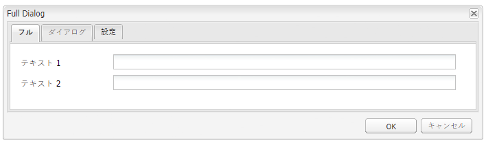

#### 例 2：Single Panel ダイアログ {#example-single-panel-dialog}

**Single Panel** ダイアログには、1 つのタブを持つウィンドウが表示されます。このタブには、2 つのテキストフィールドがあります。特性は次のとおりです。

* Displays 1 tab (node type = `cq:Dialog`, xtype = ` [panel](/help/sites-developing/xtypes.md#panel)`)
* The tab has 2 textfields (node type = `cq:Widget`, xtype = ` [textfield](/help/sites-developing/xtypes.md#textfield)`)
* ノードによって定義されます：
   `/apps/extjstraining/components/dialogbasics/singlepanel`
* 次を要求することにより、JSON 形式でレンダリングされます。
   `https://localhost:4502/apps/extjstraining/components/dialogbasics/singlepanel.-1.json`
* **Full ダイアログ**&#x200B;の利点の 1 つは、必要な設定が少ないことです。
* 推奨される用途：情報を表示するだけの、またはフィールドが数個しかない単純なダイアログ。

Single Panel ダイアログを使用するには：

1. **Dialog Basics** コンポーネントのダイアログを **Single Panel** ダイアログに置き換えます。
   1. In **CRXDE Lite**, delete the node: `/apps/extjstraining/components/dialogbasics/dialog`
   1. 「**すべて保存**」をクリックして変更を保存します。
   1. Copy the node: `/apps/extjstraining/components/dialogbasics/singlepanel`
   1. Paste the copied node below: `/apps/extjstraining/components/dialogbasics`
   1. ノードを選択します。 `/apps/extjstraining/components/dialogbasics/Copy of singlepanel`名前を変更し `dialog`ます。
1. コンポーネントを編集します。次のようなダイアログが表示されます。

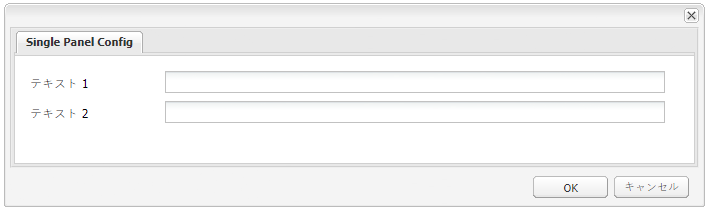

#### 例 3：Multi Panel ダイアログ {#example-multi-panel-dialog}

**Multi Panel** ダイアログは、**Full** ダイアログと同じ表示内容ですが、ダイアログの作成の仕方が異なります。特性は次のとおりです。

* Is defined by a node (node type = `cq:Dialog`, xtype = ` [tabpanel](/help/sites-developing/xtypes.md#tabpanel)`).
* Displays 3 tabs (node type = `cq:Panel`).
* Each tab has 2 textfields (node type = `cq:Widget`, xtype = ` [textfield](/help/sites-developing/xtypes.md#textfield)`).
* ノードによって定義されます：
   `/apps/extjstraining/components/dialogbasics/multipanel`
* 次を要求することにより、JSON 形式でレンダリングされます。
   `https://localhost:4502/apps/extjstraining/components/dialogbasics/multipanel.-1.json`
* **Full ダイアログ**&#x200B;の利点の一つは、構造が簡単であることです。
* 推奨される用途：複数のタブを持つダイアログ。

マルチパネルダイアログを使用するには：

1. Replace the dialog of the **Dialog Basics** component with the **Multi Panel** dialog:
follow the steps described for the [Example 2: Single Panel Dialog](#example-single-panel-dialog)
1. コンポーネントを編集します。次のようなダイアログが表示されます。

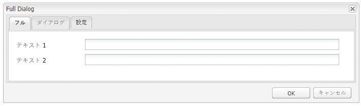

#### 例 4：Rich ダイアログ {#example-rich-dialog}

**Rich** ダイアログには、2 つのタブを持つウィンドウが表示されます。最初のタブには、テキストフィールド、ドロップダウンメニューおよび折り畳み可能なテキスト領域があります。2 番目のタブには、4 つのテキストフィールドを含むフィールドセットと、2 つのテキストフィールドを含む折り畳み可能なフィールドセットがあります。特性は次のとおりです。

* Is defined by a node (node type = `cq:Dialog`, xtype = ` [dialog](/help/sites-developing/xtypes.md#dialog)`).
* Displays 2 tabs (node type = `cq:Panel`).
* The first tab has a ` [dialogfieldset](/help/sites-developing/xtypes.md#dialogfieldset)` widget with a ` [textfield](/help/sites-developing/xtypes.md#textfield)` and a ` [selection](/help/sites-developing/xtypes.md#selection)` widget with 3 options, and a collapsible ` [dialogfieldset](/help/sites-developing/xtypes.md#dialogfieldset)` with a ` [textarea](/help/sites-developing/xtypes.md#textarea)` widget.
* The second tab has a ` [dialogfieldset](/help/sites-developing/xtypes.md#dialogfieldset)` widget with 4 ` [textfield](/help/sites-developing/xtypes.md#textfield)` widgets, and a collapsible `dialogfieldset` with 2 ` [textfield](/help/sites-developing/xtypes.md#textfield)` widgets.
* ノードによって定義されます：
   `/apps/extjstraining/components/dialogbasics/rich`
* 次を要求することにより、JSON 形式でレンダリングされます。
   `https://localhost:4502/apps/extjstraining/components/dialogbasics/rich.-1.json`

**Rich** ダイアログを使用するには：

1. Replace the dialog of the **Dialog Basics** component with the **Rich** dialog:
follow the steps described for the [Example 2: Single Panel Dialog](#example-single-panel-dialog)
1. コンポーネントを編集します。次のようなダイアログが表示されます。

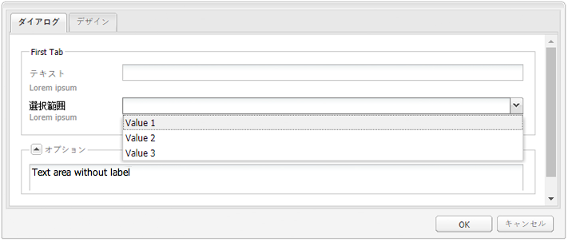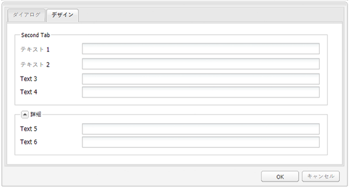

### Dynamic Dialogs {#dynamic-dialogs}

サイドキックにある **Using ExtJS Widgets** グループの 2 番目のコンポーネントは、**2.Dynamic Dialogs** という名前で、3 つの動的ダイアログが含まれています。これらのダイアログは、すぐに使用できるウィジェットと、**カスタマイズされた Javascript ロジック**&#x200B;から作成されています。The dialogs are stored below `/apps/extjstraining/components/dynamicdialogs`. 動的なダイアログボックスは次のとおりです。

* Switch Tabs ダイアログ（`switchtabs` ノード）：2 つのタブを持つウィンドウが表示されます。最初のタブでは、ラジオボタンにより、3 つのオプションのいずれかを選択できます。オプションを選択すると、選択したオプションに関連付けられているタブが表示されます。2 番目のタブには、2 つのテキストフィールドがあります。
*  ダイアログ（`arbitrary`arbitrary ノード）：1 つのタブを持つウィンドウが表示されます。このタブには、2 つのフィールドがあります。一つは、アセットをドロップまたはアップロードするためのフィールド、もう一つは、コンポーネントを含むページに関する情報とアセットに関する情報（アセットが参照されている場合）を表示するフィールドです。
* the Toggle Fields dialog ( `togglefield` node): it displays a window with one tab. このタブには、1 つのチェックボックスがあります。このチェックボックスを選択すると、2 つのテキストフィールドを含むフィールドセットが表示されます。

To include the **2. Dynamic Dialogs** コンポーネントをサンプルページに組み込むには：

1. **2.  Dynamic Dialogs** コンポーネントをサンプルページに追加します（**サイドキック**&#x200B;にある「**Using ExtJS Widgets**」タブから）。
1. このコンポーネントには、タイトル、テキストおよび&#x200B;**プロパティ**&#x200B;リンクが表示されます。リンクをクリックすると、リポジトリに保存されている段落のプロパティが表示されます。リンクをもう一度クリックすると、プロパティが非表示になります。

このコンポーネントは、次のように表示されます。


#### 例 1：Switch Tabs ダイアログ {#example-switch-tabs-dialog}

**Switch Tabs** ダイアログには、2 つのタブを持つウィンドウが表示されます。最初のタブでは、ラジオボタンにより、3 つのオプションのいずれかを選択できます。オプションを選択すると、選択したオプションに関連付けられているタブが表示されます。2 番目のタブには、2 つのテキストフィールドがあります。

このダイアログの主な特徴を次に示します。

* Is defined by a node (node type = `cq:Dialog`, xtype = ` [dialog](/help/sites-developing/xtypes.md#dialog)`).
* Displays 2 tabs (node type = `cq:Panel`): 1 selection tab, the 2nd tab depends on the selection in the 1st tab (3 options).
* Has 3 optional tabs (node type = `cq:Panel`), each one has 2 textfields (node type = `cq:Widget`, xtype = ` [textfield](/help/sites-developing/xtypes.md#textfield)`). 「オプション」タブは、同時に 1 つしか表示されません。
* Is defined by the `switchtabs` node at:
   `/apps/extjstraining/components/dynamicdialogs/switchtabs`
* 次を要求することにより、JSON 形式でレンダリングされます。
   `https://localhost:4502/apps/extjstraining/components/dynamicdialogs/switchtabs.-1.json`

ロジックは、次のようにイベントリスナーと Javascript コードによって実装されています。

* The dialog node has a &quot; `beforeshow`&quot; listener that hides all the optional tabs before the dialog is shown:
   `beforeshow="function(dialog){Ejst.x2.manageTabs(dialog.items.get(0));}"`

   `dialog.items.get(0)` 選択パネルと3つのオプションパネルを含むタブパネルを取得します。
* The `Ejst.x2` object is defined in the `exercises.js` file at:
   `/apps/extjstraining/clientlib/js/exercises.js`
* In the `Ejst.x2.manageTabs()` method, as the value of `index` is -1, all the optional tabs are hidden (i goes from 1 to 3).
* 「選択範囲」タブには、2 つのリスナーがあります。一つは、ダイアログのロード（「`loadcontent`」イベント）時に選択済みのタブを表示するリスナー、もう一つは、選択内容の変更（「`selectionchanged`」イベント）時に選択済みのタブを表示するリスナーです。
   `loadcontent="function(field,rec,path){Ejst.x2.showTab(field);}"`

   `selectionchanged="function(field,value){Ejst.x2.showTab(field);}"`
* メソッドで次の操作を `Ejst.x2.showTab()` 行います。
   `field.findParentByType('tabpanel')` すべてのタブを含む(選択ウィジェットを `field` 表す)タブパネルを取得します
   `field.getValue()` 選択範囲の値を取得します。例：tab2
   `Ejst.x2.manageTabs()` 選択したタブを表示します。
* 各「オプション」タブには、「`render`」イベントでタブを非表示にするリスナーがあります。
   `render="function(tab){Ejst.x2.hideTab(tab);}"`
* メソッドで次の操作を `Ejst.x2.hideTab()` 行います。
   `tabPanel` は、すべてのタブを含むタブパネルです
   `index` は、オプションのタブのインデックスです
   `tabPanel.hideTabStripItem(index)` タブを非表示

次のように表示されます。

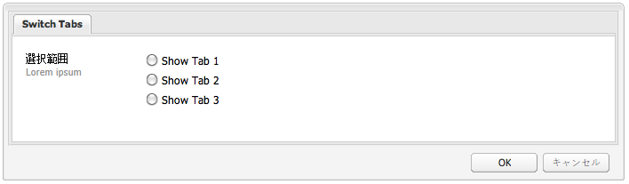

#### 例 2：Arbitrary ダイアログ {#example-arbitrary-dialog}

ほとんどの場合、ダイアログには、基になるコンポーネントからのコンテンツが表示されます。ここで説明する **Arbitrary** ダイアログは、別のコンポーネントからコンテンツを取り込みます。

**Arbitrary** ダイアログには、1 つのタブを持つウィンドウが表示されます。このタブには、2 つのフィールドがあります。一つは、アセットをドロップまたはアップロードするためのフィールド、もう一つは、コンポーネントを含むページに関する情報とアセットに関する情報（アセットが参照されている場合）を表示するフィールドです。

このダイアログの主な特徴を次に示します。

* Is defined by a node (node type = `cq:Dialog`, xtype = ` [dialog](/help/sites-developing/xtypes.md#dialog)`).
* Displays 1 tabpanel widget (node type = `cq:Widget`, xtype = ` [tabpanel](/help/sites-developing/xtypes.md#tabpanel)`) with 1 panel (node type = `cq:Panel`)
* The panel has a smartfile widget (node type = `cq:Widget`, xtype = ` [smartfile](/help/sites-developing/xtypes.md#smartfile)`) and an ownerdraw widget (node type = `cq:Widget`, xtype = ` [ownerdraw](/help/sites-developing/xtypes.md#ownerdraw)`)
* Is defined by the `arbitrary` node at:
   `/apps/extjstraining/components/dynamicdialogs/arbitrary`
* 次を要求することにより、JSON 形式でレンダリングされます。
   `https://localhost:4502/apps/extjstraining/components/dynamicdialogs/arbitrary.-1.json`

ロジックは、次のようにイベントリスナーと Javascript コードによって実装されています。

* The ownerdraw widget has a &quot; `loadcontent`&quot; listener that shows info about the page containing the component and the asset referenced by the smartfile widget when the content is loaded:
   `loadcontent="function(field,rec,path){Ejst.x2.showInfo(field,rec,path);}"`

   `field` はownerdrawオブジェクトで設定されます。
   `path` がコンポーネントのコンテンツパスで設定される場合(例：/content/geometrixx/jp/products/triangle/ui-tutorial/jcr:content/par/dynamicdialogs)
* The `Ejst.x2` object is defined in the `exercises.js` file at:
   `/apps/extjstraining/clientlib/js/exercises.js`
* メソッドで次の操作を `Ejst.x2.showInfo()` 行います。
   `pagePath` は、コンポーネントを含むページのパスです
   `pageInfo` json形式のページプロパティを表します。
   `reference` は、参照されるアセットのパスです。
   `metadata` アセットのメタデータをjson形式で表します。
   `ownerdraw.getEl().update(html);` 作成したhtmlをダイアログに表示します。

**Arbitrary** ダイアログを使用するには：

1. Replace the dialog of the **Dynamic Dialog** component with the **Arbitrary** dialog:
follow the steps described for the [Example 2: Single Panel Dialog](#example-single-panel-dialog)
1. コンポーネントを編集します。次のようなダイアログが表示されます。

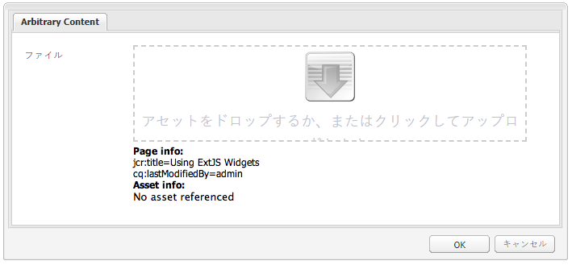

#### 例 3：Toggle Fields ダイアログ {#example-toggle-fields-dialog}

**Toggle Fields** ダイアログには、1 つのタブを持つウィンドウが表示されます。このタブには、1 つのチェックボックスがあります。このチェックボックスを選択すると、2 つのテキストフィールドを含むフィールドセットが表示されます。

このダイアログの主な特徴を次に示します。

* Is defined by a node (node type = `cq:Dialog`, xtype = ` [dialog](/help/sites-developing/xtypes.md#dialog)`).
* Displays 1 tabpanel widget (node type = `cq:Widget`, xtype = ` [tabpanel](/help/sites-developing/xtypes.md#textpanel)`) with 1 panel (node type = `cq:Panel`).
* The panel has a selection/checkbox widget (node type = `cq:Widget`, xtype = ` [selection](/help/sites-developing/xtypes.md#selection)`, type = ` [checkbox](/help/sites-developing/xtypes.md#checkbox)`) and a collapsible dialogfieldset widget (node type = `cq:Widget`, xtype = ` [dialogfieldset](/help/sites-developing/xtypes.md#dialogfieldset)`) that is hidden by default, with 2 textfield widgets (node type = `cq:Widget`, xtype = ` [textfield](/help/sites-developing/xtypes.md#textfield)`).
* Is defined by the `togglefields` node at:
   `/apps/extjstraining/components/dynamicdialogs/togglefields`
* 次を要求することにより、JSON 形式でレンダリングされます。
   `https://localhost:4502/apps/extjstraining/components/dynamicdialogs/togglefields.-1.json`

ロジックは、次のようにイベントリスナーと Javascript コードによって実装されています。

* the selection tab has 2 listeners: one that shows the dialogfieldset when the content is loaded (&quot; `loadcontent`&quot; event) and one that shows the dialogfieldset when the selection is changed (&quot; `selectionchanged`&quot; event):
   `loadcontent="function(field,rec,path){Ejst.x2.toggleFieldSet(field);}"`

   `selectionchanged="function(field,value){Ejst.x2.toggleFieldSet(field);}"`
* The `Ejst.x2` object is defined in the `exercises.js` file at:
   `/apps/extjstraining/clientlib/js/exercises.js`
* メソッドで次の操作を `Ejst.x2.toggleFieldSet()` 行います。
   `box` は選択オブジェクトです。
   `panel` は、選択範囲とダイアログフィールドセットウィジェットを含むパネルです
   `fieldSet` は、dialogfieldsetオブジェクトです。
   `show` は、ダイアログフィールドセットが表示されるか、表示されないかを「 `show`」に基づいて、選択範囲の値（trueまたはfalse）です

To use the **Toggle Fields** dialog:

1. Replace the dialog of the **Dynamic Dialog** component with the **Toggle Fields** dialog:
follow the steps described for the [Example 2: Single Panel Dialog](#example-single-panel-dialog)
1. コンポーネントを編集します。次のようなダイアログが表示されます。

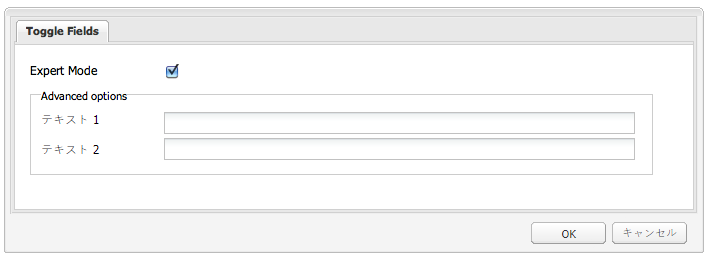

### カスタムウィジェット {#custom-widgets}

AEM に付属しているすぐに使用できるウィジェットは、ほとんどのケースに対応できます。ただし、プロジェクト固有の要件をカバーするカスタムウィジェットを作成する必要が生じる場合があります。 カスタムウィジェットは、既存のウィジェットを拡張して作成できます。こうしたカスタマイズをおこなう際の手助けとなるように、**Using ExtJS Widgets** パッケージには、3 つの異なるカスタムウィジェットを使用する 3 つのダイアログが含まれています。

* Multi Field ダイアログ（`multifield` ノード）。1 つのタブを持つウィンドウが表示されます。このタブには、カスタマイズされた multifield ウィジェットがあり、2 つのオプションを選択できるドロップダウンメニューとテキストフィールドという 2 つのフィールドが含まれています。このタブは、すぐに使用できる `multifield` ウィジェット（テキストフィールドのみを持つ）に基づいているので、`multifield` ウィジェットの機能をすべて使用できます。
* Tree Browse ダイアログ（`treebrowse` ノード）。このダイアログに表示されるウィンドウには、パス参照ウィジェットを含む 1 つのタブがあります。このウィジェットで矢印をクリックすると、ウィンドウが開き、階層を参照しながら項目を選択できます。項目を選択すると、そのパスがパスフィールドに追加され、ダイアログを閉じても保持され続けます。
* リッチテキストエディタープラグインベースのダイアログ（`rteplugin` ノード）。リッチテキストエディターにカスタムボタンを追加したもので、メインテキストにカスタムテキストを挿入できます。`richtext` ウィジェット（RTE）と、RTE プラグインメカニズムを通じて追加されたカスタム機能から構成されています。

カスタムウィジェットとプラグインは、**3.Custom Widgets**（**Using ExtJS Widgets** パッケージに属する）という名前のコンポーネントに含まれています。このコンポーネントをサンプルページに組み込むには：

1. **3.  Custom Widgets** コンポーネントをサンプルページに追加します（**サイドキック**&#x200B;にある「**Using ExtJS Widgets**」タブから）。
1. このコンポーネントには、タイトルとテキストが表示されます。また、**プロパティ**&#x200B;リンクをクリックすると、リポジトリに保存されている段落のプロパティも表示されます。リンクをもう一度クリックすると、プロパティが非表示になります。このコンポーネントは、次のように表示されます。


#### 例 1：Custom Multifield ウィジェット {#example-custom-multifield-widget}

**Custom Multifield** ウィジェットベースのダイアログには、1 つのタブを持つウィンドウが表示されます。このタブには、カスタマイズされた multifield ウィジェットがあります。標準の multifield ウィジェットには 1 つのフィールドがありますが、このウィジェットには、2 つのオプションを選択できるドロップダウンメニューとテキストフィールドという 2 つのフィールドがあります。

**Custom Multifield** ウィジェットベースのダイアログ：

* Is defined by a node (node type = `cq:Dialog`, xtype = ` [dialog](/help/sites-developing/xtypes.md#dialog)`).
* Displays 1 tabpanel widget (node type = `cq:Widget`, xtype = ` [tabpanel](/help/sites-developing/xtypes.md#tabpanel)`) containing a panel (node type = `cq:Widget`, xtype = ` [panel](/help/sites-developing/xtypes.md#panel)`).
* The panel has a `multifield` widget (node type = `cq:Widget`, xtype = ` [multifield](/help/sites-developing/xtypes.md#multifield)`).
* The `multifield` widget has a fieldconfig (node type = `nt:unstructured`, xtype = `ejstcustom`, optionsProvider = `Ejst.x3.provideOptions`) that is based on the custom xtype &#39; `ejstcustom`&#39;:
   * &#39; `fieldconfig`&#39; is a config option of the ` [CQ.form.MultiField](https://helpx.adobe.com/experience-manager/6-5/sites/developing/using/reference-materials/widgets-api/index.html?class=CQ.form.MultiField)` object.
   * &#39; `optionsProvider`&#39; is a configuration of the `ejstcustom` widget. It is set with the `Ejst.x3.provideOptions` method which is defined in `exercises.js` at:
      `/apps/extjstraining/clientlib/js/exercises.js`
2つのオプションを返します。
* Is defined by the `multifield` node at:
   `/apps/extjstraining/components/customwidgets/multifield`
* 次を要求することにより、JSON 形式でレンダリングされます。
   `https://localhost:4502/apps/extjstraining/components/customwidgets/multifield.-1.json`

Custom Multifield ウィジェット（xtype = `ejstcustom`）：

* `Ejst.CustomWidget` という名前の Javascript オブジェクトです。
* 次の場所にある `CustomWidget.js` Javascript ファイルで定義されます。
   `/apps/extjstraining/clientlib/js/CustomWidget.js`
* Extends the ` [CQ.form.CompositeField](https://helpx.adobe.com/experience-manager/6-5/sites/developing/using/reference-materials/widgets-api/index.html?class=CQ.form.CompositeField)` widget.
* Has 3 fields: `hiddenField` (Textfield), `allowField` (ComboBox) and `otherField` (Textfield)
* Overrides `CQ.Ext.Component#initComponent` to add the 3 fields:
   * `allowField` は、 [CQ.form.Selection](https://helpx.adobe.com/experience-manager/6-5/sites/developing/using/reference-materials/widgets-api/index.html?class=CQ.form.Selection) オブジェクトのタイプが「select」です。 optionsProviderは、ダイアログで定義されたCustomWidgetのoptionsProvider設定でインスタンス化されたSelectionオブジェクトの設定です
   * `otherField` は、[CQ.Ext.form.TextField](https://helpx.adobe.com/experience-manager/6-5/sites/developing/using/reference-materials/widgets-api/index.html?class=CQ.Ext.form.TextField) オブジェクトです。
* Overrides the methods `setValue`, `getValue` and `getRawValue` of [CQ.form.CompositeField](https://helpx.adobe.com/experience-manager/6-5/sites/developing/using/reference-materials/widgets-api/index.html?class=CQ.form.CompositeField) in order to set and retrieve the value of CustomWidget with the format:
   `<allowField value>/<otherField value>, e.g.: 'Bla1/hello'`.
* Registers itself as &#39; `ejstcustom`&#39; xtype:
   `CQ.Ext.reg('ejstcustom', Ejst.CustomWidget);`

**Custom Multifield** ウィジェットベースのダイアログは、次のように表示されます。

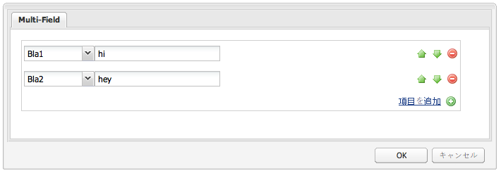

#### 例 2：カスタム Treebrowse ウィジェット {#example-custom-treebrowse-widget}

カスタム **Treebrowse** ウィジェットベースのダイアログには、1 つのタブを持つウィンドウが表示されます。このタブには、カスタムパス参照ウィジェットが含まれています。このウィジェットで矢印をクリックすると、ウィンドウが開き、階層を参照しながら項目を選択できます。項目を選択すると、そのパスがパスフィールドに追加され、ダイアログを閉じても保持され続けます。

カスタム treebrowse ダイアログ：

* Is defined by a node (node type = `cq:Dialog`, xtype = ` [dialog](/help/sites-developing/xtypes.md#dialog)`).
* Displays 1 tabpanel widget (node type = `cq:Widget`, xtype = ` [tabpanel](/help/sites-developing/xtypes.md#tabpanel)`) containing a panel (node type = `cq:Widget`, xtype = ` [panel](/help/sites-developing/xtypes.md#panel)`).
* The panel has a custom widget (node type = `cq:Widget`, xtype = `ejstbrowse`)
* Is defined by the `treebrowse` node at:
   `/apps/extjstraining/components/customwidgets/treebrowse`
* 次を要求することにより、JSON 形式でレンダリングされます。
   `https://localhost:4502/apps/extjstraining/components/customwidgets/treebrowse.-1.json`

カスタム treebrowse ウィジェット（xtype = `ejstbrowse`）：

* `Ejst.CustomWidget` という名前の Javascript オブジェクトです。
* 次の場所にある `CustomBrowseField.js` Javascript ファイルで定義されます。
   `/apps/extjstraining/clientlib/js/CustomBrowseField.js`
* Extends ` [CQ.Ext.form.TriggerField](https://helpx.adobe.com/experience-manager/6-5/sites/developing/using/reference-materials/widgets-api/index.html?class=CQ.Ext.form.TriggerField)`.
* `browseWindow` という名前の参照ウィンドウを定義します。
* Overrides ` [CQ.Ext.form.TriggerField](https://helpx.adobe.com/experience-manager/6-5/sites/developing/using/reference-materials/widgets-api/index.html?class=CQ.Ext.form.TriggerField)#onTriggerClick` to show the browse window when the arrow is clicked.
* [CQ.Ext.tree.TreePanel](https://helpx.adobe.com/experience-manager/6-5/sites/developing/using/reference-materials/widgets-api/index.html?class=CQ.Ext.tree.TreePanel) オブジェクトを定義します。
   * It gets its data by calling the servlet registered at `/bin/wcm/siteadmin/tree.json`.
   * Its root is &quot; `apps/extjstraining`&quot;.
* Defines a `window` object ( ` [CQ.Ext.Window](https://helpx.adobe.com/experience-manager/6-5/sites/developing/using/reference-materials/widgets-api/index.html?class=CQ.Ext.Window)`):
   * 事前定義済みのパネルに基づいています。
   * 選択されたパスの値を設定し、パネルを非表示にする「**OK**」ボタンを組み込みます。
* ウィンドウは、「**パス**」フィールドの下に固定されます。
* 選択されたパスは、`show` イベントが発生したときに、参照フィールドからウィンドウに渡されます。
* Registers itself as &#39; `ejstbrowse`&#39; xtype:
   `CQ.Ext.reg('ejstbrowse', Ejst.CustomBrowseField);`

To use the **Custom Treebrowse** widget based dialog:

1. Replace the dialog of the **Custom Widgets** component with the **Custom Treebrowse** dialog:
follow the steps described for the [Example 2: Single Panel Dialog](#example-single-panel-dialog)
1. コンポーネントを編集します。次のようなダイアログが表示されます。

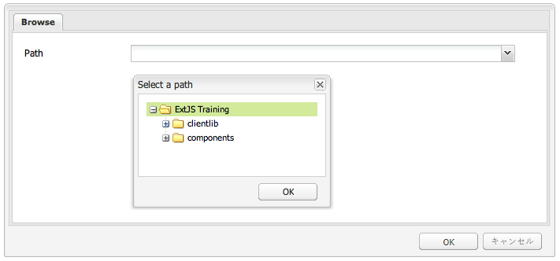

#### 例 3：リッチテキストエディター（RTE）プラグイン {#example-rich-text-editor-rte-plug-in}

**リッチテキストエディター（RTE）プラグイン**&#x200B;ベースのダイアログは、大括弧内にカスタムテキストを挿入するためのカスタムボタンがあるリッチテキストエディターベースのダイアログです。カスタムテキストをサーバー側ロジックで解析し、例えば、特定のパスで定義されたテキストを追加することができます（この例では、サーバー側ロジックは実装されていません）。

**RTE プラグイン**&#x200B;ベースのダイアログ：

* は次の場所にあるrtepluginノードによって定義されます。
   `/apps/extjstraining/components/customwidgets/rteplugin`
* 次を要求することにより、JSON 形式でレンダリングされます。
   `https://localhost:4502/apps/extjstraining/components/customwidgets/rteplugin.-1.json`
* The `rtePlugins` node has a child node `inserttext` (node type = `nt:unstructured`) that is named after the plugin. このノードには、RTE で使用可能なプラグイン機能を定義する `features` という名前のプロパティがあります。

RTE プラグイン：

* `Ejst.InsertTextPlugin` という名前の Javascript オブジェクトです。
* 次の場所にある `InsertTextPlugin.js` Javascript ファイルで定義されます。
   `/apps/extjstraining/clientlib/js/InsertTextPlugin.js`
* Extends the ` [CQ.form.rte.plugins.Plugin](https://helpx.adobe.com/experience-manager/6-5/sites/developing/using/reference-materials/widgets-api/index.html?class=CQ.form.rte.plugins.Plugin)` object.
* 次のメソッドは、` [CQ.form.rte.plugins.Plugin](https://helpx.adobe.com/experience-manager/6-5/sites/developing/using/reference-materials/widgets-api/index.html?class=CQ.form.rte.plugins.Plugin)` オブジェクトを定義するもので、プラグインの実装時に上書きされます。
   * `getFeatures()` プラグインが提供するすべての機能の配列を返します。
   * `initializeUI()` [RTE]ツールバーに新しいボタンを追加します。
   * `notifyPluginConfig()` ボタンにカーソルを合わせたときに、タイトルとテキストを表示します。
   * `execute()` が呼び出され、プラグインのアクションが実行されます。含めるテキストの定義に使用するウィンドウが表示されます。
* `insertText()` 対応するダイアログオブジェクトを使用してテキストを挿入し `Ejst.InsertTextPlugin.Dialog` ます（後述の説明を参照）。
* `executeInsertText()` が呼び出されます。このメソッドは、「 `apply()` OK **** 」ボタンがクリックされたときにトリガされます。
* Registers itself as &#39; `inserttext`&#39; plugin:
   `CQ.form.rte.plugins.PluginRegistry.register("inserttext", Ejst.InsertTextPlugin);`
* `Ejst.InsertTextPlugin.Dialog` オブジェクトは、プラグインのボタンがクリックされたときに開くダイアログを定義します。このダイアログは、1 つのパネル、1 つのフォーム、1 つのテキストフィールドおよび 2 つのボタン（「**OK**」と「**キャンセル**」）から構成されます。

**リッチテキストエディター（RTE）プラグイン**&#x200B;ベースのダイアログを使用するには：

1. **Custom Widgets** コンポーネントのダイアログを&#x200B;**リッチテキストエディター（RTE）プラグイン**&#x200B;ベースのダイアログに置き換えます。[例 2：Single Panel ダイアログ](#example-single-panel-dialog)で説明されている手順に従います。
1. コンポーネントを編集します。
1. 右側の最後のアイコン（4つの矢印の付いたアイコン）をクリックします。 Enter a path and click **OK**:
The path is displayed within brackets ([ ]).
1. 「**OK**」をクリックしてリッチテキストエディターを閉じます。

**リッチテキストエディター（RTE）プラグイン**&#x200B;ベースのダイアログは、次のように表示されます。

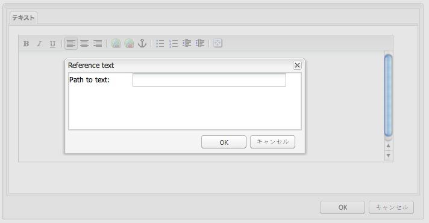

>[!NOTE]
>
>This example only shows how to implement the client-side part of the logic: the placeholders (*[text]*) have then to be parsed on the server-side explicitly (e.g. in the component JSP).

### Tree Overview {#tree-overview}

すぐに使用できる ` [CQ.Ext.tree.TreePanel](https://helpx.adobe.com/experience-manager/6-5/sites/developing/using/reference-materials/widgets-api/index.html?class=CQ.Ext.tree.TreePanel)` オブジェクトは、ツリー構造のデータをツリー構造 UI として表示できます。**Using ExtJS Widgets** パッケージに含まれている Tree Overview コンポーネントを見ると、`TreePanel` オブジェクトを使用して特定のパスの下に JCR ツリーを表示する方法がわかります。このウィンドウ自体は、ドッキングすることも、ドッキング解除することもできます。この例の場合、ウィンドウのロジックは、コンポーネント jsp の &lt;script> タグと &lt;/script> タグの間に埋め込まれています。

**Tree Overview** コンポーネントをサンプルページに組み込むには：

1. **4.  Tree Overview** コンポーネントをサンプルページに追加します（**サイドキック**&#x200B;にある「**Using ExtJS Widgets**」タブで）。
1. このコンポーネントには、次のものが表示されます。
   * タイトルとテキスト
   * **プロパティ**&#x200B;リンク。クリックすると、リポジトリに保存されている段落のプロパティが表示されます。リンクをもう一度クリックすると、プロパティが非表示になります。
   * リポジトリをツリーで表現した浮動ウィンドウ。このツリーは展開可能です。

このコンポーネントは、次のように表示されます。


Tree Overview コンポーネント：

* 次で定義されます。
   `/apps/extjstraining/components/treeoverview`

* このコンポーネントのダイアログでは、ウィンドウサイズの設定やウィンドウのドッキング、ドッキング解除が可能です（以下を参照）。

コンポーネント jsp：

* リポジトリから幅、高さ、ドッキングの各プロパティを取得します。
* ツリー概要のデータ形式に関するテキストを表示します。
* ウィンドウのロジックをコンポーネント jsp の Javascript タグの間に埋め込みます。
* 次で定義されます。
   `apps/extjstraining/components/treeoverview/content.jsp`

コンポーネント jsp に埋め込まれた Javascript コード：

* ページからツリーウィンドウの取得を試みることにより、`tree` オブジェクトを定義します。
* If the window displaying the tree does not exist, `treePanel` ([CQ.Ext.tree.TreePanel](https://helpx.adobe.com/experience-manager/6-5/sites/developing/using/reference-materials/widgets-api/index.html?class=CQ.Ext.tree.TreePanel)) is created:
   * `treePanel` には、ウィンドウの作成に使用されるデータが含まれています。
   * データは、次で登録されたサーブレットを呼び出すことにより、取得されます。
      `/bin/wcm/siteadmin/tree.json`
* The `beforeload` listener makes sure the clicked node is loaded.
* The `root` object sets the path `apps/extjstraining` as the tree root.
* `tree` ( ` [CQ.Ext.Window](https://helpx.adobe.com/experience-manager/6-5/sites/developing/using/reference-materials/widgets-api/index.html?class=CQ.Ext.Window)`)は、事前定義済みに基づいて設定され `treePanel`、次の項目で表示されます。
   `tree.show();`
* ウィンドウが既に存在する場合、ウィンドウは、リポジトリから取得した幅、高さ、ドッキングの各プロパティに基づいて表示されます。

コンポーネントダイアログ：

* ツリー概要ウィンドウのサイズ（幅と高さ）を設定するための 2 つのフィールドとウィンドウをドッキング、ドッキング解除するための 1 つのフィールドを持つ 1 つのタブを表示します。
* Is defined by a node (node type = `cq:Dialog`, xtype = ` [panel](/help/sites-developing/xtypes.md#panel)`).
* The panel has a sizefield widget (node type = `cq:Widget`, xtype = ` [sizefield](/help/sites-developing/xtypes.md#sizefield)`) and a selection widget (node type = `cq:Widget`, xtype = ` [selection](/help/sites-developing/xtypes.md#selection)`, type = `radio`) with 2 options (true/false)
* は、次の場所にあるダイアログノードで定義されます。
   `/apps/extjstraining/components/treeoverview/dialog`
* 次を要求することにより、JSON 形式でレンダリングされます。
   `https://localhost:4502/apps/extjstraining/components/treeoverview/dialog.-1.json`
* 次のように表示されます。

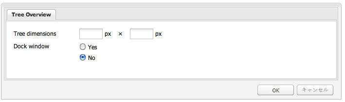

### Grid Overview {#grid-overview}

グリッドパネルには、データが行と列の表形式で表示されます。このパネルは、次の内容から構成されています。

* ストア：データレコード（行）を保持しているモデル。
* 列モデル：列の構成。
* ビュー：ユーザーインターフェイスが含まれます。
* 選択モデル：選択の動作。

The Grid Overview component included in the **Using ExtJS Widgets** package shows how to display data in a tabular format:

* 例 1 では、静的データを使用しています。
* 例2では、リポジトリから取得したデータを使用します。

グリッドの概要コンポーネントをサンプルページに含めるには：

1. **5.  Grid Overview** コンポーネントをサンプルページに追加します（**サイドキック**&#x200B;にある「**Using ExtJS Widgets**」タブで）。
1. このコンポーネントには、次のものが表示されます。
   * タイトルとテキスト
   * **プロパティ**&#x200B;リンク。クリックすると、リポジトリに保存されている段落のプロパティが表示されます。リンクをもう一度クリックすると、プロパティが非表示になります。
   * 表形式のデータを含む浮動ウィンドウ。

このコンポーネントは、次のように表示されます。


#### 例 1：デフォルトグリッド {#example-default-grid}

すぐに使用できるバージョンの場合、**Grid Overview** コンポーネントには、静的データが表形式で含まれているウィンドウが表示されます。この例の場合、ロジックは、コンポーネント jsp に 次の 2 つの方法で埋め込まれます。

* 一般的なロジックは、&lt;script> タグと &lt;/script> タグの間に定義されます。
* 特定のロジックは、個別の .js ファイルで用意され、jsp にリンクされます。このような設定であるので、&lt;script> タグを必要に応じてコメント化すれば、2 つのロジック（静的／動的）を簡単に切り替えることができます。

Grid Overview コンポーネント：

* 次で定義されます。
   `/apps/extjstraining/components/gridoverview`
* このコンポーネントのダイアログでは、ウィンドウサイズの設定やウィンドウのドッキング、ドッキング解除が可能です。

コンポーネント jsp：

* リポジトリから幅、高さ、ドッキングの各プロパティを取得します。
* グリッド概要のデータ形式の紹介としてテキストを表示します。
* GridPanel オブジェクトを定義する Javascript コードを参照します。
   `<script type="text/javascript" src="/apps/extjstraining/components/gridoverview/defaultgrid.js"></script>`

   `defaultgrid.js` は、GridPanelオブジェクトの基本として静的データを定義します。
* GridPanel オブジェクトを使用する Window オブジェクトを Javascript コードで定義して、Javascript タグの間に埋め込みます。
* 次で定義されます。
   `apps/extjstraining/components/gridoverview/content.jsp`

コンポーネント jsp に埋め込まれた Javascript コード：

* ページからウィンドウコンポーネントの取得を試みることにより、`grid` オブジェクトを定義します。
   `var grid = CQ.Ext.getCmp("<%= node.getName() %>-grid");`
* If `grid` does not exist, a [CQ.Ext.grid.GridPanel](https://helpx.adobe.com/experience-manager/6-5/sites/developing/using/reference-materials/widgets-api/index.html?class=CQ.Ext.grid.GridPanel) object ( `gridPanel`) is defined by calling the `getGridPanel()` method (see below). このメソッドは、`defaultgrid.js` で定義されます。
* `grid` は、事前定義済みのGridPanelに基づく ` [CQ.Ext.Window](https://helpx.adobe.com/experience-manager/6-5/sites/developing/using/reference-materials/widgets-api/index.html?class=CQ.Ext.Window)` オブジェクトで、次のように表示されます。 `grid.show();`
* `grid` が既に存在する場合、grid は、リポジトリから取得した幅、高さ、ドッキングの各プロパティに基づいて表示されます。

The javascript file ( `defaultgrid.js`) referenced in the component jsp defines the `getGridPanel()` method which is called by the script embedded in the JSP and returns a ` [CQ.Ext.grid.GridPanel](https://helpx.adobe.com/experience-manager/6-5/sites/developing/using/reference-materials/widgets-api/index.html?class=CQ.Ext.grid.GridPanel)` object, based on static data. ロジックを次に示します。

* `myData` は、静的データの配列で、5 列 x 4 行の表として書式設定されています。
* `store` は、使用する `CQ.Ext.data.Store` オブジェクトで `myData`す。
* `store` はメモリに読み込まれます。
   `store.load();`
* `gridPanel` は、次の処理を行う ` [CQ.Ext.grid.GridPanel](https://helpx.adobe.com/experience-manager/6-5/sites/developing/using/reference-materials/widgets-api/index.html?class=CQ.Ext.grid.GridPanel)` オブジェクトで `store`す。
   * 列幅は常に再調整されます。
      `forceFit: true`
   * 選択できる行は一度に 1 つのみです。
      `singleSelect:true`

#### 例 2：参照検索グリッド {#example-reference-search-grid}

When you install the package, the `content.jsp` of the **Grid Overview** component displays a grid that is based on static data. 次の特徴を持つグリッドを表示するようにコンポーネントを変更することが可能です。

* 3 つの列を持つ。
* サーブレットを呼び出すことにより、リポジトリから取得したデータを基礎にする。
* 最後の列のセルを編集できる。この値は、先頭の列に表示されたパスで定義されたノードの下にある `test` プロパティに保持されます。

As explained in the section before, the window object gets its ` [CQ.Ext.grid.GridPanel](https://helpx.adobe.com/experience-manager/6-5/sites/developing/using/reference-materials/widgets-api/index.html?class=CQ.Ext.grid.GridPanel)` object by calling the `getGridPanel()` method defined in the `defaultgrid.js` file at `/apps/extjstraining/components/gridoverview/defaultgrid.js`. 「**グリッドの概要**」コンポーネントは、 `getGridPanel()` メソッドに対して異なる実装を提供します。この実装は、にある `referencesearch.js` ファイルで定義され `/apps/extjstraining/components/gridoverview/referencesearch.js`ます。 コンポーネント jsp で参照される .js ファイルを切り替えることにより、グリッドは、リポジトリから取得したデータに基づくようになります。

コンポーネント jsp で参照される .js ファイルを切り替えます。

1. **CRXDE Lite** で、コンポーネントの `content.jsp` ファイル内にある `defaultgrid.js` ファイルを含む行をコメント化します。次のようになります。
   `<!-- script type="text/javascript" src="/apps/extjstraining/components/gridoverview/defaultgrid.js"></script-->`
1. `referencesearch.js` ファイルを含む行からコメントを削除します。次のようになります。
   `<script type="text/javascript" src="/apps/extjstraining/components/gridoverview/referencesearch.js"></script>`
1. 変更内容を保存します。
1. サンプルページを更新します。

このコンポーネントは、次のように表示されます。


The javascript code referenced in the component jsp ( `referencesearch.js`) defines the `getGridPanel()` method called from the component jsp and returns a ` [CQ.Ext.grid.GridPanel](https://helpx.adobe.com/experience-manager/6-5/sites/developing/using/reference-materials/widgets-api/index.html?class=CQ.Ext.grid.GridPanel)` object, based on data that are dynamically retrieved from the repository. `referencesearch.js` のロジックでは、一部の動的データが GridPanel の基礎として定義されています。

* `reader` は、JSON 形式のサーブレット応答を読み取る 3 列用の ` [CQ.Ext.data.JsonReader](https://helpx.adobe.com/experience-manager/6-5/sites/developing/using/reference-materials/widgets-api/index.html?class=CQ.Ext.data.JsonReader)` オブジェクトです。
* `cm` は、3列の ` [CQ.Ext.grid.ColumnModel](https://helpx.adobe.com/experience-manager/6-5/sites/developing/using/reference-materials/widgets-api/index.html?class=CQ.Ext.grid.ColumnModel)` オブジェクトです。
「テスト」列のセルは、editor で定義されているので、編集することが可能です。
   `editor: new [CQ.Ext.form.TextField](https://helpx.adobe.com/experience-manager/6-5/sites/developing/using/reference-materials/widgets-api/index.html?class=CQ.Ext.form.TextField)({})`
* 列は並べ替え可能です。
   `cm.defaultSortable = true;`
* `store` は ` [CQ.Ext.data.GroupingStore](https://helpx.adobe.com/experience-manager/6-5/sites/developing/using/reference-materials/widgets-api/index.html?class=CQ.Ext.data.GroupingStore)` オブジェクトです。
   * it gets its data by calling the servlet registered at &quot; `/bin/querybuilder.json`&quot; with a few parameters used to filter the query
   * 前に定義した `reader` に基づきます。
   * 表は、「**jcr:path**」列に従って、昇順で並べ替えられます。
* `gridPanel` は編集可能な ` [CQ.Ext.grid.EditorGridPanel](https://helpx.adobe.com/experience-manager/6-5/sites/developing/using/reference-materials/widgets-api/index.html?class=CQ.Ext.grid.EditorGridPanel)` オブジェクトです。
   * 事前定義済みの `store` と列モデル `cm` に基づいています。
   * 選択できる行は一度に 1 つのみです。
      `sm: new [CQ.Ext.grid.RowSelectionModel](https://helpx.adobe.com/experience-manager/6-5/sites/developing/using/reference-materials/widgets-api/index.html?class=CQ.Ext.grid.RowSelectionModel)({singleSelect:true})`
   * `afteredit` リスナーは、「**テスト**」列のセルが編集されたことを確認します。
      * the property &#39; `test`&#39; of the node at the path defined by the &quot;**jcr:path**&quot; column is set in the repository with the value of the cell
      * POST が成功した場合は、値が `store` オブジェクトに追加されます。POST が失敗した場合は、値が拒否されます。
