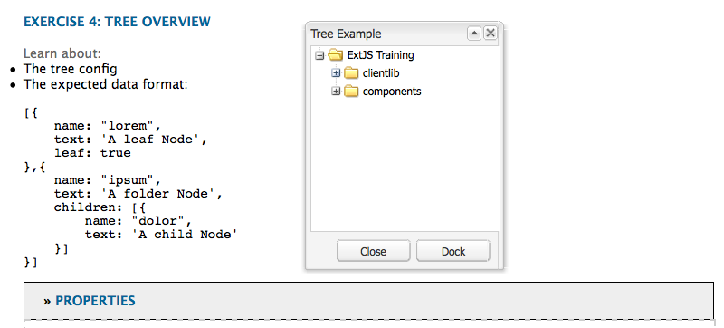

# ウィジェットの使用および拡張（クラシック UI）{#using-and-extending-widgets-classic-ui}

>[!NOTE]
>
>このページでは、AEM 6.4 で廃止されたクラシック UI でのウィジェットの使用方法について説明します。
>
>Adobeでは、最新の [タッチ操作対応 UI](/help/sites-developing/touch-ui-concepts.md) 基準 [Coral UI](/help/sites-developing/touch-ui-concepts.md#coral-ui) および [Granite UI](/help/sites-developing/touch-ui-concepts.md#granite-ui-foundation-components).

Adobe Experience Manager(AEM) の Web ベースのインターフェイスでは、AJAXやその他の最新のブラウザーテクノロジーを使用して、作成者が Web ページ上で直接コンテンツの WYSIWYG 編集や書式設定をおこなうことができます。

AEMは [ExtJS](https://www.sencha.com/) ウィジェットライブラリ。最も重要なブラウザーすべてで機能し、デスクトップグレードの UI エクスペリエンスを作成できる、高度に磨かれたユーザーインターフェイス要素を提供します。

これらのウィジェットはAEM内に含まれ、AEM自体で使用される以外に、AEMを使用して作成された任意の Web サイトで使用できます。

AEMで使用可能なすべてのウィジェットの完全なリファレンスについては、 [widget API ドキュメント](https://developer.adobe.com/experience-manager/reference-materials/6-5/widgets-api/index.html) または [既存の xtype のリスト](/help/sites-developing/xtypes.md). また、ExtJS フレームワークを所有している [Sencha](https://examples.sencha.com/extjs/7.6.0/) のサイトには、ExtJS フレームワークの使用方法の例が多数掲載されています。

このページでは、ウィジェットの使用と拡張の方法に関するインサイトを提供します。 まず、 [ページにクライアント側コードを含める](#including-the-client-sided-code-in-a-page). 次に、基本的な使用方法や拡張機能を説明するために作成されたサンプルコンポーネントについて説明します。 これらのコンポーネントは、 **ExtJS ウィジェットの使用** パッケージ **パッケージ共有**.

このパッケージには、次の例が含まれます。

* [基本ダイアログ](#basic-dialogs) 標準ウィジェットで構築されています。
* [動的ダイアログ](#dynamic-dialogs) 標準ウィジェットとカスタマイズされた JavaScript ロジックで構築されています。
* 次に基づくダイアログ [カスタムウィジェット](#custom-widgets).
* A [ツリーパネル](#tree-overview) 特定のパスの下に JCR ツリーを表示する。
* A [グリッドパネル](#grid-overview) 表形式でのデータの表示。

>[!NOTE]
>
>Adobe Experience Manager のクラシック UI は、[ExtJS 3.4.0](https://extjs.cachefly.net/ext-3.4.0/docs/) をベースに構築されています。

## クライアントサイドのコードをページに含める {#including-the-client-sided-code-in-a-page}

クライアント側の JavaScript とスタイルシートコードは、クライアントライブラリに配置する必要があります。

クライアントライブラリを作成するには：

1. `/apps/<project>` の下にノードを作成し、次のプロパティを設定します。

   * name=&quot;clientlib&quot;
   * jcr:mixinTypes=&quot;[mix:lockable]&quot;
   * jcr:primaryType=&quot;cq:ClientLibraryFolder&quot;
   * sling:resourceType=&quot;widgets/clientlib&quot;
   * categories=&quot;[&lt;category-name>]&quot;
   * dependencies=&quot;[cq.widgets]&quot;

   `Note: <category-name> is the name of the custom library (e.g. "cq.extjstraining") and is used to include the library on the page.`

1. `clientlib` の下に `css` フォルダーと `js` フォルダー（nt:folder）を作成します。

1. `clientlib` の下に `css.txt` ファイルと `js.txt` ファイル（nt:file）を作成します。これらの .txt ファイルには、ライブラリに組み込むファイルを記述します。

1. 編集 `js.txt`:「 」で始める必要があります `#base=js`&#39;の後に、CQ クライアントライブラリサービスによって集計されたファイルのリストが続きます。例：

   ```
   #base=js
    components.js
    exercises.js
    CustomWidget.js
    CustomBrowseField.js
    InsertTextPlugin.js
   ```

1. 編集 `css.txt`:「 」で始める必要があります `#base=css`&#39;の後に、CQ クライアントライブラリサービスによって集計されたファイルのリストが続きます。例：

   ```
   #base=css
    components.css
   ```

1. `js` フォルダーの下に、ライブラリに属する JavaScript ファイルを配置します。

1. 以下の `css` フォルダーに、 `.css` css ファイルで使用されるファイルとリソース ( 例： `my_icon.png`) をクリックします。

>[!NOTE]
>
>前述のスタイルシートの処理はオプションです。

ページコンポーネント jsp にクライアントライブラリを組み込むには：

* JavaScript コードとスタイルシートの両方を含めるには：
   `<ui:includeClientLib categories="<category-name1>, <category-name2>, ..."/>`
条件 
`<category-nameX>` はクライアントサイドのライブラリの名前です。

* JavaScript コードのみを含めるには：
   `<ui:includeClientLib js="<category-name>"/>`

詳しくは、 [&lt;ui:includeclientlib>](/help/sites-developing/taglib.md#lt-ui-includeclientlib) タグを使用します。

Sometimes a client library should only be available in author mode and should be excluded in publish mode. これは、次のように実行できます。

```xml
    if (WCMMode.fromRequest(request) != WCMMode.DISABLED) {
        %><ui:includeClientLib categories="cq.collab.blog"/><%
    }
```

### サンプルの概要 {#getting-started-with-the-samples}

このページのチュートリアルに従うには、パッケージをインストールします **ExtJS ウィジェットの使用** ローカルAEMインスタンスで、コンポーネントを含むサンプルページを作成します。 それには、次の手順を実行します。

1. AEMインスタンスで、という名前のパッケージをダウンロードします。 **ExtJS ウィジェット (v01) の使用** パッケージ共有から、パッケージをインストールします。 リポジトリの `/apps` の下に `extjstraining` という名前のプロジェクトが作成されます。
1. スクリプト (js) とスタイルシート (css) を含むクライアントライブラリを、Geometrixxページ jsp の head タグに含めます。 サンプルコンポーネントを **Geometrixx** ブランチ：in **CRXDE Lite** ファイルを開く `/apps/geometrixx/components/page/headlibs.jsp` をクリックし、 `cq.extjstraining` 既存の `<ui:includeClientLib>` タグの下に次のように記述します。
   `%><ui:includeClientLib categories="apps.geometrixx-main, cq.extjstraining"/><%`
1. ページを **Geometrixx** 下の分岐 `/content/geometrixx/en/products` そして、 **ExtJS ウィジェットの使用**.
1. デザインモードに切り替え、**Using ExtJS Widgets** という名前のグループのすべてのコンポーネントを Geometrixx のデザインに追加します。
1. 編集モードに戻ります。サイドキックで **Using ExtJS Widgets**&#x200B;グループのコンポーネントが使用可能になります。

>[!NOTE]
>
>このページの例は、Geometrixx サンプルコンテンツに基づいています。これは現在、AEM には付属しておらず、We.Retail に置き換えられています。詳しくは、 [We.Retail 参照実装](/help/sites-developing/we-retail.md#we-retail-geometrixx) を参照してください。

### 基本ダイアログ {#basic-dialogs}

ダイアログは通常、コンテンツの編集に使用されますが、情報の表示も可能です。 完全なダイアログを簡単に表示するには、JSON 形式で表現にアクセスします。 これをおこなうには、ブラウザーで次の設定をおこないます。

`https://localhost:4502/<path-to-dialog>.-1.json`

の最初のコンポーネント **ExtJS ウィジェットの使用** サイドキックのグループは、 **1. ダイアログの基本** には、標準ウィジェットで作成され、カスタマイズされた JavaScript ロジックを持たない、4 つの基本的なダイアログが含まれています。 ダイアログは、`/apps/extjstraining/components/dialogbasics` の下に保存されています。基本的なダイアログを次に示します。

* 完全ダイアログ ( `full` ノード ):3 つのタブを持つウィンドウが表示され、各タブには 2 つのテキストフィールドがあります。
* 単一のパネルダイアログ ( `singlepanel` ノード ):2 つのテキストフィールドを持つ 1 つのタブを持つウィンドウが表示されます。
* 複数パネルダイアログ（`multipanel` ノード）：表示内容はフルダイアログと同じですが、ダイアログの作成の仕方が異なります。
* デザインダイアログ ( `design` ノード ):2 つのタブを持つウィンドウが表示されます。 最初のタブには、テキストフィールド、ドロップダウンメニューおよび折りたたみ可能なテキスト領域があります。 2 番目のタブには、4 つのテキストフィールドを含むフィールドセットと、2 つのテキストフィールドを含む折りたたみ可能なフィールドセットがあります。

次を含める： **1. ダイアログの基本** コンポーネントを次のサンプルページに示します。

1. **1 を追加します。Dialog Basics** コンポーネントを&#x200B;**サイドキック**&#x200B;の「**ExtJS ウィジェットの使用**」タブからサンプルページに追加します。
1. このコンポーネントには、タイトル、テキスト、および **プロパティ** リンク。 リンクを選択すると、リポジトリに保存されている段落のプロパティが表示されます。 リンクを再度選択して、プロパティを非表示にします。

このコンポーネントは、次のように表示されます。


#### 例 1:完全なダイアログ {#example-full-dialog}

この **完全** ダイアログには、3 つのタブを持つウィンドウが表示され、各タブには 2 つのテキストフィールドがあります。 これは、 **ダイアログの基本** コンポーネント。 特性は次のとおりです。

* ノード（node type = `cq:Dialog`、xtype = ` [dialog](/help/sites-developing/xtypes.md#dialog)`）によって定義されます。
* 3 つのタブを表示します ( ノードタイプ= `cq:Panel`) をクリックします。
* 各タブには 2 つのテキストフィールドがあります ( ノードタイプ= `cq:Widget`, xtype = ` [textfield](/help/sites-developing/xtypes.md#textfield)`) をクリックします。
* ノードによって定義されます。
   `/apps/extjstraining/components/dialogbasics/full`
* 次をリクエストすることにより、JSON 形式でレンダリングされます。
   `https://localhost:4502/apps/extjstraining/components/dialogbasics/full.-1.json`

ダイアログが次のように表示されます。


#### 例 2:シングルパネルダイアログ {#example-single-panel-dialog}

この **単一パネル** ダイアログには、2 つのテキストフィールドを持つ 1 つのタブを持つウィンドウが表示されます。 特性は次のとおりです。

* タブを 1 つ表示します ( ノードタイプ= `cq:Dialog`, xtype = ` [panel](/help/sites-developing/xtypes.md#panel)`)
* このタブには、2 つのテキストフィールドがあります ( ノードタイプ= `cq:Widget`, xtype = ` [textfield](/help/sites-developing/xtypes.md#textfield)`)
* ノードによって定義されます。
   `/apps/extjstraining/components/dialogbasics/singlepanel`
* 次をリクエストすることにより、JSON 形式でレンダリングされます。
   `https://localhost:4502/apps/extjstraining/components/dialogbasics/singlepanel.-1.json`
* より一つの利点 **完全なダイアログ** 必要な設定が少ないということです。
* 推奨される使用例：情報を表示する、または少数のフィールドのみを持つ単純なダイアログの場合。

[ シングルパネル ] ダイアログを使用するには：

1. ダイアログを **ダイアログの基本** コンポーネント **単一パネル** ダイアログ：
   1. **CRXDE Lite** で、次のノードを削除します。`/apps/extjstraining/components/dialogbasics/dialog`
   1. 「**すべて保存**」をクリックして変更を保存します。
   1. 次のノードをコピーします。`/apps/extjstraining/components/dialogbasics/singlepanel`
   1. コピーしたノードを次に貼り付けます。`/apps/extjstraining/components/dialogbasics`
   1. ノード `/apps/extjstraining/components/dialogbasics/Copy of singlepanel` を選択して、名前を `dialog` に変更します。
1. コンポーネントを編集します。次のようなダイアログが表示されます。


#### 例 3:マルチパネルダイアログ {#example-multi-panel-dialog}

この **マルチパネル** ダイアログは **完全** ダイアログは異なりますが、別の方法で構築されます。 特性は次のとおりです。

* ノード（node type = `cq:Dialog`、xtype = ` [tabpanel](/help/sites-developing/xtypes.md#tabpanel)`）によって定義されます。
* 3 つのタブを表示します ( ノードタイプ= `cq:Panel`) をクリックします。
* 各タブには 2 つのテキストフィールドがあります ( ノードタイプ= `cq:Widget`, xtype = ` [textfield](/help/sites-developing/xtypes.md#textfield)`) をクリックします。
* ノードによって定義されます。
   `/apps/extjstraining/components/dialogbasics/multipanel`
* 次をリクエストすることにより、JSON 形式でレンダリングされます。
   `https://localhost:4502/apps/extjstraining/components/dialogbasics/multipanel.-1.json`
* **フルダイアログ**&#x200B;より有利な点は、構造が簡単なことです。
* 複数のタブを持つダイアログでの使用を推奨します。

複数パネルダイアログを使用するには：

1. **ダイアログの基本**&#x200B;コンポーネントのダイアログを&#x200B;**複数パネル**ダイアログに置き換えます。
[例 2：単一パネルダイアログ](#example-single-panel-dialog)で説明している手順に従います。
1. コンポーネントを編集します。次のようなダイアログが表示されます。


#### 例 4:リッチダイアログ {#example-rich-dialog}

この **リッチ** 2 つのタブを持つウィンドウが表示されます。 最初のタブには、テキストフィールド、ドロップダウンメニューおよび折りたたみ可能なテキスト領域があります。 2 番目のタブには、4 つのテキストフィールドを含むフィールドセットと、2 つのテキストフィールドを含む折りたたみ可能なフィールドセットがあります。 特性は次のとおりです。

* ノード（node type = `cq:Dialog`、xtype = ` [dialog](/help/sites-developing/xtypes.md#dialog)`）によって定義されます。
* 2 つのタブが表示されます ( ノードタイプ= `cq:Panel`) をクリックします。
* 最初のタブには ` [dialogfieldset](/help/sites-developing/xtypes.md#dialogfieldset)` ウィジェット ` [textfield](/help/sites-developing/xtypes.md#textfield)` および ` [selection](/help/sites-developing/xtypes.md#selection)` 3 つのオプションを持つウィジェットと折りたたみ可能 ` [dialogfieldset](/help/sites-developing/xtypes.md#dialogfieldset)` と ` [textarea](/help/sites-developing/xtypes.md#textarea)` ウィジェット。
* 2 番目のタブには、 ` [dialogfieldset](/help/sites-developing/xtypes.md#dialogfieldset)` 4 つのウィジェット ` [textfield](/help/sites-developing/xtypes.md#textfield)` ウィジェットと折りたたみ可能 `dialogfieldset` 2 人で ` [textfield](/help/sites-developing/xtypes.md#textfield)` ウィジェット。
* ノードによって定義されます。
   `/apps/extjstraining/components/dialogbasics/rich`
* 次をリクエストすることにより、JSON 形式でレンダリングされます。
   `https://localhost:4502/apps/extjstraining/components/dialogbasics/rich.-1.json`

**リッチ**&#x200B;ダイアログを使用するには：

1. **ダイアログの基本**&#x200B;コンポーネントのダイアログを&#x200B;**リッチ**ダイアログに置き換えます。
[例 2：単一パネルダイアログ](#example-single-panel-dialog)で説明している手順に従います。
1. コンポーネントを編集します。次のようなダイアログが表示されます。

 

### 動的ダイアログ {#dynamic-dialogs}

の 2 番目の要素 **ExtJS ウィジェットの使用** サイドキックのグループは、 **2. 動的ダイアログ** には、標準のウィジェットで作成された 3 つの動的ダイアログと **カスタマイズされた JavaScript ロジックを使用**. ダイアログは、`/apps/extjstraining/components/dynamicdialogs` の下に保存されます。動的ダイアログは次のようになります。

* タブ切り換えダイアログ（`switchtabs` ノード）：2 つのタブを持つウィンドウが表示されます。最初のタブには、次の 3 つのオプションを含むラジオが選択されます。オプションを選択すると、そのオプションに関連するタブが表示されます。 2 番目のタブには、2 つのテキストフィールドがあります。
*  任意ダイアログ（`arbitrary` ノード）。タブが 1 つあるウィンドウが表示されます。このタブには、フィールドが 2 つあります。一つは、アセットをドロップまたはアップロードするためのフィールド、もう一つは、コンポーネントを含むページに関する情報とアセットに関する情報（アセットが参照されている場合）を表示するフィールドです。
* フィールド切り換えダイアログ（`togglefield` ノード）：タブが 1 つあるウィンドウが表示されます。このタブには、チェックボックスが 1 つあります。このチェックボックスを選択すると、テキストフィールドを 2 つ含むフィールドセットが表示されます。

**2.動的ダイアログ**&#x200B;コンポーネントをサンプルページに組み込むには：

1. **2.動的ダイアログ** コンポーネントを **ExtJS ウィジェットの使用** 」タブをクリックします。 **サイドキック**.
1. このコンポーネントには、タイトル、テキスト、および **プロパティ** リンク。 リンクを選択すると、リポジトリに保存されている段落のプロパティが表示されます。 リンクを再度選択して、プロパティを非表示にします。

このコンポーネントは、次のように表示されます。


#### 例 1:タブを切り替えダイアログ {#example-switch-tabs-dialog}

この **タブを切り替え** 2 つのタブを持つウィンドウが表示されます。 最初のタブには、次の 3 つのオプションを含むラジオが選択されます。オプションを選択すると、そのオプションに関連するタブが表示されます。 2 番目のタブには、2 つのテキストフィールドがあります。

このダイアログの主な特徴を次に示します。

* ノード（node type = `cq:Dialog`、xtype = ` [dialog](/help/sites-developing/xtypes.md#dialog)`）によって定義されます。
* 2 つのタブが表示されます ( ノードタイプ= `cq:Panel`):1 つの「選択」タブ、2 つ目のタブは、最初のタブでの選択（3 つのオプション）に応じて異なります。
* 3 つのオプションのタブがあります ( ノードタイプ= `cq:Panel`) の場合、それぞれに 2 つのテキストフィールドがあります ( ノードタイプ= `cq:Widget`, xtype = ` [textfield](/help/sites-developing/xtypes.md#textfield)`) をクリックします。 オプションタブは、同時に 1 つしか表示されません。
* 次の場所にある `switchtabs` ノードによって定義されます。
   `/apps/extjstraining/components/dynamicdialogs/switchtabs`
* 次をリクエストすることにより、JSON 形式でレンダリングされます。
   `https://localhost:4502/apps/extjstraining/components/dynamicdialogs/switchtabs.-1.json`

ロジックは、次のように、イベントリスナーと JavaScript コードを使用して実装されます。

* ダイアログノードには、ダイアログを表示する前にすべてのオプションタブを非表示にする「`beforeshow`」リスナーがあります。
   `beforeshow="function(dialog){Ejst.x2.manageTabs(dialog.items.get(0));}"`

   `dialog.items.get(0)` は `tabpanel` このパネルには、選択パネルと 3 つのオプションパネルが含まれています。
* `Ejst.x2` オブジェクトは、次の場所にある `exercises.js` ファイルで定義します。
   `/apps/extjstraining/clientlib/js/exercises.js`
* `Ejst.x2.manageTabs()` メソッドで `index` の値を -1 にすると、すべてのオプションタブが非表示になります（i は 1 から 3 です）。
* 「選択」タブには、次の 2 つのリスナーがあります。ダイアログの読み込み時に選択したタブを表示するタブ ( `loadcontent`&quot;イベント&quot;) と、選択が変更されたときに選択したタブを表示するタブ (&quot; `selectionchanged`&quot;イベント ):
   `loadcontent="function(field,rec,path){Ejst.x2.showTab(field);}"`

   `selectionchanged="function(field,value){Ejst.x2.showTab(field);}"`
* の `Ejst.x2.showTab()` メソッド
   `field.findParentByType('tabpanel')` は `tabpanel` すべてのタブ ( `field` （選択ウィジェットを表します）
   `field.getValue()` 選択の値を取得します（例： tab2）。
   `Ejst.x2.manageTabs()` は選択したタブを表示します。
* 各オプションタブには、「`render`」イベントでタブを非表示にするリスナーがあります。
   `render="function(tab){Ejst.x2.hideTab(tab);}"`
* の `Ejst.x2.hideTab()` メソッド
   `tabPanel` が `tabpanel` すべてのタブを含む
   `index` はオプションタブのインデックスです
   `tabPanel.hideTabStripItem(index)` はタブを非表示にします

次のように表示されます。


#### 例 2：任意ダイアログ {#example-arbitrary-dialog}

多くの場合、ダイアログには基になるコンポーネントのコンテンツが表示されます。 ここで説明する&#x200B;**任意**&#x200B;ダイアログは、別のコンポーネントからコンテンツを取り込みます。

この **任意** ダイアログには、1 つのタブを持つウィンドウが表示されます。 「 」タブには、次の 2 つのフィールドがあります。1 つはアセットをドロップまたはアップロードするためのもので、含まれるページとアセット（参照されている場合）に関する情報を表示するものです。

このダイアログの主な特徴を次に示します。

* ノード（node type = `cq:Dialog`、xtype = ` [dialog](/help/sites-developing/xtypes.md#dialog)`）によって定義されます。
* 1 つを表示 `tabpanel` widget ( ノードタイプ= `cq:Widget`, xtype = ` [tabpanel](/help/sites-developing/xtypes.md#tabpanel)`) を 1 つのパネル (node type = `cq:Panel`)
* パネルには、smartfile ウィジェット（node type = `cq:Widget`、xtype = ` [smartfile](/help/sites-developing/xtypes.md#smartfile)`）と ownerdraw ウィジェット（node type = `cq:Widget`、xtype = ` [ownerdraw](/help/sites-developing/xtypes.md#ownerdraw)`）があります。
* 次の場所にある `arbitrary` ノードによって定義されます。
   `/apps/extjstraining/components/dynamicdialogs/arbitrary`
* 次をリクエストすることにより、JSON 形式でレンダリングされます。
   `https://localhost:4502/apps/extjstraining/components/dynamicdialogs/arbitrary.-1.json`

ロジックは、次のように、イベントリスナーと JavaScript コードを使用して実装されます。

* この `ownerdraw` ウィジェットに「 `loadcontent`」コンポーネントを含むページに関する情報を表示するリスナー。 つまり、コンテンツの読み込み時に smartfile ウィジェットが参照するアセットです。
   `loadcontent="function(field,rec,path){Ejst.x2.showInfo(field,rec,path);}"`

   `field``ownerdraw` は オブジェクトで設定
   `path` コンポーネントのコンテンツパスを使用して設定されます ( 例： `/content/geometrixx/en/products/triangle/ui-tutorial/jcr:content/par/dynamicdialogs`)
* `Ejst.x2` オブジェクトは、次の場所にある `exercises.js` ファイルで定義します。
   `/apps/extjstraining/clientlib/js/exercises.js`
* の `Ejst.x2.showInfo()` メソッド
   `pagePath` は、コンポーネントを含むページのパス;
   `pageInfo` は、ページプロパティを json 形式で表す;
   `reference` は、参照元のアセットのパス;
   `metadata` は、アセットのメタデータを json 形式で表す;
   `ownerdraw.getEl().update(html);` は、作成した html をダイアログに表示

**任意** ダイアログを使用するには：

1. **動的ダイアログ**&#x200B;コンポーネントのダイアログを&#x200B;**任意の**ダイアログに置き換えます。
[例 2：単一パネルダイアログ](#example-single-panel-dialog)で説明している手順に従います。
1. コンポーネントを編集します。次のようなダイアログが表示されます。


#### Example 3: Toggle Fields Dialog {#example-toggle-fields-dialog}

****&#x200B;このタブには、チェックボックスが 1 つあります。このチェックボックスを選択すると、テキストフィールドを 2 つ含むフィールドセットが表示されます。

このダイアログの主な特徴を次に示します。

* ノード（node type = `cq:Dialog`、xtype = ` [dialog](/help/sites-developing/xtypes.md#dialog)`）によって定義されます。
* 1 つのパネル（ノードタイプ= `cq:Panel`）で 1 つの `tabpanel` ウィジェット（ノードタイプ= `cq:Widget`、xtype = ` [tabpanel](/help/sites-developing/xtypes.md#textpanel)`）を表示します。
* パネルには、選択/チェックボックスウィジェット (node type = `cq:Widget`, xtype = ` [selection](/help/sites-developing/xtypes.md#selection)`, type = ` [checkbox](/help/sites-developing/xtypes.md#checkbox)`) と折りたたみ可能な dialogfieldset ウィジェット ( ノードタイプ= `cq:Widget`, xtype = ` [dialogfieldset](/help/sites-developing/xtypes.md#dialogfieldset)`) がデフォルトで非表示になり、2 つの textfield ウィジェット ( ノードタイプ= `cq:Widget`, xtype = ` [textfield](/help/sites-developing/xtypes.md#textfield)`) をクリックします。
* 次の場所にある `togglefields` ノードによって定義されます。
   `/apps/extjstraining/components/dynamicdialogs/togglefields`
* 次をリクエストすることにより、JSON 形式でレンダリングされます。
   `https://localhost:4502/apps/extjstraining/components/dynamicdialogs/togglefields.-1.json`

ロジックは、次のように、イベントリスナーと JavaScript コードを使用して実装されます。

* 「選択」タブには、次の 2 つのリスナーがあります。コンテンツの読み込み時に dialogfieldset を表示するもの (&quot; `loadcontent`&quot;イベント ) と、選択が変更されたときに dialogfieldset を表示するもの (&quot; `selectionchanged`&quot;イベント ):
   `loadcontent="function(field,rec,path){Ejst.x2.toggleFieldSet(field);}"`

   `selectionchanged="function(field,value){Ejst.x2.toggleFieldSet(field);}"`
* `Ejst.x2` オブジェクトは、次の場所にある `exercises.js` ファイルで定義します。
   `/apps/extjstraining/clientlib/js/exercises.js`
* の `Ejst.x2.toggleFieldSet()` メソッド
   `box` は選択オブジェクトです。
   `panel` は、選択および dialogfieldset ウィジェットを含むパネルです。
   `fieldSet` は dialogfieldset オブジェクトです。
   `show` は選択範囲の値です（true または false）。「 」に基づく `show`&#39; dialogfieldset が表示されているかどうか

次の手順で **フィールドを切り替え** ダイアログで、次の操作を実行します。

1. **動的ダイアログ**&#x200B;コンポーネントのダイアログを&#x200B;**フィールドを切り換え**ダイアログに置き換えます。
[例 2：単一パネルダイアログ](#example-single-panel-dialog)で説明している手順に従います。
1. コンポーネントを編集します。次のようなダイアログが表示されます。


### カスタムウィジェット {#custom-widgets}

AEMに付属しているすぐに使用できるウィジェットは、ほとんどの使用例をカバーする必要があります。 ただし、プロジェクト固有の要件に対応するために、カスタムウィジェットの作成が必要になることもあります。カスタムウィジェットは、既存のウィジェットを拡張して作成できます。 このようなカスタマイズを開始する際に役立つように、 **`Using ExtJS Widgets`** パッケージには、3 つの異なるカスタムウィジェットを使用する 3 つのダイアログが含まれています。

* 複数フィールドダイアログ（`multifield` ノード）は、タブが 1 つあるウィンドウを表示します。このタブには、カスタマイズされた multifield ウィジェットがあり、2 つのオプションを選択できるドロップダウンメニューとテキストフィールドという 2 つのフィールドが含まれています。このタブは、デフォルトの `multifield` ウィジェット（テキストフィールドのみを持つ）に基づいているので、`multifield` ウィジェットの機能をすべて使用できます。
* ツリー参照ダイアログ（`treebrowse` ノード）。このダイアログに表示されるウィンドウには、パス参照ウィジェットを含む 1 つのタブがあります。矢印をクリックすると、ウィンドウが開き、階層を参照しながら項目を選択できます。項目を選択すると、そのパスがパスフィールドに追加され、ダイアログを閉じても保持され続けます。
* リッチテキストエディタープラグインベースのダイアログ（`rteplugin` ノード）。リッチテキストエディターにカスタムボタンを追加したもので、メインテキストにカスタムテキストを挿入できます。これは、 `richtext` ウィジェット (RTE) と、RTE プラグインメカニズムによって追加されるカスタム機能の両方について説明します。

カスタムウィジェットとプラグインは、 **3. カスタムウィジェット** の **ExtJS ウィジェットの使用** パッケージ。 このコンポーネントをサンプルページに含めるには：

1. **3.**********
1. このコンポーネントには、タイトルとテキストが表示され、 **プロパティ** リンクとは、リポジトリに保存されている段落のプロパティです。 もう一度クリックすると、プロパティが非表示になります。
このコンポーネントは、次のように表示されます。


#### 例 1:カスタム Multifield ウィジェット {#example-custom-multifield-widget}

この **カスタムマルチフィールド** ウィジェットベースのダイアログには、1 つのタブを持つウィンドウが表示されます。 このタブにはカスタマイズされた multifield ウィジェットがあり、1 つのフィールドを持つ標準ウィジェットとは異なり、次の 2 つのフィールドを持ちます。2 つのオプションと 1 つのテキストフィールドを含むドロップダウンメニュー。

この **カスタムマルチフィールド** ウィジェットベースのダイアログ：

* ノードによって定義されます（node type = `cq:Dialog`、xtype = ` [dialog](/help/sites-developing/xtypes.md#dialog)`）。
* 1 つを表示 `tabpanel` widget ( ノードタイプ= `cq:Widget`, xtype = ` [tabpanel](/help/sites-developing/xtypes.md#tabpanel)`) にパネルが含まれている ( ノードタイプ= `cq:Widget`, xtype = ` [panel](/help/sites-developing/xtypes.md#panel)`) をクリックします。
* このパネルには、`multifield` ウィジェット（node type = `cq:Widget`、xtype = ` [multifield](/help/sites-developing/xtypes.md#multifield)`）があります。
* `multifield` ウィジェットには、カスタム xtype 「`ejstcustom`」に基づく fieldconfig（node type = `nt:unstructured`、xtype = `ejstcustom`、optionsProvider = `Ejst.x3.provideOptions`）があります。
   * 「`fieldconfig`」は、` [CQ.form.MultiField](https://developer.adobe.com/experience-manager/reference-materials/6-5/widgets-api/index.html?class=CQ.form.MultiField)` オブジェクトの設定オプションです。
   * 「`optionsProvider`」は、`ejstcustom` ウィジェットの設定です。`Ejst.x3.provideOptions` メソッドで設定されます。このメソッドは、次の場所にある `exercises.js` で定義されます。
      `/apps/extjstraining/clientlib/js/exercises.js`
とは、2 つのオプションを返します。
* 次の場所にある `multifield` ノードによって定義されます。
   `/apps/extjstraining/components/customwidgets/multifield`
* 次をリクエストすることにより、JSON 形式でレンダリングされます。
   `https://localhost:4502/apps/extjstraining/components/customwidgets/multifield.-1.json`

カスタム `multifield` widget (xtype = `ejstcustom`):

* は、 `Ejst.CustomWidget`
* が `CustomWidget.js` JavaScript ファイル ( ):
   `/apps/extjstraining/clientlib/js/CustomWidget.js`
* ` [CQ.form.CompositeField](https://developer.adobe.com/experience-manager/reference-materials/6-5/widgets-api/index.html?class=CQ.form.CompositeField)` ウィジェットを拡張します。
* 次の 3 つのフィールドがあります。 `hiddenField` （テキストフィールド）、 `allowField` (ComboBox) および `otherField` （テキストフィールド）
* 上書き `CQ.Ext.Component#initComponent` 3 つのフィールドを追加するには：
   * `allowField` は「select」型のオブジェクト [CQ.form.Selection](https://developer.adobe.com/experience-manager/reference-materials/6-5/widgets-api/index.html?class=CQ.form.Selection) です。optionsProvider は、ダイアログで定義された CustomWidget の optionsProvider 設定でインスタンス化される Selection オブジェクトの設定です。
   * `otherField` は、[CQ.Ext.form.TextField](https://developer.adobe.com/experience-manager/reference-materials/6-5/widgets-api/index.html?class=CQ.Ext.form.TextField) オブジェクトです。
* [CQ.form.CompositeField](https://developer.adobe.com/experience-manager/reference-materials/6-5/widgets-api/index.html?class=CQ.form.CompositeField) のメソッド `setValue`、`getValue`、および `getRawValue` を上書きして、次の形式で CustomWidget の値を設定および取得します。
   `<allowField value>/<otherField value>, for example: 'Bla1/hello'`
* 自分自身を「`ejstcustom`」 xtype として登録します。
   `CQ.Ext.reg('ejstcustom', Ejst.CustomWidget);`

****


#### 例 2:カスタム `Treebrowse` ウィジェット {#example-custom-treebrowse-widget}

カスタム **`Treebrowse`** ウィジェットベースのダイアログには、カスタムパスの参照ウィジェットを含む 1 つのタブを持つウィンドウが表示されます。When you select the arrow, a window opens up in which you can browse a hierarchy and select an item. 項目を選択すると、そのパスがパスフィールドに追加され、ダイアログを閉じても保持され続けます。

カスタム `treebrowse` ダイアログ：

* ノードによって定義されます（node type = `cq:Dialog`、xtype = ` [dialog](/help/sites-developing/xtypes.md#dialog)`）。
* 1 つを表示 `tabpanel` widget ( ノードタイプ= `cq:Widget`, xtype = ` [tabpanel](/help/sites-developing/xtypes.md#tabpanel)`) にパネルが含まれている ( ノードタイプ= `cq:Widget`, xtype = ` [panel](/help/sites-developing/xtypes.md#panel)`) をクリックします。
* このパネルには、カスタムウィジェット（node type = `cq:Widget`、xtype = `ejstbrowse`）があります。
* 次の場所にある `treebrowse` ノードによって定義されます。
   `/apps/extjstraining/components/customwidgets/treebrowse`
* 次をリクエストすることにより、JSON 形式でレンダリングされます。
   `https://localhost:4502/apps/extjstraining/components/customwidgets/treebrowse.-1.json`

カスタム treebrowse ウィジェット（xtype = `ejstbrowse`）：

* は、 `Ejst.CustomWidget`
* が `CustomBrowseField.js` JavaScript ファイル ( ):
   `/apps/extjstraining/clientlib/js/CustomBrowseField.js`
* ` [CQ.Ext.form.TriggerField](https://developer.adobe.com/experience-manager/reference-materials/6-5/widgets-api/index.html?class=CQ.Ext.form.TriggerField)` を拡張します。
* `browseWindow` という名前の参照ウィンドウを定義します。
* 矢印がクリックされたときに参照ウィンドウを表示するように ` [CQ.Ext.form.TriggerField](https://developer.adobe.com/experience-manager/reference-materials/6-5/widgets-api/index.html?class=CQ.Ext.form.TriggerField)#onTriggerClick` を上書きします。
* [CQ.Ext.tree.TreePanel](https://developer.adobe.com/experience-manager/reference-materials/6-5/widgets-api/index.html?class=CQ.Ext.tree.TreePanel) オブジェクトを定義します。
   * このオブジェクトのデータを取得するには、`/bin/wcm/siteadmin/tree.json` に登録されたサーブレットを呼び出します。
   * このオブジェクトのルートは、「`apps/extjstraining`」です。
* `window` オブジェクト（` [CQ.Ext.Window](https://developer.adobe.com/experience-manager/reference-materials/6-5/widgets-api/index.html?class=CQ.Ext.Window)`）を定義します。
   * 事前定義済みのパネルに基づいています。
   * 選択されたパスの値を設定し、パネルを非表示にする「**OK**」ボタンを組み込みます。
* ウィンドウは、「**パス**」フィールドの下に固定されます。
* 選択されたパスは、`show` イベントが発生したときに、参照フィールドからウィンドウに渡されます。
* それ自体を「`ejstbrowse`」xtype として登録します。
   `CQ.Ext.reg('ejstbrowse', Ejst.CustomBrowseField);`

次の手順で **Custom Treebrowse** ウィジェットベースのダイアログ：

1. **カスタムウィジェット**&#x200B;コンポーネントのダイアログを&#x200B;**カスタム Treebrowse** ダイアログに置き換えます。
[例 2：Single Panel ダイアログ](#example-single-panel-dialog)で説明されている手順に従います。
1. コンポーネントを編集します。次のようなダイアログが表示されます。


#### 例 3:リッチテキストエディター (RTE) プラグイン {#example-rich-text-editor-rte-plug-in}

**リッチテキストエディター (RTE) プラグイン** ベースのダイアログは、リッチテキストエディターベースのダイアログで、角括弧内にカスタムテキストを挿入するためのカスタムボタンがあります。カスタムテキストをサーバー側ロジックで解析し、例えば、特定のパスで定義されたテキストを追加することができます（この例では、サーバー側ロジックは実装されていません）。

**RTE プラグイン**&#x200B;ベースのダイアログ：

* 次の場所にある rteplugin ノードによって定義されます。
   `/apps/extjstraining/components/customwidgets/rteplugin`
* 次を要求することにより、JSON 形式でレンダリングされます。
   `https://localhost:4502/apps/extjstraining/components/customwidgets/rteplugin.-1.json`
* `rtePlugins` ノードには、プラグインにちなんで命名された子ノード `inserttext`（ノードタイプ = `nt:unstructured`）があります。これには、という名前のプロパティがあります。 `features` は、RTE で使用可能なプラグイン機能を定義します。

RTE プラグイン：

* は、 `Ejst.InsertTextPlugin`
* が `InsertTextPlugin.js` JavaScript ファイル ( ):
   `/apps/extjstraining/clientlib/js/InsertTextPlugin.js`
* ` [CQ.form.rte.plugins.Plugin](https://developer.adobe.com/experience-manager/reference-materials/6-5/widgets-api/index.html?class=CQ.form.rte.plugins.Plugin)` オブジェクトを拡張します。
* 次のメソッドは、` [CQ.form.rte.plugins.Plugin](https://developer.adobe.com/experience-manager/reference-materials/6-5/widgets-api/index.html?class=CQ.form.rte.plugins.Plugin)` オブジェクトを定義するもので、プラグインの実装時に上書きされます。
   * `getFeatures()` は、プラグインによって使用可能になるすべての機能の配列を返します。
   * `initializeUI()` は、RTE ツールバーに新しいボタンを追加します。
   * `notifyPluginConfig()` は、ボタンにマウスポインターが置かれたときにタイトルとテキストを表示します。
   * `execute()` は、ボタンのクリック時に呼び出されるもので、含めるテキストを定義するためのウィンドウを表示するというプラグインのアクションを実行します。
* `insertText()` は、対応するダイアログオブジェクト `Ejst.InsertTextPlugin.Dialog`（後述）を使用してテキストを挿入します。
* `executeInsertText()` は、ダイアログの `apply()` メソッドで呼び出されます。これは「**OK**」ボタンをクリックしたときにトリガーされます。
* それ自体を「`inserttext`」プラグインとして登録します。
   `CQ.form.rte.plugins.PluginRegistry.register("inserttext", Ejst.InsertTextPlugin);`
* `Ejst.InsertTextPlugin.Dialog` オブジェクトは、プラグインのボタンがクリックされたときに開くダイアログを定義します。このダイアログは、1 つのパネル、1 つのフォーム、1 つのテキストフィールド、2 つのボタン (**OK** および **キャンセル**) をクリックします。

**リッチテキストエディター（RTE）プラグイン**&#x200B;ベースのダイアログを使用するには：

1. **カスタムウィジェット**&#x200B;コンポーネントのダイアログを&#x200B;**リッチテキストエディター（RTE）プラグイン**ベースのダイアログに置き換えます。
[例 2：Single Panel ダイアログ](#example-single-panel-dialog)で説明されている手順に従います。
1. コンポーネントを編集します。
1. 右端のアイコン（4 つの矢印が付いているアイコン）をクリックします。パスを入力して「**OK**」をクリックします。
パスが角括弧（[ ]）内に表示されます。
1. 「**OK**」をクリックして、リッチテキストエディターを閉じます。

**リッチテキストエディター (RTE) プラグイン** ベースのダイアログは、次のように表示されます。


>[!NOTE]
>
>この例は、ロジックのクライアント側の部分の実装方法を示しています。プレースホルダー (*[text]*) は、サーバー側で明示的に（例えば、コンポーネント JSP で）解析する必要があります。

### Tree Overview {#tree-overview}

すぐに使用できる ` [CQ.Ext.tree.TreePanel](https://developer.adobe.com/experience-manager/reference-materials/6-5/widgets-api/index.html?class=CQ.Ext.tree.TreePanel)` オブジェクトは、ツリー構造のデータをツリー構造 UI として表示できます。**Using ExtJS Widgets** パッケージに含まれている Tree Overview コンポーネントを見ると、`TreePanel` オブジェクトを使用して特定のパスの下に JCR ツリーを表示する方法がわかります。このウィンドウ自体は、ドッキングすることも、ドッキング解除することもできます。この例の場合、ウィンドウのロジックは、コンポーネント jsp の &lt;script> タグと &lt;/script> タグの間に埋め込まれています。

**Tree Overview** コンポーネントをサンプルページに組み込むには：

1. **4.Tree Overview** コンポーネントをサンプルページに追加します。これは、**サイドキック**&#x200B;にある「**Using ExtJS Widgets**」タブでおこないます。
1. このコンポーネントには、次のものが表示されます。
   * タイトルとテキスト
   * a **プロパティ** リンク：をクリックして、リポジトリに保存されている段落のプロパティを表示します。 もう一度クリックすると、プロパティが非表示になります。
   * 展開可能なリポジトリのツリー表現を持つフローティングウィンドウ。

このコンポーネントは、次のように表示されます。



Tree Overview コンポーネント：

* 次で定義されます。
   `/apps/extjstraining/components/treeoverview`

* このダイアログでは、ウィンドウのサイズを設定したり、ウィンドウをドッキングまたはドッキング解除したりできます（詳細は以下を参照）。

コンポーネント jsp は次のようになります。

* リポジトリから幅、高さ、ドッキングの各プロパティを取得します。
* ツリー概要のデータ形式に関するテキストを表示します。
* コンポーネント jsp の JavaScript タグ間にウィンドウロジックを埋め込みます。
* 次で定義されます。
   `apps/extjstraining/components/treeoverview/content.jsp`

コンポーネント jsp に埋め込まれる JavaScript コード：

* ページからツリーウィンドウの取得を試みることにより、`tree` オブジェクトを定義します。
* ツリーを表示しているウィンドウが存在しない場合は、`treePanel`（[CQ.Ext.tree.TreePanel](https://developer.adobe.com/experience-manager/reference-materials/6-5/widgets-api/index.html?class=CQ.Ext.tree.TreePanel)）が作成されます。
   * `treePanel` には、ウィンドウの作成に使用されるデータが含まれています。
   * データは、次で登録されたサーブレットを呼び出すことにより、取得されます。
      `/bin/wcm/siteadmin/tree.json`
* この `beforeload` リスナーは、選択したノードが読み込まれていることを確認します。
* `root` オブジェクトは、パス `apps/extjstraining` をツリーのルートとして設定します。
* `tree`（` [CQ.Ext.Window](https://developer.adobe.com/experience-manager/reference-materials/6-5/widgets-api/index.html?class=CQ.Ext.Window)`）は、事前定義済みの `treePanel` に基づいて設定され、次のように表示されます。
   `tree.show();`
* ウィンドウが存在する場合は、リポジトリから取得した幅、高さ、ドッキングの各プロパティに基づいて表示されます。

コンポーネントダイアログ：

* 2 つのフィールドを持つ 1 つのタブを表示してツリー概要ウィンドウのサイズ（幅と高さ）を設定し、1 つのフィールドでウィンドウをドッキング/ドッキング解除します
* ノードによって定義されます（node type = `cq:Dialog`、xtype = ` [panel](/help/sites-developing/xtypes.md#panel)`）。
* このパネルには sizefield ウィジェットがあります (node type = `cq:Widget`, xtype = ` [sizefield](/help/sites-developing/xtypes.md#sizefield)`) と選択ウィジェット (node type = `cq:Widget`, xtype = ` [selection](/help/sites-developing/xtypes.md#selection)`, type = `radio`) に 2 つのオプション (true/false) を追加しました。
* 次の場所にあるダイアログノードによって定義されます。
   `/apps/extjstraining/components/treeoverview/dialog`
* 次のことを要求することにより、JSON 形式でレンダリングされます。
   `https://localhost:4502/apps/extjstraining/components/treeoverview/dialog.-1.json`
* 次のように表示されます。


### グリッドの概要 {#grid-overview}

グリッドパネルは、データを行と列の表形式で表します。 これは、次の内容で構成されます。

* ストア：データレコード（行）を保持しているモデル。
* 列モデル：列の構成。
* ビュー：ユーザーインターフェイスが含まれます。
* 選択モデル：選択の動作。

**Using ExtJS Widgets** パッケージに含まれている Grid Overview コンポーネントを見ると、データを表形式で表示する方法がわかります。

* 例 1 では、静的データを使用しています。
* 例 2 では、リポジトリから取得したデータを使用しています。

Grid Overview コンポーネントをサンプルページに組み込むには：

1. **5 を追加します。Grid Overview** コンポーネントを、**サイドキック**&#x200B;の **Using ExtJS Widgets** タブからサンプルページに追加します。
1. このコンポーネントには、次のものが表示されます。
   * タイトルとテキスト
   * a **プロパティ** リンク：をクリックして、リポジトリに保存されている段落のプロパティを表示します。 もう一度クリックすると、プロパティが非表示になります。
   * 表形式のデータを含むフローティングウィンドウ。

このコンポーネントは、次のように表示されます。


#### Example 1: Default Grid {#example-default-grid}

標準バージョンの場合、**グリッドの概要** コンポーネントには、静的データが表形式で含まれるウィンドウが表示されます。この例では、ロジックは次の 2 つの方法でコンポーネント jsp に埋め込まれます。

* 汎用ロジックは &lt;script>&lt;/script> タグの間で定義されます
* 特定のロジックは別の.js ファイルで使用でき、jsp 内でにリンクされます。この設定では、目的の &lt;script> タグにコメントを付けることで、2 つのロジック（静的/動的）を切り替えることができます。

Grid Overview コンポーネント：

* 次で定義されます。
   `/apps/extjstraining/components/gridoverview`
* このダイアログでは、ウィンドウのサイズを設定したり、ウィンドウをドッキングまたはドッキング解除したりできます。

コンポーネント jsp は次のようになります。

* リポジトリから幅、高さ、ドッキングの各プロパティを取得します。
* グリッド概要のデータ形式の紹介としてテキストを表示します。
* GridPanel オブジェクトを定義する JavaScript コードを参照します。
   `<script type="text/javascript" src="/apps/extjstraining/components/gridoverview/defaultgrid.js"></script>`

   `defaultgrid.js` では、一部の静的データを GridPanel オブジェクトのベースとして定義します。
* GridPanel オブジェクトを使用する Window オブジェクトを定義する JavaScript タグの間に JavaScript コードを埋め込みます。
* 次で定義されます。
   `apps/extjstraining/components/gridoverview/content.jsp`

コンポーネント jsp に埋め込まれる JavaScript コード：

* ページからウィンドウコンポーネントの取得を試みることにより、`grid` オブジェクトを定義します。
   `var grid = CQ.Ext.getCmp("<%= node.getName() %>-grid");`
* `grid` が存在しない場合、[CQ.Ext.grid.GridPanel](https://developer.adobe.com/experience-manager/reference-materials/6-5/widgets-api/index.html?class=CQ.Ext.grid.GridPanel) オブジェクト（`gridPanel`）は、`getGridPanel()` メソッド（以下を参照）を呼び出すことにより定義されます。このメソッドは、`defaultgrid.js` で定義されます。
* `grid` は、事前定義済みの GridPanel に基づく ` [CQ.Ext.Window](https://developer.adobe.com/experience-manager/reference-materials/6-5/widgets-api/index.html?class=CQ.Ext.Window)` オブジェクトであり、次のように表示されます：`grid.show();`
* If `grid` が存在する場合は、リポジトリから取得した幅、高さ、ドッキングの各プロパティに基づいて表示されます。

JavaScript ファイル ( `defaultgrid.js`) をコンポーネント jsp で参照する場合は、 `getGridPanel()` メソッド。JSP に埋め込まれたスクリプトによって呼び出され、 ` [CQ.Ext.grid.GridPanel](https://developer.adobe.com/experience-manager/reference-materials/6-5/widgets-api/index.html?class=CQ.Ext.grid.GridPanel)` オブジェクトに作成します。 ロジックを次に示します。

* `myData` は、5 列 4 行のテーブルとして書式設定された静的データの配列です。
* `store` は、`myData` を使用する `CQ.Ext.data.Store` オブジェクトです。
* `store` は、メモリにロードされます。
   `store.load();`
* `gridPanel` は、`store` を使用する ` [CQ.Ext.grid.GridPanel](https://developer.adobe.com/experience-manager/reference-materials/6-5/widgets-api/index.html?class=CQ.Ext.grid.GridPanel)` オブジェクトです。
   * 列の幅は常に比例が適用されます。
      `forceFit: true`
   * 選択できる行は一度に 1 つのみです。
      `singleSelect:true`

#### 例 2：参照検索グリッド {#example-reference-search-grid}

パッケージをインストールすると、**Grid Overview** コンポーネントの `content.jsp` により、静的データに基づくグリッドが表示されます。次の特性を持つグリッドを表示するようにコンポーネントを変更できます。

* 3 列あり。
* サーブレットを呼び出してリポジトリから取得したデータに基づきます。
* 最後の列のセルを編集できます。 この値は、先頭の列に表示されたパスで定義されたノードの下にある `test` プロパティに保持されます。

前の節で説明したように、ウインドウオブジェクトは、`/apps/extjstraining/components/gridoverview/defaultgrid.js` の `defaultgrid.js` ファイルで定義された `getGridPanel()` メソッドを呼び出して、その ` [CQ.Ext.grid.GridPanel](https://developer.adobe.com/experience-manager/reference-materials/6-5/widgets-api/index.html?class=CQ.Ext.grid.GridPanel)` オブジェクトを取得します。Grid Overview コンポーネントでは、`getGridPanel()` メソッドを別の方法で実装することができます。これは、`/apps/extjstraining/components/gridoverview/referencesearch.js` にある `referencesearch.js` ファイルで定義されます。コンポーネント jsp で参照される.js ファイルを切り替えると、グリッドはリポジトリから取得されたデータに基づきます。

コンポーネント jsp で参照される .js ファイルを切り替えるには、次の手順を行います。

1. **CRXDE Lite** で、コンポーネントの `content.jsp` ファイル内にある `defaultgrid.js` ファイルを含む行を、次のようにコメント化します。
   `<!-- script type="text/javascript" src="/apps/extjstraining/components/gridoverview/defaultgrid.js"></script-->`
1. `referencesearch.js` ファイルを含む行のコメント化を、次のように解除します。
   `<script type="text/javascript" src="/apps/extjstraining/components/gridoverview/referencesearch.js"></script>`
1. 変更内容を保存します。
1. サンプルページを更新します。

このコンポーネントは、次のように表示されます。


コンポーネント jsp ( `referencesearch.js`) は、 `getGridPanel()` メソッドは、コンポーネント jsp から呼び出され、 ` [CQ.Ext.grid.GridPanel](https://developer.adobe.com/experience-manager/reference-materials/6-5/widgets-api/index.html?class=CQ.Ext.grid.GridPanel)` オブジェクトに格納されます。 `referencesearch.js` のロジックでは、一部の動的データが GridPanel の基礎として定義されています。

* `reader` は ` [CQ.Ext.data.JsonReader](https://developer.adobe.com/experience-manager/reference-materials/6-5/widgets-api/index.html?class=CQ.Ext.data.JsonReader)`3 つの列の json 形式でサーブレット応答を読み取るオブジェクト。
* `cm` は ` [CQ.Ext.grid.ColumnModel](https://developer.adobe.com/experience-manager/reference-materials/6-5/widgets-api/index.html?class=CQ.Ext.grid.ColumnModel)` オブジェクトを 3 列に設定します。
「テスト」列のセルは、エディターで定義されているので編集することが可能です。
   `editor: new [CQ.Ext.form.TextField](https://developer.adobe.com/experience-manager/reference-materials/6-5/widgets-api/index.html?class=CQ.Ext.form.TextField)({})`
* 列は並べ替え可能です。
   `cm.defaultSortable = true;`
* `store` は ` [CQ.Ext.data.GroupingStore](https://developer.adobe.com/experience-manager/reference-materials/6-5/widgets-api/index.html?class=CQ.Ext.data.GroupingStore)` オブジェクトで、次のような特徴があります。
   * クエリをフィルター処理するためのパラメーターをいくつか指定し、「`/bin/querybuilder.json`」に登録されているサーブレットを呼び出すことで、データを取得します
   * 前に定義した `reader` に基づきます
   * 表は、「**jcr:path**」列に従って、昇順で並べ替えられます。
* `gridPanel` は編集可能な ` [CQ.Ext.grid.EditorGridPanel](https://developer.adobe.com/experience-manager/reference-materials/6-5/widgets-api/index.html?class=CQ.Ext.grid.EditorGridPanel)` オブジェクトで、次のような特徴があります。
   * 事前定義済みの `store` と列モデル `cm` に基づいています。
   * 選択できる行は一度に 1 つのみです。
      `sm: new [CQ.Ext.grid.RowSelectionModel](https://developer.adobe.com/experience-manager/reference-materials/6-5/widgets-api/index.html?class=CQ.Ext.grid.RowSelectionModel)({singleSelect:true})`
   * `afteredit` リスナーは、「**テスト**」列のセルが編集されたことを確認します。
      * 「**jcr:path**」列で定義されたパスにあるノードのプロパティ「`test`」は、セルの値とともにリポジトリに設定されます。
      * POST が成功した場合は、値が `store` オブジェクトに追加されます。POST が失敗した場合は、値が拒否されます。
