# ワークフロー機能の拡張{#extending-workflow-functionality}

このトピックでは、ワークフロー用のカスタムステップコンポーネントを作成する方法や、プログラムによってワークフローとやり取りする方法について説明します。

カスタムワークフローステップの作成では、次の作業をおこないます。

* ワークフローステップコンポーネントを作成する
* ステップ機能を OSGi サービスまたは ECMA スクリプトとして実装する

[プログラムおよびスクリプトからワークフローを操作](/help/sites-developing/workflows-program-interaction.md)することもできます。

## ワークフローステップコンポーネント - 基本 {#workflow-step-components-the-basics}

ワークフローステップコンポーネントは、ワークフローモデルの作成時にステップの外観と動作を定義するものです。

* ワークフローのサイドキックのカテゴリとステップ名。
* ワークフローモデルのステップの外観
* コンポーネントのプロパティを設定する編集ダイアログ
* 実行時に実行されるサービスまたはスクリプト

[他のあらゆるコンポーネント](/help/sites-developing/components.md)と同様、ワークフローステップコンポーネントは、`sling:resourceSuperType` プロパティに指定されたコンポーネントから継承します。次の図は、すべてのワークフローステップコンポーネントの基礎を形成する `cq:component` ノードの階層を示しています。The diagram also includes the **Process Step**, **Participant Step**, and **Dynamic Participant Step** components, as these are the most common (and basic) starting points for developing custom step components.

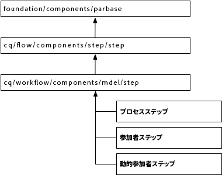

>[!CAUTION]
>
>`/libs` パス内の設定は&#x200B;***一切***&#x200B;変更しないでください。
>
>`/libs` コンテンツは、インスタンスを次回アップグレードするとき（場合によってはホットフィックスまたは機能パックを適用したとき）に上書きされるからです。
>
>設定およびその他の変更に推奨される方法は次のとおりです。
>
>1. Recreate the required item (i.e. as it exists in `/libs` under `/apps`
>2. `/apps` 内で変更作業をおこないます。


The `/libs/cq/workflow/components/model/step` component is the nearest common ancestor of the **Process Step**, **Participant Step**, and **Dynamic Participant Step**, which all inherit the following items:

* `step.jsp`

   The `step.jsp` script renders the title of the step component when it is added to a model.

   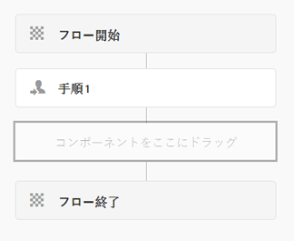

* [cq:dialog](/help/sites-developing/developing-components.md#creating-and-configuring-a-dialog)

   ダイアログには次のタブがあります。

   * **共通**：タイトルと説明の編集用です。
   * **詳細**：電子メール通知プロパティの編集用です。

   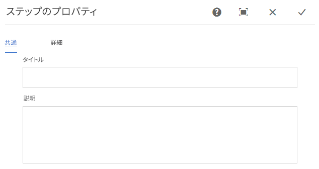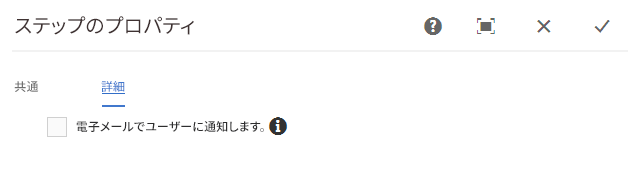

   >[!NOTE]
   >
   >ステップコンポーネントの編集ダイアログのタブがこのデフォルトの外観と一致しない場合、ステップコンポーネントには、これらの継承されたタブをオーバーライドするスクリプト、ノードプロパティまたはダイアログタブが定義されています。

### ECMA スクリプト {#ecma-scripts}

ECMAスクリプト内では、次のオブジェクトを使用できます（ステップのタイプに応じて異なります）。

* [WorkItem](https://helpx.adobe.com/experience-manager/6-5/sites/developing/using/reference-materials/javadoc/com/day/cq/workflow/exec/WorkItem.html) workItem
* [WorkflowSession](https://helpx.adobe.com/experience-manager/6-5/sites/developing/using/reference-materials/javadoc/com/day/cq/workflow/WorkflowSession.html) workflowSession
* [WorkflowData](https://helpx.adobe.com/experience-manager/6-5/sites/developing/using/reference-materials/javadoc/com/day/cq/workflow/exec/WorkflowData.html) workflowData
* `args`：プロセスの引数を格納する配列

* `sling`：他の OSGi サービスへのアクセス用
* `jcrSession`

### MetaDataMap {#metadatamaps}

ワークフローメタデータを使用すると、ワークフローの有効期間中に必要とされる情報を保持できます。ワークフローステップの一般的な要件は、そのワークフローで以降に使用するデータを保持したり、保持されているデータを取得することです。

There are three types of MetaDataMap objects - for `Workflow`, `WorkflowData` and `WorkItem` objects. メタデータを保存する目的は、すべて同じです。

WorkItem には、作業項目（ステップなど）の実行中にのみ使用できる固有の MetaDataMap があります。

Both `Workflow` and `WorkflowData` metadatamaps are shared over the entire workflow. このような場合は、`WorkflowData` MetaDataMap だけを使用することをお勧めします。

## カスタムワークフローステップコンポーネントの作成 {#creating-custom-workflow-step-components}

ワークフローステップコンポーネントは、[その他のコンポーネントと同じ方法で作成](/help/sites-developing/components.md)できます。

（既存の）ベースステップコンポーネントのいずれかから継承するには、次のプロパティを `cq:Component` ノードに追加します。

* 名前：`sling:resourceSuperType`
* 型：`String`
* 値：ベースコンポーネントに解決される次のパスのいずれか

   * `cq/workflow/components/model/process`
   * `cq/workflow/components/model/participant`
   * `cq/workflow/components/model/dynamic_participant`

### ステップインスタンスのデフォルトのタイトルおよび説明の指定 {#specifying-the-default-title-and-description-for-step-instances}

「**共通**」タブの「**タイトル**」フィールドと「**説明**」フィールドのデフォルト値を指定するには、以下の手順を実行します。

>[!NOTE]
>
>以下の要件が両方とも満たされる場合に、フィールド値がステップインスタンスに表示されます。
>
>* ステップの編集ダイアログが次の場所にタイトルと説明を保存している。 >
>* `./jcr:title`
>* `./jcr:description`場所：

>
>  
This requirement is satisfied when the edit dialog uses the Common tab that the `/libs/cq/flow/components/step/step` component implements.
>
>* The step component or an ancestor of the component does not override the `step.jsp` script that the `/libs/cq/flow/components/step/step` component implements.


1. Below the `cq:Component` node, add the following node:

   * 名前：`cq:editConfig`
   * 型：`cq:EditConfig`

   >[!NOTE]
   >
   >For more information about the cq:editConfig node, see [Configuring the Edit Behavior of a Component](/help/sites-developing/developing-components.md#configuring-the-edit-behavior).

1. Below the `cq:EditConfig` node, add the following node:

   * 名前：`cq:formParameters`
   * 型：`nt:unstructured`

1. Add `String` properties of the following names to the `cq:formParameters` node:

   * `jcr:title`：この値が「**共通**」タブの「**タイトル**」フィールドに設定されます。
   * `jcr:description`：この値が「**共通**」タブの「**説明**」フィールドに設定されます。

### ワークフローメタデータにプロパティ値を保存 {#saving-property-values-in-workflow-metadata}

>[!NOTE]
>
>[データの保持とアクセス](#persisting-and-accessing-data)を参照してください。特に、実行時のプロパティ値へのアクセスについては、[実行時のダイアログプロパティ値へのアクセス](#accessing-dialog-property-values-at-runtime)を参照してください。

`cq:Widget` 項目の name プロパティで、ウィジェットの値を保存する JCR ノードを指定します。ワークフロー手順のコンポーネントのダイアログ内のウィジェットが `./metaData` ノードの下に値を格納する場合、値がワークフローに追加され `MetaDataMap`ます。

例えば、ダイアログのテキストフィールドは、次のプロパティを持つ `cq:Widget` ノードです。

| 名前 | タイプ | 値 |
|---|---|---|
| `xtype` | `String` | `textarea` |
| `name` | `String` | `./metaData/subject` |
| `fieldLabel` | `String` | `Email Subject` |

The value that is specified in this text field is added to the workflow instance&#39;s ` [MetaDataMap](#metadatamaps)` object, and is associated with the `subject` key.

>[!NOTE]
>
>キーが `PROCESS_ARGS` の場合、この値は `args` 変数を使用して ECMA スクリプト実装ですぐに使用できます。この場合、name プロパティの値は `./metaData/PROCESS_ARGS.`

### Overriding the Step Implementation {#overriding-the-step-implementation}

各基本手順コンポーネントにより、ワークフローモデル開発者は、設計時に次の主な機能を設定できます。

* プロセスステップ：実行時に実行されるサービスまたは ECMA スクリプト。
* 参加者ステップ：生成された作業項目を割り当てるユーザーの ID。
* 動的参加者ステップ：作業項目を割り当てるユーザーの ID を選択するサービスまたは ECMA スクリプト。

コンポーネントを特定のワークフローシナリオ専用にするために、デザイン時に設定した主要機能をモデル開発者が変更できないようにします。

1. cq:Component ノードの下に、次のノードを追加します。

   * 名前：`cq:editConfig`
   * 型：`cq:EditConfig`

   cq:editConfig ノードについて詳しくは、[コンポーネントの編集動作の設定](/help/sites-developing/developing-components.md#configuring-the-edit-behavior)を参照してください。

1. cq:EditConfig ノードの下に、次のノードを追加します。

   * 名前：`cq:formParameters`
   * 型：`nt:unstructured`

1. ノード追加のプロパティで `String``cq:formParameters` す。 コンポーネントのスーパータイプによって、プロパティの名前が次のように決定されます。

   * プロセスステップ: `PROCESS`
   * Participant Step: `PARTICIPANT`
   * 動的参加者ステップ: `DYNAMIC_PARTICIPANT`

1. プロパティの値を次のように指定します。

   * `PROCESS`：ステップの動作を実装する ECMA スクリプトへのパスまたはサービスの PID。
   * `PARTICIPANT`：作業項目を割り当てるユーザーの ID。
   * `DYNAMIC_PARTICIPANT`:作業項目を割り当てるユーザーを選択するECMAスクリプトのパスまたはサービスのPID。

1. モデル開発者がプロパティ値を変更できないようにするために、コンポーネントのスーパータイプのダイアログをオーバーライドします。

### フォームとダイアログを参加者ステップに追加 {#adding-forms-and-dialogs-to-participant-steps}

Customize your participant step component to provide features that are found in the [Form Participant Step](/help/sites-developing/workflows-step-ref.md#form-participant-step) and [Dialog Participant Step](/help/sites-developing/workflows-step-ref.md#dialog-participant-step) components:

* 生成された作業項目を開いたときに、フォームを表示する
* 生成された作業項目を完了したときに、カスタムダイアログを表示する

Peform the following procedure on your new component (see [Creating Custom Workflow Step Components](#creating-custom-workflow-step-components)):

1. Below the `cq:Component` node, add the following node:

   * 名前：`cq:editConfig`
   * 型：`cq:EditConfig`

   For more information about the cq:editConfig node, see [Configuring the Edit Behavior of a Component](/help/sites-developing/components-basics.md#edit-behavior).

1. cq:EditConfig ノードの下に、次のノードを追加します。

   * 名前：`cq:formParameters`
   * 型：`nt:unstructured`

1. 作業項目を開くとフォームが表示されるようにするには、次のプロパティを `cq:formParameters` ノードに追加します。

   * 名前：`FORM_PATH`
   * 型：`String`
   * 値：フォームに解決されるパス

1. 作業項目を完了するとカスタムダイアログが表示されるようにするには、次のプロパティを `cq:formParameters` ノードに追加します。

   * 名前：`DIALOG_PATH`
   * 型：`String`
   * 値：ダイアログに解決されるパス

### ワークフローステップの実行時の動作の設定 {#configuring-the-workflow-step-runtime-behavior}

Below the `cq:Component` node, add a `cq:EditConfig` node. Below that add an `nt:unstructured` node (must be named `cq:formParameters`) and to that node add the following properties:

* 名前：`PROCESS_AUTO_ADVANCE`

   * 型：`Boolean`
   * 値:

      * when set to `true` the workflow will run that step and continue - this is default and also recommended
      * `false` に設定した場合、ワークフローはそのステップを実行して停止します。これには追加の処理が必要なので、`true` に設定することをお勧めします。

* 名前：`DO_NOTIFY`

   * 型：`Boolean`
   * 値：ユーザー参加ステップについて電子メール通知を送信するかどうかを示します（メールサーバーが正しく設定されていると想定しています）。

## データの保持とアクセス {#persisting-and-accessing-data}

### 後続のワークフローステップのためのデータ保持 {#persisting-data-for-subsequent-workflow-steps}

ワークフローメタデータを使用して、ワークフローの有効期間中およびステップの間で必要とされる情報を保持できます。ワークフローステップの一般的な要件は、以降に使用するデータを保持したり、以前のステップから保持されているデータを取得したりすることです。

ワークフローメタデータは、[`MetaDataMap`](#metadatamaps) オブジェクトに保存されます。The Java API provides the [`Workflow.getWorkflowData`](https://helpx.adobe.com/experience-manager/6-5/sites/developing/using/reference-materials/javadoc/com/adobe/granite/workflow/exec/Workflow.html) method to return a [`WorkflowData`](https://helpx.adobe.com/experience-manager/6-5/sites/developing/using/reference-materials/javadoc/com/adobe/granite/workflow/exec/WorkflowData.html) object that provides the appropriate `MetaDataMap` object. This `WorkflowData` `MetaDataMap` object is available to the OSGi service or ECMA script of a step component.

#### Java {#java}

`WorkflowProcess` 実装の execute メソッドは、`WorkItem` オブジェクトに渡されます。このオブジェクトを使用して、現在のワークフローインスタンスの `WorkflowData` オブジェクトを取得します。次の例では、ワークフローの `MetaDataMap` オブジェクトに項目を追加してから、各項目を記録します。(&quot;mykey&quot;, &quot;My Step Value&quot;) 項目は、ワークフローの後続ステップで使用可能です。

```java
public void execute(WorkItem item, WorkflowSession session, MetaDataMap args) throws WorkflowException {

    MetaDataMap wfd = item.getWorkflow().getWorkflowData().getMetaDataMap();

    wfd.put("mykey", "My Step Value");

    Set<String> keyset = wfd.keySet();
    Iterator<String> i = keyset.iterator();
    while (i.hasNext()){
     Object key = i.next();
     log.info("The workflow medata includes key {} and value {}",key.toString(),wfd.get(key).toString());
    }
}
```

#### ECMA スクリプト {#ecma-script}

`graniteWorkItem` 変数は、現在の `WorkItem` Java オブジェクトの ECMA スクリプト表現です。したがって、`graniteWorkItem` 変数を使用して、ワークフローメタデータを取得できます。次の ECMA スクリプトを使用すると、ワークフローの **オブジェクトに項目を追加してから各項目を記録する**&#x200B;プロセスステップ`MetaDataMap`を実装できます。これらの項目は、ワークフローの後続の手順で使用できます。

>[!NOTE]
>
>ステップスクリプトですぐ使用できる `metaData` 変数は、ステップのメタデータです。ステップメタデータは、ワークフローメタデータとは異なります。

```
var currentDateInMillis = new Date().getTime();

graniteWorkItem.getWorkflowData().getMetaDataMap().put("hardcodedKey","theKey");

graniteWorkItem.getWorkflowData().getMetaDataMap().put("currentDateInMillisKey",currentDateInMillis);

var iterator = graniteWorkItem.getWorkflowData().getMetaDataMap().keySet().iterator();
while (iterator.hasNext()){
    var key = iterator.next();
    log.info("Workflow metadata key, value = " + key.toString() + ", " + graniteWorkItem.getWorkflowData().getMetaDataMap().get(key));
}
```

### 実行時のダイアログプロパティ値へのアクセス {#accessing-dialog-property-values-at-runtime}

ワークフローインスタンスの `MetaDataMap` オブジェクトは、ワークフローの有効期間全体を通じてデータを保存および取得する場合に役立ちます。ワークフローステップコンポーネントの実装では、特に実行時のコンポーネントプロパティ値を取得するときに `MetaDataMap` が役立ちます。

>[!NOTE]
>
>プロパティをワークフローメタデータとして保存するコンポーネントダイアログの設定については、[ワークフローメタデータへのプロパティ値の保存](#saving-property-values-in-workflow-metadata)を参照してください。

ワークフローの `MetaDataMap` は、Java および ECMA スクリプトプロセス実装で次のように使用できます。

* In Java implementations of the WorkflowProcess interface, the `args` parameter is the `MetaDataMap` object for the workflow.

* In ECMA script implementations, the value is available using the `args` and `metadata` variables.

### 例：プロセスステップコンポーネントの引数の取得 {#example-retrieving-the-arguments-of-the-process-step-component}

**プロセスステップ**&#x200B;コンポーネントの編集ダイアログには、**Arguments** プロパティが含まれます。**Arguments** プロパティの値は、ワークフローメタデータに保存され、キーに関連付けられてい `PROCESS_ARGS` ます。

In the following diagram, the value of the **Arguments** property is `argument1, argument2`:

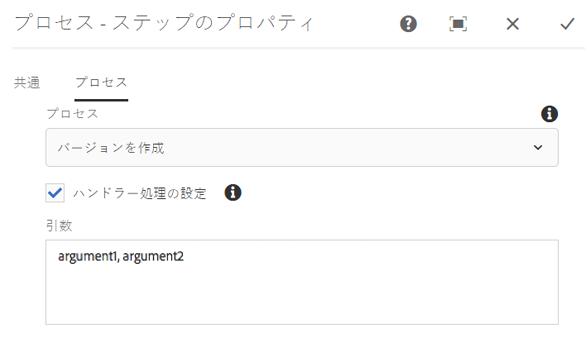

#### Java {#java-1}

次の Java コードは、`execute` 実装の `WorkflowProcess` メソッドです。The method logs the value in the `args` `MetaDataMap` that is associated with the `PROCESS_ARGS` key.

```java
public void execute(WorkItem item, WorkflowSession session, MetaDataMap args) throws WorkflowException {
     if (args.containsKey("PROCESS_ARGS")){
      log.info("workflow metadata for key PROCESS_ARGS and value {}",args.get("PROCESS_ARGS","string").toString());
     }
    }
```

この Java 実装を使用するプロセスステップが実行されると、ログに次のエントリが記録されます。

```xml
16.02.2018 12:07:39.566 *INFO* [JobHandler: /var/workflow/instances/server0/2018-02-16/model_855140139900189:/content/we-retail/de] com.adobe.example.workflow.impl.process.LogArguments workflow metadata for key PROCESS_ARGS and value argument1, argument2
```

#### ECMA スクリプト {#ecma-script-1}

次の ECMA スクリプトは、**プロセスステップ**&#x200B;のプロセスとして使用されます。このスクリプトは、引数の数と値を記録します。

```
var iterator = graniteWorkItem.getWorkflowData().getMetaDataMap().keySet().iterator();
while (iterator.hasNext()){
    var key = iterator.next();
    log.info("Workflow metadata key, value = " + key.toString() + ", " + graniteWorkItem.getWorkflowData().getMetaDataMap().get(key));
}
log.info("hardcodedKey "+ graniteWorkItem.getWorkflowData().getMetaDataMap().get("hardcodedKey"));
log.info("currentDateInMillisKey "+ graniteWorkItem.getWorkflowData().getMetaDataMap().get("currentDateInMillisKey"));
```

>[!NOTE]
>
>この節では、プロセスステップの引数の使用方法について説明します。この情報は、動的参加者選択にも適用されます。

>[!NOTE]
>ワークフローメタデータにコンポーネントのプロパティを保存するもう 1 つの例については、例：ロガーワークフローステップの作成を参照してください。この例では、メタデータ値と PROCESS_ARGS 以外のキーを関連付けるダイアログについて説明しています。

### スクリプトとプロセスの引数 {#scripts-and-process-arguments}

**プロセスステップ**&#x200B;コンポーネント用のスクリプト内で、引数は `args` オブジェクトを通して使用できます。

When creating a custom step component, the object `metaData` is available in a script. このオブジェクトは、1つの文字列引数に制限されます。

## プロセスステップ実装の作成 {#developing-process-step-implementations}

ワークフローのプロセスでプロセスステップが開始されると、そのステップは OSGi サービスにリクエストを送信するか、ECMA スクリプトを実行します。そのため、ワークフローに必要なアクションを実行するサービスまたは ECMA スクリプトを作成します。

>[!NOTE]
>
>プロセスステップコンポーネントとサービスまたはスクリプトの関連付けについては、[プロセスステップ](/help/sites-developing/workflows-step-ref.md#process-step)または[ステップ実装のオーバーライド](#overriding-the-step-implementation)を参照してください。

### Java クラスを使用したプロセスステップの実装 {#implementing-a-process-step-with-a-java-class}

OSGI サービスコンポーネント（Java バンドル）としてプロセスステップを定義する

1. バンドルを作成して、OSGI コンテナにデプロイします。[CRXDE Liteまたは](/help/sites-developing/developing-with-crxde-lite.md) Eclipseを使用したバンドルの作成に関するドキュメントを参照してください [](/help/sites-developing/howto-projects-eclipse.md)。

   >[!NOTE]
   >
   >The OSGI component needs to implement the `WorkflowProcess` interface with its `execute()` method. 以下のコード例を参照してください。

   >[!NOTE]
   >
   >The package name needs to be added to the `<*Private-Package*>` section of the `maven-bundle-plugin` configuration.

1. Add the SCR property `process.label`  and set the value as you require. This will be the name which your process step is listed as when using the generic **Process Step** component. 下の例を参照してください。
1. In the **Models** editor, add the process step to the workflow using the generic **Process Step** component.
1. In the edit dialog (of the **Process Step**), go to the **Process** tab and select your process implementation.
1. コード内で引数を使用する場合は、**プロセスの引数**&#x200B;を設定します。例：false
1. ステップとワークフローモデルの両方に対する変更を保存します（モデルエディターの左上隅）。

実行可能なJavaメソッドを実装するクラスはそれぞれOSGIサービスとして登録され、実行時にいつでもメソッドを追加できます。

以下のOSGIコンポーネントは、ペイロードがページ `approved` の場合に、ページコンテンツノードにプロパティを追加します。

```java
package com.adobe.example.workflow.impl.process;

import com.adobe.granite.workflow.WorkflowException;
import com.adobe.granite.workflow.WorkflowSession;
import com.adobe.granite.workflow.exec.WorkItem;
import com.adobe.granite.workflow.exec.WorkflowData;
import com.adobe.granite.workflow.exec.WorkflowProcess;
import com.adobe.granite.workflow.metadata.MetaDataMap;

import org.apache.felix.scr.annotations.Component;
import org.apache.felix.scr.annotations.Property;
import org.apache.felix.scr.annotations.Service;

import org.osgi.framework.Constants;

import javax.jcr.Node;
import javax.jcr.RepositoryException;
import javax.jcr.Session;

/**
 * Sample workflow process that sets an <code>approve</code> property to the payload based on the process argument value.
 */
@Component
@Service
public class MyProcess implements WorkflowProcess {

 @Property(value = "An example workflow process implementation.")
 static final String DESCRIPTION = Constants.SERVICE_DESCRIPTION;
 @Property(value = "Adobe")
 static final String VENDOR = Constants.SERVICE_VENDOR;
 @Property(value = "My Sample Workflow Process")
 static final String LABEL="process.label";

 private static final String TYPE_JCR_PATH = "JCR_PATH";

 public void execute(WorkItem item, WorkflowSession session, MetaDataMap args) throws WorkflowException {
  WorkflowData workflowData = item.getWorkflowData();
  if (workflowData.getPayloadType().equals(TYPE_JCR_PATH)) {
   String path = workflowData.getPayload().toString() + "/jcr:content";
   try {
    Session jcrSession = session.adaptTo(Session.class);
    Node node = (Node) jcrSession.getItem(path);
    if (node != null) {
     node.setProperty("approved", readArgument(args));
     jcrSession.save();
    }
   } catch (RepositoryException e) {
    throw new WorkflowException(e.getMessage(), e);
   }
  }
 }

 private boolean readArgument(MetaDataMap args) {
  String argument = args.get("PROCESS_ARGS", "false");
  return argument.equalsIgnoreCase("true");
 }
}
```

>[!NOTE]
>
>プロセスが連続して 3 回失敗した場合は、ワークフロー管理者のインボックスに 1 つのアイテムが配置されます。

### ECMAScript の使用 {#using-ecmascript}

スクリプト開発者は、ECMA スクリプトを使用してプロセスステップを実装できます。スクリプトは JCR リポジトリ内に配置され、そこから実行されます。

スクリプトの処理にすぐに使用でき、ワークフロー Java API のオブジェクトへのアクセスを提供する変数を以下の表に示します。

| Java クラス | スクリプト変数名 | 説明 |
|---|---|---|
| `com.adobe.granite.workflow.exec.WorkItem` | `graniteWorkItem` | 現在のステップインスタンス。 |
| `com.adobe.granite.workflow.WorkflowSession` | `graniteWorkflowSession` | 現在のステップインスタンスのワークフローセッション。 |
| `String[]` （プロセスの引数が含まれます） | `args` | ステップの引数。 |
| `com.adobe.granite.workflow.metadata.MetaDataMap` | `metaData` | 現在のステップインスタンスのメタデータ。 |
| `org.apache.sling.scripting.core.impl.InternalScriptHelper` | `sling` | Sling ランタイム環境へのアクセスを可能にします。 |

次のサンプルスクリプトは、ワークフローのペイロードを表す JCR ノードにアクセスする方法を示しています。`graniteWorkflowSession` 変数を JCR セッション変数に適応させます。この変数を使用して、ペイロードパスからノードを取得します。

```
var workflowData = graniteWorkItem.getWorkflowData();
if (workflowData.getPayloadType() == "JCR_PATH") {
    var path = workflowData.getPayload().toString();
    var jcrsession = graniteWorkflowSession.adaptTo(Packages.javax.jcr.Session);
    var node = jcrsession.getNode(path);
    if (node.hasProperty("approved")){
     node.setProperty("approved", args[0] == "true" ? true : false);
     node.save();
 }
}
```

The following script checks if the payload is an image ( `.png` file), creates a black and white image from it, and saves it as a sibling node.

```
var workflowData = graniteWorkItem.getWorkflowData();
if (workflowData.getPayloadType() == "JCR_PATH") {
    var path = workflowData.getPayload().toString();
    var jcrsession = graniteWorkflowSession.adaptTo(Packages.javax.jcr.Session);
    var node = jcrsession.getRootNode().getNode(path.substring(1));
     if (node.isNodeType("nt:file") && node.getProperty("jcr:content/jcr:mimeType").getString().indexOf("image/") == 0) {
        var is = node.getProperty("jcr:content/jcr:data").getStream();
        var layer = new Packages.com.day.image.Layer(is);
        layer.grayscale();
                var parent = node.getParent();
                var gn = parent.addNode("grey" + node.getName(), "nt:file");
        var content = gn.addNode("jcr:content", "nt:resource");
                content.setProperty("jcr:mimeType","image/png");
                var cal = Packages.java.util.Calendar.getInstance();
                content.setProperty("jcr:lastModified",cal);
                var f = Packages.java.io.File.createTempFile("test",".png");
        var tout = new Packages.java.io.FileOutputStream(f);
        layer.write("image/png", 1.0, tout);
        var fis = new Packages.java.io.FileInputStream(f);
                content.setProperty("jcr:data", fis);
                parent.save();
        tout.close();
        fis.close();
        is.close();
        f.deleteOnExit();
    }
}
```

スクリプトを使用するには：

1. Create the script (for example with CRXDE Lite) and save it in the repository below `/apps/myapp/workflow/scripts`
1. **プロセスステップ**&#x200B;の編集ダイアログでスクリプトを識別するタイトルを指定するには、次のプロパティをスクリプトの `jcr:content` ノードに追加します。

   | 名前 | タイプ | 値 |
   |---|---|---|
   | `jcr:mixinTypes` | `Name[]` | `mix:title` |
   | `jcr:title` | `String` | 編集ダイアログに表示される名前。 |

1. **プロセスステップ**&#x200B;インスタンスを編集し、使用するスクリプトを指定します。

## 参加者選択の作成 {#developing-participant-choosers}

**動的参加者ステップ**&#x200B;コンポーネント用の参加者選択を作成できます。

When a **Dynamic Participant Step** component is started during a workflow, the step needs to detemine the participant to which the generated work item can be assigned. そのためには、ステップで次のいずれかを実行します。

* OSGiサービスにリクエストを送信
* 参加者を選択する ECMA スクリプトを実行する

ワークフローの要件に応じて参加者を選択するサービスまたは ECMA スクリプトを作成できます。

>[!NOTE]
>
>**動的参加者ステップ**&#x200B;コンポーネントとサービスまたはスクリプトの関連付けについては、[動的参加者ステップ](/help/sites-developing/workflows-step-ref.md#dynamic-participant-step)または[ステップ実装のオーバーライド](#persisting-and-accessing-data)を参照してください。

### Java クラスを使用した参加者選択の作成 {#developing-a-participant-chooser-using-a-java-class}

参加者ステップを OSGI サービスコンポーネント（Java クラス）として定義する

1. The OSGI component needs to implement the `ParticipantStepChooser` interface with its `getParticipant()` method. 以下のコード例を参照してください。

   バンドルを作成して、OSGI コンテナにデプロイします。

1. Add the SCR property `chooser.label` and set the value as required. This will be the name as which your participant chooser is listed, using the **Dynamic Participant Step** component. 次に例を示します。

   ```java
   package com.adobe.example.workflow.impl.process;
   
   import com.adobe.granite.workflow.WorkflowException;
   import com.adobe.granite.workflow.WorkflowSession;
   import com.adobe.granite.workflow.exec.ParticipantStepChooser;
   import com.adobe.granite.workflow.exec.WorkItem;
   import com.adobe.granite.workflow.exec.WorkflowData;
   import com.adobe.granite.workflow.metadata.MetaDataMap;
   
   import org.apache.felix.scr.annotations.Component;
   import org.apache.felix.scr.annotations.Property;
   import org.apache.felix.scr.annotations.Service;
   
   import org.osgi.framework.Constants;
   
   /**
    * Sample dynamic participant step that determines the participant based on a path given as argument.
    */
   @Component
   @Service
   
   public class MyDynamicParticipant implements ParticipantStepChooser {
   
    @Property(value = "An example implementation of a dynamic participant chooser.")
    static final String DESCRIPTION = Constants.SERVICE_DESCRIPTION;
       @Property(value = "Adobe")
       static final String VENDOR = Constants.SERVICE_VENDOR;
       @Property(value = "Dynamic Participant Chooser Process")
       static final String LABEL=ParticipantStepChooser.SERVICE_PROPERTY_LABEL;
   
       private static final String TYPE_JCR_PATH = "JCR_PATH";
   
       public String getParticipant(WorkItem workItem, WorkflowSession workflowSession, MetaDataMap args) throws WorkflowException {
           WorkflowData workflowData = workItem.getWorkflowData();
           if (workflowData.getPayloadType().equals(TYPE_JCR_PATH)) {
               String path = workflowData.getPayload().toString();
               String pathFromArgument = args.get("PROCESS_ARGS", String.class);
               if (pathFromArgument != null && path.startsWith(pathFromArgument)) {
                   return "admin";
               }
           }
           return "administrators";
       }
   }
   ```

1. In the **Models** editor, add the dynamic participant step to the workflow using the generic **Dynamic Participant Step** component.
1. 編集ダイアログで、「**参加者セレクター**」タブを選択し、セレクターの実装を選択します。
1. If you use arguments in your code set the **Process Arguments**. 次の例では、 `/content/we-retail/de`.
1. ステップとワークフローモデルの両方に対する変更を保存します。

### ECMA スクリプトを使用した参加者選択の作成 {#developing-a-participant-chooser-using-an-ecma-script}

**参加者ステップ**&#x200B;で生成される作業項目を割り当てるユーザーを選択する ECMA スクリプトを作成できます。スクリプトには、`getParticipant` という関数を含める必要があります。この関数は引数が不要で、ユーザーまたはグループの ID を格納した `String` を返します。

スクリプトは JCR リポジトリ内に配置され、そこから実行されます。

スクリプト内のワークフロー Java オブジェクトにすぐにアクセスできる変数を以下の表に示します。

| Java クラス | スクリプト変数名 |
|---|---|
| `com.adobe.granite.workflow.exec.WorkItem` | `graniteWorkItem` |
| `com.adobe.granite.workflow.WorkflowSession` | `graniteWorkflowSession` |
| `String[]` （プロセスの引数が含まれます） | `args` |
| `com.adobe.granite.workflow.metadata.MetaDataMap` | `metaData` |
| `org.apache.sling.scripting.core.impl.InternalScriptHelper` | `sling` |

```
function getParticipant() {
    var workflowData = graniteWorkItem.getWorkflowData();
    if (workflowData.getPayloadType() == "JCR_PATH") {
        var path = workflowData.getPayload().toString();
        if (path.indexOf("/content/we-retail/de") == 0) {
            return "admin";
        } else {
            return "administrators";
        }
    }
}
```

1. Create the script (for example with CRXDE Lite) and save it in the repository below `/apps/myapp/workflow/scripts`
1. **プロセスステップ**&#x200B;の編集ダイアログでスクリプトを識別するタイトルを指定するには、次のプロパティをスクリプトの `jcr:content` ノードに追加します。

   | 名前 | タイプ | 値 |
   |---|---|---|
   | `jcr:mixinTypes` | `Name[]` | `mix:title` |
   | `jcr:title` | `String` | 編集ダイアログに表示される名前。 |

1. Edit the [Dynamic Participant Step](/help/sites-developing/workflows-step-ref.md#dynamic-participant-step) instance and specify the script to be used.

## ワークフローパッケージの処理 {#handling-workflow-packages}

[ワークフローパッケージ](/help/sites-authoring/workflows-applying.md#specifying-workflow-details-in-the-create-workflow-wizard)をワークフローに渡して処理することができます。ワークフローパッケージには、ページやアセットなどのリソースへの参照が含まれます。

>[!NOTE]
>
>次のワークフロープロセスステップは、一括ページアクティベーション用のワークフローパッケージを受け入れます。
>
>* [`com.day.cq.wcm.workflow.process.ActivatePageProcess`](https://helpx.adobe.com/experience-manager/6-5/sites/developing/using/reference-materials/javadoc/com/day/cq/wcm/workflow/process/ActivatePageProcess.html)
>* [`com.day.cq.wcm.workflow.process.DeactivatePageProcess`](https://helpx.adobe.com/experience-manager/6-5/sites/developing/using/reference-materials/javadoc/com/day/cq/wcm/workflow/process/DeactivatePageProcess.html)

>


パッケージリソースを取得して処理するワークフローステップを作成できます。`com.day.cq.workflow.collection` パッケージの以下の構成要素は、ワークフローパッケージへのアクセスを可能にします。

* `ResourceCollection`:ワークフローパッケージクラス。
* `ResourceCollectionUtil`：ResourceCollection オブジェクトの取得に使用されます。
* `ResourceCollectionManager`:コレクションを作成し、取得します。 実装は、OSGi サービスとしてデプロイされます。

次の Java クラスの例は、パッケージリソースの取得方法を示しています。

```java
package com.adobe.example;

import java.util.ArrayList;
import java.util.List;

import com.day.cq.workflow.WorkflowException;
import com.day.cq.workflow.WorkflowSession;
import com.day.cq.workflow.collection.ResourceCollection;
import com.day.cq.workflow.collection.ResourceCollectionManager;
import com.day.cq.workflow.collection.ResourceCollectionUtil;
import com.day.cq.workflow.exec.WorkItem;
import com.day.cq.workflow.exec.WorkflowData;
import com.day.cq.workflow.exec.WorkflowProcess;
import com.day.cq.workflow.metadata.MetaDataMap;

import org.apache.felix.scr.annotations.Component;
import org.apache.felix.scr.annotations.Property;
import org.apache.felix.scr.annotations.Service;
import org.apache.felix.scr.annotations.Reference;
import org.osgi.framework.Constants;

import org.slf4j.Logger;
import org.slf4j.LoggerFactory;

import javax.jcr.Node;
import javax.jcr.PathNotFoundException;
import javax.jcr.RepositoryException;
import javax.jcr.Session;

@Component
@Service
public class LaunchBulkActivate implements WorkflowProcess {

 private static final Logger log = LoggerFactory.getLogger(LaunchBulkActivate.class);

 @Property(value="Bulk Activate for Launches")
  static final String PROCESS_NAME ="process.label";
 @Property(value="A sample workflow process step to support Launches bulk activation of pages")
 static final String SERVICE_DESCRIPTION = Constants.SERVICE_DESCRIPTION;

 @Reference
 private ResourceCollectionManager rcManager;
public void execute(WorkItem workItem, WorkflowSession workflowSession) throws Exception {
    Session session = workflowSession.getSession();
    WorkflowData data = workItem.getWorkflowData();
    String path = null;
    String type = data.getPayloadType();
    if (type.equals(TYPE_JCR_PATH) && data.getPayload() != null) {
        String payloadData = (String) data.getPayload();
        if (session.itemExists(payloadData)) {
            path = payloadData;
        }
    } else if (data.getPayload() != null && type.equals(TYPE_JCR_UUID)) {
        Node node = session.getNodeByUUID((String) data.getPayload());
        path = node.getPath();
    }

    // CUSTOMIZED CODE IF REQUIRED....

    if (path != null) {
        // check for resource collection
        ResourceCollection rcCollection = ResourceCollectionUtil.getResourceCollection((Node)session.getItem(path), rcManager);
        // get list of paths to replicate (no resource collection: size == 1
        // otherwise size >= 1
        List<String> paths = getPaths(path, rcCollection);
        for (String aPath: paths) {

            // CUSTOMIZED CODE....

        }
    } else {
        log.warn("Cannot process because path is null for this " + "workitem: " + workItem.toString());
    }
}

/**
 * helper
 */
private List<String> getPaths(String path, ResourceCollection rcCollection) {
    List<String> paths = new ArrayList<String>();
    if (rcCollection == null) {
        paths.add(path);
    } else {
        log.debug("ResourceCollection detected " + rcCollection.getPath());
        // this is a resource collection. the collection itself is not
        // replicated. only its members
        try {
            List<Node> members = rcCollection.list(new String[]{"cq:Page", "dam:Asset"});
            for (Node member: members) {
                String mPath = member.getPath();
                paths.add(mPath);
            }
        } catch(RepositoryException re) {
            log.error("Cannot build path list out of the resource collection " + rcCollection.getPath());
        }
    }
    return paths;
}
}
```

## 例：カスタムステップの作成 {#example-creating-a-custom-step}

独自のカスタムステップを作成する場合は、次の場所から既存のステップをコピーする方法が簡単です。

`/libs/cq/workflow/components/model`

### 基本的なステップの作成 {#creating-the-basic-step}

1. 次の例のように、/apps の下にパスを再作成します。

   `/apps/cq/workflow/components/model`

   The new folders are of type `nt:folder`:

   ```xml
   - apps
     - cq
       - workflow (nt:folder)
         - components (nt:folder)
           - model (nt:folder)
   ```

   >[!NOTE]
   >
   >この手順は、クラシック UI のモデルエディターには適用されません。

1. 次の例のように、コピーしたステップを /apps フォルダーに配置します。

   `/apps/cq/workflow/components/model/myCustomStep`

   カスタマイズしたステップの例は次のとおりです。

   

   >[!CAUTION]
   >
   >標準 UI ではカードに表示されるのはタイトルのみで、説明は表示されないので、クラシック UI エディター用の `details.jsp` は不要です。

1. このノードに次のプロパティを適用します。

   `/apps/cq/workflow/components/model/myCustomStep`

   **対象プロパティ：**

   * `sling:resourceSuperType`

      既存のステップから継承する必要があります。

      In this example we are inheriting from the base step at `cq/workflow/components/model/step`, but you can use other super types like `participant`, `process`, etc.

   * `jcr:title`

       コンポーネントがステップブラウザー（ワークフローモデルエディターの左側のパネル）に一覧表示されたときに表示されるタイトルです。

   * `cq:icon`

      Used to specify a [Coral icon](https://helpx.adobe.com/experience-manager/6-5/sites/developing/using/reference-materials/coral-ui/coralui3/Coral.Icon.html) for the step.

   * `componentGroup`

      次のいずれかである必要があります。

      * コラボレーションワークフロー
      * DAM ワークフロー
      * Forms のワークフロー
      * プロジェクト
      * WCM ワークフロー
      * ワークフロー

   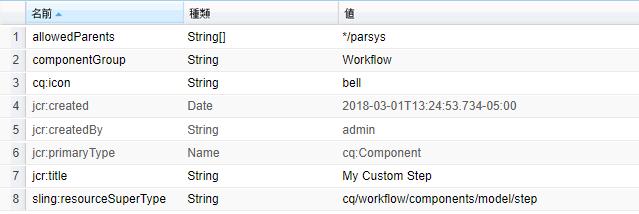

1. 以上でワークフローを開いて編集できるようになります。ステップブラウザーでは、次の手順でフィルターを適用して&#x200B;**カスタムステップ**&#x200B;を表示できます。

   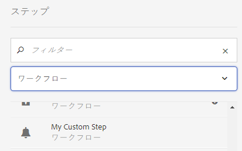

   **カスタムステップ**&#x200B;をモデルにドラッグすると、カードが表示されます。

   

   ステップで `cq:icon` が定義されていない場合は、タイトルの最初の 2 文字を使用したデフォルトのアイコンが表示されます。次に例を示します。

   

#### ステップの設定ダイアログの定義 {#defining-the-step-configure-dialog}

[基本ステップを作成](#creating-the-basic-step)したら、次の手順に沿ってステップの&#x200B;**設定**&#x200B;ダイアログを定義します。

1. Configure the properties on the node `cq:editConfig` as follows:

   **対象プロパティ：**

   * `cq:inherit`

      When set to `true`, then your step component will inherit properties from the step you specified in `sling:resourceSuperType`.

   * `cq:disableTargeting`

      必要に応じて設定します。
   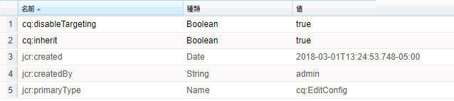

1. Configure the properties on the node `cq:formsParameter` as follows:

   **対象プロパティ：**

   * `jcr:title`

       モデルマップのステップカードと、**カスタム - ステップのプロパティ**&#x200B;設定ダイアログの&#x200B;**タイトル**&#x200B;フィールドのデフォルトのタイトルを設定します。

   * 独自のカスタムプロパティも定義できます。

   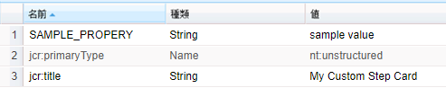

1. Configure the properties on the node `cq:listeners`.

   `cq:listener` ノードとそのプロパティを利用すると、ステップをモデルページにドラッグしたり、ステップのプロパティを編集したりして、タッチ操作対応 UI のモデルエディターでイベントに対処するイベントハンドラーを設定できます。

   **対象プロパティ：**

   * `afterMove: REFRESH_PAGE`
   * `afterdelete: CQ.workflow.flow.Step.afterDelete`
   * `afteredit: CQ.workflow.flow.Step.afterEdit`
   * `afterinsert: CQ.workflow.flow.Step.afterInsert`

   この設定は、エディターを適切に機能させるために必要です。ほとんどのケースで、この設定は変更しないでください。

   ただし、`cq:inherit` を true に設定した場合は（`cq:editConfig` ノードで設定します。上記を参照）、この設定を継承できるので、ステップの定義に明示的に含める必要はありません。継承が存在しない場合は、次のプロパティと値を持つこのノードを追加する必要があります。

   次の例では継承が有効になっているので、`cq:listeners` ノードを削除できます。削除しても、ステップは正常に機能します。

   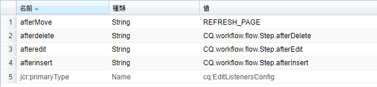

1. これで、ステップのインスタンスをワークフローモデルに追加できます。ステップを&#x200B;**設定**&#x200B;する際は、次のダイアログが表示されます。

   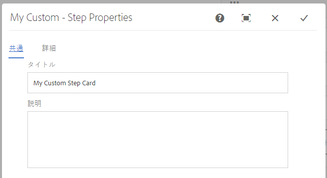 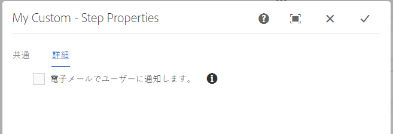

#### この例で使用するマークアップのサンプル {#sample-markup-used-in-this-example}

Markup for a custom step is be represented in the `.content.xml` of the component root node. The sample `.content.xml` used for this example:

`/apps/cq/workflow/components/model/myCustomStep/.content.xml`

```xml
<?xml version="1.0" encoding="UTF-8"?>
<jcr:root xmlns:sling="https://sling.apache.org/jcr/sling/1.0" xmlns:cq="https://www.day.com/jcr/cq/1.0" xmlns:jcr="https://www.jcp.org/jcr/1.0"
    cq:icon="bell"
    jcr:primaryType="cq:Component"
    jcr:title="My Custom Step"
    sling:resourceSuperType="cq/workflow/components/model/process"
    allowedParents="[*/parsys]"
    componentGroup="Workflow"/>
```

The `_cq_editConfig.xml` sample used in this example:

```xml
<?xml version="1.0" encoding="UTF-8"?>
<jcr:root xmlns:cq="https://www.day.com/jcr/cq/1.0" xmlns:jcr="https://www.jcp.org/jcr/1.0" xmlns:nt="https://www.jcp.org/jcr/nt/1.0"
    cq:disableTargeting="{Boolean}true"
    cq:inherit="{Boolean}true"
    jcr:primaryType="cq:EditConfig">
    <cq:formParameters
        jcr:primaryType="nt:unstructured"
        jcr:title="My Custom Step Card"
        SAMPLE_PROPERY="sample value"/>
    <cq:listeners
        jcr:primaryType="cq:EditListenersConfig"
        afterdelete="CQ.workflow.flow.Step.afterDelete"
        afteredit="CQ.workflow.flow.Step.afterEdit"
        afterinsert="CQ.workflow.flow.Step.afterInsert"
        afterMove="REFRESH_PAGE"/>
</jcr:root>
```

The `_cq_dialog/.content.xml` sample used in this example:

```xml
<?xml version="1.0" encoding="UTF-8"?>
<jcr:root xmlns:sling="https://sling.apache.org/jcr/sling/1.0" xmlns:cq="https://www.day.com/jcr/cq/1.0" xmlns:jcr="https://www.jcp.org/jcr/1.0" xmlns:nt="https://www.jcp.org/jcr/nt/1.0"
    jcr:primaryType="nt:unstructured"
    jcr:title="My Custom - Step Properties"
    sling:resourceType="cq/gui/components/authoring/dialog">
    <content
        jcr:primaryType="nt:unstructured"
        sling:resourceType="granite/ui/components/coral/foundation/tabs">
        <items jcr:primaryType="nt:unstructured">
            <common
                cq:hideOnEdit="true"
                jcr:primaryType="nt:unstructured"
                jcr:title="Common"
                sling:resourceType="granite/ui/components/coral/foundation/fixedcolumns"/>
            <process
                cq:hideOnEdit="true"
                jcr:primaryType="nt:unstructured"
                jcr:title="Process"
                sling:resourceType="granite/ui/components/coral/foundation/fixedcolumns"/>
            <mycommon
                jcr:primaryType="nt:unstructured"
                jcr:title="Common"
                sling:resourceType="granite/ui/components/coral/foundation/fixedcolumns">
                <items jcr:primaryType="nt:unstructured">
                    <columns
                        jcr:primaryType="nt:unstructured"
                        sling:resourceType="granite/ui/components/coral/foundation/container">
                        <items jcr:primaryType="nt:unstructured">
                            <title
                                jcr:primaryType="nt:unstructured"
                                sling:resourceType="granite/ui/components/coral/foundation/form/textfield"
                                fieldLabel="Title"
                                name="./jcr:title"/>
                            <description
                                jcr:primaryType="nt:unstructured"
                                sling:resourceType="granite/ui/components/coral/foundation/form/textarea"
                                fieldLabel="Description"
                                name="./jcr:description"/>
                        </items>
                    </columns>
                </items>
            </mycommon>
            <advanced
                jcr:primaryType="nt:unstructured"
                jcr:title="Advanced"
                sling:resourceType="granite/ui/components/coral/foundation/fixedcolumns">
                <items jcr:primaryType="nt:unstructured">
                    <columns
                        jcr:primaryType="nt:unstructured"
                        sling:resourceType="granite/ui/components/coral/foundation/container">
                        <items jcr:primaryType="nt:unstructured">
                            <email
                                jcr:primaryType="nt:unstructured"
                                sling:resourceType="granite/ui/components/coral/foundation/form/checkbox"
                                fieldDescription="Notify user via email."
                                fieldLabel="Email"
                                name="./metaData/PROCESS_AUTO_ADVANCE"
                                text="Notify user via email."
                                value="true"/>
                        </items>
                    </columns>
                </items>
            </advanced>
        </items>
    </content>
</jcr:root>
```

>[!NOTE]
>
>ダイアログの定義に含まれている共通のプロセスノードに注目してください。これらのノードは、カスタムステップのスーパータイプとして使用したプロセスステップから継承したものです。
>
>`sling:resourceSuperType : cq/workflow/components/model/process`

>[!NOTE]
>
>クラシック UI のモデルエディターのダイアログは、標準のタッチ操作対応 UI のエディターでも利用できます。
>
>ただし、クラシック UI のステップダイアログを標準の UI のダイアログにアップグレードする場合は、AEM の[ダイアログ変換](/help/sites-developing/dialog-conversion.md)ツールを利用できます。変換後も、特定の用途に合わせてダイアログに手動で変更を加えることができます。
>
>* In cases where an upgraded dialog is empty you can look at dialogs in `/libs` that have similar functionality as examples of how to provide a solution. 次に例を示します。
   >
   >
* `/libs/cq/workflow/components/model`
>* `/libs/cq/workflow/components/workflow`
>* `/libs/dam/components`
>* `/libs/wcm/workflow/components/autoassign`
>* `/libs/cq/projects`

>
>  
You must not modify anything in `/libs`, simply use them as examples. If you want to leverage any of the existing steps, copy them to `/apps` and modify them there.
