# ワークフローモデルの作成{#creating-workflow-models}

>[!CAUTION]
>
>クラシック UI の使用方法については、[AEM 6.3 のドキュメント](https://helpx.adobe.com/experience-manager/6-3/help/sites-developing/workflows-models.html)を参照してください。

ワークフローを開始したときに実行される一連のステップを定義するには、[ワークフローモデル](/help/sites-developing/workflows.md#model)を作成します。ワークフローを一時的にするか、複数のリソースを使用するかなど、モデルのプロパティを定義することもできます。

ユーザーがワークフローを開始すると、インスタンスが開始されます。これは対応するランタイムモデルです。変更内容を[同期](#sync-your-workflow-generate-a-runtime-model)すると作成されます。

## 新しいワークフローの作成 {#creating-a-new-workflow}

初めて作成する新しいワークフローモデルには、次のものが含まれています。

* The steps, **Flow Start** and **Flow End**.
これらのステップは、ワークフローの始まりと終わりを表します。これらの手順は必須で、編集/削除はできません。
* An example **Participant** step named **Step 1**.
このステップは、作業項目をワークフロー開始者に割り当てるように設定されています。このステップを編集または削除し、必要に応じてステップを追加します。

エディターを使用して新しいワークフローを作成するには：

1. Open the **Workflow Models** console; via **Tools**, **Workflow**, **Models** or, for example: [https://localhost:4502/aem/workflow](https://localhost:4502/aem/workflow)
1. 「**作成**」を選択してから、「**モデルを作成**」を選択します。
1. **ワークフローモデルを追加**&#x200B;ダイアログが表示されます。「**タイトル**」と「**名前**」（オプション）を入力してから、「**完了**」を選択します。
1. The new model is listed in the **Workflow Models** console.
1. 新しいワークフローを選択し、[**「編集**」をクリックすると、ワークフローが設定のために開かれます](#editinganexistingworkflow)。
   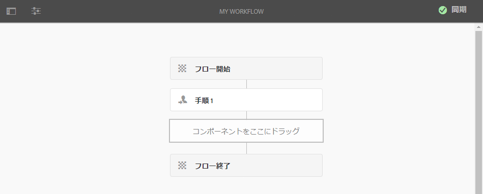

>[!NOTE]
>
>（CRX パッケージを使用して）プログラムによってモデルを作成する場合は、次の場所にサブフォルダーを作成することもできます。
>
>`/var/workflow/models`
>
>例：`/var/workflow/models/prototypes`
>
>このフォルダーは、[そのフォルダー内のモデルへのアクセス権を管理](/help/sites-administering/workflows-managing.md#create-a-subfolder-in-var-workflow-models-and-apply-the-acl-to-that)するために利用できます。

## ワークフローの編集 {#editing-a-workflow}

既存のワークフローモデルを編集して、次のことができます。

* [ステップ](#addingasteptoamodel-)と[パラメーター](#configuring-a-workflow-step)を定義する
* [ステージ](#configuring-workflow-stages-that-show-workflow-progress)、[ワークフローを一時的にする](#creatingatransientworkflow-)か、[複数のリソースを使用する](#configuring-a-workflow-for-multi-resource-support)かなど、ワークフロープロパティを設定する

[**デフォルトおよびレガシー**（初期設定）のワークフロー](#editing-a-default-or-legacy-workflow-for-the-first-time)を編集する場合は、変更を加える前に、[セーフコピー](/help/sites-developing/workflows-best-practices.md#locations-workflow-models)を作成する追加の手順が必要になります。

ワークフローの変更を完了するには、「**同期**」を使用して、**ランタイムモデルを生成**&#x200B;する必要があります。詳しくは、[ワークフローの同期](#sync-your-workflow-generate-a-runtime-model)を参照してください。

### ワークフローの同期 - ランタイムモデルの生成 {#sync-your-workflow-generate-a-runtime-model}

「**同期**」（エディターのツールバーの右側）をクリックすると、[ランタイムモデル](/help/sites-developing/workflows.md#runtime-model)が生成されます。ランタイムモデルは、ユーザーがワークフローを開始したときに実際に使用されるモデルです。変更内容を&#x200B;**同期**&#x200B;しない場合は、その変更内容は実行時には反映されません。

ワークフローに変更を加えた場合は、「**同期**」をクリックしてランタイムモデルを生成する必要があります。個々のダイアログ（ステップなど）に保存オプションがある場合でも同様です。

変更内容がランタイム（保存済み）モデルと同期されると、「**同期済み**」に表示が変わります。

ステップによっては必須のフィールドや組み込みの検証が含まれている場合があります。こうした条件を満たしていない場合は、モデルの&#x200B;**同期**&#x200B;をおこなうと、エラーが表示されます。例えば次のように、**参加者**&#x200B;ステップで参加者が定義されていない場合などです。

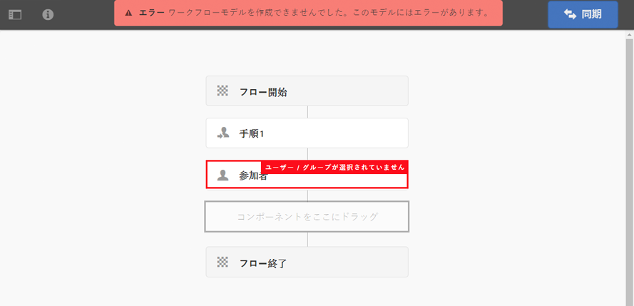

### デフォルトまたはレガシーのワークフローの初回編集時 {#editing-a-default-or-legacy-workflow-for-the-first-time}

[デフォルトまたはレガシーのモデル](/help/sites-developing/workflows.md#workflow-types)を開いて編集する際は、次の点に注意してください。

* ステップブラウザーを利用できません（左側）。
* ツールバーで「**編集**」操作を利用できます（右側）。
* 次の理由から、最初はモデルとそのプロパティが読み取り専用モードで開かれます。
   * Default workflows are located in `/libs`
   * Legacy workflows are located in `/etc`
Selecting 
**編集する** :
* take a copy of the workflow into `/conf`
* ステップブラウザーを利用できるようになります。
* 変更を加えられるようになります。

>[!NOTE]
>
>詳しくは、[ワークフローモデルの場所](/help/sites-developing/workflows-best-practices.md#locations-workflow-models)を参照してください。

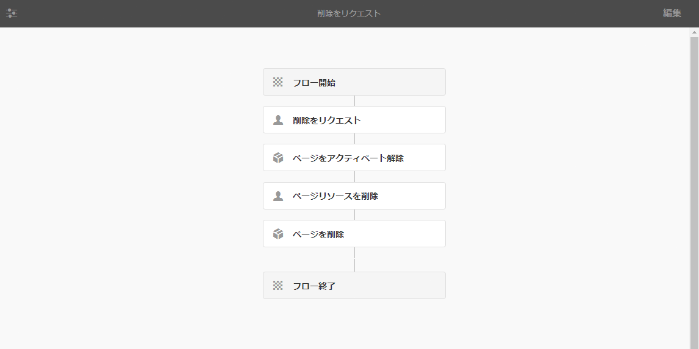

### モデルにステップを追加 {#adding-a-step-to-a-model}

実行するアクティビティを表すために、ステップをモデルに追加する必要があります。各ステップは固有のアクティビティを実行します。標準の AEM インスタンスには、いくつかのステップコンポーネントが用意されています。

モデルを編集する際は、**ステップブラウザー**&#x200B;の様々なグループに利用可能なステップが表示されます。次に例を示します。

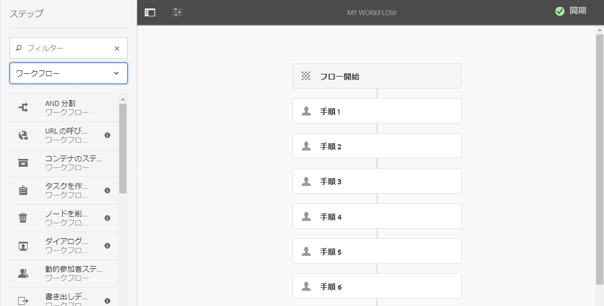

>[!NOTE]
>
>AEM と共にインストールされる主なステップコンポーネントについては、[ワークフローステップのリファレンス](/help/sites-developing/workflows-step-ref.md)を参照してください。

ワークフローモデルへのステップの追加手順

1. 編集する既存のワークフローモデルを開きます。From the **Workflows Model** console, select the required model, then **Edit**.
1. **サイドパネルを切り替え**（上部ツールバーの左端）を使用してステップブラウザーを開きます。ここでは、以下のことができます。

   * **フィルター**&#x200B;を使用して特定のステップのみを表示する。
   * ドロップダウンセレクターを使用して、選択対象を特定のステップのグループに限定する。
   * Select the Show Description icon  to show more details about the appropriate step.

   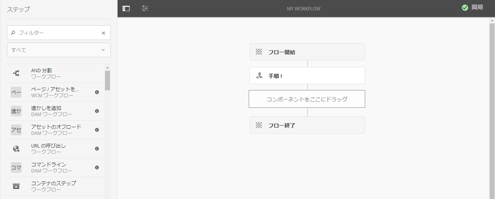

1. 対象のステップをドラッグしてモデル内の目的の場所に移動します。

   **参加者ステップ**&#x200B;などです。

   フローに追加した[ステップは設定を変更](#configuring-a-workflow-step)できます。

   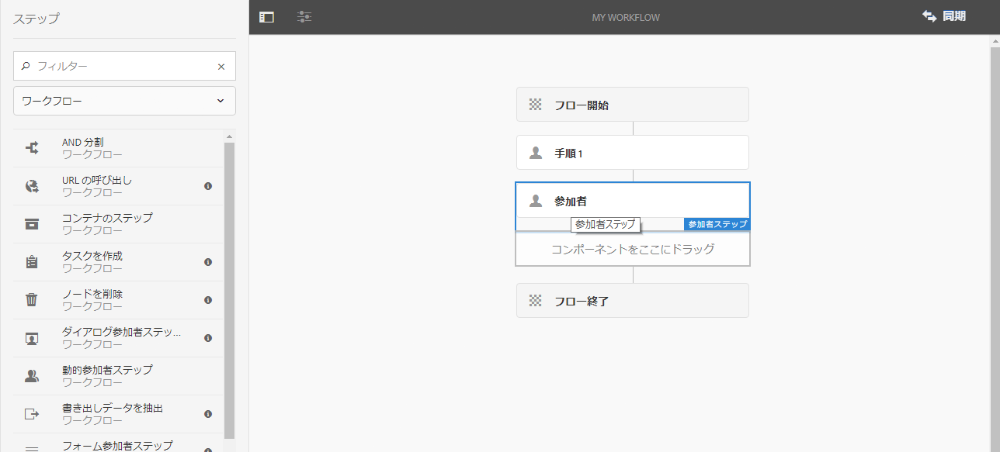

1. 必要に応じてステップを追加したり、変更を加えたりします。

   実行時には、ステップがモデル内に配置されている順序で実行されます。いったん追加したステップコンポーネントを、モデル内の別の場所にドラッグすることもできます。

   [ページエディター](/help/sites-authoring/editing-content.md)と同様に、ステップのコピー、切り取り、貼り付け、グループ分け、削除をおこなうこともできます。

   Split steps can also be collapsed/expanded using the toolbar option: 

1. 「**同期**」（エディターツールバー）をクリックして変更内容を確定し、ランタイムモデルを生成します。

   詳しくは、[ワークフローの同期](#sync-your-workflow-generate-a-runtime-model)を参照してください。

### ワークフローステップの設定 {#configuring-a-workflow-step}

**ステップのプロパティ**&#x200B;ダイアログを使用して、ワークフローステップの動作を&#x200B;**設定**&#x200B;およびカスタマイズできます。

1. ステップに対応する&#x200B;**ステップのプロパティ**&#x200B;ダイアログを開くには、次のどちらかを実行します。

   * Click/tap the* *step in the workflow model and select **Configure** from the component toolbar.

   * ステップをダブルクリックします。
   >[!NOTE]
   >
   >AEM と共にインストールされる主なステップコンポーネントについては、[ワークフローステップのリファレンス](/help/sites-developing/workflows-step-ref.md)を参照してください。

1. 必要に応じて&#x200B;**ステップのプロパティ**&#x200B;を設定します。利用できるプロパティはステップのタイプによって異なります。複数のタブが表示されることもあります。For example, the default **Participant Step**, present in a new workflow as `Step 1`:

   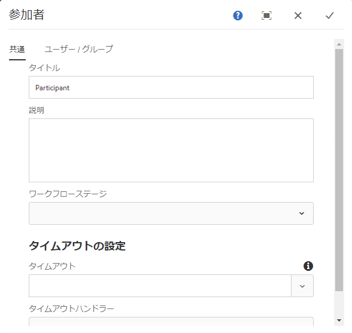

1. チェックマークをクリックして、変更内容を確認します。
1. 「**同期**」（エディターツールバー）をクリックして変更内容を確定し、ランタイムモデルを生成します。

   詳しくは、[ワークフローの同期](#sync-your-workflow-generate-a-runtime-model)を参照してください。

### 一時的ワークフローの作成 {#creating-a-transient-workflow}

新しいモデルを作成するときに、または既存のモデルに手を加えて、[一時的](/help/sites-developing/workflows.md#transient-workflows)ワークフローモデルを作成することができます。

1. [編集](#editinganexistingworkflow)するワークフローモデルを開きます。
1. ツールバーから「**ワークフローモデルのプロパティ**」を選択します。
1. In the dialog activate **Transient Workflow** (or deactivate if required):

   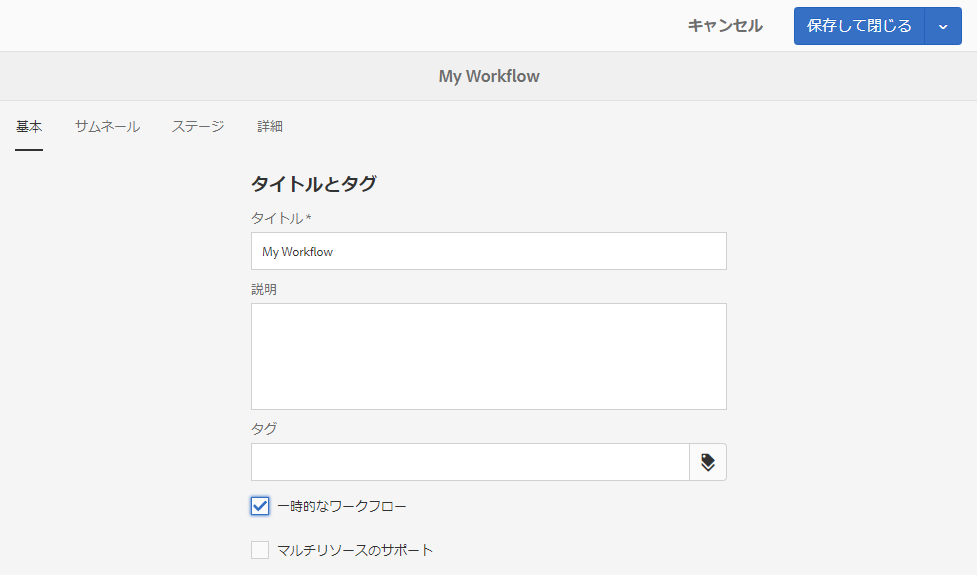

1. 「**保存して閉じる**」をクリックし、「**同期**」（エディターツールバー）をクリックして変更内容を確定し、ランタイムモデルを生成します。

   詳しくは、[ワークフローの同期](#sync-your-workflow-generate-a-runtime-model)を参照してください。

>[!NOTE]
>
>ワークフローを[一時的](/help/sites-developing/workflows.md#transient-workflows)モードでした場合は、AEM にはワークフロー履歴が保存されません。したがって、そのワークフローに関連する情報は、[タイムライン](/help/sites-authoring/basic-handling.md#timeline)に表示されません。[](/help/sites-authoring/basic-handling.md#timeline)

## タッチ UI でワークフローモデルを使用可能にする {#classic2touchui}

If a workflow model is present in Classic UI, but missing in the selection popup menu in the **[!UICONTROL Timeline]** rail of Touch UI, then follow the configuration to make it available. 次の手順は、アクティベーションの **[!UICONTROL 要求と呼ばれるワークフローモデルの使用を説明しています]**。

1. 該当するモデルがタッチ対応 UI で使用できないことを確認します。Access an asset using `/assets.html/content/dam` path. アセットを選択します。左レールの「**[!UICONTROL タイムライン]**」を開きます。「 **[!UICONTROL 開始ワークフロー]** 」をクリックし、「アクティベーション **[!UICONTROL 要求]** 」モデルがポップアップリストに存在しないことを確認します。

1. **[!UICONTROL ツール/一般/タグ付けに移動します]**。 「**[!UICONTROL ワークフロー]**」を選択します。

1. Select **[!UICONTROL Create > Create Tag]**. Set **[!UICONTROL Title]** as `DAM` and **[!UICONTROL Name]** as `dam`. 「**[!UICONTROL 送信]**」を選択します。
   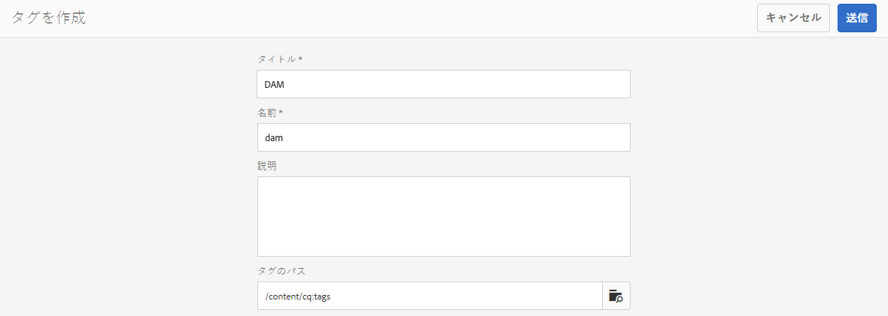

1. Navigate to **[!UICONTROL Tools > Workflow > Models]**. 「 **[!UICONTROL アクティベーションの]**&#x200B;要求 **[!UICONTROL 」を選択し、「]**&#x200B;編集」を選択します。

1. 「 **[!UICONTROL 編集]**」を選択し、 **[!UICONTROL ページ情報]** メニューを開き、「 **[!UICONTROL 開くプロパティ]** 」を選択して「 **** 基本」タブに移動します（まだ開いていない場合）。

1. 「タグ `Workflow : DAM` 」フィ追加ールドに追加します **** 。 選択を確認し、チェックマークを付けます。

1. 「 **[!UICONTROL 保存して閉じる]**」でタグの追加を確認します。
   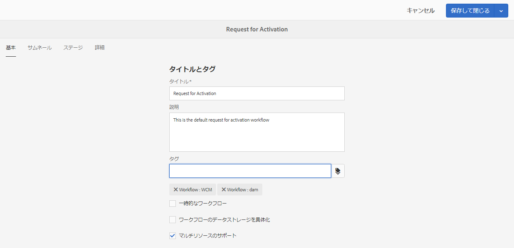

1. 「 **[!UICONTROL 同期]**」を使用してプロセスを完了します。 タッチ対応UIでワークフローが利用できるようになりました。

### マルチリソースのサポートのためのワークフローの設定 {#configuring-a-workflow-for-multi-resource-support}

新しいモデルを作成するときに、または既存のモデルに手を加えて、[マルチリソースのサポート](/help/sites-developing/workflows.md#multi-resource-support)のためのワークフローモデルを設定できます。

1. [編集](#editinganexistingworkflow)するワークフローモデルを開きます。
1. ツールバーから「**ワークフローモデルのプロパティ**」を選択します。

1. In the dialog activate **Multi Resource Support** (or deactivate if required):

   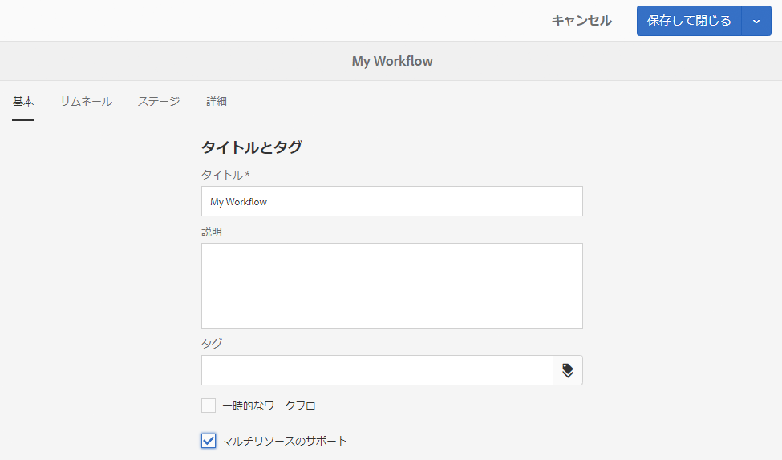

1. 「**保存して閉じる**」をクリックし、「**同期**」（エディターツールバー）をクリックして変更内容を確定し、ランタイムモデルを生成します。

   詳しくは、[ワークフローの同期](#sync-your-workflow-generate-a-runtime-model)を参照してください。

### Configuring Workflow Stages (that show Workflow Progress) {#configuring-workflow-stages-that-show-workflow-progress}

[ワークフローステージ](/help/sites-developing/workflows.md#workflow-stages)は、タスクを処理するときにワークフローの進行状況を確認するのに役立ちます。

>[!CAUTION]
>
>ワークフローステージが&#x200B;**ページのプロパティ**&#x200B;で定義されていても、いずれのワークフローステップでも使用されない場合は、（現在のワークフローステップに関係なく）進行状況バーに進行状況は表示されません。

使用可能なステージは、ワークフローモデルで定義されます。既存のワークフローモデルを更新すると、ステージの定義を含めることができます。ワークフローモデルに対して任意の数のステージを定義できます。

ワークフローの&#x200B;**ステージ**&#x200B;を定義するには：

1. 編集するワークフローモデルを開きます。
1. ツールバーから「**ワークフローモデルのプロパティ**」を選択します。「**ステージ**」タブを開きます。
1. 必要な&#x200B;**ステージ**&#x200B;を追加（および配置）します。ワークフローモデルに対して任意の数のステージを定義できます。

   次に例を示します。

   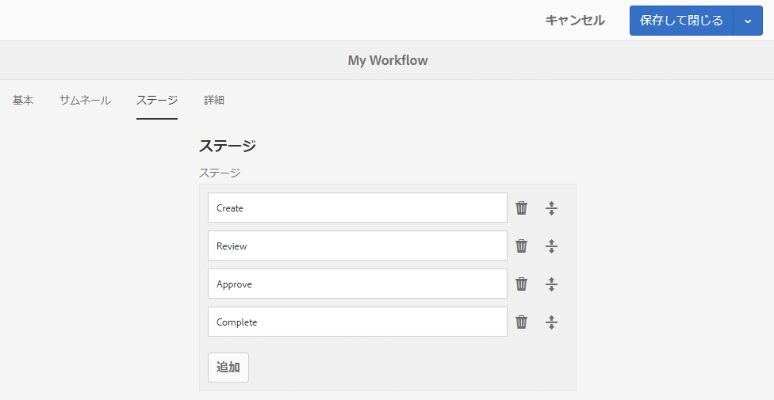

1. 「**保存して閉じる**」をクリックしてプロパティを保存します。
1. ワークフローモデルの各ステップにステージを割り当てます。次に例を示します。

   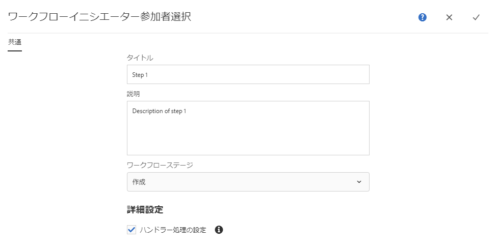

   1 つのステージを複数のステップに割り当てることができます。次に例を示します。

   | **ステップ** | **ステージ** |
   |---|---|
   | 手順 1 | 作成 |
   | ステップ 2 | 作成 |
   | ステップ 3 | レビュー |
   | ステップ 4 | 承認 |
   | ステップ 5 | 承認 |
   | ステップ 6 | 完了 |

1. 「**同期**」（エディターツールバー）をクリックして変更内容を確定し、ランタイムモデルを生成します。

   詳しくは、[ワークフローの同期](#sync-your-workflow-generate-a-runtime-model)を参照してください。

## パッケージのワークフローモデルのエクスポート {#exporting-a-workflow-model-in-a-package}

パッケージのワークフローモデルをエクスポートする方法は次のとおりです。

1. [パッケージマネージャー](/help/sites-administering/package-manager.md#package-manager)を使用して新しいパッケージを作成します。

   1. **ツール**／**導入**／**パッケージ**&#x200B;に移動してパッケージマネージャーにアクセスします。

   1. 「**パッケージを作成**」をクリックします。
   1. **パッケージ名**&#x200B;と、その他の必要な情報を指定します。
   1. 「**OK**」をクリックします。

1. 新しいパッケージのツールバーの「**編集**」をクリックします。

1. 「**フィルター**」タブを開きます。

1. 「**フィルターを追加**」を選択し、ワークフローモデルの設計&#x200B;**&#x200B;のパスを指定します。

   `/conf/global/settings/workflow/models/<*your-model-name*>`

   「**完了**」をクリックします。

1. 「**フィルターを追加**」を選択し、ランタイムワークフローモデルのパスを指定します。**

   `/var/workflow/models/<*your-model-name*>`

   「**完了**」をクリックします。

1. モデルで使用されるカスタムスクリプトのフィルターを追加します。
1. 「**保存**」をクリックしてフィルターの定義を確定します。
1. パッケージ定義のツールバーの「**ビルド**」を選択します。
1. パッケージのツールバーの「**ダウンロード**」を選択します。

## ワークフローを使用したフォーム送信処理 {#using-workflows-to-process-form-submissions}

フォームを特定のワークフローで処理するように設定できます。ユーザーがフォームを送信すると、フォームの送信データをペイロードとして持つ新しいワークフローインスタンスが作成されます。

フォームを使用するためのワークフローの設定手順

1. 新しいページを作成して、編集用に開きます。
1. **フォーム**&#x200B;コンポーネントをページに追加します。
1. ページに表示された&#x200B;**フォーム開始**&#x200B;コンポーネントを&#x200B;**設定**&#x200B;します。
1. Use **Start Workflow** to select the desired workflow from those available:

   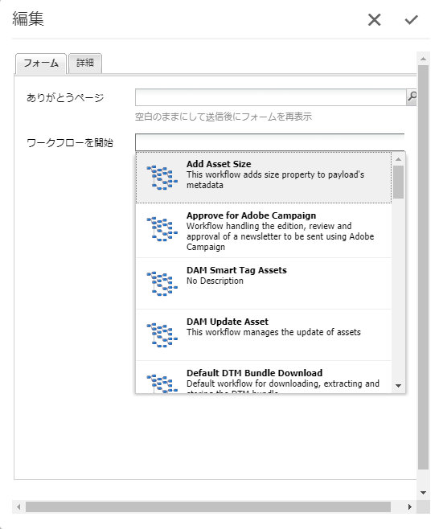

1. チェックマークをクリックして、新しいフォーム設定を確認します。

## ワークフローのテスト {#testing-workflows}

ワークフローのテスト時には、開発時のタイプと異なるものも含め、様々なペイロードタイプを使用してワークフローをテストすることをお勧めします。例えば、アセットを処理するワークフローの場合、ページをペイロードとして設定して、ワークフローでエラーがスローされないことを確認します。

例えば、新しいワークフローを次のようにテストします。

1. [コンソールからワークフローモデル](/help/sites-administering/workflows-starting.md) を開始します。
1. **ペイロード**&#x200B;を定義して確定します。

1. ワークフローが進行するように、必要なアクションを実行します。
1. ワークフローの動作中にログファイルを監視します。

ログファイルに&#x200B;**デバッグ**&#x200B;メッセージを記録するように AEM を設定することもできます。See [Logging](/help/sites-deploying/configure-logging.md) for further information and when the development is finished, set the **Log Level** back to **Info**.

## 例 {#examples}

### 例：公開のリクエストを承認／拒否する（単純な）ワークフローの作成 {#example-creating-a-simple-workflow-to-accept-or-reject-a-request-for-publication}

To illustrate some of the possibilities for creating a workflow, the following example creates a variation of the `Publish Example` workflow.

1. [新しいワークフローモデルを作成](#creating-a-new-workflow)します。

   新しいワークフローには、次のステップが含まれます。

   * **フロー開始**
   * `Step 1`
   * **フロー終了**

1. `Step 1` を削除します（この例には不適切なステップタイプです）。

   * Click on the step and select **Delete** from the component toolbar. アクションを確定します。

1. From the **Workflow** selection of the steps browser, drag a **Participant Step** onto the workflow and position it between **Flow Start** and **Flow End**.
1. 次のいずれかの方法でプロパティダイアログを開きます。

   * Click on the participant step and select **Configure** from the component toolbar.
   * 参加者ステップをダブルクリックします。

1. 「**共通**」タブで、「`Validate Content`タイトル&#x200B;**」と「**&#x200B;説明&#x200B;**」の両方に** と入力します。
1. 「**ユーザー / グループ**」タブを開きます。

   * 「**電子メールでユーザーに通知します**」を有効にします。
   * Select `Administrator` ( `admin`) for the **User/Group** field.

   >[!NOTE]
   >
   >電子メールを送信するには、[メールサービスとユーザーアカウントの詳細を設定する必要があります](/help/sites-administering/notification.md)。

1. チェックマークをクリックして、変更内容を確認します。

   You will be returned to the overview of the workflow model, here the participant step will have been renamed to `Validate Content`.

1. Drag an **Or Split** onto the workflow and position it between `Validate Content` and **Flow End**.
1. **OR 分割**&#x200B;を設定用に開きます。
1. 設定:

   * **共通**：分割名を指定します。
   * **ブランチ 1**：「**デフォルトのルート**」を選択します。

   * **ブランチ 2**：「**デフォルトのルート**」を選択しません。

1. **OR 分割**&#x200B;の変更内容を確定します。
1. **参加者ステップ**&#x200B;を左側のブランチにドラッグし、プロパティを開き、次の値を指定してから変更内容を確定します。

   * **タイトル**: `Reject Publish Request`

   * **ユーザー / グループ**：`projects-administrators` など

   * **電子メールでユーザーに通知**:ユーザーに電子メールで通知する場合にアクティブ化します。

1. **プロセスステップ**&#x200B;を右側のブランチにドラッグし、プロパティを開き、次の値を指定してから変更内容を確定します。

   * **タイトル**: `Publish Page as Requested`

   * **プロセス**:を選択 `Activate Page`します。 このプロセスは、選択されているページをパブリッシュインスタンスに公開します。

1. 「**同期**」（エディターのツールバー）をクリックし、ランタイムモデルを生成します。

   詳しくは、[ワークフローの同期](#sync-your-workflow-generate-a-runtime-model)を参照してください。

   新しいワークフローモデルは次のようになります。

   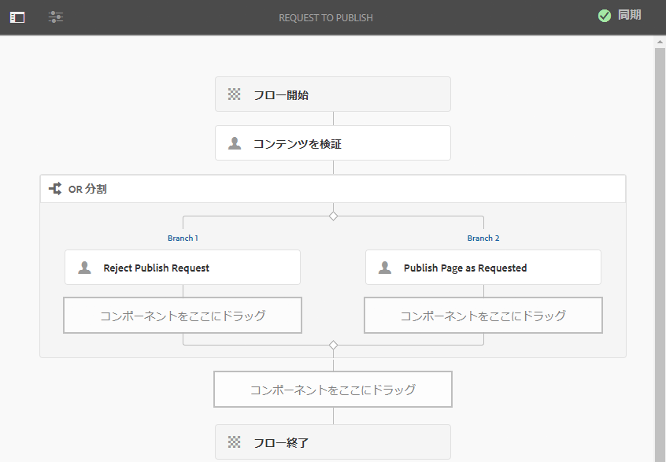

1. このワークフローをページに適用します。その結果、ユーザーが「**コンテンツを検証**」ステップの「**完了**」に移動すると、「**リクエストに応じてページを公開**」と「**公開リクエストを拒否**」のどちらを実行するかを選択できます。

   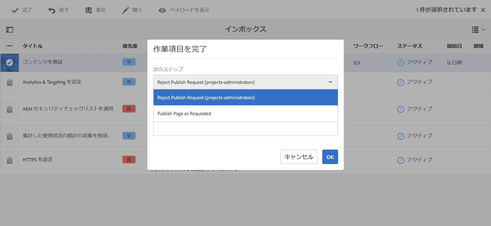

### 例：ECMA スクリプトを使用した OR 分割のルールの定義 {#defineruleecmascript}

**OR 分割**&#x200B;ステップを使用すると、ワークフローに条件分岐の処理パスを導入できます。

OR ルールを定義するには、次の手順に従います。

1. 2 つのスクリプトを作成して、リポジトリ内の次の場所などに保存します。

   `/apps/myapp/workflow/scripts`

   >[!NOTE]
   >
   >The scripts must have a [function `check()`](#function-check) that returns a boolean.

1. ワークフローを編集し、**OR 分割**&#x200B;をモデルに追加します。
1. **OR 分割**&#x200B;の&#x200B;**ブランチ 1** のプロパティを編集します。

   * Define this as the **Default Route** by setting the **Value** to `true`.

   * As **Rule**, set the path to the script. 次に例を示します。
      `/apps/myapp/workflow/scripts/myscript1.ecma`
   >[!NOTE]
   >
   >必要に応じて、分岐の順序を切り替えることができます。

1. **OR 分割**&#x200B;の&#x200B;**ブランチ 2** のプロパティを編集します。

   * As **Rule**, set the path to the other script. 次に例を示します。
      `/apps/myapp/workflow/scripts/myscript2.ecma`

1. 各ブランチ内の個々のステップのプロパティを設定します。Make sure the **User/Group** is set.
1. 「**同期**」（エディターのツールバー）をクリックして、ランタイムモデルに対する変更を保持します。

   詳しくは、[ワークフローの同期](#sync-your-workflow-generate-a-runtime-model)を参照してください。

#### 関数 Check() {#function-check}

>[!NOTE]
>
>[ECMAScript の使用](/help/sites-developing/workflows-customizing-extending.md#using-ecmascript)を参照してください。

The following sample script returns `true` if the node is a `JCR_PATH` located under `/content/we-retail/us/en`:

```
function check() {
    if (workflowData.getPayloadType() == "JCR_PATH") {
      var path = workflowData.getPayload().toString();
      var node = jcrSession.getItem(path);

      if (node.getPath().indexOf("/content/we-retail/us/en") >= 0) {
       return true;
      } else {
       return false;
      }
     } else {
      return false;
     }
}
```

### 例：アクティベーション用にカスタマイズされたリクエスト {#example-customized-request-for-activation}

標準提供のワークフローは、いずれもカスタマイズすることができます。動作をカスタマイズするには、適切なワークフローの詳細をオーバーレイします。

例えば、**アクティベーションをリクエスト**&#x200B;をカスタマイズするとします。このワークフローは、**サイト**&#x200B;内でページを公開するために使用され、コンテンツ作成者が適切なレプリケーション権限を持っていない場合に自動的に実行されます。See [Customizing Page Authoring - Customizing the Request for Activation Workflow](/help/sites-developing/customizing-page-authoring-touch.md#customizing-the-request-for-activation-workflow) for further details.
