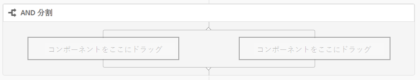
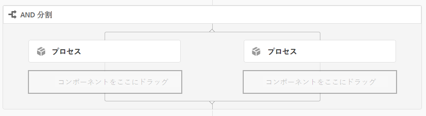
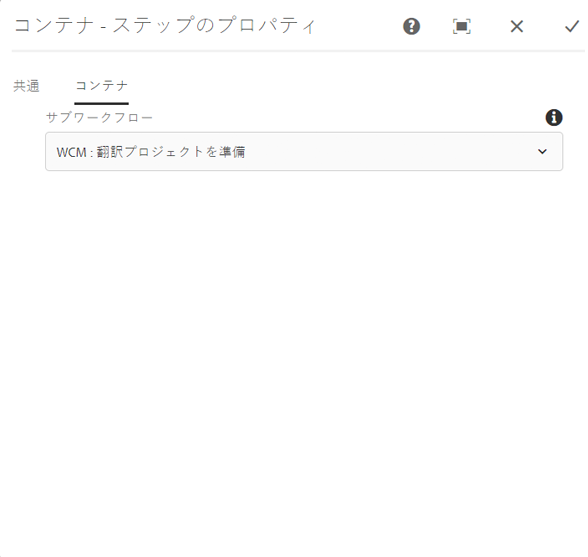
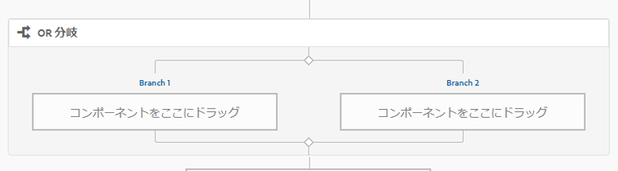
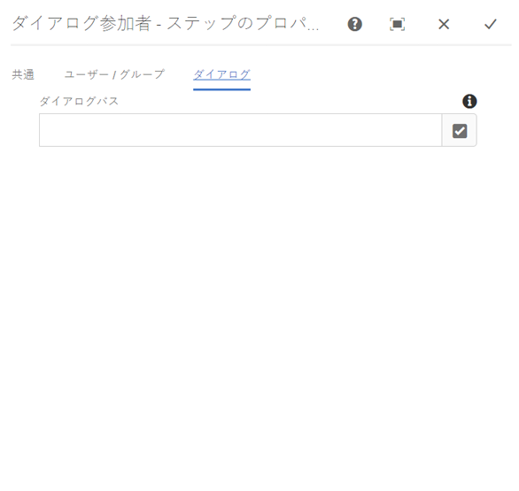
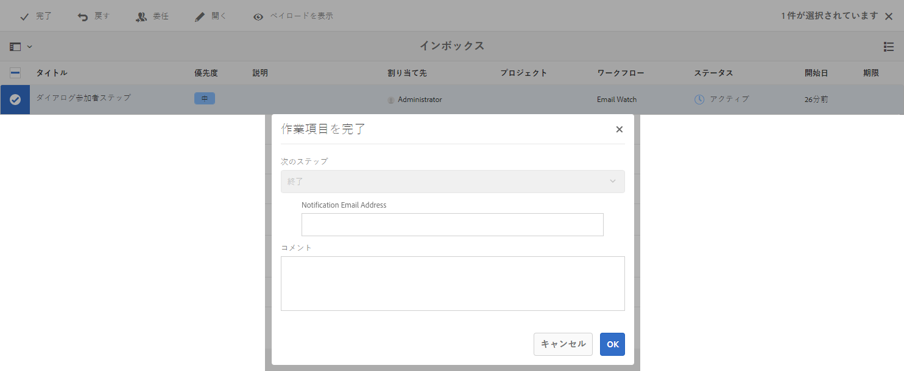
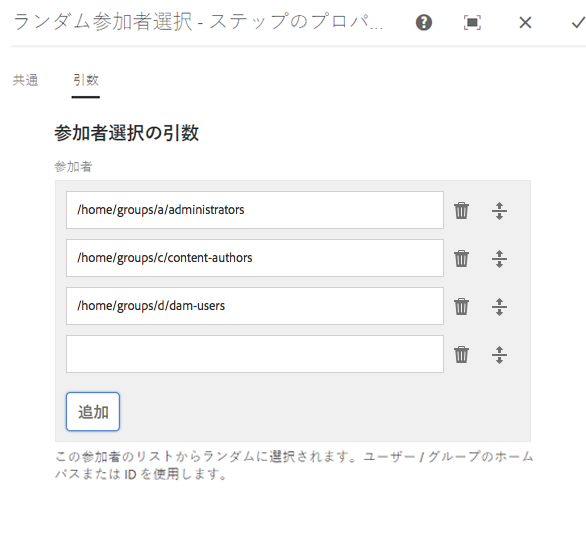
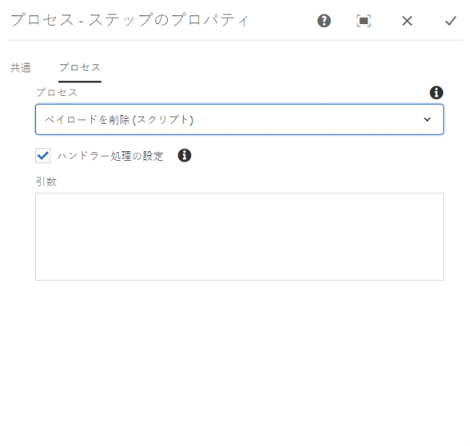
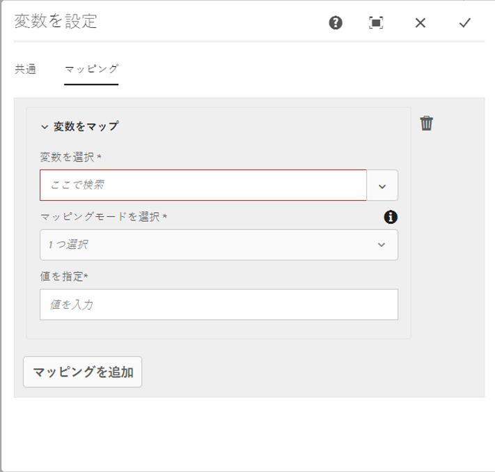

# ワークフローステップのリファレンス {#workflow-step-reference}

ワークフローモデルは、各種タイプの一連のステップで構成されます。これらのステップを、それぞれのタイプに応じてパラメーターやスクリプトで設定および拡張し、必要な機能とコントロールを実現することができます。

>[!NOTE]
>
>この節では、標準ワークフローのステップについて説明します。
>
>モジュール固有のステップについては、次の資料も参照してください。
>
>* [AEM Forms ワークフローステップのリファレンス](/help/forms/using/aem-forms-workflow-step-reference.md)
>* [メディアハンドラーとワークフローを使用したアセットの処理](/help/assets/media-handlers.md)

>


## ステップのプロパティ {#step-properties}

各ステップコンポーネントには、必要なプロパティを定義および編集できる&#x200B;**ステップのプロパティ**&#x200B;ダイアログがあります。

### ステップのプロパティ - 「共通」タブ {#step-properties-common-tab}

大部分のワークフローステップコンポーネントでは、プロパティダイアログの「**共通**」タブで、次のプロパティを組み合わせて使用できます。

* **タイトル**&#x200B;ステップのタイトル。

* **説明**&#x200B;ステップの説明。

* **ワークフローステージ**

   A drop down selector to apply a [Stage](/help/sites-developing/workflows.md#workflow-stages) to the step.

* **タイムアウト**

   ステップが「タイムアウト」されるまでの期間。
You can select between: **Off**, **Immediate**, **1h**, **6h**, **12h**, **24h**.

* **タイムアウトハンドラー**

   ステップがタイムアウトしたときにワークフローを制御するハンドラ。例：
   `Auto Advancer`

* **ハンドラー処理の設定**

   実行後、ワークフローを自動的に次の手順に進める場合は、このオプションを選択します。 選択しない場合、実装スクリプトでワークフローの進行を処理する必要があります。

### ステップのプロパティ - 「ユーザー／グループ」タブ {#step-properties-user-group-tab}

多くのワークフローステップコンポーネントでは、プロパティダイアログの「**ユーザー／グループ**」タブで、次のプロパティを使用できます。

* **電子メールでユーザーに通知します**

   * ワークフローがステップに到達したときに、参加者に電子メールを送信して通知できます。
   * 有効にすると、**User/Group** プロパティによって定義されたユーザーに、またはグループが定義されている場合はグループの各メンバーに、電子メールが送信されます。

* **ユーザー / グループ**

   * ドロップダウン選択ボックスを使用して、ユーザーやグループ間を移動し、選択することができます
   * 特定のユーザーにステップを割り当てた場合は、そのユーザーだけがステップのアクションを実行できます。
   * If you assign the step to an entire group, then when the workflow reaches this step all users in this group will have the action in their **Workflow Inbox**.
   * 詳しくは、[ワークフローへの参加](/help/sites-authoring/workflows-participating.md)を参照してください。

## AND 分割 {#and-split}

The **AND Split** creates a split in the workflow, after which both branches will be active. 必要に応じて、各ブランチにワークフローステップを追加できます。このステップを使用して、ワークフローに複数の処理パスを導入できます。例えば、複数のレビューステップを並列で発生させ、時間を節約することができます。



### AND 分割 - 設定 {#and-split-configuration}

分割の設定手順

* **AND 分割のプロパティ**&#x200B;を編集します。

   * **名前を分割**：わかりやすい名前を割り当てます。
   * 必要なブランチの数（2、3、4 または 5）を選択します。

* 必要に応じて、各ブランチにワークフローステップを追加します。

   

## コンテナステップ {#container-step}

コンテナステップは、子ワークフローとして実行される別のワークフローモデルを開始します。

このコンテナを使用すると、ワークフローモデルを再利用して、共通のステップシーケンスを実装できます。例えば、1 つの翻訳ワークフローモデルを複数の編集ワークフローで使用することができます。



### コンテナステップ - 設定 {#container-step-configuration}

このステップを設定するには、次のタブを編集および使用します。

* [共通](#step-properties-common-tab)
* **コンテナ**

   * **サブワークフロー**：開始するワークフローを選択します。

## 移動ステップ {#goto-step}

「 **ステップへ移動** 」(Goto Step)では、ワークフローモデルで次に実行するステップを指定できます。 ルーティング式としてルール定義、外部スクリプト、またはECMAスクリプトを指定し、ワークフローモデルの次のステップを評価できます。

* 指定した条件がtrueを保持している場合は、 **Gotoステップ** （ステップへ進む）が完了し、ワークフローエンジンは指定したステップを実行します。
* 指定した条件がtrueを保持しない場合は、「 **Gotoステップ** 」が完了し、通常のルーティングロジックによって次に実行するステップが決定されます。

**移動ステップ**&#x200B;を使用すると、ワークフローモデル内に詳細なルーティング構造を実装できます。For example, to implement a loop, the **Goto Step** can be defined to execute a prior step in the workflow, with the routing expression evaluating a loop condition.

### 移動ステップ - 設定 {#goto-step-configuration}

このステップを設定するには、次のタブを編集および使用します。

* [共通](#step-properties-common-tab)
* **プロセス**

   * **ターゲット手順**:ルーティング式の条件を評価した後に実行する手順を選択します。
   * **ルーティング式**:「ルール定義」、「外部スクリプト」、または **ターゲット手順を実行するかどうかを決定するECMAスクリプトを選択します**。

      * **ルールの定義：** ルールを定義するには、 [式エディタ](/help/forms/using/variable-in-aem-workflows.md#use-expression-editor) (Editor)を使用します。
      * **外部スクリプト：** 外部スクリプトのパス。
      * **ECMAスクリプト**:手順 **Gotoを実行するかどうかを決定するスクリプト**。

#### ループのシミュレート {#simulating-a-for-loop}

ループをシミュレートするには、発生したループの繰り返し回数を記録する必要があります。

* この回数は、一般的に、アクションの対象となるワークフロー内の項目のインデックスを表します。
* この回数がループの終了基準として評価されます。

例えば、複数の JCR ノードに対してアクションを実行するワークフローを実装するには、ループカウンターをノードのインデックスとして使用できます。回数を保持するには、ワークフローインスタンスのデータマップに `integer` 値を保存します。回数を増分したり、回数を終了基準と比較するには、**移動ステップ**&#x200B;のスクリプトを使用します。

```
function check(){
   var count=0;
   var keyname="loopcount"
   try{
      if (workflowData.getMetaDataMap().containsKey(keyname)){
        log.info("goto script: found loopcount key");
        count= parseInt(workflowData.getMetaDataMap().get(keyname))+1;
      }

     workflowData.getMetaDataMap().put(keyname,count);

     }catch(err) {
         log.info(err.message);
         return false;
    }
   if (parseInt(count) <7){
       return true;
   } else {
      return false;
   }
}
```

### ルール定義を使用したforループのシミュレーション {#simulateforloop}

ルーティング式として「ルール定義」を使用して、forループをシミュレートすることもできます。 [Longデータ型の **count**](/help/forms/using/variable-in-aem-workflows.md#create-a-variable) 変数を作成します。 Set Variable **ステップのマッピングモードとして** 式を使用し **[、Set Variable](/help/sites-developing/using-variables-in-aem-workflows.md#set-a-variable)** ステップの値を設定し、Count **Variableカウントの値を設定し、Set Variable** ステップの各実行に対して1を設定し、Set Variableステップの各実行に対して ******** を使用します。


「 **Step**」で、「 **Set Variable** 」を「 **Step** 」として使用し、「&lt; 5goto」を「 **ターゲット式」として** カウントします。


「 **Set Variable** 」ステップは、実行のたびに **count** 変数の値を1ずつ、値が5に達するまで繰り返し増分します。

## OR 分割 {#or-split}

**OR 分割**&#x200B;は、ワークフロー内に分割を作成し、どちらか 1 つのブランチだけをアクティブにします。これを使用すると、ワークフローに条件付き処理パスを導入できます。必要に応じて、各ブランチにワークフローステップを追加できます。

>[!NOTE]
>
>OR分割の作成の詳細は、次を参照してください。 [https://helpx.adobe.com/experience-manager/using/aem64_workflow_servlet.html](https://helpx.adobe.com/experience-manager/using/aem64_workflow_servlet.html)



### OR 分割 - 設定 {#or-split-configuration}

分割の設定手順

* **OR 分割のプロパティ**&#x200B;を編集します。

   * **共通**

      * 分割名を指定します。
   * **分岐(*x)***

      * **分岐追加:** 手順の分岐を追加増やします。
      * **ルーティング式の選択**:アクティブなブランチを評価するルーティング式を選択します。 使用できる値は次のとおりです。ルール定義、外部スクリプト、ECMAスクリプトを参照してください。
      * **クリックして追加式**:「ルール定義」を「追加ルーティング」式として選択した場合に、アクティブなブランチを評価する式。 ****
      * **Script Path**:ルーティング式として「 **外部スクリプト** 」を選択した場合に、アクティブなブランチを評価するスクリプトが含まれるファイルへのパスです。
      * **スクリプト**:ルーティング追加式として **ECMAスクリプトを選択した場合に、アクティブなブランチを評価するためのボックス内のスクリプト** 。
      * **Default Route**:複数のブランチがある場合は、デフォルトのブランチが使用されます。 デフォルトとして指定できるブランチは 1 つだけです。

   >[!NOTE]
   >
   >    * 1つのブランチが、ルーティング式に基づいて一度に評価されます。
   >    * 分岐は上から下に評価されます。
   >    * trueに評価される最初のスクリプトが実行されます。
   >    * どの分岐もtrueと評価されない場合、ワークフローは進みません。


   >[!NOTE]
   >
   >[OR 分割用のルールの定義](/help/sites-developing/workflows-models.md#defineruleecmascript)を参照してください。

* 必要に応じて、各ブランチにワークフローステップを追加します。

## 参加者ステップと参加者選択 {#participant-steps-and-choosers}

### Participant Step {#participant-step}

**参加者ステップ**&#x200B;では、特定のアクションの所有者を割り当てることができます。ワークフローは、ユーザーが手動で手順を確認した場合にのみ続行されます。 これは、ワークフローに関するアクションを誰かに実行させる場合に使用します。例えば、レビューステップです。

余談になりますが、アクションを割り当てる際には、ユーザー認証を考慮する必要があります。ユーザーは、ワークフローのペイロードであるページにアクセスする必要があるからです。

#### 参加者ステップ - 設定 {#participant-step-configuration}

このステップを設定するには、次のタブを編集および使用します。

* [共通](#step-properties-common-tab)
* [ユーザー / グループ](#step-properties-user-group-tab)

>[!NOTE]
>
>次の場合、ワークフロー開始者には常に通知が送信されます。
>
>* ワークフローが完了しました（完了しました）。
>* ワークフローが中止されました（終了されました）。

>


>[!NOTE]
>
>一部のプロパティでは、電子メール通知を有効にするように設定する必要があります。電子メールテンプレートをカスタマイズしたり、新しい言語用の電子メールテンプレートを追加することもできます。See [Configuring Email Notification](/help/sites-administering/notification.md#configuringemailnotification) to configure email notifications in AEM.

### ダイアログ参加者ステップ {#dialog-participant-step}

**ダイアログ参加者ステップ**&#x200B;は、作業項目を割り当てられたユーザーから情報を収集するために使用します。このステップは、ワークフロー内で後で使用する少量のデータを収集するのに役立ちます。

ステップの完了時、**作業項目を完了**&#x200B;ダイアログには、ダイアログで定義したフィールドが表示されます。各フィールドで収集されたデータは、ワークフローペイロードのノードに保存されます。後続のワークフローステップは、この値をリポジトリから読み取ることができます。

このステップを設定するには、作業項目を割り当てるユーザーまたはグループ、およびダイアログへのパスを指定します。

#### ダイアログ参加者ステップ - 設定 {#dialog-participant-step-configuration}

このステップを設定するには、次のタブを編集および使用します。

* [共通](#step-properties-common-tab)
* [ユーザー / グループ](#step-properties-user-group-tab)
* **ダイアログ**

   * **ダイアログパス**:作成する [ダイアログのダイアログノードへのパス](#dialog-participant-step-creating-a-dialog)。

#### Dialog Participant Step - Creating a dialog {#dialog-participant-step-creating-a-dialog}

ダイアログを作成するには、以下を実行する必要があります。

* 収集されたデータを[ペイロード内に保存](#dialog-participant-step-storing-data-in-the-payload)する場所を決定します。
* [ダイアログを定義します。データの収集（および保存）に使用するフィールドの定義も含まれます](#dialog-participant-step-dialog-definition)。

#### ダイアログ参加者ステップ - ペイロードにデータを保存 {#dialog-participant-step-storing-data-in-the-payload}

ウィジェットデータは、ワークフローペイロードまたは作業項目のメタデータに保存できます。widget ノードの `name` プロパティの形式によって、データの保存場所が決定されます。

* **データをペイロードと共に保存**

   * ウィジェットデータをワークフローペイロードのプロパティとして保存するには、ウィジェットノードのnameプロパティの値に次の形式を使用します。
      `./jcr:content/nodename`

   * データは、ペイロードのノードの `nodename` プロパティに保存されます。ノードにこのプロパティが含まれていない場合は、プロパティが作成されます。
   * ペイロードと共に保存した場合は、後で同じペイロードを持つダイアログを使用したときに、プロパティの値が上書きされます。

* **データを作業項目と共に保存**

   * ウィジェットデータを作業項目メタデータのプロパティとして保存するには、nameプロパティの値に次の形式を使用します。
      `nodename`

   * The data is stored in the `nodename` property of the work item `metadata`. この場合は、同じペイロードを持つダイアログを使用しても、データは保存されます。

#### ダイアログ参加者ステップ - ダイアログ定義 {#dialog-participant-step-dialog-definition}

1. **ダイアログ構造**

   ダイアログ参加者ステップのダイアログは、コンポーネントのオーサリング用に作成するダイアログと似ています。ダイアログは、次の場所に保存されます。

   `/apps/myapp/workflow/dialogs`

   標準のタッチ操作対応 UI 用ダイアログは、次のノード構造を持ちます。

   ```xml
   newComponent (cq:Component)
     |- cq:dialog (nt:unstructured)
       |- content
         |- layout
           |- items
             |- column
               |- items
                 |- component0
                 |- component1
                 |- ...
   ```

   >[!NOTE]
   >
   >詳しくは、[ダイアログの作成と設定](/help/sites-developing/developing-components.md#creating-and-configuring-a-dialog)を参照してください。

1. **ダイアログパスのプロパティ**

   The **Dialog Participant Step** has the **Dialog Path** property (together with the properties of a [Participant Step](#participant-step)). **ダイアログパス**&#x200B;のプロパティの値は、ダイアログの `dialog` ノードへのパスです。

   例えば、ダイアログが、ノードに保存されている `EmailWatch` というコンポーネントに含まれているとします。

   `/apps/myapp/workflows/dialogs`

   タッチ操作対応 UI の場合、**ダイアログパス**&#x200B;のプロパティには次の値を使用します。

   `/apps/myapp/workflow/dialogs/EmailWatch/cq:dialog`

   

1. **ダイアログ定義の例**

   次の XML コードスニペットは、ペイロードコンテンツの `String` ノードに `watchEmail` 値を保存するダイアログを表しています。title ノードは、[TextField](https://helpx.adobe.com/experience-manager/6-5/sites/developing/using/reference-materials/granite-ui/api/jcr_root/libs/granite/ui/components/coral/foundation/form/textfield/index.html) コンポーネントを表します。

   ```xml
   jcr:primaryType="nt:unstructured"
       jcr:title="Watcher Email Address Dialog"
       sling:resourceType="cq/gui/components/authoring/dialog">
       <content jcr:primaryType="nt:unstructured"
           sling:resourceType="granite/ui/components/foundation/container">
           <layout jcr:primaryType="nt:unstructured"
               margin="false"
               sling:resourceType="granite/ui/components/foundation/layouts/fixedcolumns"
           />
           <items jcr:primaryType="nt:unstructured">
               <column jcr:primaryType="nt:unstructured"
                   sling:resourceType="granite/ui/components/foundation/container">
                   <items jcr:primaryType="nt:unstructured">
                       <title jcr:primaryType="nt:unstructured"
                           fieldLabel="Notification Email Address"
                           name="./jcr:content/watchEmails"
                           sling:resourceType="granite/ui/components/foundation/form/textfield"
                       />
                   </items>
               </column>
           </items>
       </content>
   </cq:dialog>
   ```

   タッチ操作対応 UI の場合、この例は次のようなダイアログになります。

   

### 動的参加者ステップ {#dynamic-participant-step}

**動的参加者ステップ**&#x200B;コンポーネントは&#x200B;**[参加者ステップ](#participant-step)**&#x200B;に似ていますが、参加者が実行時に自動的に選択される点が異なります。

このステップを設定するには、ダイアログと、作業項目を割り当てる参加者を識別する&#x200B;**参加者選択**&#x200B;を選択します。

#### 動的参加者ステップ - 設定 {#dynamic-participant-step-configuration}

このステップを設定するには、次のタブを編集および使用します。

* [共通](#step-properties-common-tab)
* **参加者選択**

   * **参加者選択**：[作成する参加者選択](#developingtheparticipantchooser)の名前。
   * **引数**：必要なすべての引数。
   * **電子メール**：電子メール通知をユーザーに送信するかどうか。

* **ダイアログ**

   * **ダイアログパス**：[作成するダイアログ（**ダイアログ参加者ステップ**&#x200B;の場合と同様）の dialog ノードへのパス](#dialog-participant-step-creating-a-dialog)。

#### 動的参加者ステップ - 参加者選択の作成 {#dynamic-participant-step-developing-the-participant-chooser}

参加者選択を作成します。そのために、あらゆる選択ロジックまたは選択条件を使用できます。例えば、参加者選択を使用して、（グループ内で）最も作業項目が少ないユーザーを選択できます。任意の数の参加者選択を作成して、ワークフローモデル内の&#x200B;**動的参加者ステップ**&#x200B;コンポーネントの異なるインスタンスで使用できます。

作業項目を割り当てるユーザーを選択する OSGi サービスまたは ECMAScript を作成します。

* **ECMAScript**

   スクリプトには、ユーザー ID を `String` 値として返す、getParticipant という関数を含める必要があります。Store your custom scripts in, for example, the `/apps/myapp/workflow/scripts` folder, or a subfolder.

   標準 AEM インスタンスには、次のサンプルスクリプトが付属しています。

   `/libs/workflow/scripts/initiator-participant-chooser.ecma`

   >[!CAUTION]
   >
   >`/libs` パス内の設定は&#x200B;***一切***&#x200B;変更しないでください。
   >
   >
   >This is because the content of `/libs` is overwritten the next time you upgrade your instance (and may be overwritten when you apply either a hotfix or feature pack).

   このスクリプトは、ワークフロー開始者を参加者として選択します。

   ```
   function getParticipant() {
       return workItem.getWorkflow().getInitiator();
   }
   ```

   >[!NOTE]
   >
   >The **Workflow Initiator Participant Chooser** component extends the **Dynamic Participant Step** and uses this script as the step implementation.

* **OSGi サービス**

   Services must implement the [com.day.cq.workflow.exec.ParticipantStepChooser](https://helpx.adobe.com/experience-manager/6-5/sites/developing/using/reference-materials/javadoc/com/day/cq/workflow/exec/ParticipantStepChooser.html) interface. このインターフェイスは、次の構成要素を定義します。

   * `SERVICE_PROPERTY_LABEL` フィールド：このフィールドを使用して、参加者選択の名前を指定します。 この名前が、**動的参加者ステップ**&#x200B;のプロパティで使用可能な参加者選択のリストに表示されます。

   * `getParticipant` メソッド：動的に解決されるプリンシパルIDを `String` 値として返します。
   >[!CAUTION]
   >
   >The `getParticipant` method returns the dynamically resolved Principal id. この ID は、グループ ID またはユーザー ID のいずれかになります。
   >
   >
   >ただし、グループ ID を使用できるのは、**参加者ステップ**&#x200B;に対してのみです（参加者のリストが返された場合）。For a **Dynamic Participant Step** an empty list is returned and this cannot be used for delegation.

   **動的参加者ステップ**&#x200B;コンポーネントに対して実装を使用可能にするには、サービスを書き出す OSGi バンドルに Java クラスを追加し、バンドルを AEM サーバーにデプロイします。

   >[!NOTE]
   >
   >**ランダム参加者選択**&#x200B;は、ランダムにユーザーを選択するサンプルサービスです（`com.day.cq.workflow.impl.process.RandomParticipantChooser`）。サンプルの&#x200B;**ランダム参加者選択**&#x200B;ステップコンポーネントは、**動的参加者ステップ**&#x200B;を拡張し、このサービスをステップ実装として使用します。

#### 動的参加者ステップ - 参加者選択サービスの例 {#dynamic-participant-step-example-participant-chooser-service}

次の Java クラスは、`ParticipantStepChooser` インターフェイスを実装します。このクラスは、ワークフローを開始した参加者の名前を返します。The code uses the same logic that the sample script (`initiator-participant-chooser.ecma`) uses.

注 `@Property` 釈によって、 `SERVICE_PROPERTY_LABEL` フィールドの値がに設定され `Workflow Initiator Participant Chooser`ます。

```java
package com.adobe.example;

import org.apache.felix.scr.annotations.Component;
import org.apache.felix.scr.annotations.Properties;
import org.apache.felix.scr.annotations.Property;
import org.apache.felix.scr.annotations.Service;
import org.osgi.framework.Constants;
import org.slf4j.Logger;
import org.slf4j.LoggerFactory;

import com.adobe.granite.workflow.WorkflowException;
import com.adobe.granite.workflow.WorkflowSession;
import com.adobe.granite.workflow.exec.ParticipantStepChooser;
import com.adobe.granite.workflow.exec.WorkItem;
import com.adobe.granite.workflow.metadata.MetaDataMap;

@Component
@Service
@Properties({
        @Property(name = Constants.SERVICE_DESCRIPTION, value = "An example implementation of a dynamic participant chooser."),
        @Property(name = ParticipantStepChooser.SERVICE_PROPERTY_LABEL, value = "Workflow Initiator Participant Chooser (service)") })
public class InitiatorParticipantChooser implements ParticipantStepChooser {

 private Logger logger = LoggerFactory.getLogger(this.getClass());

 public String getParticipant(WorkItem arg0, WorkflowSession arg1,
   MetaDataMap arg2) throws WorkflowException {

  String initiator = arg0.getWorkflow().getInitiator();
  logger.info("Assigning Dynamic Participant Step work item to {}",initiator);

  return initiator;
 }
}
```

In the **Dynamic Participant Step** properties dialog, the **Participant Chooser** list includes the item `Workflow Initiator Participant Chooser (script)`, which represents this service.

ワークフローモデルが開始されると、ワークフローを開始し、作業項目が割り当てられたユーザーの ID がログに記録されます。この例では、`admin` ユーザーがワークフローを開始しています。

`13.09.2015 15:48:53.037 *INFO* [10.176.129.223 [1347565733037] POST /etc/workflow/instances HTTP/1.1] com.adobe.example.InitiatorParticipantChooser Assigning Dynamic Participant Step work item to admin`

### フォーム参加者ステップ {#form-participant-step}

**フォーム参加者ステップ**&#x200B;は、作業項目が開かれるとフォームを表示します。ユーザーがフォームに入力して送信すると、フィールドデータがワークフローペイロードのノードに保存されます。

このステップを設定するには、作業項目を割り当てるユーザーまたはグループ、およびフォームへのパスを指定します。

>[!CAUTION]
>
>This section deals with the [Forms section of Foundation Components for Page Authoring](/help/sites-authoring/default-components-foundation.md#form).

#### フォーム参加者ステップ - 設定 {#form-participant-step-configuration}

このステップを設定するには、次のタブを編集および使用します。

* [共通](#step-properties-common-tab)
* [ユーザー / グループ](#step-properties-user-group-tab)
* **フォーム**

   * **Form Path**:作成する [フォームへのパス](#form-participant-step-creating-the-form)。

#### フォーム参加者ステップ - フォームの作成 {#form-participant-step-creating-the-form}

通常どおり、**フォーム参加者ステップ**&#x200B;で使用するフォームを作成します。ただし、フォーム参加者ステップ用のフォームには、次の設定が必要です。

* Formコンポーネントの **開始では** 、「 **Action Type** 」プロパティが「」に設定されている必要があり `Edit Workflow Controlled Resource(s)`ます。
* The **Start of Form** component must have a value for the `Form Identifier` property.
* フォームコンポーネントでは、**エレメント名**&#x200B;プロパティを、フィールドデータを保存するノードのパスに設定する必要があります。パスは、ワークフローペイロードコンテンツ内のノードを見つける必要があります。 値には次の形式を使用します。

   `./jcr:content/path_to_node`

* The form must include a **Workflow Submit Button(s)** component. このコンポーネントのプロパティは一切設定しないでください。

ワークフローの要件によって、フィールドデータを保存する場所が決定されます。例えば、フィールドデータを使用して、ページコンテンツのプロパティを設定できます。The following value of an **Element Name** property stores field data as the value of the `redirectTarget` property of the `jcr:content` node:

`./jcr:content/redirectTarget`

In the following example, the field data is used as the content of a **Text** component on the payload page:

`./jcr:content/par/text_3/text`

最初の例は、`cq:Page` コンポーネントがレンダリングする、あらゆるページに使用できます。2 番目の例は、ペイロードページに「**」という ID を持つ**&#x200B;テキスト`text_3`コンポーネントが含まれる場合にのみ使用できます。

フォームは、リポジトリ内のどこにでも配置できますが、ワークフローユーザーにはフォームを読み取るための権限が必要です。

### ランダム参加者選択 {#random-participant-chooser}

The **Random Participant Chooser** step is a participant chooser that assigns the generated work item to a user that is randomly selected from a list.



#### ランダム参加者選択 - 設定 {#random-participant-chooser-configuration}

このステップを設定するには、次のタブを編集および使用します。

* [共通](#step-properties-common-tab)
* **引数**

   * **参加者**：選択に使用できるユーザーのリストを指定します。ユーザーをリストに追加するには、「**項目を追加**」をクリックし、ユーザーノードのホームパスまたはユーザー ID を入力します。ユーザーの順序は、作業項目が割り当てられる可能性に影響を与えません。

### ワークフローイニシエーター参加者選択 {#workflow-initiator-participant-chooser}

**ワークフローイニシエーター参加者選択**&#x200B;ステップは、生成された作業項目を、そのワークフローを開始したユーザーに割り当てる参加者選択です。**共通**&#x200B;プロパティ以外に、設定するプロパティはありません。

#### ワークフローイニシエーター参加者選択 - 設定 {#workflow-initiator-participant-chooser-configuration}

このステップを設定するには、次のタブを使用して編集します。

* [共通](#step-properties-common-tab)

## プロセスステップ {#process-step}

A **Process Step** executes an ECMAScript or calls an OSGi service to perform automatic processing.



### プロセスステップ - 設定 {#process-step-configuration}

このステップを設定するには、次のタブを編集および使用します。

* [共通](#step-properties-common-tab)
* **プロセス**

   * **プロセス**：実行するプロセス実装。ドロップダウンメニューを使用して、ECMAScriptまたはOSGiサービスを選択します。 参考情報：

      * 標準の ECMAScript および OSGi サービスについては、[プロセスステップ用のビルトインプロセス](/help/sites-developing/workflows-process-ref.md)を参照してください。
      * プロセスステップ用の ECMAScript の作成については、[ECMAScript を使用したプロセスステップの実装](/help/sites-developing/workflows-customizing-extending.md#using-ecmascript)を参照してください。
      * プロセスステップ用の OSGi サービスの作成については、[Java クラスを使用したプロセスステップの実装](/help/sites-developing/workflows-customizing-extending.md#implementing-a-process-step-with-a-java-class)を参照してください。
   * **ハンドラー処理の設定**：実行後にワークフローを次のステップに自動的に進めるには、このオプションを選択します。選択しない場合、実装スクリプトでワークフローの進行を処理する必要があります。
   * **引数**：プロセスに渡される引数。


## 変数を設定 {#set-variable}

「変数を設定」ステップでは、変数の値を設定し、値が設定される順序を定義できます。 変数は、変数の設定手順で変数のマッピングが表示される順序で設定されます。



### 変数の設定 — 設定 {#setvariable}

このステップを設定するには、次のタブを編集および使用します。

* [共通](/help/sites-developing/workflows-step-ref.md#step-properties-common-tab)
* **マッピング**

   * **変数を選択：** 値を設定する変数を選択するには、このオプションを使用します。
   * **マッピングモードの選択：** マッピングモードを選択して、変数の値を設定します。 変数のデータタイプに応じて、次のオプションを使用して変数の値を設定できます。

      * **リテラル：**&#x200B;指定する値が正確に分かっている場合は、このオプションを使用します。
      * **式:** このオプションは、式に基づいて使用する値が計算される場合に使用します。 式は、提供された式エディタで作成されます。
      * **JSONドット表記：** このオプションを使用して、JSONまたはFDM型の変数から値を取得します。
      * **XPATH:** XML型の変数から値を取得するには、このオプションを使用します。
      * **ペイロードとの相対：** 変数に保存する値がペイロードに対する相対パスで使用できる場合に、このオプションを使用します。
      * **絶対パス：** 変数に保存する値が絶対パスで使用できる場合にこのオプションを使用します。
   * **値を指定：** 変数にマップする値を指定します。 このフィールドで指定する値は、マッピングモードによって異なります。
   * **追加マッピング：** このオプションを使用して、さらにマッピングを追加して変数の値を設定します。
