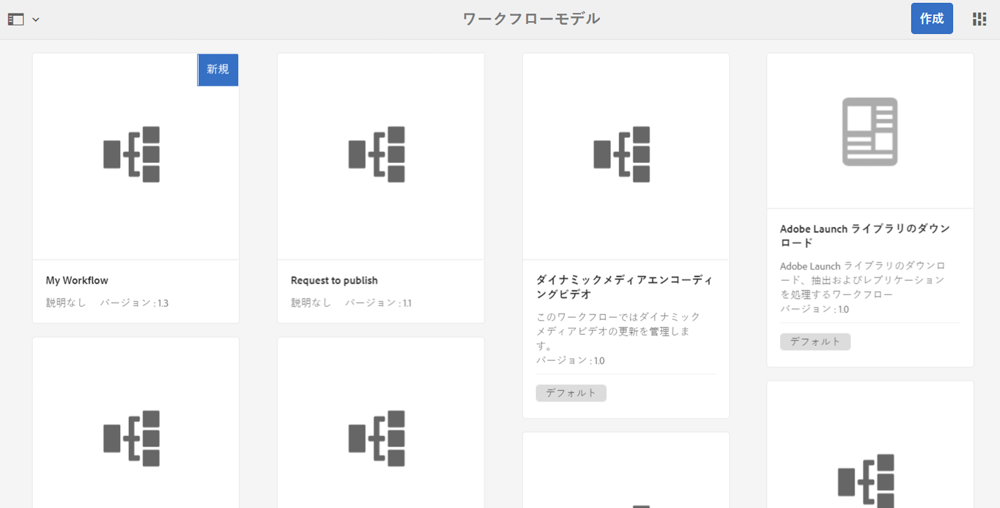

# ワークフローの開発と拡張{#developing-and-extending-workflows}

AEM には、ワークフローモデルを作成し、ワークフローステップを開発し、プログラムによってワークフローとやり取りするためのツールやリソースが用意されています。

ワークフローにより、AEM 環境でリソースを管理し、コンテンツを公開するプロセスを自動化できます。ワークフローは一連のステップで構成され、ステップごとに個別のタスクが実行されます。ロジックとランタイムデータを使用して、いつプロセスを続行できるかを判断し、実行可能な複数のステップのうち 1 つを次のステップとして選択できます。

例えば、Web ページを作成および公開するビジネスプロセスには、様々な参加者による承認やサインオフのタスクが伴います。AEM ワークフローを使用してこれらのプロセスをモデル化し、特定のコンテンツに適用できます。

重要な要素については以降で説明しますが、詳しい説明は次のページを参照してください。

* [ワークフローモデルの作成](/help/sites-developing/workflows-models.md)
* [ワークフロー機能の拡張](/help/sites-developing/workflows-customizing-extending.md)
* [プログラムによるワークフローとのやり取り](/help/sites-developing/workflows-program-interaction.md)
* [ワークフローステップのリファレンス](/help/sites-developing/workflows-step-ref.md)
* [ワークフロープロセスのリファレンス](/help/sites-developing/workflows-process-ref.md)
* [ワークフローのベストプラクティス](/help/sites-developing/workflows-best-practices.md)

>[!NOTE]
>
>参考情報：
>
>* ワークフローへの参加については、[ワークフローの使用](/help/sites-authoring/workflows.md)を参照してください。
>* ワークフローとワークフローインスタンスの管理については、[ワークフローの管理](/help/sites-administering/workflows.md)を参照してください。
>* エンドツーエンドのコミュニティの記事については、[Adobe Experience Managerワークフローを使用したデジタルアセットの変更を参照してください。](https://helpx.adobe.com/experience-manager/using/modify_asset_workflow.html)
>* ワークフロー](https://bit.ly/ATACE218)の[AEMの専門家に質問するウェビナーを参照してください。
>* エンドツーエンドのコミュニティの記事については、[カスタムのAdobe Experience Manager6.3動的参加者の作成手順](https://helpx.adobe.com/experience-manager/using/dynamic-steps-aem63.html)を参照してください。
>* 情報の場所の変更点については、[AEM 6.5 のリポジトリの再構成](/help/sites-deploying/repository-restructuring.md)と[ワークフローに関するベストプラクティス - 場所](/help/sites-developing/workflows-best-practices.md#locations)を参照してください。

>

## モデル {#model}

`WorkflowModel` は、ワークフローの定義（モデル）を表します。`WorkflowNodes`と`WorkflowTransitions`で作られます。 トランジションはノードを接続し、*フロー*&#x200B;を定義します。 モデルには常に開始ノードと終了ノードがあります。

### ランタイムモデル {#runtime-model}

ワークフローモデルはバージョン管理されます。ワークフローのインスタンスを実行すると、ワークフローのランタイムモデルが使用（および保持）されます（ワークフローが開始されたときに利用可能になります）。

ランタイムモデルは、[ワークフローモデルのエディターで&#x200B;**同期**&#x200B;が実行されたときに作成されます](/help/sites-developing/workflows-models.md#sync-your-workflow-generate-a-runtime-model)。

発生するワークフローモデル、または生成されたランタイムモデルに対する編集（**&#x200B;の後）は、そのインスタンスに適用されません。

>[!CAUTION]
>
>実行されるステップは、[ランタイムモデル](/help/sites-developing/workflows-models.md#sync-your-workflow-generate-a-runtime-model)で定義されたものとなります。ランタイムモデルは、ワークフローモデルのエディターで&#x200B;**同期**&#x200B;が実行されたときに生成されます。
>
>その時点より後にワークフローモデルが変更されても（**同期**&#x200B;を実行しない限り）、ランタイムインスタンスにその変更が反映されることはありません。変更後に作成されたランタイムモデルのみに、その変更が反映されます。例外は、基になる ECMA スクリプトです。このスクリプトは一度だけ実行されるので、スクリプトに対する変更が取り込まれます。

### ステップ  {#step}

各ステップは個別のタスクを実行します。ワークフローステップには、様々な種類があります。

* 参加者（ユーザー／グループ）：このステップでは、作業項目が生成され、ユーザーまたはグループに割り当てられます。ワークフローを進めるには、作業項目を完了する必要があります。
* プロセス（スクリプト、Java メソッド呼び出し）：このステップは、自動的に実行されます。ECMA スクリプトまたは Java クラスでステップが実装されます。特殊なワークフローイベントを検出し、ビジネスロジックに従ってタスクを実行するようにサービスを開発できます。
* コンテナ（サブワークフロー）：この種類のステップは別のワークフローモデルを開始します。
* OR 分割／結合：ロジックを使用して、ワークフローで次に実行するステップを決定します。
* AND 分割／結合：複数のステップを同時に実行できます。

すべての手順で、次の共通のプロパティを共有します。`Autoadvance`と`Timeout`の警告（スクリプト可能）。

### トランジション {#transition}

`WorkflowTransition`は、`WorkflowModel`の2つの`WorkflowNodes`の間のトランジションを表します。

* 2 つの連続したステップ間のリンクを定義します。
* 規則を適用することができます。

### WorkItem  {#workitem}

`WorkItem`は、`WorkflowModel`の`Workflow`インスタンスを通して渡される単位です。 インスタンスの動作対象となる`WorkflowData`と、基になるワークフロー手順を説明する`WorkflowNode`への参照が含まれます。

* タスクを識別するために使用され、それぞれのインボックスに入れられます。
* ワークフローインスタンスは、（ワークフローモデルに応じて）1つまたは複数の`WorkItems`を同時に持つことができます。
* `WorkItem` はワークフローインスタンスを参照します。
* リポジトリ内では、`WorkItem` はワークフローインスタンスの下に保存されます。

### ペイロード {#payload}

ワークフローに沿って前に移動する必要があるリソースを参照します。

ペイロードの実装は、リポジトリ内のリソースを（パス、UUID、URL またはシリアル化された Java オブジェクトによって）参照します。リポジトリ内のリソースの参照は、柔軟性に富み、Sling を併用すると生産性が向上します。例えば、参照されたノードをフォームとしてレンダリングできます。

### Lifecycle  {#lifecycle}

（対応するワークフローモデルを選択し、ペイロードを定義して）新しいワークフローを起動したときに作成され、終了ノードが処理されたときに終了します。

ワークフローインスタンスでは、次の操作を実行できます。

* 終了
* 休止
* 再開
* 再起動

完了または強制終了したインスタンスはアーカイブされます。

### インボックス  {#inbox}

各ユーザーアカウントには、割り当てられた`WorkItems`にアクセスできる独自のワークフローインボックスがあります。

`WorkItems`は、ユーザーアカウントに直接割り当てられるか、またはユーザーが属するグループに割り当てられます。

### ワークフローのタイプ {#workflow-types}

ワークフローモデルコンソールを見てわかるように、ワークフローには次のように様々なタイプがあります。

* **デフォルト**

   標準AEMインスタンスには、標準搭載されたワークフローが含まれています。

* カスタムワークフロー（コンソールにインジケーターは表示されません）

   これらは、新規に作成したワークフロー、またはカスタマイズがオーバーレイされた標準搭載のワークフローから作成されたです。

* **レガシー**

   AEMの以前のバージョンで作成されたワークフロー。 アップグレード時に保持したり、以前のバージョンからワークフローパッケージとしてエクスポートしてから、新しいバージョンにインポートしたりできます。

### 一時的なワークフロー {#transient-workflows}

標準ワークフローは、実行中にランタイム（履歴）情報を保存します。このような履歴を保持したくない場合は、ワークフローモデルを「**一時的**」なものとして定義することができます。このモデルは、情報の保持に使用される時間やリソースが節約または回避されるので、パフォーマンスチューニングに使用されます。

一時的ワークフローは、次のようなワークフローに使用できます。

* 頻繁に実行される。
* ワークフロー履歴が必要ない。

一時的ワークフローは、アセットを大量に読み込むときのための機能です。このような場合、アセット情報は重要ですが、ワークフローのランタイム履歴は重要ではありません。

>[!NOTE]
>
>詳しくは、[一時的ワークフローの作成](/help/sites-developing/workflows-models.md#creating-a-transient-workflow)を参照してください。

>[!CAUTION]
>
>ワークフローモデルに「一時的」というフラグを設定しても、次のようなシナリオでは引き続きランタイム情報が保持されます。
>
>* ペイロードタイプ（ビデオなど）の処理に外部のステップが必要となる。そのような場合は、ステータスの確認にランタイム履歴が必要になります。
>* ワークフローが **AND 分割**&#x200B;に入る。そのような場合は、ステータスの確認にランタイム履歴が必要になります。
>* 一時的ワークフローが参加者ステップに入ると、（実行時に）モードが恒久的に変更されます。ユーザーにタスクが渡されるので、履歴を保持する必要があるためです。

>

>[!CAUTION]
>
>一時的ワークフロー内では、**ステップに移動**&#x200B;を使用しないでください。
>
>これは、**Goto Step**&#x200B;がSlingジョブを作成して`goto`ポイントでワークフローを続行するためのものです。 これにより、ワークフローを一時的にする目的が損なわれ、ログファイルにエラーが生成されます。
>
>一時的ワークフローで判断をおこなうには、**OR 分割**&#x200B;を使用できます。

>[!NOTE]
>
>一時的ワークフローがアセットのパフォーマンスに与える影響について詳しくは、[アセットのベストプラクティス](/help/assets/performance-tuning-guidelines.md#transient-workflows)を参照してください。

### マルチリソースのサポート  {#multi-resource-support}

ワークフローモデルに対して&#x200B;**Multi Resource Support**&#x200B;をアクティブにすると、複数のリソースを選択した場合でも、単一のワークフローインスタンスが開始されます。これらはパッケージとして添付されます。

ワークフローモデルの&#x200B;**マルチリソースのサポート**&#x200B;をアクティベートせずに複数のリソースを選択した場合、各リソースに対して個別のワークフローインスタンスが起動します。

>[!NOTE]
>
>詳しくは、[マルチリソースのサポートのためのワークフローの設定](/help/sites-developing/workflows-models.md#configuring-a-workflow-for-multi-resource-support)を参照してください。

### ワークフローステージ {#workflow-stages}

ワークフローステージは、タスクを処理するときにワークフローの進行状況を確認するのに役立ちます。ワークフローステージを使用すると、ワークフローがどの処理段階にあるのかについて概要を示すことができます。ユーザーは、ワークフローを実行すると、（個々のステップとは対照的に）**ステージ**&#x200B;で表される進行状況を確認できます。

個々のステップ名は具体的で技術的な名前にすることができるので、ステージ名を定義して、ワークフローの進行状況の概念的な表示を提供できます。

例えば、6 つのステップと 4 つのステージがあるワークフローの場合は次のようになります。

1. [（ワークフローの進行状況を表示する）ワークフローステージを設定し、ワークフローの各ステップに適切なステージを割り当てる](/help/sites-developing/workflows-models.md#configuring-workflow-stages-that-show-workflow-progress)ことができます。

   * 複数のステージ名を作成できます。
   * その後、個々のステージ名を各ステップに割り当てます（1 つのステージ名を 1 つ以上のステップに割り当てることができます）。

   | **ステップ名** | **ステージ（ステップに割り当て）** |
   |---|---|
   | 手順 1 | 作成 |
   | ステップ 2 | 作成 |
   | ステップ 3 | レビュー |
   | ステップ 4 | 承認 |
   | ステップ 5 | 完了 |
   | ステップ 6 | 完了 |

1. ワークフローが実行されると、ユーザーは進行状況を（ステップ名ではなく）ステージ名に照らして確認できます。ワークフローの進行状況は、[インボックス](/help/sites-authoring/inbox.md)に一覧表示されている作業項目](/help/sites-authoring/workflows-participating.md#opening-a-workflow-item-to-view-details-and-take-actions)のタスクの詳細ウィンドウの「[WORKFLOW INFO」タブに表示されます。

### ワークフローおよびフォーム {#workflows-and-forms}

一般的には、ワークフローは AEM でのフォーム送信の処理に使用されます。これは、標準のAEMインスタンスで使用できる[コアコンポーネントフォームコンポーネント](https://helpx.adobe.com/experience-manager/core-components/using/form-container.html)、または[AEM Formsソリューション](/help/forms/using/aem-forms-workflow.md)で使用できます。

新しいフォームの作成時に、フォームの送信を簡単にワークフローモデルに関連付けることができます。これにより、例えばコンテンツをリポジトリの特定の場所に格納したり、ユーザーにフォームの送信とその内容について通知したりすることができます。

### ワークフローおよび翻訳  {#workflows-and-translation}

ワークフローは、[翻訳](/help/sites-administering/translation.md)プロセスの重要な要素でもあります。
